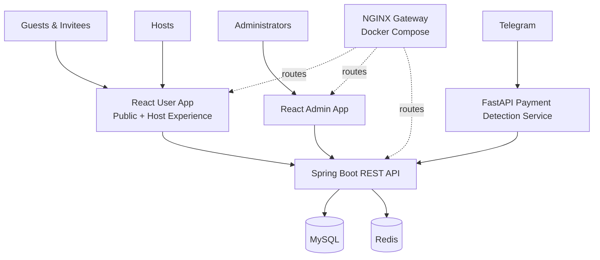

<div align="center">

# 💌 Koupreng

<p><strong>E-Invitation Platform</strong></p>

**Create, share, and manage meaningful celebrations through a modern Khmer-first experience.**

Koupreng brings invitation publishing, guest coordination, RSVP, templates, payments, and administration into one full-stack platform designed as a professional university capstone and portfolio project.

<p>
  
  
  
  
  
  
  
  
</p>

[Features](#features) · [Architecture](#architecture) · [Tech Stack](#tech-stack) · [Getting Started](#getting-started) · [API Docs](#api-documentation) · [Security](#security)

</div>

---

<a id="about"></a>

## ✨ About Koupreng

Koupreng is a Khmer-focused digital invitation platform composed of a public and host-facing React application, a separate React administration application, a Spring Boot REST API, and a Python service for Telegram-assisted payment detection.

The platform supports invitation and guest management, RSVP workflows, reusable templates, payment-related flows, interactive API documentation, and a containerized deployment topology. It is built to demonstrate clear domain ownership, secure application boundaries, and practical full-stack engineering—not to overstate unfinished external integrations as production-complete.

<a id="features"></a>

## 🚀 Key Features

| Capability | What it provides |
| --- | --- |
| 💌 **Invitations** | Create, customize, publish, moderate, and share digital invitations. |
| 👥 **Guest Management** | Organize guest lists, invitation delivery, seating, and check-in data. |
| ✅ **RSVP** | Capture attendance responses, party details, and guest messages. |
| 🎨 **Templates** | Browse and manage invitation templates, categories, and premium access. |
| 💳 **Payments** | Support template and subscription payment workflows with confirmation evidence. |
| 🤖 **Telegram Integration** | Detect configured payment messages and coordinate confirmations through a FastAPI service. |
| 🛡️ **Authentication & Security** | Apply role-aware access, OAuth/JWT support, CSRF controls, validation, rate limits, and request filtering. |
| 📊 **Administration** | Provide dedicated moderation, user, reporting, notification, template, and payment views. |
| 📱 **Responsive Experience** | Deliver separate Vite-powered interfaces for invitees, hosts, and administrators. |
| 🐳 **Deployment** | Package the applications behind an NGINX gateway with Docker Compose, MySQL, and Redis. |

<a id="tech-stack"></a>

## 🧰 Tech Stack

| Area | Core technologies |
| --- | --- |
| **Frontend** | React, Vite, Tailwind CSS, Framer Motion, React Router, Axios, Zustand, Lucide, React Icons |
| **Backend** | Java 25, Spring Boot, Spring Security, Spring Data JPA, Flyway, Maven |
| **Data** | MySQL 8, Redis 7.4 |
| **Payment & Services** | Python 3.13, FastAPI, HTTPX, Telegram integration |
| **API & Documentation** | OpenAPI, Springdoc, Scalar, Swagger UI |
| **Testing & Quality** | JUnit, ArchUnit, JaCoCo, SpotBugs, PMD, Vitest, Playwright, ESLint, Ruff, Bandit |
| **DevOps** | Docker, Docker Compose, NGINX, GitHub Actions |

<a id="architecture"></a>

## 🏗️ System Architecture



The backend follows domain-oriented package boundaries with API, application, domain, and infrastructure responsibilities. See the [Architecture V2 guide](docs/architecture/ARCHITECTURE.md), [folder ownership rules](docs/architecture/folder-structure.md), and [database architecture](docs/database/DATABASE.md) for the detailed design.

<a id="repository-structure"></a>

## 📁 Repository Structure

```text
apps/
├── backend/          Spring Boot API, Flyway migrations, and tests
├── frontend-user/    Public invitation and host React application
├── frontend-admin/   Administration React application
└── telegram-bot/     FastAPI and Telegram integration service
packages/             Shared API contracts and collections
docs/                 Architecture, API, operations, and QA guidance
infra/                Reverse proxy, monitoring, database, and operations assets
scripts/              Development, CI, and maintenance automation
tools/                Sample data and development utilities
```

<a id="getting-started"></a>

## ⚡ Getting Started

### 1. Prerequisites

- JDK 25
- Node.js 22 and npm
- Python 3.13
- MySQL 8
- Docker and Docker Compose for the containerized option

### 2. Clone the repository

```bash
git clone https://github.com/Ny-Panha/Koupreng-invitation_project.git
cd Koupreng-invitation_project
```

### 3. Configure the environment

Copy the example environment file and replace every placeholder with a local value. The resulting `.env` file must remain untracked.

```bash
cp .env.example .env
```

```powershell
Copy-Item .env.example .env
```

Optional repository setup helpers:

```bash
chmod +x scripts/dev/*.sh scripts/maintenance/*.sh
./scripts/dev/setup.sh
```

```powershell
powershell -ExecutionPolicy Bypass -File .\scripts\dev\setup.ps1
```

### 4. Run locally

Launch the repository-specific local stack on Windows:

```powershell
.\run-local-stack.ps1
```

Or run each service independently:

```bash
cd apps/backend && ./mvnw spring-boot:run
cd apps/frontend-user && npm ci && npm run dev
cd apps/frontend-admin && npm ci && npm run dev
cd apps/telegram-bot && python -m pip install -r requirements.txt && python start.py
```

### 5. Run with Docker Compose

After configuring `.env`:

```bash
docker compose config --quiet
docker compose build --pull
docker compose up -d
```

The Compose gateway exposes the user application at `http://localhost:8080` and the admin application at `http://admin.localhost:8080`. MySQL and Redis remain private to the Compose network. See the [Docker deployment guide](docs/deployment/DOCKER.md) for topology, volumes, proxy rules, and release checks.

<a id="local-services"></a>

## 🌐 Local Services

| Service | Default URL | Purpose |
| --- | --- | --- |
| Backend API | `http://localhost:8080` | REST API, health endpoints, and API documentation |
| User frontend | `http://localhost:5173` | Public invitation and host workflows |
| Admin frontend | `http://localhost:5174` | Administrative workflows |
| Telegram service | `http://localhost:8000` | FastAPI health and Telegram payment integration |

These ports describe individually launched development services. Docker Compose exposes the platform through the gateway on port `8080`.

<a id="api-documentation"></a>

## 📚 API Documentation

When the backend runs with development documentation enabled, the API is available through both Scalar and Swagger UI.

| Resource | Local URL |
| --- | --- |
| Scalar API Reference | `http://localhost:8080/docs` |
| Swagger UI | `http://localhost:8080/swagger-ui/index.html` |
| OpenAPI JSON | `http://localhost:8080/v3/api-docs` |
| OpenAPI YAML | `http://localhost:8080/v3/api-docs.yaml` |

Bearer authentication is the intended interactive-documentation workflow. Sensitive `/api/v1/internal/**` service endpoints are excluded from the generated contract.

<details>
<summary><strong>View development fixtures and authentication details</strong></summary>

Run the backend with the `dev` profile and `DEV_SAMPLE_DATA_ENABLED=true` to create the idempotent local fixture dataset configured by `.env.example`.

| Account | Email | Password |
| --- | --- | --- |
| User | `demo@koupreng.local` | `DemoPass123!` |
| Administrator | `admin.demo@koupreng.local` | `AdminDemoPass123!` |

In Scalar, open **Authentication**, send the pre-filled `POST /api/auth/login` example, copy the returned `accessToken`, and set the `bearerAuth` credential. Scalar adds the `Bearer` prefix. `SCALAR_PERSIST_AUTH=true` can preserve local authorization across page refreshes; no JWT is committed to the repository.

The fixture creates a published `demo-wedding` invitation, organization, representative RSVP states, seating and check-in data, wishes, budget items, a wedding gift, an in-app notification, and a free development package definition. It does not create subscription entitlement, payment transactions, external messages, or verified ABA payments. Database identifiers are generated rather than assumed.

`OPENAPI_ENABLED`, `SCALAR_ENABLED`, `SCALAR_PERSIST_AUTH`, and `DEV_SAMPLE_DATA_ENABLED` control the developer experience. OpenAPI, Scalar, and sample data default to disabled under the `prod` profile. Optional HttpOnly cookie authentication uses a readable CSRF cookie with a matching request token for protected mutations.

</details>

For endpoint ownership and compatibility rules, read the [API contract](docs/api/API_CONTRACT.md).

<a id="testing-quality"></a>

## 🧪 Testing & Quality

The repository combines backend verification, frontend unit and browser testing, dependency analysis, static analysis, and CI smoke checks.

```bash
cd apps/backend && ./mvnw clean verify
cd apps/frontend-user && npm run lint && npm test && npm run analyze:knip && npm run analyze:deps && npm run build
cd apps/frontend-admin && npm run lint && npm test && npm run analyze:knip && npm run analyze:deps && npm run build
cd apps/telegram-bot && python -m pytest -q && python -m ruff check . && python -m bandit -q -r main.py start.py
```

Run Playwright browser journeys from `apps/frontend-user`:

```bash
npm run test:e2e
```

The CI workflow also covers secret scanning, dependency audits, fresh-MySQL Flyway migration, static analysis, build artifacts, and route smoke checks. Follow the reproducible [smoke-test guide](docs/testing/SMOKE_TEST.md), then review the latest [verification evidence](docs/qa/verification-results.md) and [known release gates](docs/qa/known-limitations.md).

<a id="security"></a>

## 🔐 Security

- Keep `.env`, credentials, tokens, private keys, database dumps, generated logs, build output, and dependency caches out of Git.
- Review [SECURITY.md](SECURITY.md) before reporting a vulnerability; security reports should follow its private disclosure process.
- The credential incident recorded during the 2026-07-21 audit still requires external token rotation and a coordinated history rewrite. Removing a value from the current tree does not revoke it or erase it from Git history.
- Invitation child data is scoped by `invitationId`. Guest, budget, gift, RSVP, media, delivery, seating, check-in, and notification operations must preserve authenticated invitation ownership or administrator authorization.

<a id="documentation"></a>

## 📖 Documentation

| Guide | Description |
| --- | --- |
| [Architecture](docs/architecture/ARCHITECTURE.md) | System boundaries, modules, and target architecture |
| [Folder Structure](docs/architecture/folder-structure.md) | Package and directory ownership rules |
| [Database](docs/database/DATABASE.md) | Schema ownership, migrations, and persistence rules |
| [API Contract](docs/api/API_CONTRACT.md) | Endpoint compatibility and API conventions |
| [Docker Deployment](docs/deployment/DOCKER.md) | Container topology, gateway, volumes, and operations |
| [Smoke Testing](docs/testing/SMOKE_TEST.md) | Reproducible local and release verification |
| [Verification Results](docs/qa/verification-results.md) | Latest recorded validation evidence |
| [Known Limitations](docs/qa/known-limitations.md) | Open release gates and environment constraints |
| [Security Policy](SECURITY.md) | Vulnerability reporting and security expectations |
| [Contributing](CONTRIBUTING.md) | Contribution workflow and repository standards |

---

<div align="center">

<p><strong>💌 Koupreng</strong></p>

**Modern digital invitations built for meaningful celebrations.**

Made with ❤️ in Cambodia 🇰🇭

</div>
