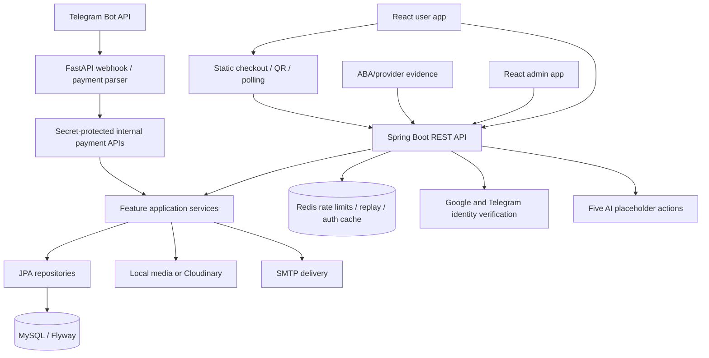

# CODEX E-INVITATION DEEP AUDIT

Phase 1 — discovery, vetted skill installation, testing and report only. Audit date: **2026-10-02, Asia/Bangkok**. Application snapshot: `dda6f44dd359b05d06428636ef12b118c8fd39bd`; concurrent documentation-only commit observed: `29c324101a2d4d11e66ee56a82b7fa41c9ee4ef5`.

No application fixes, dependency upgrades, changes to existing application databases, commits, pushes, deployments or GitHub settings changes were performed. Existing Maven tests use isolated H2 fixtures; no existing database or migration history was modified. Future recommendations below require a separately authorized implementation phase. Local evidence is retained outside the application at `C:/Users/ASER Nitro/.codex/tmp/einvite-audit-20261002/`; paths beginning `logs/`, `screenshots/`, `workspace/` or `e2e-results/` refer to that directory. Source paths refer to the repository root. This document includes the inventories and source evidence so it can be handed to ChatGPT without those temporary files.

Severity expresses potential practical impact; confidence expresses strength of evidence. **Confirmed** can mean source-confirmed behavior rather than a live exploit. **High** confidence labels a source-supported race/risk whose full runtime outcome is not reproduced. Deployment, product-policy and provider limitations are explicit. No critical finding was established. Scanner results do not prove absence of application vulnerabilities.

---

## 1. Executive Summary

The repository contains a substantial implemented product: two React applications, a modular Spring API, a Telegram FastAPI service, MySQL/Flyway persistence and Redis-backed security controls. Lint, frontend/Python unit tests, isolated Maven verify and static checks pass. The existing normal-motion browser run has two animation-related automation failures; ordinary pointer/keyboard opening and the unchanged scroll tests under reduced motion pass. Passing checks coexist with important source-backed payment, identity and data-integrity defects.

**Canonical findings: 56 — Critical: 0, High: 13, Medium: 36, Low: 7, Info: 0.** Overlapping accessibility/bundle observations are consolidated: frontend `A11Y-002` maps to `QA-002`/`QA-003`; QA `DEP-001` maps to `PERF-001`. These aliases are not extra findings. Hypotheses and optional integration opportunities are not counted as confirmed vulnerabilities.

Strong existing controls include BCrypt, verified social tokens, JWT issuer/expiry/version checks, owner/admin guards, internal confirmation secrets, transaction evidence and locks, fixed subscription prices, replay/rate controls, CSP/upload path safeguards and regression tests. These must survive future fixes.

Highest-priority future work is to prevent unpaid template unlocks (`PAY-001`), unsafe email-only identity linking (`SEC-001`), public RSVP impersonation/token disclosure (`SEC-004`) and forged Telegram payment authority when a webhook secret is absent (`PY-001`). Protect subscription renewal and media replacement (`DB-002`, `BE-001`); repair local-only check-in/walk-in/gift behavior (`FE-004`–`FE-006`). Historical sensitive material requires validity/rotation review (`REPO-001`), rather than publishing its values.

The API inventory covers **212 Spring handlers / 233 expanded registrations in 27 controllers**, plus **two custom FastAPI routes**. The frontend inventory covers **103 explicit route patterns plus the admin index redirect**. There are **31 entities, 25 repositories, 24 migrations and 122 DTOs**. Static matching identifies **40 registrations without a direct active consumer**, grouped into **nine backend integration review groups**; aliases/equivalent UI/internal routes are qualified. There are **eight distinct mounted frontend-only or broken capability families**, counting the AI placeholder family and grouping QR preview/download together; cookie authentication and report routing are additional functional findings.

Material limits: no disposable MySQL migration run, no live external provider/payment calls, no production data or load tests, no actual Docker stack startup, no authenticated full-stack browser mutation flows, and no fully refreshed/comprehensive Java advisory database. Npm and Python scanners reported zero current advisories for the scanned dependency sets; Java's zero is explicitly cache-qualified. Phase 2 has not begun.

---

## 2. Repository Snapshot

| Item | Observed snapshot |
|---|---|
| Root / remote | `D:/Koupreng-invitation_project`; [Ny-Panha/Koupreng-invitation_project](https://github.com/Ny-Panha/Koupreng-invitation_project) |
| Branch / initial HEAD | `fix/full-ci-repair`; `dda6f44dd359b05d06428636ef12b118c8fd39bd` |
| Final observed HEAD | `29c324101a2d4d11e66ee56a82b7fa41c9ee4ef5` — externally added existing `.agents` documentation and removed its ignore entry; no audited app/config scope changed |
| Baseline | Initially clean; 1,336 tracked files; all original file SHA-256 values captured. Final external commit tracks 1,595 files before this report |
| Relevant pre-existing ignored material | `.env`, `.cache`, backend `target`, frontend `node_modules`/build/test artifacts, Python caches; contents preserved and secrets excluded from report |
| User/admin frontend | React / React DOM **19.3.0**, React Router **7.18.4**, Axios **1.20.0**, Vite **8.3.0**, Tailwind **4.3.3**, Vitest **4.1.11**, Zustand, Framer Motion; predominantly JavaScript/JSX |
| Browser runner | User lockfile `@playwright/test` **1.63.0**; runner covers both apps |
| Backend | Spring Boot **4.0.8**, Java **25**, Maven wrapper, Spring Security/JPA, Flyway; 299 main Java sources |
| Python service | FastAPI **0.139.2**, httpx **0.28.1**, python-dotenv **1.2.2**, uvicorn **0.51.0**; Telegram bot/webhook, **no implemented Python AI service** |
| Persistence | MySQL 8 deployment; 24 MySQL-specific Flyway migrations; Redis 7.4 rate/replay/auth cache; H2 in many tests |
| Local tools / CI | Node 26.5.0 / CI 22; Java 25.0.1 / CI 25; Python 3.14.5 / CI 3.13; Docker daemon 28.3.2 |
| Build systems | npm lockfiles/Vite; Maven wrapper; Python requirements and CI tooling requirements; Docker/Compose scripts |
| External integrations | Google identity, Telegram OIDC/legacy HMAC + Bot API, SMTP, Cloudinary or local media, ABA/static payment/reconciliation/provider confirmation |

Frontend versions above are lockfile resolutions, rather than lower `^` manifest floors or historical README versions. A PostgreSQL dependency does not establish PostgreSQL migration support. Spring AI endpoints are placeholders, not evidence of a separately implemented AI service. Initial hashes and inventory are retained externally. Concurrent user changes were preserved; see final integrity subsection in section 24.

---

## 3. Agent Skills Installed

Ten selected skills were installed with the official, locally inspected Codex skill installer, using immutable Git commits and download mode. Installation went to `C:/Users/ASER Nitro/.codex/skills/`; no application runtime dependency or manifest was added or updated. Existing project-local and user `.agents` skills were preserved. The initial internal selection table was saved before the UI/UX install; selections, safety rationale and limitations are reproduced here.

| Skill | Category | GitHub Repository | Stars at Audit Time | Version/Commit | Reason Selected |
|---|---|---|---:|---|---|
| `security-best-practices` | Security / React / FastAPI | [openai/skills](https://github.com/openai/skills) | 27,847 | commit-pinned; `49f948faa9258a0c61caceaf225e179651397431` | JavaScript/Python framework security review; no Java guidance |
| `playwright` | Browser QA | [openai/skills](https://github.com/openai/skills) | 27,847 | commit-pinned; `49f948faa9258a0c61caceaf225e179651397431` | Read-only browser inspection and existing E2E review |
| `react-best-practices` | React / performance | [vercel-labs/agent-skills](https://github.com/vercel-labs/agent-skills) | 31,831 | 1.0.0; `063bee94c3f4df8453406c830b0a7df0f2860278` | Client rendering, request waterfalls and bundle analysis |
| `web-design-guidelines` | UI / accessibility | [vercel-labs/agent-skills](https://github.com/vercel-labs/agent-skills) | 31,831 | 1.0.0; `063bee94c3f4df8453406c830b0a7df0f2860278` | Semantic controls, forms, keyboard/focus and responsive review |
| `ui-ux-pro-max` | UI/UX | [nextlevelbuilder/ui-ux-pro-max-skill](https://github.com/nextlevelbuilder/ui-ux-pro-max-skill) | 132,441 | commit-pinned; `09170eec67eefd46a7ae85de61b40c194020f997` | Focused UX outcome checks while preserving the existing Khmer identity |
| `spring-boot-engineer` | Spring / APIs / architecture | [Jeffallan/claude-skills](https://github.com/Jeffallan/claude-skills) | 11,700 | 1.1.0; `882ef55e377dbf9a4dbe496bb41ac6ccd0e555cf` | Controller, validation, transaction and security-layer review; Boot 3 examples need Boot 4 verification |
| `sql-pro` | MySQL / database | [Jeffallan/claude-skills](https://github.com/Jeffallan/claude-skills) | 11,700 | 1.1.0; `882ef55e377dbf9a4dbe496bb41ac6ccd0e555cf` | Schema constraints, migration/entity alignment and query patterns |
| `code-reviewer` | Code review / hygiene | [Jeffallan/claude-skills](https://github.com/Jeffallan/claude-skills) | 11,700 | 1.1.0; `882ef55e377dbf9a4dbe496bb41ac6ccd0e555cf` | Correctness, maintainability, architecture and evidence-first findings |
| `test-master` | QA / frontend testing | [Jeffallan/claude-skills](https://github.com/Jeffallan/claude-skills) | 11,700 | 1.1.1; `882ef55e377dbf9a4dbe496bb41ac6ccd0e555cf` | Coverage analysis, error paths, integration and regression strategy |
| `fastapi` | Python / FastAPI | [fastapi/fastapi](https://github.com/fastapi/fastapi) | 102,759 | commit-pinned; `02912c3fea549591d0d4cf49883478acfa698d31` | Official dependency, response schema and async guidance; version-specific advice screened |

All ten directories contain valid `SKILL.md` name/description frontmatter and appeared in the refreshed Codex available-skills catalogue during this session. The directory `react-best-practices` declares the discovery name `vercel-react-best-practices`. The newly installed skills are available on subsequent turns; their files were read and used during this audit. Directory checks and SHA-256 records are retained with the external audit evidence.

### Candidate provenance and maintenance review

Current repository metadata came from the GitHub REST API on 2026-10-02. Stars/forks are point-in-time counts. `pushed_at` can differ from the default-branch commit date, and open-issue counts include PRs. Contributor counts include API-visible anonymous contributors. These signals informed selection alongside source ownership, compatibility and least privilege.

| Serious candidate | Forks | Created / age at audit | Last repository push | Pinned/default commit date | Contributors | Open issues/PRs | Latest release | License evidence | Decision |
|---|---:|---|---|---|---|---:|---|---|---|
| [openai/skills](https://github.com/openai/skills) | 1,893 | 2025-11-25; ~8–12 months | 2026-09-08T20:35:26Z | 2026-06-24T02:36:12Z | 35 API-visible | 300 | No latest release returned (404) | Repository API/license file absent in reviewed snapshot | Selected; see capability/version limitations |
| [trailofbits/skills](https://github.com/trailofbits/skills) | 625 | 2026-01-14; ~8–12 months | 2026-10-02T09:42:29Z | 2026-09-28T18:06:37Z | 59 API-visible | 54 | No latest release returned (404) | CC-BY-SA-4.0 | Rejected as standalone skill: plugin workflow dependency |
| [Jeffallan/claude-skills](https://github.com/Jeffallan/claude-skills) | 1,128 | 2025-10-20; ~8–12 months | 2026-08-07T20:19:18Z | 2026-08-07T20:19:14Z | 22 API-visible | 36 | v0.4.16 | MIT | Selected; see capability/version limitations |
| [fastapi/fastapi](https://github.com/fastapi/fastapi) | 9,981 | 2018-12-08; ~7 years 10 months | 2026-10-02T09:19:21Z | 2026-10-02T09:19:20Z | 100 returned on page 1; more pages exist | 95 | 0.142.2 | MIT | Selected; see capability/version limitations |
| [vercel-labs/agent-skills](https://github.com/vercel-labs/agent-skills) | 2,786 | 2025-12-08; ~8–12 months | 2026-08-28T13:36:31Z | 2026-08-28T13:36:07Z | 26 API-visible | 177 | agent-skills-063bee94c3f4df8453406c830b0a7df0f2860278 | MIT in React skill frontmatter; repository API license absent | Selected; see capability/version limitations |
| [nextlevelbuilder/ui-ux-pro-max-skill](https://github.com/nextlevelbuilder/ui-ux-pro-max-skill) | 14,044 | 2025-11-30; ~8–12 months | 2026-09-27T11:30:41Z | 2026-09-27T11:30:41Z | 95 API-visible | 82 | v2.15.0 | MIT | Selected; see capability/version limitations |

For each serious candidate, the repository README/documentation and selected `SKILL.md` were inspected, recent five commits and five issue/PR records were queried, release and contributor metadata were collected, and the selected skill subtree was downloaded or inspected before installation. The reviewed sources are their original publisher repositories rather than unofficial mirrors. No selected subtree required elevated privileges, obfuscated code execution, credential harvesting, arbitrary exfiltration, or destructive commands. This was a scoped review of the selected packages, not a security certification of every repository file.

Most selected packages are Markdown/reference data only. OpenAI Playwright includes a short Bash wrapper executing `npx --yes --package @playwright/cli`; it may download a CLI from npm, so the audit used already installed Playwright tooling instead of executing an unpinned download. The UI/UX package contains Python standard-library search/data tooling; its optional `--persist`/`--force` paths write design files, and were disabled. Two focused local searches (`keyboard focus modal`, `error summary validation`) returned relevant guidance without persistence. The Vercel guideline skill fetches a documented public GitHub raw URL; that content was read as review guidance. The official installer checks archive extraction paths, validates skill directories/symlinks, refuses existing destination overwrites and copies skill files without running their scripts; its GitHub helper can use an existing GitHub token only for authenticated source downloads. No token value was logged.

Spring skill guidance targets Boot 3/Security 6, while this application uses Boot 4.0.8; general concepts were used, and outdated examples were not treated as migration requirements. OpenAI's security skill supports JavaScript/TypeScript/Python/Go and supplies no Java-specific reference; Spring source/tests and primary Spring/OWASP references supplied Java coverage. The official FastAPI skill reflects newer capabilities than the application's pinned version, so unsupported new APIs were not reported as missing features. SQL examples were interpreted for MySQL, with no query-plan or production-scale benchmark claims.

### Rejected Skills

| Skill | Stars | Reason Rejected |
|---|---:|---|
| Trail of Bits `audit-context-building` at `82fe8226252622fa807643bdca1710901198553a` | 7,338 | Reputable publisher; no suspicious behavior found in reviewed files. The current entrypoint delegates to a plugin-specific Workflow/slash command and schema-bound agents outside its standalone skill path. Installing only that directory would not make the full workflow runnable in this Codex environment. |
| Jeffallan alternate `fastapi-expert` / `playwright-expert` / `security-reviewer` | 11,700 (repository) | Candidate paths discovered; not selected for full installation review because official framework/browser/security sources and existing isolated scanners cover the audit with less duplicate guidance. Not classified as unsafe. |
| Broad design/build packs and unofficial mirrors | Not relied upon | Existing project skills retained. No bulk pack install, redesign workflow, OS package installer or mirror was needed for this read-only phase. |

Official Codex Security service access was not available as a callable security scanning capability in this session. It was not represented as a downloaded GitHub skill or as an executed scanner. Architecture/API/performance/hygiene coverage also used the project's executable checks and direct source analysis; installing one package per requested category was unnecessary.

---

## 4. Architecture Overview

Frontend routes select feature pages and shared hooks/API adapters, with Zustand/local-storage support for auth, invitation drafts and local event tools. Axios generally unwraps `ApiResponse.data`; auth has a direct token/user contract. Numeric server invitations coexist with local draft IDs, making the authority/persistence distinction essential. Public templates use registries and iframe message synchronization; static import searches cannot establish dead templates/assets.

Spring is a modular monolith under `com.koupreng.backend`: API DTO/controllers, application services, domain/JPA and infrastructure. MySQL owns invitations/guests/RSVP/check-ins/seating/finances and payment fulfillment; Redis is not the durable payment ledger. Security filters, exception translation, method guards and production validation cross-cut the services. Controllers and helpers have compatibility aliases that must be preserved or migrated deliberately.

The Python application is a Telegram UI and payment-notification bridge. Its custom routes are health and webhook; outbound internal-secret requests reach Spring payment services. It has no database and no implemented AI adapter. Spring's five AI routes expose disabled/empty placeholder responses (`ARCH-001`); future AI implementation is a product decision, with fallback UI already present.

Architectural pressure points are eager frontend imports/catalog ownership (`PERF-001`/`PERF-002`), server/local-state authority (`FE-004`–`FE-007`), external storage inside SQL transactions (`BE-001`), large financial/payment/admin service responsibilities and dual compatibility contracts. Recommendations below preserve modules, aliases and stored data rather than assuming a rewrite is authorized.

---

## 5. Feature Preservation Manifest

Every listed capability, route, data model and indirectly loaded template is **MUST PRESERVE / DO NOT REMOVE**, including partially connected or unknown legacy features. COMPLETE denotes implemented source wiring unless stronger runtime evidence is explicitly stated. PARTIAL/BROKEN label the exact defect, not the whole feature. The API/DTO/entity/route inventories complete the traceability for each family.

### Backend and shared product capabilities

All rows are **MUST PRESERVE**. B=`apps/backend/src/main/java/com/koupreng/backend/`, U=`apps/frontend-user/src/`, A=`apps/frontend-admin/src/`. Full endpoint appendix supplies exact contracts/services/repositories. Completeness is static, not production proof.

| Feature / purpose | Backend / API family | Frontend consumer | DB | Auth/config/external dependency | Completeness / defects / existing tests | Audit status |
|---|---|---|---|---|---|---|
| Account register/login/logout | B auth,user; auth/*, users/me aliases | U auth/store, A authService | users | Public auth; JWT/cookie/Redis | Connected; SEC-001/002/005/006; AuthService/AuthEndpointSecurity/CookieCsrf/UserAuthCache suites | PARTIAL |
| Google/Telegram login | B auth identity; auth/google,telegram | U SocialAuthButtons | users | Client IDs/JWKS/bot/HMAC/Redis replay | Config-dependent, BE-002/SEC-001; identity/auth suites | PARTIAL |
| Password change/recovery/reset | B AccountService | U auth/profile flows | users,password_reset_tokens | Password/hashed expiring token/mail sender | Connected; missing mail means no recovery delivery; SEC-008; AccountServiceTests | PARTIAL |
| Profile/avatar | B user; users/me,profile-image | U userApi/profile | users,storage objects | Owner/upload/local or Cloudinary | Connected, retained unmounted legacy profile module; UserServiceTests | PARTIAL |
| Catalog/template previews | B template; templates/{id},slug/{code} | U template services/showcase/renderers | templates | Public/assets | Garden/Royal history/Celestial retained; PAY-003; TemplateCatalogServiceTests | PARTIAL |
| Invitation lifecycle | B invitation; invitations CRUD,draft,publish,unpublish,preview | U invitation/event/create/edit/dashboard | invitations,templates,users,organization + children | Owner/moderation/publish validation | Connected; hard SQL delete despite deleted flag; InvitationServiceTests | COMPLETE |
| Customization/design/content JSON | B customization GET/PUT + main DTO | U editor main-payload saves | invitations,templates | Owner/template access | Dedicated endpoints backend-only; main field persistence connected; preserve all JSON fields | PARTIAL |
| Public/password/token/personalized invitation | B public slug/guest-view/access-verify | U public invitation/GuestInvitationView | invitations,guests,seating,media,rsvps | Published/moderation/visibility/token/password | Connected; SEC-007; InvitationServiceTests | PARTIAL |
| Guests CRUD/group/search/import/export/send list | B guest | U guestApi/management | guests,invitations | Owner/CSV-XLSX parsers | Main CRUD/search/JSON import connected; some aggregate/file/export APIs backend-only; GuestServiceTests | PARTIAL |
| RSVP/wishes/summary/owner management | B rsvp | U public RSVP/modal/wishes/reports | rsvps,guests,notifications | Public guest/access token; owner/deadline/limits | Partial; owner edit/delete backend-only, wrong wish-delete path; SEC-004; RsvpServiceTests | PARTIAL |
| Invitation and guest QR | B QrCodeService; invitation/guest qr | U qrApi/GuestQrModal/InvitationQrPage | invitations,guests | Owner/baseURL/ZXing | Payload endpoints connected; standalone preview/download mismatch; retain qrPayload/qrCodeDataUri | PARTIAL |
| QR/manual check-in/idempotency | B checkin scan/manual/list/summary | U guestService/InvitationCheckInPage | guest_check_ins,guests,users,rsvps | Owner or ADMIN/locked correct guest | Connected; undo is local only, N+1 summary; CheckInServiceTests | COMPLETE |
| Tables/seating/assignments/export | B seating,seating/tables aliases | U seatingApi/page/export | event_tables,guest_seat_assignments,guests | Owner or ADMIN/locks/capacity | Connected; alternate APIs/summary backend-only; SeatingServiceTests | PARTIAL |
| Budget cap/items/summary/CSV/planning | B budget and budget-items | U budget/planning/reports | budgets,budget_items | Owner/ADMIN read/USD-KHR | Connected, BE-003/004; preserve both contracts; BudgetServiceTests | PARTIAL |
| Wedding gift ledger | B gift | U planning/gifts; A invitation gifts | wedding_gifts,invitations | Owner/ADMIN/USD-KHR | Connected; distinct from manual guest contribution fields; WeddingGiftServiceTests | COMPLETE |
| Share-link/email/reminder delivery | B delivery | U invitations delivery API/page | invitation_delivery_events,guests,rsvps | Owner/published/mail/baseURL | Connected; email synchronous inside SQL transactions; InvitationDeliveryServiceTests | COMPLETE |
| Notifications/read states/admin status | B notification | U notification/header; A notifications | notifications + related references | User/owner/ADMIN | Connected record lifecycle; not every channel has real sender; NotificationServiceTests | PARTIAL |
| Organization/team/role editing | B organization including qualified PATCH annotation | U organization/settings | organizations,organization_members,users | Owner/member/email association | Connected; invited absent users not automatically activated on sign-up, role labels do not grant collaboration; OrganizationServiceTests | PARTIAL |
| Template checkout/poll/claim/access | B payment | U PaymentModal/paymentsApi/history | template_payment_orders,user_template_access | Owner/static ABA/shared secret/provider/Telegram | Connected with PAY-001/PAY-003; TemplatePaymentService/security suites | PARTIAL |
| Payment trusted reconciliation/callback | B payment/aba/manual/admin/internal | A unified confirm; Python Telegram listener | payment orders/access/audit | ADMIN or internal secret/provider bank verification | Operational consumers need no browser UI; dedicated template review UI absent; preserve evidence/locks | COMPLETE |
| Subscription catalog/purchase/history/poll/activation | B subscription/PaymentConfirmationService | U subscription/package modal; A package/payment | packages,subscriptions,users,audit | Owner/fixed BASIC-PRO-PREMIUM/secret/admin/Telegram | Connected, DB-002/PAY-002; SubscriptionService/PaymentConfirmation tests | PARTIAL |
| Unified history/details/receipts | B PaymentHistoryService | U history/receipt; A payment detail | current/legacy orders,subscriptions | Owner/ADMIN | Connected; retain legacy history; PaymentHistoryServiceTests | COMPLETE |
| User/invitation/admin dashboards/reports/CSV | B reporting | A admin summary; U raw aggregation/report module unmounted | Invitations/guests/RSVP/payments/users/notifications | Owner/ADMIN | User aggregate APIs largely backend-only; BE-005; DashboardReportServiceTests | PARTIAL |
| Admin management/moderation/analytics | B admin | A routes/services/pages | users/templates/invitations/packages/payments/audit | ADMIN; STAFF maps to ADMIN | Broadly connected; DB-001; preserve master/last-admin safeguards; AdminManagementServiceTests | PARTIAL |
| Dual audit models/system logs | B audit; audit-logs/admin system-logs/recent | A system/recent logs | audit_logs,system_audit_logs | ADMIN/auditing | Separate legacy/new models; SEC-005; AuditLogService/Query tests | PARTIAL |
| Legacy event lifecycle (11 routes) | B event; events/* | No direct frontend (eventsApi uses invitations) | events | ADMIN/legacy LocalDateTime | BACKEND_ONLY, preserve; BE-006; no focused EventService suite found | BACKEND_ONLY |
| AI copy/story/formal/translate/timeline | B integration/ai (5 routes) | U AI assistant/tools | None | Auth/app.ai provider flags | PARTIALLY_CONNECTED placeholder, ARCH-001; no adapter test | PARTIAL |
| English/Khmer message dictionaries | B i18n; i18n/messages | U/A i18n services/hooks | None | Public/locale resources | Connected; preserve keys/resources | COMPLETE |
| Health/docs/metrics/security infrastructure | B shared/config/security; root/API health, Actuator/OpenAPI | Probes/admin/developer docs | DB/Redis health | Public health/docs configured; other Actuator ADMIN | Preserve filters/validators/headers/errors/probes; security/production validator suites | COMPLETE |
| Retained guest-payment/webhook/Telegram/payout schemas | B PaymentConfig,Transaction,WebhookLog,TelegramNotification,OrganizerPayoutAccount,TemplateOrder | No active guest checkout/payout adapter evidenced | payment_configs,payment_transactions,payment_webhook_logs,telegram_notifications,organizer_payout_accounts,template_orders | Intended merchant/payout integration unknown | UNUSED_OR_UNKNOWN, not deletion candidates; retain relationships/history | UNKNOWN |

### Frontend surfaces, drafts, templates and indirect dependencies

This names existing capabilities, including incomplete/local-only ones. Presence is not a claim of defect-free operation. Future work must repair rather than silently delete a listed feature, route, data field, asset or integration.

| Feature | Existing frontend surface | Data/dependencies/behavior to preserve | Current audit notes | Audit status |
|---|---|---|---|---|
| Marketing/venues/contact | Home/pricing/templates/contact/venues and detail deep links | Catalog/local content/language keys, venue modal, phone/social contact options | Present; inquiry transport UX-001, layout/translation QA-004/005. Preserve direct-entry pages. | PARTIAL |
| Auth/account/social | Login/register/Google/Telegram/recovery/reset/profile/avatar/password/logout | JWT and optional cookie modes, provider widgets/env, current-user DTO, user/profile-image storage | Broad active feature; cookie reload FE-001. Keep safe relative redirects/bearer mode. | PARTIAL |
| Templates/dedicated layouts | Browse/detail/demo/preview/paid lists and registry | Codes/slugs/IDs/premium access, dedicated KhmerCelestial/DigitalYes/RoyalKhmer/EmeraldLuxe and all current designs/styles/assets | Indirect registry consumers active; do not prune by literal route names. | COMPLETE |
| Server invitation lifecycle | Host list/new/design/edit/preview/publish/unpublish/public slug | Numeric IDs, ownership, statuses/password, designJson/public URLs | Active; separate Event-model API BG-01 not wired. Keep both models pending decision. | COMPLETE |
| Local draft lifecycle | Draft previews/local event helpers/editor | `wed-...` IDs/localStorage/IndexedDB gallery/schema/legacy aliases | Intentional existing mode; isolate from server failures while preserving data. | COMPLETE |
| Rich builder/live simulation | InvitationForm, phone/iframe previews, admin studio | Sections/story/timeline/gallery/music/KHQR/font/theme/layout fields, autosave, language, message protocol | Active; sender checks FE-010, KH mapping UX-002. Do not remove preview or saved customization. | PARTIAL |
| Guest management | Scoped/general lists/CRUD/groups/categories/import/export/share/QR | Guest/contact/status IDs, personalized tokens/messages, CSV/JSON schema, ownership | Client utilities plus active server API; standalone QR differs from working guest QR. | COMPLETE |
| Published/personalized invitation | `/w/:slug`, `/i/:slug`, template experience | Password/guest-token access, RSVP/wishes/pass, map/media/music/privacy/language | Active; preserve guest content while restricting preview messages. | COMPLETE |
| RSVP/wishes | Public form, host summary/list/wish cards | Attendance/party size/guest link/message IDs | Public submit/read present, moderation BG-04/BG-06/FE-008 incomplete. Do not delete whole attendance to remove a wish. | PARTIAL |
| Delivery | Scoped prepare/share/email/reminder/status UI | Prepared personalized messages, mark-shared/events/email status, reminders | Current service actively wired; legacy send APIs not mounted. | COMPLETE |
| Media | Scoped media/builder gallery | Cover/gallery/video/music multipart replace/delete/object URLs | Typed endpoints active; FormData header logic handles boundaries. Preserve galleries/assets. | COMPLETE |
| Check-in desk | Camera/manual scan, duplicates/celebration, walk-in/undo/gifts | BarcodeDetector/jsQR, guest/attendance IDs, totals, permissions and local drafts | FE-004–007 and CFG-101; retain every operation with durable honest outcomes. | PARTIAL |
| Seating | Tables/assignment/draggable floor plan/export | Names/capacities/notes/positions/entrance/walkway, local/server layout and assignments | Active; FE-012 text preservation and A11Y-004 input alternatives. | PARTIAL |
| Budget/expenses | Scoped budget/general expense UI | Planned/actual/category/status/date/currency CRUD/export | Active; FE-013 defaults. Keep KHR/USD totals separate. | PARTIAL |
| Gifts/financial reports | Ledger/scoped financial report/print | Donor/guest/date/currency/amount, income/expense per currency | Ordinary API active; desk capture FE-006, aliases FE-009. Preserve print and records. | PARTIAL |
| AI copy assistance | Scoped assistant/apply generated content | Copy/story/formal/translate/timeline, explicit source labeling | Frontend distinguishes AI_PROVIDER/LOCAL_TEMPLATE; backend implementation reviewed separately. Preserve fallback/apply behavior. | COMPLETE |
| Organizations/members | List/detail/member dialogs | IDs/roles/invites/member lifecycle and variable URL calls | Present; backend owns privilege/scope audit. Keep memberships and role semantics. | COMPLETE |
| Notifications | User/admin list/unread/read/all/publish | IDs/status/count/audience | Active; preserve badges/admin publishing. | COMPLETE |
| Template payments/subscriptions | Checkout/status/return/history/detail/paid templates/package screens | Orders/receipts/polling/retry/history/current package/provider/manual/Telegram integration | Active; root PAY-001 authoritative confirmation; preserve purchase/history/provider flows. | PARTIAL |
| Admin dashboard/users | Stats/revenue/health/activity/users/create/roles/status/detail/invitations | Admin auth/backend datasets/audit | Broad active UI; client role guard is not security authority. | COMPLETE |
| Admin template studio | Fullscreen create/edit/list/active/premium | Metadata/design/assets/widgets/live preview/persistence | Heavy but active; code splitting must preserve all studio functions. | COMPLETE |
| Admin operations/reports | Payments/packages/notifications/logs/report overview/detail/moderation | Filters/pagination/order IDs/report data/audit/statuses | Active; concrete generic report callers require verification. | COMPLETE |
| Shared UI | Navbar/mobile menu/chat/toasts/modal/calendar/language | Responsive layout/reduced motion/feedback/focus/keyboard | Shared accessibility evidence; existing reduced-motion CSS/hooks found, no blanket absence claim. | COMPLETE |

Status notes: PARTIAL means implemented functionality has a cited defect/gap; it does not authorize deleting that capability. The standalone QR/report/undo/wish actions are BROKEN in their specific paths (`FE-002`/`FE-003`/`FE-007`/`FE-008`/`FE-009`), while related guest QR/report/RSVP features remain active. Contact inquiry delivery is FRONTEND_ONLY (`UX-001`); payment/Telegram/AI integration status is conditional as described below. UNKNOWN legacy schema intent is a preservation requirement. All statuses describe audited source evidence, not production acceptance.

### FastAPI Telegram routes and command/menu features

| Route | Methods | Auth / behavior | Status |
|---|---|---|---|
| `/health` | GET | Public constant `{ok: true}`; no dependencies checked | Implemented; liveness only, not backend/Telegram readiness |
| `/telegram/webhook` | POST | Optional shared header secret; chat allowlist; admin/sender JSON identity after request auth; accepts message, edited_message, channel_post, edited_channel_post and callback_query | Implemented; findings PY-001/002/003 |
| `/openapi.json` | GET, HEAD | Default FastAPI schema | Enabled in app; gateway exposes only exact webhook path, so public docs exposure is not established |
| `/docs` | GET, HEAD | Default Swagger UI | Enabled in app; edge reachability not established |
| `/docs/oauth2-redirect` | GET, HEAD | Default docs OAuth redirect helper | Enabled in app; not a business auth endpoint |
| `/redoc` | GET, HEAD | Default ReDoc UI | Enabled in app; edge reachability not established |

Full route introspection artifact: `logs/python-endpoints.json`.

- Startup lifespan registers `/start`, `/menu`, `/help` with Telegram if the bot token is set. Existing startup helper checks the token then starts development Uvicorn reload mode; Docker uses Uvicorn without reload. Neither process was started with a real token during the audit.
- `/start`, menu/profile/help/pricing callbacks, template link buttons, reply keyboard and optional welcome-photo file ID are implemented. Pricing copy is static and may drift from backend packages; current authoritative package prices must come from backend catalog rather than this independent copy.
- `/id` and `/debug` reply with caller/chat configuration identifiers. `/paid` requires configured admin ID and invokes internal template confirmation. `/detect` / `/confirm` require admin ID; direct or replied PayWay text is parsed; an available original sender identity must be trusted. Subscription reconciliation requires amount/currency/payer last3/transaction evidence and uses the backend internal subscription path; backend owns exact uniqueness, expiry and atomic activation checks.
- Automatic PayWay notification handling requires trusted sender and EVT order code; notifications without order code are not auto-confirmed as subscriptions. This prevents treating partial generic alerts as subscription authority. Empty group allowlist accepts any group; configured payment bot IDs take precedence, otherwise username must match and `is_bot` must be true.
- Amount parsing uses Decimal and explicit USD/KHR patterns; payer suffix, transaction ID, APV and optional remark are extracted. Backend values and state decide final paid/review/error replies. Dedupe is process-local FIFO bounded to 4096 IDs.
- Outgoing backend HTTP uses a 15-second timeout and internal header secret. Telegram HTTP calls use a 10-second timeout. Exception messages avoid printing token-bearing URLs; fresh tests verify sanitization. HTTP clients are created per request; no persistent connection pooling. App has no database, ORM, file upload, dynamic shell execution, or cookie auth.

---

## 6. Backend API Inventory

`COMPLETE` below means a statically matched request in an imported API module/helper, not proof that each exported function is invoked by a mounted screen or that a runtime flow passes. `BACKEND_ONLY` means no active direct request matched; compare equivalent UI/provider notes. `DUPLICATED` marks compatibility aliases with the same handler as a consumed path. Provider/internal endpoints do not require a browser UI. Static call graphs conservatively include overload/helper errors; statuses listed are potential service failures, not guaranteed on every branch.

Common errors: binding/bean validation 400; auth/ownership 401/403; resource/route 404; method 405; content type 415; multipart size 413; conflict 409; unexpected exception 500; auth/RSVP/WAF limit 429, limiter unavailability 503. Controller advice generally emits timestamp/status/error/code/message/path/fieldErrors, with legacy fields on validation. Security/filter responses can differ. Most success responses use ApiResponse(success/message/data); auth directly returns accessToken/tokenType/expiresAt/user. CSV is raw response bytes/content-disposition. Instant denotes UTC timestamps; event date/time use LocalDate/LocalTime, legacy Event uses LocalDateTime. IDs are Long. Binding names, multipart file/files and alias paths must be preserved.

Each row provides exact controller/method/path/request/response/auth, static service/repository/table dependencies, validation, possible errors and frontend consumer. Auth rules combine SecurityConfig and method-level checks; public invitation service rules still enforce publication/moderation/visibility access. ADMIN currently includes STAFF through the JWT converter; internal paths require X-ADMIN-PAYMENT-SECRET regardless of permitAll matcher.

| Method + path | Controller.method and source | Request → response | Auth + object guards | Service → repository → DB | Validation + potential errors | Frontend + integration classification |
|---|---|---|---|---|---|---|
| POST /api/v1/admin/users | AdminManagementController.createUser; apps/backend/src/main/java/com/koupreng/backend/admin/api/AdminManagementController.java:78 | Authentication authentication, @Valid @RequestBody AdminCreateUserRequest requestBody, HttpServletRequest request → ResponseEntity&lt;ApiResponse&lt;AdminUserResponse&gt;&gt; | JWT bearer or optional auth cookie; ADMIN (STAFF currently maps to ROLE_ADMIN); currentUser | AdminManagementService.createUser → AppUserRepository, SystemAuditLogRepository → system_audit_logs, users | AdminCreateUserRequest: @NotBlank(message = "Full name is required"), @Size(max = 120, message = "Full name must be at most 120 characters"), @NotBlank(message = "Email is required"), @Email(message = "Email must be valid"), @Size(max = 255, message = "Email must be at most 255 characters"), @NotBlank(message = "Password is required"), @Size(min = 8, max = 100, message = "Password must be between 8 and 100 characters"), @NotNull(message = "Role is required"); BAD_REQUEST, CONFLICT, UNAUTHORIZED | apps/frontend-admin/src/shared/api/adminService.js:9; COMPLETE [static module/helper request; runtime/function use unverified] |
| GET /api/v1/admin/users | AdminManagementController.listUsers; apps/backend/src/main/java/com/koupreng/backend/admin/api/AdminManagementController.java:90 | none → ResponseEntity&lt;ApiResponse&lt;List&lt;AdminUserResponse&gt;&gt;&gt; | JWT bearer or optional auth cookie; ADMIN (STAFF currently maps to ROLE_ADMIN);  | AdminManagementService.listUsers → AppUserRepository → users | Binding/service checks; no bean-constraint DTO identified; Common errors apply | apps/frontend-admin/src/shared/api/adminService.js:8; COMPLETE [static module/helper request; runtime/function use unverified] |
| GET /api/v1/admin/users/{userId} | AdminManagementController.getUser; apps/backend/src/main/java/com/koupreng/backend/admin/api/AdminManagementController.java:95 | @PathVariable Long userId → ResponseEntity&lt;ApiResponse&lt;AdminUserResponse&gt;&gt; | JWT bearer or optional auth cookie; ADMIN (STAFF currently maps to ROLE_ADMIN);  | AdminManagementService.getUser → AppUserRepository → users | Binding/service checks; no bean-constraint DTO identified; NOT_FOUND | apps/frontend-admin/src/shared/api/adminService.js:10; COMPLETE [static module/helper request; runtime/function use unverified] |
| PATCH /api/v1/admin/users/{userId}/activate | AdminManagementController.activateUser; apps/backend/src/main/java/com/koupreng/backend/admin/api/AdminManagementController.java:100 | Authentication authentication, @PathVariable Long userId, HttpServletRequest request → ResponseEntity&lt;ApiResponse&lt;AdminUserResponse&gt;&gt; | JWT bearer or optional auth cookie; ADMIN (STAFF currently maps to ROLE_ADMIN); currentUser | AdminManagementService.activateUser → AppUserRepository, SystemAuditLogRepository → system_audit_logs, users | Binding/service checks; no bean-constraint DTO identified; NOT_FOUND, UNAUTHORIZED | apps/frontend-admin/src/shared/api/adminService.js:12; COMPLETE [static module/helper request; runtime/function use unverified] |
| PATCH /api/v1/admin/users/{userId}/deactivate | AdminManagementController.deactivateUser; apps/backend/src/main/java/com/koupreng/backend/admin/api/AdminManagementController.java:112 | Authentication authentication, @PathVariable Long userId, HttpServletRequest request → ResponseEntity&lt;ApiResponse&lt;AdminUserResponse&gt;&gt; | JWT bearer or optional auth cookie; ADMIN (STAFF currently maps to ROLE_ADMIN); currentUser | AdminManagementService.deactivateUser → AppUserRepository, SystemAuditLogRepository → system_audit_logs, users | Binding/service checks; no bean-constraint DTO identified; BAD_REQUEST, NOT_FOUND, UNAUTHORIZED | apps/frontend-admin/src/shared/api/adminService.js:13; COMPLETE [static module/helper request; runtime/function use unverified] |
| PATCH /api/v1/admin/users/{userId}/role | AdminManagementController.updateUserRole; apps/backend/src/main/java/com/koupreng/backend/admin/api/AdminManagementController.java:124 | Authentication authentication, @PathVariable Long userId, @Valid @RequestBody AdminUpdateUserRoleRequest requestBody, HttpServletRequest request → ResponseEntity&lt;ApiResponse&lt;AdminUserResponse&gt;&gt; | JWT bearer or optional auth cookie; ADMIN (STAFF currently maps to ROLE_ADMIN); currentUser | AdminManagementService.updateUserRole → AppUserRepository, SystemAuditLogRepository → system_audit_logs, users | AdminUpdateUserRoleRequest: @NotNull(message = "User role is required"); BAD_REQUEST, NOT_FOUND, UNAUTHORIZED | apps/frontend-admin/src/shared/api/adminService.js:14; COMPLETE [static module/helper request; runtime/function use unverified] |
| GET /api/v1/admin/users/{userId}/invitations | AdminManagementController.listUserInvitations; apps/backend/src/main/java/com/koupreng/backend/admin/api/AdminManagementController.java:137 | @PathVariable Long userId → ResponseEntity&lt;ApiResponse&lt;List&lt;InvitationResponse&gt;&gt;&gt; | JWT bearer or optional auth cookie; ADMIN (STAFF currently maps to ROLE_ADMIN);  | AdminManagementService.listUserInvitations → AppUserRepository, UserInvitationRepository → invitations, users | Binding/service checks; no bean-constraint DTO identified; NOT_FOUND | apps/frontend-admin/src/shared/api/adminService.js:11; COMPLETE [static module/helper request; runtime/function use unverified] |
| GET /api/v1/admin/templates | AdminManagementController.listTemplates; apps/backend/src/main/java/com/koupreng/backend/admin/api/AdminManagementController.java:145 | none → ResponseEntity&lt;ApiResponse&lt;List&lt;AdminTemplateResponse&gt;&gt;&gt; | JWT bearer or optional auth cookie; ADMIN (STAFF currently maps to ROLE_ADMIN);  | AdminManagementService.listTemplates → InvitationTemplateRepository → templates | Binding/service checks; no bean-constraint DTO identified; Common errors apply | apps/frontend-admin/src/shared/api/adminService.js:16; COMPLETE [static module/helper request; runtime/function use unverified] |
| POST /api/v1/admin/templates | AdminManagementController.createTemplate; apps/backend/src/main/java/com/koupreng/backend/admin/api/AdminManagementController.java:150 | Authentication authentication, @Valid @RequestBody AdminTemplateRequest requestBody, HttpServletRequest request → ResponseEntity&lt;ApiResponse&lt;AdminTemplateResponse&gt;&gt; | JWT bearer or optional auth cookie; ADMIN (STAFF currently maps to ROLE_ADMIN); currentUser | AdminManagementService.createTemplate → AppUserRepository, InvitationTemplateRepository, SystemAuditLogRepository → system_audit_logs, templates, users | AdminTemplateRequest: @NotBlank(message = "Template name is required"); UNAUTHORIZED | apps/frontend-admin/src/shared/api/adminService.js:18; COMPLETE [static module/helper request; runtime/function use unverified] |
| GET /api/v1/admin/templates/{templateId} | AdminManagementController.getTemplate; apps/backend/src/main/java/com/koupreng/backend/admin/api/AdminManagementController.java:162 | @PathVariable Long templateId → ResponseEntity&lt;ApiResponse&lt;AdminTemplateResponse&gt;&gt; | JWT bearer or optional auth cookie; ADMIN (STAFF currently maps to ROLE_ADMIN);  | AdminManagementService.getTemplate → InvitationTemplateRepository → templates | Binding/service checks; no bean-constraint DTO identified; NOT_FOUND | apps/frontend-admin/src/shared/api/adminService.js:17; COMPLETE [static module/helper request; runtime/function use unverified] |
| PUT /api/v1/admin/templates/{templateId} | AdminManagementController.updateTemplate; apps/backend/src/main/java/com/koupreng/backend/admin/api/AdminManagementController.java:167 | Authentication authentication, @PathVariable Long templateId, @Valid @RequestBody AdminTemplateRequest requestBody, HttpServletRequest request → ResponseEntity&lt;ApiResponse&lt;AdminTemplateResponse&gt;&gt; | JWT bearer or optional auth cookie; ADMIN (STAFF currently maps to ROLE_ADMIN); currentUser | AdminManagementService.updateTemplate → AppUserRepository, InvitationTemplateRepository, SystemAuditLogRepository → system_audit_logs, templates, users | AdminTemplateRequest: @NotBlank(message = "Template name is required"); NOT_FOUND, UNAUTHORIZED | apps/frontend-admin/src/shared/api/adminService.js:19; COMPLETE [static module/helper request; runtime/function use unverified] |
| PATCH /api/v1/admin/templates/{templateId}/activate | AdminManagementController.activateTemplate; apps/backend/src/main/java/com/koupreng/backend/admin/api/AdminManagementController.java:180 | Authentication authentication, @PathVariable Long templateId, HttpServletRequest request → ResponseEntity&lt;ApiResponse&lt;AdminTemplateResponse&gt;&gt; | JWT bearer or optional auth cookie; ADMIN (STAFF currently maps to ROLE_ADMIN); currentUser | AdminManagementService.activateTemplate → AppUserRepository, InvitationTemplateRepository, SystemAuditLogRepository → system_audit_logs, templates, users | Binding/service checks; no bean-constraint DTO identified; NOT_FOUND, UNAUTHORIZED | apps/frontend-admin/src/shared/api/adminService.js:20; COMPLETE [static module/helper request; runtime/function use unverified] |
| PATCH /api/v1/admin/templates/{templateId}/deactivate | AdminManagementController.deactivateTemplate; apps/backend/src/main/java/com/koupreng/backend/admin/api/AdminManagementController.java:192 | Authentication authentication, @PathVariable Long templateId, HttpServletRequest request → ResponseEntity&lt;ApiResponse&lt;AdminTemplateResponse&gt;&gt; | JWT bearer or optional auth cookie; ADMIN (STAFF currently maps to ROLE_ADMIN); currentUser | AdminManagementService.deactivateTemplate → AppUserRepository, InvitationTemplateRepository, SystemAuditLogRepository → system_audit_logs, templates, users | Binding/service checks; no bean-constraint DTO identified; NOT_FOUND, UNAUTHORIZED | apps/frontend-admin/src/shared/api/adminService.js:21; COMPLETE [static module/helper request; runtime/function use unverified] |
| PATCH /api/v1/admin/templates/{templateId}/premium | AdminManagementController.updateTemplatePremium; apps/backend/src/main/java/com/koupreng/backend/admin/api/AdminManagementController.java:204 | Authentication authentication, @PathVariable Long templateId, @RequestBody(required = false) AdminTemplatePremiumRequest requestBody, HttpServletRequest request → ResponseEntity&lt;ApiResponse&lt;AdminTemplateResponse&gt;&gt; | JWT bearer or optional auth cookie; ADMIN (STAFF currently maps to ROLE_ADMIN); currentUser | AdminManagementService.updateTemplatePremium → AppUserRepository, InvitationTemplateRepository, SystemAuditLogRepository → system_audit_logs, templates, users | AdminTemplatePremiumRequest: ; NOT_FOUND, UNAUTHORIZED | apps/frontend-admin/src/shared/api/adminService.js:23; COMPLETE [static module/helper request; runtime/function use unverified] |
| DELETE /api/v1/admin/templates/{templateId} | AdminManagementController.deleteTemplate; apps/backend/src/main/java/com/koupreng/backend/admin/api/AdminManagementController.java:217 | Authentication authentication, @PathVariable Long templateId, HttpServletRequest request → ResponseEntity&lt;ApiResponse&lt;Void&gt;&gt; | JWT bearer or optional auth cookie; ADMIN (STAFF currently maps to ROLE_ADMIN); currentUser | AdminManagementService.deleteTemplate → AppUserRepository, InvitationTemplateRepository, SystemAuditLogRepository → system_audit_logs, templates, users | Binding/service checks; no bean-constraint DTO identified; NOT_FOUND, UNAUTHORIZED | apps/frontend-admin/src/shared/api/adminService.js:24; COMPLETE [static module/helper request; runtime/function use unverified] |
| GET /api/v1/admin/invitations | AdminManagementController.listInvitations; apps/backend/src/main/java/com/koupreng/backend/admin/api/AdminManagementController.java:227 | none → ResponseEntity&lt;ApiResponse&lt;List&lt;InvitationResponse&gt;&gt;&gt; | JWT bearer or optional auth cookie; ADMIN (STAFF currently maps to ROLE_ADMIN);  | AdminManagementService.listInvitations → UserInvitationRepository → invitations | Binding/service checks; no bean-constraint DTO identified; Common errors apply | apps/frontend-admin/src/shared/api/adminService.js:26; COMPLETE [static module/helper request; runtime/function use unverified] |
| GET /api/v1/admin/invitations/{invitationId} | AdminManagementController.getInvitation; apps/backend/src/main/java/com/koupreng/backend/admin/api/AdminManagementController.java:235 | @PathVariable Long invitationId → ResponseEntity&lt;ApiResponse&lt;InvitationResponse&gt;&gt; | JWT bearer or optional auth cookie; ADMIN (STAFF currently maps to ROLE_ADMIN);  | AdminManagementService.getInvitation → UserInvitationRepository → invitations | Binding/service checks; no bean-constraint DTO identified; NOT_FOUND | apps/frontend-admin/src/shared/api/adminService.js:27; COMPLETE [static module/helper request; runtime/function use unverified] |
| GET /api/v1/admin/invitations/{invitationId}/rsvp-summary | AdminManagementController.invitationRsvpSummary; apps/backend/src/main/java/com/koupreng/backend/admin/api/AdminManagementController.java:243 | @PathVariable Long invitationId → ResponseEntity&lt;ApiResponse&lt;RsvpSummaryResponse&gt;&gt; | JWT bearer or optional auth cookie; ADMIN (STAFF currently maps to ROLE_ADMIN);  | AdminManagementService.invitationRsvpSummary → GuestRepository, RsvpRepository, UserInvitationRepository → guests, invitations, rsvps | Binding/service checks; no bean-constraint DTO identified; NOT_FOUND | apps/frontend-admin/src/shared/api/adminService.js:31; COMPLETE [static module/helper request; runtime/function use unverified] |
| GET /api/v1/admin/invitations/{invitationId}/gifts | AdminManagementController.listInvitationGifts; apps/backend/src/main/java/com/koupreng/backend/admin/api/AdminManagementController.java:251 | @PathVariable Long invitationId → ResponseEntity&lt;ApiResponse&lt;List&lt;WeddingGiftResponse&gt;&gt;&gt; | JWT bearer or optional auth cookie; ADMIN (STAFF currently maps to ROLE_ADMIN);  | WeddingGiftService.listForAdmin → WeddingGiftRepository → wedding_gifts | Binding/service checks; no bean-constraint DTO identified; Common errors apply | apps/frontend-admin/src/shared/api/adminService.js:28; COMPLETE [static module/helper request; runtime/function use unverified] |
| PATCH /api/v1/admin/invitations/{invitationId}/moderate | AdminManagementController.moderateInvitation; apps/backend/src/main/java/com/koupreng/backend/admin/api/AdminManagementController.java:259 | Authentication authentication, @PathVariable Long invitationId, @Valid @RequestBody AdminInvitationModerationRequest requestBody, HttpServletRequest request → ResponseEntity&lt;ApiResponse&lt;InvitationResponse&gt;&gt; | JWT bearer or optional auth cookie; ADMIN (STAFF currently maps to ROLE_ADMIN); currentUser | AdminManagementService.moderateInvitation → AppUserRepository, SystemAuditLogRepository, UserInvitationRepository → invitations, system_audit_logs, users | AdminInvitationModerationRequest: @NotNull(message = "Moderation status is required"); NOT_FOUND, UNAUTHORIZED | apps/frontend-admin/src/shared/api/adminService.js:35; COMPLETE [static module/helper request; runtime/function use unverified] |
| PATCH /api/v1/admin/invitations/{invitationId}/status | AdminManagementController.updateInvitationStatus; apps/backend/src/main/java/com/koupreng/backend/admin/api/AdminManagementController.java:272 | Authentication authentication, @PathVariable Long invitationId, @Valid @RequestBody AdminInvitationStatusRequest requestBody, HttpServletRequest request → ResponseEntity&lt;ApiResponse&lt;InvitationResponse&gt;&gt; | JWT bearer or optional auth cookie; ADMIN (STAFF currently maps to ROLE_ADMIN); currentUser | AdminManagementService.updateInvitationStatus → AppUserRepository, SystemAuditLogRepository, UserInvitationRepository → invitations, system_audit_logs, users | AdminInvitationStatusRequest: @NotNull(message = "Invitation status is required"); NOT_FOUND, UNAUTHORIZED | apps/frontend-admin/src/shared/api/adminService.js:33; COMPLETE [static module/helper request; runtime/function use unverified] |
| PATCH /api/v1/admin/invitations/{invitationId}/activate | AdminManagementController.activateInvitation; apps/backend/src/main/java/com/koupreng/backend/admin/api/AdminManagementController.java:285 | Authentication authentication, @PathVariable Long invitationId, HttpServletRequest request → ResponseEntity&lt;ApiResponse&lt;InvitationResponse&gt;&gt; | JWT bearer or optional auth cookie; ADMIN (STAFF currently maps to ROLE_ADMIN); currentUser | AdminManagementService.activateInvitation → AppUserRepository, SystemAuditLogRepository, UserInvitationRepository → invitations, system_audit_logs, users | Binding/service checks; no bean-constraint DTO identified; NOT_FOUND, UNAUTHORIZED | apps/frontend-admin/src/shared/api/adminService.js:36; COMPLETE [static module/helper request; runtime/function use unverified] |
| PATCH /api/v1/admin/invitations/{invitationId}/deactivate | AdminManagementController.deactivateInvitation; apps/backend/src/main/java/com/koupreng/backend/admin/api/AdminManagementController.java:297 | Authentication authentication, @PathVariable Long invitationId, HttpServletRequest request → ResponseEntity&lt;ApiResponse&lt;InvitationResponse&gt;&gt; | JWT bearer or optional auth cookie; ADMIN (STAFF currently maps to ROLE_ADMIN); currentUser | AdminManagementService.deactivateInvitation → AppUserRepository, SystemAuditLogRepository, UserInvitationRepository → invitations, system_audit_logs, users | Binding/service checks; no bean-constraint DTO identified; NOT_FOUND, UNAUTHORIZED | apps/frontend-admin/src/shared/api/adminService.js:37; COMPLETE [static module/helper request; runtime/function use unverified] |
| GET /api/v1/admin/reports/users | AdminManagementController.usersReport; apps/backend/src/main/java/com/koupreng/backend/admin/api/AdminManagementController.java:309 | none → ResponseEntity&lt;ApiResponse&lt;AdminReportResponse&gt;&gt; | JWT bearer or optional auth cookie; ADMIN (STAFF currently maps to ROLE_ADMIN);  | AdminManagementService.usersReport → AppUserRepository → users | Binding/service checks; no bean-constraint DTO identified; Common errors apply | apps/frontend-admin/src/shared/api/adminService.js:39; COMPLETE [static module/helper request; runtime/function use unverified] |
| GET /api/v1/admin/reports/invitations | AdminManagementController.invitationsReport; apps/backend/src/main/java/com/koupreng/backend/admin/api/AdminManagementController.java:314 | none → ResponseEntity&lt;ApiResponse&lt;AdminReportResponse&gt;&gt; | JWT bearer or optional auth cookie; ADMIN (STAFF currently maps to ROLE_ADMIN);  | AdminManagementService.invitationsReport → UserInvitationRepository → invitations | Binding/service checks; no bean-constraint DTO identified; Common errors apply | apps/frontend-admin/src/shared/api/adminService.js:39; COMPLETE [static module/helper request; runtime/function use unverified] |
| GET /api/v1/admin/reports/payments | AdminManagementController.paymentsReport; apps/backend/src/main/java/com/koupreng/backend/admin/api/AdminManagementController.java:322 | none → ResponseEntity&lt;ApiResponse&lt;AdminReportResponse&gt;&gt; | JWT bearer or optional auth cookie; ADMIN (STAFF currently maps to ROLE_ADMIN);  | AdminManagementService.paymentsReport → TemplatePaymentOrderRepository → template_payment_orders | Binding/service checks; no bean-constraint DTO identified; Common errors apply | apps/frontend-admin/src/shared/api/adminService.js:39; COMPLETE [static module/helper request; runtime/function use unverified] |
| GET /api/v1/admin/reports/rsvp | AdminManagementController.rsvpReport; apps/backend/src/main/java/com/koupreng/backend/admin/api/AdminManagementController.java:330 | none → ResponseEntity&lt;ApiResponse&lt;AdminReportResponse&gt;&gt; | JWT bearer or optional auth cookie; ADMIN (STAFF currently maps to ROLE_ADMIN);  | AdminManagementService.rsvpReport → RsvpRepository → rsvps | Binding/service checks; no bean-constraint DTO identified; Common errors apply | apps/frontend-admin/src/shared/api/adminService.js:39; COMPLETE [static module/helper request; runtime/function use unverified] |
| GET /api/v1/admin/reports/system | AdminManagementController.systemReport; apps/backend/src/main/java/com/koupreng/backend/admin/api/AdminManagementController.java:335 | none → ResponseEntity&lt;ApiResponse&lt;AdminReportResponse&gt;&gt; | JWT bearer or optional auth cookie; ADMIN (STAFF currently maps to ROLE_ADMIN);  | AdminManagementService.systemReport → AppUserRepository, GuestRepository, NotificationRepository, RsvpRepository, UserInvitationRepository → guests, invitations, notifications, rsvps, users | Binding/service checks; no bean-constraint DTO identified; Common errors apply | apps/frontend-admin/src/shared/api/adminService.js:39; COMPLETE [static module/helper request; runtime/function use unverified] |
| GET /api/v1/admin/analytics/overview | AdminManagementController.analyticsOverview; apps/backend/src/main/java/com/koupreng/backend/admin/api/AdminManagementController.java:343 | none → ResponseEntity&lt;ApiResponse&lt;AdminReportResponse&gt;&gt; | JWT bearer or optional auth cookie; ADMIN (STAFF currently maps to ROLE_ADMIN);  | AdminManagementService.analyticsOverview → AppUserRepository, GuestRepository, RsvpRepository, TemplatePaymentOrderRepository, UserInvitationRepository → guests, invitations, rsvps, template_payment_orders, users | Binding/service checks; no bean-constraint DTO identified; Common errors apply | apps/frontend-admin/src/features/dashboard/dashboardService.js:9; COMPLETE [static module/helper request; runtime/function use unverified] |
| GET /api/v1/admin/analytics/revenue | AdminManagementController.analyticsRevenue; apps/backend/src/main/java/com/koupreng/backend/admin/api/AdminManagementController.java:351 | none → ResponseEntity&lt;ApiResponse&lt;AdminReportResponse&gt;&gt; | JWT bearer or optional auth cookie; ADMIN (STAFF currently maps to ROLE_ADMIN);  | AdminManagementService.analyticsRevenue → TemplatePaymentOrderRepository → template_payment_orders | Binding/service checks; no bean-constraint DTO identified; Common errors apply | apps/frontend-admin/src/features/dashboard/dashboardService.js:10; COMPLETE [static module/helper request; runtime/function use unverified] |
| GET /api/v1/admin/analytics/templates | AdminManagementController.analyticsTemplates; apps/backend/src/main/java/com/koupreng/backend/admin/api/AdminManagementController.java:359 | none → ResponseEntity&lt;ApiResponse&lt;AdminReportResponse&gt;&gt; | JWT bearer or optional auth cookie; ADMIN (STAFF currently maps to ROLE_ADMIN);  | AdminManagementService.analyticsTemplates → InvitationTemplateRepository → templates | Binding/service checks; no bean-constraint DTO identified; Common errors apply | apps/frontend-admin/src/features/dashboard/dashboardService.js:11; COMPLETE [static module/helper request; runtime/function use unverified] |
| GET /api/v1/admin/analytics/delivery | AdminManagementController.analyticsDelivery; apps/backend/src/main/java/com/koupreng/backend/admin/api/AdminManagementController.java:367 | none → ResponseEntity&lt;ApiResponse&lt;AdminReportResponse&gt;&gt; | JWT bearer or optional auth cookie; ADMIN (STAFF currently maps to ROLE_ADMIN);  | AdminManagementService.analyticsDelivery → GuestRepository, NotificationRepository → guests, notifications | Binding/service checks; no bean-constraint DTO identified; Common errors apply | apps/frontend-admin/src/features/dashboard/dashboardService.js:12; COMPLETE [static module/helper request; runtime/function use unverified] |
| GET /api/v1/admin/analytics/rsvp | AdminManagementController.analyticsRsvp; apps/backend/src/main/java/com/koupreng/backend/admin/api/AdminManagementController.java:375 | none → ResponseEntity&lt;ApiResponse&lt;AdminReportResponse&gt;&gt; | JWT bearer or optional auth cookie; ADMIN (STAFF currently maps to ROLE_ADMIN);  | AdminManagementService.analyticsRsvp → GuestRepository, RsvpRepository → guests, rsvps | Binding/service checks; no bean-constraint DTO identified; Common errors apply | apps/frontend-admin/src/features/dashboard/dashboardService.js:13; COMPLETE [static module/helper request; runtime/function use unverified] |
| GET /api/v1/admin/analytics/check-in | AdminManagementController.analyticsCheckIn; apps/backend/src/main/java/com/koupreng/backend/admin/api/AdminManagementController.java:383 | none → ResponseEntity&lt;ApiResponse&lt;AdminReportResponse&gt;&gt; | JWT bearer or optional auth cookie; ADMIN (STAFF currently maps to ROLE_ADMIN);  | AdminManagementService.analyticsCheckIn → GuestCheckInRepository, GuestRepository → guest_check_ins, guests | Binding/service checks; no bean-constraint DTO identified; Common errors apply | apps/frontend-admin/src/features/dashboard/dashboardService.js:14; COMPLETE [static module/helper request; runtime/function use unverified] |
| GET /api/v1/admin/system-health | AdminManagementController.systemHealth; apps/backend/src/main/java/com/koupreng/backend/admin/api/AdminManagementController.java:391 | none → ResponseEntity&lt;ApiResponse&lt;AdminReportResponse&gt;&gt; | JWT bearer or optional auth cookie; ADMIN (STAFF currently maps to ROLE_ADMIN);  | AdminManagementService.systemHealth → AppUserRepository, NotificationRepository, SystemAuditLogRepository, TemplatePaymentOrderRepository, UserInvitationRepository → invitations, notifications, system_audit_logs, template_payment_orders, users | Binding/service checks; no bean-constraint DTO identified; Common errors apply | apps/frontend-admin/src/features/dashboard/dashboardService.js:15; COMPLETE [static module/helper request; runtime/function use unverified] |
| GET /api/v1/admin/audit-logs/recent | AdminManagementController.recentAuditLogs; apps/backend/src/main/java/com/koupreng/backend/admin/api/AdminManagementController.java:399 | none → ResponseEntity&lt;ApiResponse&lt;List&lt;SystemAuditLogResponse&gt;&gt;&gt; | JWT bearer or optional auth cookie; ADMIN (STAFF currently maps to ROLE_ADMIN);  | AdminManagementService.recentAuditLogs → SystemAuditLogRepository → system_audit_logs | Binding/service checks; no bean-constraint DTO identified; Common errors apply | apps/frontend-admin/src/features/dashboard/dashboardService.js:17; COMPLETE [static module/helper request; runtime/function use unverified] |
| GET /api/v1/admin/alerts | AdminManagementController.alerts; apps/backend/src/main/java/com/koupreng/backend/admin/api/AdminManagementController.java:407 | none → ResponseEntity&lt;ApiResponse&lt;AdminReportResponse&gt;&gt; | JWT bearer or optional auth cookie; ADMIN (STAFF currently maps to ROLE_ADMIN);  | AdminManagementService.alerts → NotificationRepository, SystemAuditLogRepository, TemplatePaymentOrderRepository → notifications, system_audit_logs, template_payment_orders | Binding/service checks; no bean-constraint DTO identified; Common errors apply | apps/frontend-admin/src/features/dashboard/dashboardService.js:16; COMPLETE [static module/helper request; runtime/function use unverified] |
| GET /api/v1/admin/system-logs | AdminManagementController.systemLogs; apps/backend/src/main/java/com/koupreng/backend/admin/api/AdminManagementController.java:415 | none → ResponseEntity&lt;ApiResponse&lt;List&lt;SystemAuditLogResponse&gt;&gt;&gt; | JWT bearer or optional auth cookie; ADMIN (STAFF currently maps to ROLE_ADMIN);  | AuditLogService.listLogs → SystemAuditLogRepository → system_audit_logs | Binding/service checks; no bean-constraint DTO identified; Common errors apply | apps/frontend-admin/src/shared/api/adminService.js:40; COMPLETE [static module/helper request; runtime/function use unverified] |
| GET /api/v1/admin/packages | AdminManagementController.listPackages; apps/backend/src/main/java/com/koupreng/backend/admin/api/AdminManagementController.java:420 | none → ResponseEntity&lt;ApiResponse&lt;List&lt;SubscriptionPackageResponse&gt;&gt;&gt; | JWT bearer or optional auth cookie; ADMIN (STAFF currently maps to ROLE_ADMIN);  | SubscriptionService.listAllPackages → SubscriptionPackageRepository → packages | Binding/service checks; no bean-constraint DTO identified; Common errors apply | apps/frontend-admin/src/shared/api/adminService.js:46; COMPLETE [static module/helper request; runtime/function use unverified] |
| POST /api/v1/admin/packages | AdminManagementController.createPackage; apps/backend/src/main/java/com/koupreng/backend/admin/api/AdminManagementController.java:428 | @Valid @RequestBody SubscriptionPackageRequest request → ResponseEntity&lt;ApiResponse&lt;SubscriptionPackageResponse&gt;&gt; | JWT bearer or optional auth cookie; ADMIN (STAFF currently maps to ROLE_ADMIN);  | SubscriptionService.createPackage → SubscriptionPackageRepository, SystemAuditLogRepository → packages, system_audit_logs | SubscriptionPackageRequest: ; Common errors apply | apps/frontend-admin/src/shared/api/adminService.js:47; COMPLETE [static module/helper request; runtime/function use unverified] |
| PUT /api/v1/admin/packages/{packageId} | AdminManagementController.updatePackage; apps/backend/src/main/java/com/koupreng/backend/admin/api/AdminManagementController.java:438 | @PathVariable Long packageId, @Valid @RequestBody SubscriptionPackageRequest request → ResponseEntity&lt;ApiResponse&lt;SubscriptionPackageResponse&gt;&gt; | JWT bearer or optional auth cookie; ADMIN (STAFF currently maps to ROLE_ADMIN);  | SubscriptionService.updatePackage → SubscriptionPackageRepository, SystemAuditLogRepository → packages, system_audit_logs | SubscriptionPackageRequest: ; NOT_FOUND | apps/frontend-admin/src/shared/api/adminService.js:48; COMPLETE [static module/helper request; runtime/function use unverified] |
| PATCH /api/v1/admin/packages/{packageId}/activate | AdminManagementController.activatePackage; apps/backend/src/main/java/com/koupreng/backend/admin/api/AdminManagementController.java:449 | @PathVariable Long packageId → ResponseEntity&lt;ApiResponse&lt;SubscriptionPackageResponse&gt;&gt; | JWT bearer or optional auth cookie; ADMIN (STAFF currently maps to ROLE_ADMIN);  | SubscriptionService.activatePackage → SubscriptionPackageRepository, SystemAuditLogRepository → packages, system_audit_logs | Binding/service checks; no bean-constraint DTO identified; NOT_FOUND | apps/frontend-admin/src/shared/api/adminService.js:49; COMPLETE [static module/helper request; runtime/function use unverified] |
| PATCH /api/v1/admin/packages/{packageId}/deactivate | AdminManagementController.deactivatePackage; apps/backend/src/main/java/com/koupreng/backend/admin/api/AdminManagementController.java:459 | @PathVariable Long packageId → ResponseEntity&lt;ApiResponse&lt;SubscriptionPackageResponse&gt;&gt; | JWT bearer or optional auth cookie; ADMIN (STAFF currently maps to ROLE_ADMIN);  | SubscriptionService.deactivatePackage → SubscriptionPackageRepository, SystemAuditLogRepository → packages, system_audit_logs | Binding/service checks; no bean-constraint DTO identified; NOT_FOUND | apps/frontend-admin/src/shared/api/adminService.js:50; COMPLETE [static module/helper request; runtime/function use unverified] |
| GET /api/v1/admin/payments | AdminManagementController.listAllPayments; apps/backend/src/main/java/com/koupreng/backend/admin/api/AdminManagementController.java:469 | none → ResponseEntity&lt;ApiResponse&lt;List&lt;PaymentHistoryResponse&gt;&gt;&gt; | JWT bearer or optional auth cookie; ADMIN (STAFF currently maps to ROLE_ADMIN);  | PaymentHistoryService.listAll → SubscriptionRepository, TemplatePaymentOrderRepository → subscriptions, template_payment_orders | Binding/service checks; no bean-constraint DTO identified; Common errors apply | apps/frontend-admin/src/shared/api/adminService.js:42; COMPLETE [static module/helper request; runtime/function use unverified] |
| GET /api/v1/admin/payments/{orderCode} | AdminManagementController.getPayment; apps/backend/src/main/java/com/koupreng/backend/admin/api/AdminManagementController.java:477 | Authentication authentication, @PathVariable String orderCode → ResponseEntity&lt;ApiResponse&lt;PaymentHistoryResponse&gt;&gt; | JWT bearer or optional auth cookie; ADMIN (STAFF currently maps to ROLE_ADMIN); currentUser | PaymentHistoryService.get → AppUserRepository, SubscriptionRepository, TemplatePaymentOrderRepository → subscriptions, template_payment_orders, users | Binding/service checks; no bean-constraint DTO identified; BAD_REQUEST, FORBIDDEN, NOT_FOUND, UNAUTHORIZED | apps/frontend-admin/src/shared/api/adminService.js:43; COMPLETE [static module/helper request; runtime/function use unverified] |
| POST /api/v1/admin/payments/{orderCode}/confirm | AdminManagementController.confirmPayment; apps/backend/src/main/java/com/koupreng/backend/admin/api/AdminManagementController.java:488 | @PathVariable String orderCode, @io.swagger.v3.oas.annotations.parameters.RequestBody( content = @io.swagger.v3.oas.annotations.media.Content( mediaType = "application/json", examples = @io.swagger.v3.oas.annotations.media.ExampleObject( name = "adminReview", summary = "Confirm a pending order through the legacy path endpoint", value = """ {"amount":19.00,"confirmedBy":"admin-demo"} """ ) ) ) @RequestBody(required = false) Map&lt;String, Object&gt; body → ResponseEntity&lt;ApiResponse&lt;PaymentConfirmResponse&gt;&gt; | JWT bearer or optional auth cookie; ADMIN (STAFF currently maps to ROLE_ADMIN);  | PaymentHistoryService.confirmPayment → SubscriptionRepository, SystemAuditLogRepository, TemplatePaymentOrderRepository, UserTemplateAccessRepository → subscriptions, system_audit_logs, template_payment_orders, user_template_access | Binding/service checks; no bean-constraint DTO identified; BAD_REQUEST, CONFLICT, NOT_FOUND | No direct active request found; BACKEND_ONLY [no direct active request found] |
| POST /api/v1/admin/notifications | AdminNotificationController.create; apps/backend/src/main/java/com/koupreng/backend/notification/api/AdminNotificationController.java:52 | Authentication authentication, @Valid @RequestBody CreateNotificationRequest request, HttpServletRequest httpRequest → ResponseEntity&lt;ApiResponse&lt;NotificationResponse&gt;&gt; | JWT bearer or optional auth cookie; ADMIN (STAFF currently maps to ROLE_ADMIN); currentUser | NotificationService.createNotification, AuditLogService.logAdminAction → AppUserRepository, GuestRepository, NotificationRepository, RsvpRepository, SystemAuditLogRepository, TemplatePaymentOrderRepository, UserInvitationRepository → guests, invitations, notifications, rsvps, system_audit_logs, template_payment_orders, users | CreateNotificationRequest: @NotNull(message = "Notification type is required"), @NotNull(message = "Notification channel is required"), @NotBlank(message = "Notification title is required"); BAD_REQUEST, NOT_FOUND, UNAUTHORIZED | apps/frontend-admin/src/shared/api/adminService.js:53; COMPLETE [static module/helper request; runtime/function use unverified] |
| GET /api/v1/admin/notifications | AdminNotificationController.list; apps/backend/src/main/java/com/koupreng/backend/notification/api/AdminNotificationController.java:65 | @RequestParam(required = false) NotificationStatusFilter status, @RequestParam(required = false) NotificationTypeFilter type, @RequestParam(required = false) NotificationChannelFilter channel → ResponseEntity&lt;ApiResponse&lt;List&lt;NotificationResponse&gt;&gt;&gt; | JWT bearer or optional auth cookie; ADMIN (STAFF currently maps to ROLE_ADMIN);  | NotificationService.listAllForAdmin → NotificationRepository → notifications | NotificationChannelFilter: ; NotificationStatusFilter: ; NotificationTypeFilter: ; Common errors apply | apps/frontend-admin/src/shared/api/adminService.js:52; COMPLETE [static module/helper request; runtime/function use unverified] |
| PATCH /api/v1/admin/notifications/{notificationId}/status | AdminNotificationController.updateStatus; apps/backend/src/main/java/com/koupreng/backend/notification/api/AdminNotificationController.java:77 | Authentication authentication, @PathVariable Long notificationId, @Valid @RequestBody NotificationStatusUpdateRequest request, HttpServletRequest httpRequest → ResponseEntity&lt;ApiResponse&lt;NotificationResponse&gt;&gt; | JWT bearer or optional auth cookie; ADMIN (STAFF currently maps to ROLE_ADMIN); currentUser | NotificationService.recordDeliveryStatus, AuditLogService.logAdminAction → AppUserRepository, NotificationRepository, SystemAuditLogRepository → notifications, system_audit_logs, users | NotificationStatusUpdateRequest: @NotNull(message = "Notification status is required"); NOT_FOUND, UNAUTHORIZED | apps/frontend-admin/src/shared/api/adminService.js:55; COMPLETE [static module/helper request; runtime/function use unverified] |
| POST /api/v1/ai/invitation-copy | AiInvitationAssistantController.draft; apps/backend/src/main/java/com/koupreng/backend/integration/ai/api/AiInvitationAssistantController.java:29 | @RequestBody(required = false) AiInvitationDraftRequest request → ResponseEntity&lt;ApiResponse&lt;AiInvitationDraftResponse&gt;&gt; | JWT bearer or optional auth cookie; authenticated user; service object ownership where shown;  | AiInvitationAssistantService.draft → none → none | AiInvitationDraftRequest: ; Common errors apply | apps/frontend-user/src/features/ai-assistant/api/aiAssistantApi.js:7; COMPLETE [static module/helper request; runtime/function use unverified] |
| POST /api/v1/ai/invitation/story | AiInvitationAssistantController.story; apps/backend/src/main/java/com/koupreng/backend/integration/ai/api/AiInvitationAssistantController.java:39 | @RequestBody(required = false) AiInvitationDraftRequest request → ResponseEntity&lt;ApiResponse&lt;AiInvitationDraftResponse&gt;&gt; | JWT bearer or optional auth cookie; authenticated user; service object ownership where shown;  | AiInvitationAssistantService.story → none → none | AiInvitationDraftRequest: ; Common errors apply | apps/frontend-user/src/features/ai-assistant/api/aiAssistantApi.js:8; COMPLETE [static module/helper request; runtime/function use unverified] |
| POST /api/v1/ai/invitation/formal-text | AiInvitationAssistantController.formalText; apps/backend/src/main/java/com/koupreng/backend/integration/ai/api/AiInvitationAssistantController.java:49 | @RequestBody(required = false) AiInvitationDraftRequest request → ResponseEntity&lt;ApiResponse&lt;AiInvitationDraftResponse&gt;&gt; | JWT bearer or optional auth cookie; authenticated user; service object ownership where shown;  | AiInvitationAssistantService.formalText → none → none | AiInvitationDraftRequest: ; Common errors apply | apps/frontend-user/src/features/ai-assistant/api/aiAssistantApi.js:9; COMPLETE [static module/helper request; runtime/function use unverified] |
| POST /api/v1/ai/invitation/translate | AiInvitationAssistantController.translate; apps/backend/src/main/java/com/koupreng/backend/integration/ai/api/AiInvitationAssistantController.java:59 | @RequestBody(required = false) AiInvitationDraftRequest request → ResponseEntity&lt;ApiResponse&lt;AiInvitationDraftResponse&gt;&gt; | JWT bearer or optional auth cookie; authenticated user; service object ownership where shown;  | AiInvitationAssistantService.translate → none → none | AiInvitationDraftRequest: ; Common errors apply | apps/frontend-user/src/features/ai-assistant/api/aiAssistantApi.js:10; COMPLETE [static module/helper request; runtime/function use unverified] |
| POST /api/v1/ai/invitation/timeline-suggestion | AiInvitationAssistantController.timelineSuggestion; apps/backend/src/main/java/com/koupreng/backend/integration/ai/api/AiInvitationAssistantController.java:69 | @RequestBody(required = false) AiInvitationDraftRequest request → ResponseEntity&lt;ApiResponse&lt;AiInvitationDraftResponse&gt;&gt; | JWT bearer or optional auth cookie; authenticated user; service object ownership where shown;  | AiInvitationAssistantService.timelineSuggestion → none → none | AiInvitationDraftRequest: ; Common errors apply | apps/frontend-user/src/features/ai-assistant/api/aiAssistantApi.js:11; COMPLETE [static module/helper request; runtime/function use unverified] |
| GET /api/v1/audit-logs | AuditLogController.listLogs; apps/backend/src/main/java/com/koupreng/backend/audit/api/AuditLogController.java:31 | none → ResponseEntity&lt;ApiResponse&lt;List&lt;AuditLogResponse&gt;&gt;&gt; | JWT bearer or optional auth cookie; ADMIN (STAFF currently maps to ROLE_ADMIN);  | AuditLogQueryService.listLogs → AppUserRepository, AuditLogRepository → audit_logs, users | Binding/service checks; no bean-constraint DTO identified; Common errors apply | No direct active request found; BACKEND_ONLY [no direct active request found] |
| POST /api/auth/register | AuthController.register; apps/backend/src/main/java/com/koupreng/backend/auth/api/AuthController.java:73 | @Valid @RequestBody RegisterRequest request → ResponseEntity&lt;AuthResponse&gt; | Public; authentication endpoint rate limiter;  | AuthService.register → AppUserRepository → users | RegisterRequest: @NotBlank, @Size(max = 120), @Email, @Size(max = 255), @Size(max = 30), @NotBlank, @Size(min = 8, max = 100); BAD_REQUEST, CONFLICT | apps/frontend-user/src/features/auth/api/authApi.js:8; COMPLETE [static module/helper request; runtime/function use unverified] |
| POST /api/v1/auth/register | AuthController.register; apps/backend/src/main/java/com/koupreng/backend/auth/api/AuthController.java:73 | @Valid @RequestBody RegisterRequest request → ResponseEntity&lt;AuthResponse&gt; | Public; authentication endpoint rate limiter;  | AuthService.register → AppUserRepository → users | RegisterRequest: @NotBlank, @Size(max = 120), @Email, @Size(max = 255), @Size(max = 30), @NotBlank, @Size(min = 8, max = 100); BAD_REQUEST, CONFLICT | No direct active request found; DUPLICATED [compatibility alias; same handler consumed] |
| POST /api/auth/login | AuthController.login; apps/backend/src/main/java/com/koupreng/backend/auth/api/AuthController.java:88 | @Valid @RequestBody LoginRequest request → ResponseEntity&lt;AuthResponse&gt; | Public; authentication endpoint rate limiter;  | AuthService.login → AppUserRepository, SystemAuditLogRepository → system_audit_logs, users | LoginRequest: @NotBlank, @Size(max = 255), @NotBlank, @Size(max = 100); UNAUTHORIZED | apps/frontend-user/src/features/auth/api/authApi.js:5; apps/frontend-admin/src/shared/api/authService.js:9; COMPLETE [static module/helper request; runtime/function use unverified] |
| POST /api/v1/auth/login | AuthController.login; apps/backend/src/main/java/com/koupreng/backend/auth/api/AuthController.java:88 | @Valid @RequestBody LoginRequest request → ResponseEntity&lt;AuthResponse&gt; | Public; authentication endpoint rate limiter;  | AuthService.login → AppUserRepository, SystemAuditLogRepository → system_audit_logs, users | LoginRequest: @NotBlank, @Size(max = 255), @NotBlank, @Size(max = 100); UNAUTHORIZED | No direct active request found; DUPLICATED [compatibility alias; same handler consumed] |
| POST /api/auth/google | AuthController.loginWithGoogle; apps/backend/src/main/java/com/koupreng/backend/auth/api/AuthController.java:94 | @Valid @RequestBody GoogleLoginRequest request → ResponseEntity&lt;AuthResponse&gt; | Public; authentication endpoint rate limiter;  | AuthService.loginWithGoogle → AppUserRepository → users | GoogleLoginRequest: @NotBlank, @Size(max = 4096); SERVICE_UNAVAILABLE, UNAUTHORIZED | apps/frontend-user/src/features/auth/api/authApi.js:11; COMPLETE [static module/helper request; runtime/function use unverified] |
| POST /api/v1/auth/google | AuthController.loginWithGoogle; apps/backend/src/main/java/com/koupreng/backend/auth/api/AuthController.java:94 | @Valid @RequestBody GoogleLoginRequest request → ResponseEntity&lt;AuthResponse&gt; | Public; authentication endpoint rate limiter;  | AuthService.loginWithGoogle → AppUserRepository → users | GoogleLoginRequest: @NotBlank, @Size(max = 4096); SERVICE_UNAVAILABLE, UNAUTHORIZED | No direct active request found; DUPLICATED [compatibility alias; same handler consumed] |
| POST /api/auth/telegram | AuthController.loginWithTelegram; apps/backend/src/main/java/com/koupreng/backend/auth/api/AuthController.java:101 | @Valid @RequestBody TelegramLoginRequest request → ResponseEntity&lt;AuthResponse&gt; | Public; authentication endpoint rate limiter;  | AuthService.loginWithTelegram → AppUserRepository → users | TelegramLoginRequest: @Size(max = 8192), @Positive, @Size(max = 120), @Size(max = 120), @Size(max = 120), @Size(max = 512), @Positive, @Size(max = 256); BAD_REQUEST, SERVICE_UNAVAILABLE, UNAUTHORIZED | apps/frontend-user/src/features/auth/api/authApi.js:14; COMPLETE [static module/helper request; runtime/function use unverified] |
| POST /api/v1/auth/telegram | AuthController.loginWithTelegram; apps/backend/src/main/java/com/koupreng/backend/auth/api/AuthController.java:101 | @Valid @RequestBody TelegramLoginRequest request → ResponseEntity&lt;AuthResponse&gt; | Public; authentication endpoint rate limiter;  | AuthService.loginWithTelegram → AppUserRepository → users | TelegramLoginRequest: @Size(max = 8192), @Positive, @Size(max = 120), @Size(max = 120), @Size(max = 120), @Size(max = 512), @Positive, @Size(max = 256); BAD_REQUEST, SERVICE_UNAVAILABLE, UNAUTHORIZED | No direct active request found; DUPLICATED [compatibility alias; same handler consumed] |
| POST /api/auth/logout | AuthController.logout; apps/backend/src/main/java/com/koupreng/backend/auth/api/AuthController.java:108 | Authentication authentication → ResponseEntity&lt;MessageResponse&gt; | JWT bearer or optional auth cookie; authenticated user; service object ownership where shown; currentUser | AuthService.logout, AuthCookieService.clearAuthCookie → AppUserRepository → users | Binding/service checks; no bean-constraint DTO identified; UNAUTHORIZED | apps/frontend-user/src/features/auth/api/authApi.js:17; apps/frontend-admin/src/shared/api/authService.js:11; COMPLETE [static module/helper request; runtime/function use unverified] |
| POST /api/v1/auth/logout | AuthController.logout; apps/backend/src/main/java/com/koupreng/backend/auth/api/AuthController.java:108 | Authentication authentication → ResponseEntity&lt;MessageResponse&gt; | JWT bearer or optional auth cookie; authenticated user; service object ownership where shown; currentUser | AuthService.logout, AuthCookieService.clearAuthCookie → AppUserRepository → users | Binding/service checks; no bean-constraint DTO identified; UNAUTHORIZED | No direct active request found; DUPLICATED [compatibility alias; same handler consumed] |
| GET /api/auth/me | AuthController.me; apps/backend/src/main/java/com/koupreng/backend/auth/api/AuthController.java:120 | Authentication authentication → UserResponse | JWT bearer or optional auth cookie; authenticated user; service object ownership where shown; currentUser | UserService.getProfile → AppUserRepository → users | Binding/service checks; no bean-constraint DTO identified; UNAUTHORIZED | apps/frontend-user/src/features/auth/api/authApi.js:20; COMPLETE [static module/helper request; runtime/function use unverified] |
| GET /api/v1/auth/me | AuthController.me; apps/backend/src/main/java/com/koupreng/backend/auth/api/AuthController.java:120 | Authentication authentication → UserResponse | JWT bearer or optional auth cookie; authenticated user; service object ownership where shown; currentUser | UserService.getProfile → AppUserRepository → users | Binding/service checks; no bean-constraint DTO identified; UNAUTHORIZED | No direct active request found; DUPLICATED [compatibility alias; same handler consumed] |
| PUT /api/auth/me | AuthController.updateMe; apps/backend/src/main/java/com/koupreng/backend/auth/api/AuthController.java:127 | Authentication authentication, @Valid @RequestBody UpdateProfileRequest request → UserResponse | JWT bearer or optional auth cookie; authenticated user; service object ownership where shown; currentUser | UserService.updateProfile → AppUserRepository → users | UpdateProfileRequest: @NotBlank, @Size(max = 120), @Size(max = 30), @Size(max = 1024); CONFLICT, UNAUTHORIZED | No direct active request found; BACKEND_ONLY [no direct active request found] |
| PUT /api/v1/auth/me | AuthController.updateMe; apps/backend/src/main/java/com/koupreng/backend/auth/api/AuthController.java:127 | Authentication authentication, @Valid @RequestBody UpdateProfileRequest request → UserResponse | JWT bearer or optional auth cookie; authenticated user; service object ownership where shown; currentUser | UserService.updateProfile → AppUserRepository → users | UpdateProfileRequest: @NotBlank, @Size(max = 120), @Size(max = 30), @Size(max = 1024); CONFLICT, UNAUTHORIZED | No direct active request found; BACKEND_ONLY [no direct active request found] |
| POST /api/auth/change-password | AuthController.changePassword; apps/backend/src/main/java/com/koupreng/backend/auth/api/AuthController.java:138 | Authentication authentication, @Valid @RequestBody ChangePasswordRequest request → MessageResponse | JWT bearer or optional auth cookie; authenticated user; service object ownership where shown; currentUser | AccountService.changePassword → AppUserRepository → users | ChangePasswordRequest: @Size(max = 100), @Size(max = 100), @NotBlank, @Size(min = 8, max = 100); BAD_REQUEST, UNAUTHORIZED | apps/frontend-user/src/features/auth/api/authApi.js:23; COMPLETE [static module/helper request; runtime/function use unverified] |
| POST /api/v1/auth/change-password | AuthController.changePassword; apps/backend/src/main/java/com/koupreng/backend/auth/api/AuthController.java:138 | Authentication authentication, @Valid @RequestBody ChangePasswordRequest request → MessageResponse | JWT bearer or optional auth cookie; authenticated user; service object ownership where shown; currentUser | AccountService.changePassword → AppUserRepository → users | ChangePasswordRequest: @Size(max = 100), @Size(max = 100), @NotBlank, @Size(min = 8, max = 100); BAD_REQUEST, UNAUTHORIZED | No direct active request found; DUPLICATED [compatibility alias; same handler consumed] |
| POST /api/auth/forgot-password | AuthController.forgotPassword; apps/backend/src/main/java/com/koupreng/backend/auth/api/AuthController.java:149 | @Valid @RequestBody ForgotPasswordRequest request → MessageResponse | Public; authentication endpoint rate limiter;  | AccountService.forgotPassword → AppUserRepository, PasswordResetTokenRepository → password_reset_tokens, users | ForgotPasswordRequest: @NotBlank, @Email, @Size(max = 255); Common errors apply | apps/frontend-user/src/features/auth/api/authApi.js:26; COMPLETE [static module/helper request; runtime/function use unverified] |
| POST /api/v1/auth/forgot-password | AuthController.forgotPassword; apps/backend/src/main/java/com/koupreng/backend/auth/api/AuthController.java:149 | @Valid @RequestBody ForgotPasswordRequest request → MessageResponse | Public; authentication endpoint rate limiter;  | AccountService.forgotPassword → AppUserRepository, PasswordResetTokenRepository → password_reset_tokens, users | ForgotPasswordRequest: @NotBlank, @Email, @Size(max = 255); Common errors apply | No direct active request found; DUPLICATED [compatibility alias; same handler consumed] |
| POST /api/auth/reset-password | AuthController.resetPassword; apps/backend/src/main/java/com/koupreng/backend/auth/api/AuthController.java:157 | @Valid @RequestBody ResetPasswordRequest request → MessageResponse | Public; authentication endpoint rate limiter;  | AccountService.resetPassword → PasswordResetTokenRepository → password_reset_tokens | ResetPasswordRequest: @NotBlank, @Size(max = 255), @NotBlank, @Size(min = 8, max = 100); BAD_REQUEST | apps/frontend-user/src/features/auth/api/authApi.js:29; COMPLETE [static module/helper request; runtime/function use unverified] |
| POST /api/v1/auth/reset-password | AuthController.resetPassword; apps/backend/src/main/java/com/koupreng/backend/auth/api/AuthController.java:157 | @Valid @RequestBody ResetPasswordRequest request → MessageResponse | Public; authentication endpoint rate limiter;  | AccountService.resetPassword → PasswordResetTokenRepository → password_reset_tokens | ResetPasswordRequest: @NotBlank, @Size(max = 255), @NotBlank, @Size(min = 8, max = 100); BAD_REQUEST | No direct active request found; DUPLICATED [compatibility alias; same handler consumed] |
| GET /api/v1/invitations/{invitationId}/budget | BudgetController.getBudget; apps/backend/src/main/java/com/koupreng/backend/budget/api/BudgetController.java:47 | Authentication authentication, @PathVariable Long invitationId → ResponseEntity&lt;ApiResponse&lt;BudgetResponse&gt;&gt; | JWT bearer or optional auth cookie; authenticated user; service object ownership where shown; currentUser, requireOwnedInvitation | BudgetService.getOrCreateBudget → AppUserRepository, BudgetItemRepository, BudgetRepository, UserInvitationRepository → budget_items, budgets, invitations, users | Binding/service checks; no bean-constraint DTO identified; FORBIDDEN, NOT_FOUND, UNAUTHORIZED | apps/frontend-user/src/features/budget/api/budgetApi.js:21; COMPLETE [static module/helper request; runtime/function use unverified] |
| PUT /api/v1/invitations/{invitationId}/budget | BudgetController.updateBudget; apps/backend/src/main/java/com/koupreng/backend/budget/api/BudgetController.java:58 | Authentication authentication, @PathVariable Long invitationId, @Valid @RequestBody UpdateBudgetRequest request → ResponseEntity&lt;ApiResponse&lt;BudgetResponse&gt;&gt; | JWT bearer or optional auth cookie; authenticated user; service object ownership where shown; currentUser, requireOwnedInvitation | BudgetService.updateBudget → AppUserRepository, BudgetItemRepository, BudgetRepository, SystemAuditLogRepository, UserInvitationRepository → budget_items, budgets, invitations, system_audit_logs, users | UpdateBudgetRequest: @DecimalMin(value = "0.00", message = "Total budget must be zero or greater"); BAD_REQUEST, FORBIDDEN, NOT_FOUND, UNAUTHORIZED | apps/frontend-user/src/features/budget/api/budgetApi.js:23; COMPLETE [static module/helper request; runtime/function use unverified] |
| GET /api/v1/invitations/{invitationId}/budget/summary | BudgetController.getBudgetSummary; apps/backend/src/main/java/com/koupreng/backend/budget/api/BudgetController.java:70 | Authentication authentication, @PathVariable Long invitationId → ResponseEntity&lt;ApiResponse&lt;BudgetSummaryResponse&gt;&gt; | JWT bearer or optional auth cookie; authenticated user; service object ownership where shown; currentUser, requireOwnedInvitation | BudgetService.getBudgetSummary → AppUserRepository, BudgetItemRepository, BudgetRepository, UserInvitationRepository → budget_items, budgets, invitations, users | Binding/service checks; no bean-constraint DTO identified; FORBIDDEN, NOT_FOUND, UNAUTHORIZED | apps/frontend-user/src/features/budget/api/budgetApi.js:28; COMPLETE [static module/helper request; runtime/function use unverified] |
| POST /api/v1/invitations/{invitationId}/budget/items | BudgetController.addBudgetItem; apps/backend/src/main/java/com/koupreng/backend/budget/api/BudgetController.java:81 | Authentication authentication, @PathVariable Long invitationId, @Valid @RequestBody CreateBudgetItemRequest request → ResponseEntity&lt;ApiResponse&lt;BudgetResponse&gt;&gt; | JWT bearer or optional auth cookie; authenticated user; service object ownership where shown; currentUser, requireOwnedInvitation | BudgetService.addBudgetItem → AppUserRepository, BudgetItemRepository, BudgetRepository, SystemAuditLogRepository, UserInvitationRepository → budget_items, budgets, invitations, system_audit_logs, users | CreateBudgetItemRequest: @NotBlank(message = "Item name is required"), @DecimalMin(value = "0.00", message = "Estimated cost must be zero or greater"), @DecimalMin(value = "0.00", message = "Actual cost must be zero or greater"); BAD_REQUEST, FORBIDDEN, NOT_FOUND, UNAUTHORIZED | apps/frontend-user/src/features/budget/api/budgetApi.js:30; COMPLETE [static module/helper request; runtime/function use unverified] |
| PUT /api/v1/invitations/{invitationId}/budget/items/{itemId} | BudgetController.updateBudgetItem; apps/backend/src/main/java/com/koupreng/backend/budget/api/BudgetController.java:93 | Authentication authentication, @PathVariable Long invitationId, @PathVariable Long itemId, @Valid @RequestBody UpdateBudgetItemRequest request → ResponseEntity&lt;ApiResponse&lt;BudgetResponse&gt;&gt; | JWT bearer or optional auth cookie; authenticated user; service object ownership where shown; currentUser, requireOwnedInvitation | BudgetService.updateBudgetItem → AppUserRepository, BudgetItemRepository, BudgetRepository, SystemAuditLogRepository, UserInvitationRepository → budget_items, budgets, invitations, system_audit_logs, users | UpdateBudgetItemRequest: @DecimalMin(value = "0.00", message = "Estimated cost must be zero or greater"), @DecimalMin(value = "0.00", message = "Actual cost must be zero or greater"); BAD_REQUEST, FORBIDDEN, NOT_FOUND, UNAUTHORIZED | apps/frontend-user/src/features/budget/api/budgetApi.js:32; COMPLETE [static module/helper request; runtime/function use unverified] |
| DELETE /api/v1/invitations/{invitationId}/budget/items/{itemId} | BudgetController.deleteBudgetItem; apps/backend/src/main/java/com/koupreng/backend/budget/api/BudgetController.java:106 | Authentication authentication, @PathVariable Long invitationId, @PathVariable Long itemId → ResponseEntity&lt;ApiResponse&lt;Void&gt;&gt; | JWT bearer or optional auth cookie; authenticated user; service object ownership where shown; currentUser, requireOwnedInvitation | BudgetService.deleteBudgetItem → AppUserRepository, BudgetItemRepository, BudgetRepository, SystemAuditLogRepository, UserInvitationRepository → budget_items, budgets, invitations, system_audit_logs, users | Binding/service checks; no bean-constraint DTO identified; FORBIDDEN, NOT_FOUND, UNAUTHORIZED | apps/frontend-user/src/features/budget/api/budgetApi.js:34; COMPLETE [static module/helper request; runtime/function use unverified] |
| GET /api/v1/invitations/{invitationId}/budget/export | BudgetController.exportBudget; apps/backend/src/main/java/com/koupreng/backend/budget/api/BudgetController.java:116 | Authentication authentication, @PathVariable Long invitationId → ResponseEntity&lt;String&gt; | JWT bearer or optional auth cookie; authenticated user; service object ownership where shown; currentUser, requireOwnedInvitation | BudgetService.exportBudgetCsv → AppUserRepository, BudgetItemRepository, BudgetRepository, UserInvitationRepository → budget_items, budgets, invitations, users | Binding/service checks; no bean-constraint DTO identified; FORBIDDEN, NOT_FOUND, UNAUTHORIZED | apps/frontend-user/src/features/budget/api/budgetApi.js:35; COMPLETE [static module/helper request; runtime/function use unverified] |
| GET /api/v1/admin/invitations/{invitationId}/budget | BudgetController.adminBudget; apps/backend/src/main/java/com/koupreng/backend/budget/api/BudgetController.java:127 | Authentication authentication, @PathVariable Long invitationId → ResponseEntity&lt;ApiResponse&lt;BudgetResponse&gt;&gt; | JWT bearer or optional auth cookie; ADMIN (STAFF currently maps to ROLE_ADMIN); currentUser, requireAdmin, requireOwnedInvitation | BudgetService.getBudgetForAdmin → AppUserRepository, BudgetItemRepository, BudgetRepository, UserInvitationRepository → budget_items, budgets, invitations, users | Binding/service checks; no bean-constraint DTO identified; FORBIDDEN, NOT_FOUND, UNAUTHORIZED | apps/frontend-admin/src/shared/api/adminService.js:29; COMPLETE [static module/helper request; runtime/function use unverified] |
| GET /api/v1/admin/invitations/{invitationId}/budget-items | BudgetController.adminBudgetItems; apps/backend/src/main/java/com/koupreng/backend/budget/api/BudgetController.java:139 | Authentication authentication, @PathVariable Long invitationId → ResponseEntity&lt;ApiResponse&lt;List&lt;BudgetItemResponse&gt;&gt;&gt; | JWT bearer or optional auth cookie; ADMIN (STAFF currently maps to ROLE_ADMIN); requireAdmin | BudgetService.listForAdmin → BudgetItemRepository, UserInvitationRepository → budget_items, invitations | Binding/service checks; no bean-constraint DTO identified; FORBIDDEN, NOT_FOUND | apps/frontend-admin/src/shared/api/adminService.js:30; COMPLETE [static module/helper request; runtime/function use unverified] |
| GET /api/v1/invitations/{invitationId}/budget-items | BudgetController.listBudgetItems; apps/backend/src/main/java/com/koupreng/backend/budget/api/BudgetController.java:150 | Authentication authentication, @PathVariable Long invitationId → ResponseEntity&lt;ApiResponse&lt;List&lt;BudgetItemResponse&gt;&gt;&gt; | JWT bearer or optional auth cookie; authenticated user; service object ownership where shown; currentUser, requireOwnedInvitation | BudgetService.list → AppUserRepository, BudgetItemRepository, UserInvitationRepository → budget_items, invitations, users | Binding/service checks; no bean-constraint DTO identified; FORBIDDEN, NOT_FOUND, UNAUTHORIZED | apps/frontend-user/src/features/budget/api/budgetApi.js:40; apps/frontend-user/src/features/planning/api/planningApi.js:10; COMPLETE [static module/helper request; runtime/function use unverified] |
| POST /api/v1/invitations/{invitationId}/budget-items | BudgetController.createBudgetItem; apps/backend/src/main/java/com/koupreng/backend/budget/api/BudgetController.java:161 | Authentication authentication, @PathVariable Long invitationId, @Valid @RequestBody BudgetItemRequest request → ResponseEntity&lt;ApiResponse&lt;BudgetItemResponse&gt;&gt; | JWT bearer or optional auth cookie; authenticated user; service object ownership where shown; currentUser, requireOwnedInvitation | BudgetService.create → AppUserRepository, BudgetItemRepository, BudgetRepository, UserInvitationRepository → budget_items, budgets, invitations, users | BudgetItemRequest: @NotBlank(message = "Budget item name is required"), @DecimalMin(value = "0.00", message = "Estimated cost must be zero or greater"), @DecimalMin(value = "0.00", message = "Actual cost must be zero or greater"); BAD_REQUEST, FORBIDDEN, NOT_FOUND, UNAUTHORIZED | apps/frontend-user/src/features/budget/api/budgetApi.js:42; apps/frontend-user/src/features/planning/api/planningApi.js:13; COMPLETE [static module/helper request; runtime/function use unverified] |
| PUT /api/v1/invitations/{invitationId}/budget-items/{itemId} | BudgetController.updatePlanningBudgetItem; apps/backend/src/main/java/com/koupreng/backend/budget/api/BudgetController.java:174 | Authentication authentication, @PathVariable Long invitationId, @PathVariable Long itemId, @Valid @RequestBody BudgetItemRequest request → ResponseEntity&lt;ApiResponse&lt;BudgetItemResponse&gt;&gt; | JWT bearer or optional auth cookie; authenticated user; service object ownership where shown; currentUser, requireOwnedInvitation | BudgetService.update → AppUserRepository, BudgetItemRepository, BudgetRepository, UserInvitationRepository → budget_items, budgets, invitations, users | BudgetItemRequest: @NotBlank(message = "Budget item name is required"), @DecimalMin(value = "0.00", message = "Estimated cost must be zero or greater"), @DecimalMin(value = "0.00", message = "Actual cost must be zero or greater"); BAD_REQUEST, FORBIDDEN, NOT_FOUND, UNAUTHORIZED | apps/frontend-user/src/features/budget/api/budgetApi.js:44; apps/frontend-user/src/features/planning/api/planningApi.js:15; COMPLETE [static module/helper request; runtime/function use unverified] |
| DELETE /api/v1/invitations/{invitationId}/budget-items/{itemId} | BudgetController.deletePlanningBudgetItem; apps/backend/src/main/java/com/koupreng/backend/budget/api/BudgetController.java:187 | Authentication authentication, @PathVariable Long invitationId, @PathVariable Long itemId → ResponseEntity&lt;ApiResponse&lt;Void&gt;&gt; | JWT bearer or optional auth cookie; authenticated user; service object ownership where shown; currentUser, requireOwnedInvitation | BudgetService.delete → AppUserRepository, BudgetItemRepository, BudgetRepository, UserInvitationRepository → budget_items, budgets, invitations, users | Binding/service checks; no bean-constraint DTO identified; FORBIDDEN, NOT_FOUND, UNAUTHORIZED | apps/frontend-user/src/features/budget/api/budgetApi.js:46; apps/frontend-user/src/features/planning/api/planningApi.js:17; COMPLETE [static module/helper request; runtime/function use unverified] |
| POST /api/v1/invitations/{invitationId}/check-in/scan | CheckInController.scan; apps/backend/src/main/java/com/koupreng/backend/checkin/api/CheckInController.java:37 | Authentication authentication, @PathVariable Long invitationId, @Valid @RequestBody CheckInScanRequest request → ResponseEntity&lt;ApiResponse&lt;CheckInResponse&gt;&gt; | JWT bearer or optional auth cookie; authenticated user; service object ownership where shown; currentUser | CheckInService.scan → AppUserRepository, GuestCheckInRepository, GuestRepository, SystemAuditLogRepository, UserInvitationRepository → guest_check_ins, guests, invitations, system_audit_logs, users | CheckInScanRequest: @NotBlank(message = "Check-in token is required"), @Size(max = 1200), @Size(max = 1000); BAD_REQUEST, CONFLICT, FORBIDDEN, NOT_FOUND, UNAUTHORIZED | apps/frontend-user/src/features/check-in/api/checkInApi.js:23 [unmounted]; apps/frontend-user/src/features/guests/api/guestApi.js:38; COMPLETE [static module/helper request; runtime/function use unverified] |
| POST /api/v1/invitations/{invitationId}/guests/{guestId}/check-in | CheckInController.manual; apps/backend/src/main/java/com/koupreng/backend/checkin/api/CheckInController.java:49 | Authentication authentication, @PathVariable Long invitationId, @PathVariable Long guestId, @Valid @RequestBody(required = false) ManualCheckInRequest request → ResponseEntity&lt;ApiResponse&lt;CheckInResponse&gt;&gt; | JWT bearer or optional auth cookie; authenticated user; service object ownership where shown; currentUser | CheckInService.manual → AppUserRepository, GuestCheckInRepository, GuestRepository, SystemAuditLogRepository, UserInvitationRepository → guest_check_ins, guests, invitations, system_audit_logs, users | ManualCheckInRequest: @Size(max = 1000); FORBIDDEN, NOT_FOUND, UNAUTHORIZED | apps/frontend-user/src/features/check-in/api/checkInApi.js:27 [unmounted]; apps/frontend-user/src/features/guests/api/guestApi.js:40; COMPLETE [static module/helper request; runtime/function use unverified] |
| GET /api/v1/invitations/{invitationId}/check-in/summary | CheckInController.summary; apps/backend/src/main/java/com/koupreng/backend/checkin/api/CheckInController.java:63 | Authentication authentication, @PathVariable Long invitationId → ResponseEntity&lt;ApiResponse&lt;CheckInSummaryResponse&gt;&gt; | JWT bearer or optional auth cookie; authenticated user; service object ownership where shown; currentUser | CheckInService.summary → AppUserRepository, GuestCheckInRepository, GuestRepository, RsvpRepository, UserInvitationRepository → guest_check_ins, guests, invitations, rsvps, users | Binding/service checks; no bean-constraint DTO identified; FORBIDDEN, NOT_FOUND, UNAUTHORIZED | apps/frontend-user/src/features/check-in/api/checkInApi.js:10 [unmounted]; apps/frontend-user/src/features/guests/api/guestApi.js:29; COMPLETE [static module/helper request; runtime/function use unverified] |
| GET /api/v1/invitations/{invitationId}/check-in/list | CheckInController.list; apps/backend/src/main/java/com/koupreng/backend/checkin/api/CheckInController.java:74 | Authentication authentication, @PathVariable Long invitationId → ResponseEntity&lt;ApiResponse&lt;List&lt;CheckInResponse&gt;&gt;&gt; | JWT bearer or optional auth cookie; authenticated user; service object ownership where shown; currentUser | CheckInService.list → AppUserRepository, GuestCheckInRepository, UserInvitationRepository → guest_check_ins, invitations, users | Binding/service checks; no bean-constraint DTO identified; FORBIDDEN, NOT_FOUND, UNAUTHORIZED | apps/frontend-user/src/features/check-in/api/checkInApi.js:18 [unmounted]; apps/frontend-user/src/features/guests/api/guestApi.js:35; COMPLETE [static module/helper request; runtime/function use unverified] |
| GET /api/v1/dashboard/summary | DashboardReportController.myDashboard; apps/backend/src/main/java/com/koupreng/backend/reporting/api/DashboardReportController.java:37 | Authentication authentication → ResponseEntity&lt;ApiResponse&lt;UserDashboardSummaryResponse&gt;&gt; | JWT bearer or optional auth cookie; authenticated user; service object ownership where shown; currentUser | DashboardReportService.getMyDashboard → AppUserRepository, GuestRepository, NotificationRepository, RsvpRepository, TemplateOrderRepository → guests, notifications, rsvps, template_orders, users | Binding/service checks; no bean-constraint DTO identified; UNAUTHORIZED | No direct active request found; BACKEND_ONLY [no direct active request found] |
| GET /api/v1/invitations/{invitationId}/dashboard | DashboardReportController.invitationDashboard; apps/backend/src/main/java/com/koupreng/backend/reporting/api/DashboardReportController.java:45 | Authentication authentication, @PathVariable Long invitationId → ResponseEntity&lt;ApiResponse&lt;InvitationDashboardResponse&gt;&gt; | JWT bearer or optional auth cookie; authenticated user; service object ownership where shown; currentUser, requireInvitationForReport | DashboardReportService.getInvitationDashboard → AppUserRepository, GuestRepository, RsvpRepository, UserInvitationRepository → guests, invitations, rsvps, users | Binding/service checks; no bean-constraint DTO identified; FORBIDDEN, NOT_FOUND, UNAUTHORIZED | No direct active request found; BACKEND_ONLY [no direct active request found] |
| GET /api/v1/invitations/{invitationId}/reports/rsvp | DashboardReportController.rsvpReport; apps/backend/src/main/java/com/koupreng/backend/reporting/api/DashboardReportController.java:56 | Authentication authentication, @PathVariable Long invitationId → ResponseEntity&lt;ApiResponse&lt;RsvpReportResponse&gt;&gt; | JWT bearer or optional auth cookie; authenticated user; service object ownership where shown; currentUser, requireInvitationForReport | DashboardReportService.getRsvpReport → AppUserRepository, GuestRepository, RsvpRepository, UserInvitationRepository → guests, invitations, rsvps, users | Binding/service checks; no bean-constraint DTO identified; FORBIDDEN, NOT_FOUND, UNAUTHORIZED | No direct active request found; BACKEND_ONLY [no direct active request found] |
| GET /api/v1/invitations/{invitationId}/reports/guests | DashboardReportController.guestReport; apps/backend/src/main/java/com/koupreng/backend/reporting/api/DashboardReportController.java:67 | Authentication authentication, @PathVariable Long invitationId → ResponseEntity&lt;ApiResponse&lt;GuestStatusReportResponse&gt;&gt; | JWT bearer or optional auth cookie; authenticated user; service object ownership where shown; currentUser, requireInvitationForReport | DashboardReportService.getGuestStatusReport → AppUserRepository, GuestRepository, RsvpRepository, UserInvitationRepository → guests, invitations, rsvps, users | Binding/service checks; no bean-constraint DTO identified; FORBIDDEN, NOT_FOUND, UNAUTHORIZED | No direct active request found; BACKEND_ONLY [no direct active request found] |
| GET /api/v1/invitations/{invitationId}/reports/rsvp/export | DashboardReportController.exportRsvpReport; apps/backend/src/main/java/com/koupreng/backend/reporting/api/DashboardReportController.java:78 | Authentication authentication, @PathVariable Long invitationId → ResponseEntity&lt;String&gt; | JWT bearer or optional auth cookie; authenticated user; service object ownership where shown; currentUser, requireInvitationForReport | DashboardReportService.exportRsvpReportCsv → AppUserRepository, GuestRepository, RsvpRepository, UserInvitationRepository → guests, invitations, rsvps, users | Binding/service checks; no bean-constraint DTO identified; FORBIDDEN, NOT_FOUND, UNAUTHORIZED | No direct active request found; BACKEND_ONLY [no direct active request found] |
| GET /api/v1/invitations/{invitationId}/reports/guests/export | DashboardReportController.exportGuestReport; apps/backend/src/main/java/com/koupreng/backend/reporting/api/DashboardReportController.java:87 | Authentication authentication, @PathVariable Long invitationId → ResponseEntity&lt;String&gt; | JWT bearer or optional auth cookie; authenticated user; service object ownership where shown; currentUser, requireInvitationForReport | DashboardReportService.exportGuestReportCsv → AppUserRepository, GuestRepository, RsvpRepository, UserInvitationRepository → guests, invitations, rsvps, users | Binding/service checks; no bean-constraint DTO identified; FORBIDDEN, NOT_FOUND, UNAUTHORIZED | No direct active request found; BACKEND_ONLY [no direct active request found] |
| GET /api/v1/admin/dashboard/summary | DashboardReportController.adminDashboard; apps/backend/src/main/java/com/koupreng/backend/reporting/api/DashboardReportController.java:99 | Authentication authentication → ResponseEntity&lt;ApiResponse&lt;AdminDashboardSummaryResponse&gt;&gt; | JWT bearer or optional auth cookie; ADMIN (STAFF currently maps to ROLE_ADMIN); currentUser, requireAdmin | DashboardReportService.getAdminDashboard → AppUserRepository, GuestRepository, InvitationTemplateRepository, RsvpRepository, TemplatePaymentOrderRepository, UserInvitationRepository → guests, invitations, rsvps, template_payment_orders, templates, users | Binding/service checks; no bean-constraint DTO identified; FORBIDDEN, UNAUTHORIZED | apps/frontend-admin/src/features/dashboard/dashboardService.js:8; COMPLETE [static module/helper request; runtime/function use unverified] |
| POST /api/v1/events | EventController.createEvent; apps/backend/src/main/java/com/koupreng/backend/event/api/EventController.java:30 | @Valid @RequestBody EventRequest request → ResponseEntity&lt;ApiResponse&lt;EventResponse&gt;&gt; | JWT bearer or optional auth cookie; ADMIN (STAFF currently maps to ROLE_ADMIN);  | EventService.createEvent → EventRepository → events | EventRequest: @NotBlank(message = "Event name is required"), @NotNull(message = "Template type is required"), @NotNull(message = "Event date is required"); Common errors apply | No direct active request found; BACKEND_ONLY [no direct active request found] |
| GET /api/v1/events | EventController.getAllEvents; apps/backend/src/main/java/com/koupreng/backend/event/api/EventController.java:41 | none → ResponseEntity&lt;ApiResponse&lt;List&lt;EventResponse&gt;&gt;&gt; | JWT bearer or optional auth cookie; ADMIN (STAFF currently maps to ROLE_ADMIN);  | EventService.getAllEvents → EventRepository → events | Binding/service checks; no bean-constraint DTO identified; Common errors apply | No direct active request found; BACKEND_ONLY [no direct active request found] |
| GET /api/v1/events/{id} | EventController.getEventById; apps/backend/src/main/java/com/koupreng/backend/event/api/EventController.java:49 | @PathVariable Long id → ResponseEntity&lt;ApiResponse&lt;EventResponse&gt;&gt; | JWT bearer or optional auth cookie; ADMIN (STAFF currently maps to ROLE_ADMIN);  | EventService.getEventById → EventRepository → events | Binding/service checks; no bean-constraint DTO identified; INTERNAL_SERVER_ERROR [unhandled EntityNotFoundException] | No direct active request found; BACKEND_ONLY [no direct active request found] |
| GET /api/v1/events/published | EventController.getPublishedEvents; apps/backend/src/main/java/com/koupreng/backend/event/api/EventController.java:57 | none → ResponseEntity&lt;ApiResponse&lt;List&lt;EventResponse&gt;&gt;&gt; | JWT bearer or optional auth cookie; ADMIN (STAFF currently maps to ROLE_ADMIN);  | EventService.getPublishedEvents → EventRepository → events | Binding/service checks; no bean-constraint DTO identified; Common errors apply | No direct active request found; BACKEND_ONLY [no direct active request found] |
| GET /api/v1/events/drafts | EventController.getDraftEvents; apps/backend/src/main/java/com/koupreng/backend/event/api/EventController.java:65 | none → ResponseEntity&lt;ApiResponse&lt;List&lt;EventResponse&gt;&gt;&gt; | JWT bearer or optional auth cookie; ADMIN (STAFF currently maps to ROLE_ADMIN);  | EventService.getDraftEvents → EventRepository → events | Binding/service checks; no bean-constraint DTO identified; Common errors apply | No direct active request found; BACKEND_ONLY [no direct active request found] |
| GET /api/v1/events/{id}/preview | EventController.previewEvent; apps/backend/src/main/java/com/koupreng/backend/event/api/EventController.java:73 | @PathVariable Long id → ResponseEntity&lt;ApiResponse&lt;EventResponse&gt;&gt; | JWT bearer or optional auth cookie; ADMIN (STAFF currently maps to ROLE_ADMIN);  | EventService.previewEvent → EventRepository → events | Binding/service checks; no bean-constraint DTO identified; INTERNAL_SERVER_ERROR [unhandled EntityNotFoundException] | No direct active request found; BACKEND_ONLY [no direct active request found] |
| PUT /api/v1/events/{id} | EventController.updateEvent; apps/backend/src/main/java/com/koupreng/backend/event/api/EventController.java:81 | @PathVariable Long id, @Valid @RequestBody EventRequest request → ResponseEntity&lt;ApiResponse&lt;EventResponse&gt;&gt; | JWT bearer or optional auth cookie; ADMIN (STAFF currently maps to ROLE_ADMIN);  | EventService.updateEvent → EventRepository → events | EventRequest: @NotBlank(message = "Event name is required"), @NotNull(message = "Template type is required"), @NotNull(message = "Event date is required"); INTERNAL_SERVER_ERROR [unhandled EntityNotFoundException] | No direct active request found; BACKEND_ONLY [no direct active request found] |
| PATCH /api/v1/events/{id}/draft | EventController.saveAsDraft; apps/backend/src/main/java/com/koupreng/backend/event/api/EventController.java:92 | @PathVariable Long id → ResponseEntity&lt;ApiResponse&lt;EventResponse&gt;&gt; | JWT bearer or optional auth cookie; ADMIN (STAFF currently maps to ROLE_ADMIN);  | EventService.saveAsDraft → EventRepository → events | Binding/service checks; no bean-constraint DTO identified; INTERNAL_SERVER_ERROR [unhandled EntityNotFoundException] | No direct active request found; BACKEND_ONLY [no direct active request found] |
| PATCH /api/v1/events/{id}/publish | EventController.publishEvent; apps/backend/src/main/java/com/koupreng/backend/event/api/EventController.java:100 | @PathVariable Long id → ResponseEntity&lt;ApiResponse&lt;EventResponse&gt;&gt; | JWT bearer or optional auth cookie; ADMIN (STAFF currently maps to ROLE_ADMIN);  | EventService.publishEvent → EventRepository → events | Binding/service checks; no bean-constraint DTO identified; INTERNAL_SERVER_ERROR [unhandled EntityNotFoundException] | No direct active request found; BACKEND_ONLY [no direct active request found] |
| PATCH /api/v1/events/{id}/unpublish | EventController.unpublishEvent; apps/backend/src/main/java/com/koupreng/backend/event/api/EventController.java:108 | @PathVariable Long id → ResponseEntity&lt;ApiResponse&lt;EventResponse&gt;&gt; | JWT bearer or optional auth cookie; ADMIN (STAFF currently maps to ROLE_ADMIN);  | EventService.unpublishEvent → EventRepository → events | Binding/service checks; no bean-constraint DTO identified; INTERNAL_SERVER_ERROR [unhandled EntityNotFoundException] | No direct active request found; BACKEND_ONLY [no direct active request found] |
| DELETE /api/v1/events/{id} | EventController.deleteEvent; apps/backend/src/main/java/com/koupreng/backend/event/api/EventController.java:116 | @PathVariable Long id → ResponseEntity&lt;ApiResponse&lt;Void&gt;&gt; | JWT bearer or optional auth cookie; ADMIN (STAFF currently maps to ROLE_ADMIN);  | EventService.deleteEvent → EventRepository → events | Binding/service checks; no bean-constraint DTO identified; INTERNAL_SERVER_ERROR [unhandled EntityNotFoundException] | No direct active request found; BACKEND_ONLY [no direct active request found] |
| POST /api/v1/invitations/{invitationId}/guests | GuestController.create; apps/backend/src/main/java/com/koupreng/backend/guest/api/GuestController.java:46 | Authentication authentication, @PathVariable Long invitationId, @Valid @RequestBody GuestRequest request → ResponseEntity&lt;ApiResponse&lt;GuestResponse&gt;&gt; | JWT bearer or optional auth cookie; authenticated user; service object ownership where shown; currentUser, requireOwnedInvitation | GuestService.create → AppUserRepository, GuestRepository, UserInvitationRepository → guests, invitations, users | GuestRequest: @NotBlank(message = "Guest name is required"), @Size(max = 255, message = "Guest name must be 255 characters or fewer"), @Size(max = 50, message = "Phone must be 50 characters or fewer"), @Email(message = "Guest email is invalid"), @Size(max = 255, message = "Guest email must be 255 characters or fewer"), @Min(value = 1, message = "Seat count must be at least 1"), @DecimalMin(value = "0.00", message = "Contribution amount cannot be negative"); CONFLICT, FORBIDDEN, NOT_FOUND, UNAUTHORIZED | apps/frontend-user/src/features/guests/api/guestApi.js:14; apps/frontend-user/src/features/guests/api/guestApi.js:16; COMPLETE [static module/helper request; runtime/function use unverified] |
| GET /api/v1/invitations/{invitationId}/guests | GuestController.list; apps/backend/src/main/java/com/koupreng/backend/guest/api/GuestController.java:57 | Authentication authentication, @PathVariable Long invitationId → ResponseEntity&lt;ApiResponse&lt;List&lt;GuestResponse&gt;&gt;&gt; | JWT bearer or optional auth cookie; authenticated user; service object ownership where shown; currentUser, requireOwnedInvitation | GuestService.list → AppUserRepository, GuestRepository, UserInvitationRepository → guests, invitations, users | Binding/service checks; no bean-constraint DTO identified; FORBIDDEN, NOT_FOUND, UNAUTHORIZED | apps/frontend-user/src/features/guests/api/guestApi.js:9; COMPLETE [static module/helper request; runtime/function use unverified] |
| GET /api/v1/invitations/{invitationId}/guests/grouped | GuestController.grouped; apps/backend/src/main/java/com/koupreng/backend/guest/api/GuestController.java:68 | Authentication authentication, @PathVariable Long invitationId → ResponseEntity&lt;ApiResponse&lt;List&lt;GuestGroupResponse&gt;&gt;&gt; | JWT bearer or optional auth cookie; authenticated user; service object ownership where shown; currentUser, requireOwnedInvitation | GuestService.groupedByCategory → AppUserRepository, GuestRepository, UserInvitationRepository → guests, invitations, users | Binding/service checks; no bean-constraint DTO identified; FORBIDDEN, NOT_FOUND, UNAUTHORIZED | No direct active request found; BACKEND_ONLY [no direct active request found] |
| GET /api/v1/invitations/{invitationId}/guests/send-list | GuestController.sendList; apps/backend/src/main/java/com/koupreng/backend/guest/api/GuestController.java:79 | Authentication authentication, @PathVariable Long invitationId → ResponseEntity&lt;ApiResponse&lt;GuestSendListResponse&gt;&gt; | JWT bearer or optional auth cookie; authenticated user; service object ownership where shown; currentUser, requireOwnedInvitation | GuestService.sendList → AppUserRepository, GuestRepository, UserInvitationRepository → guests, invitations, users | Binding/service checks; no bean-constraint DTO identified; FORBIDDEN, NOT_FOUND, UNAUTHORIZED | No direct active request found; BACKEND_ONLY [no direct active request found] |
| GET /api/v1/invitations/{invitationId}/guests/{guestId} | GuestController.get; apps/backend/src/main/java/com/koupreng/backend/guest/api/GuestController.java:90 | Authentication authentication, @PathVariable Long invitationId, @PathVariable Long guestId → ResponseEntity&lt;ApiResponse&lt;GuestResponse&gt;&gt; | JWT bearer or optional auth cookie; authenticated user; service object ownership where shown; currentUser, requireOwnedInvitation | GuestService.get → AppUserRepository, GuestRepository, UserInvitationRepository → guests, invitations, users | Binding/service checks; no bean-constraint DTO identified; FORBIDDEN, NOT_FOUND, UNAUTHORIZED | apps/frontend-user/src/features/guests/api/guestApi.js:12; COMPLETE [static module/helper request; runtime/function use unverified] |
| PUT /api/v1/invitations/{invitationId}/guests/{guestId} | GuestController.update; apps/backend/src/main/java/com/koupreng/backend/guest/api/GuestController.java:102 | Authentication authentication, @PathVariable Long invitationId, @PathVariable Long guestId, @Valid @RequestBody GuestRequest request → ResponseEntity&lt;ApiResponse&lt;GuestResponse&gt;&gt; | JWT bearer or optional auth cookie; authenticated user; service object ownership where shown; currentUser, requireOwnedInvitation | GuestService.update → AppUserRepository, GuestRepository, UserInvitationRepository → guests, invitations, users | GuestRequest: @NotBlank(message = "Guest name is required"), @Size(max = 255, message = "Guest name must be 255 characters or fewer"), @Size(max = 50, message = "Phone must be 50 characters or fewer"), @Email(message = "Guest email is invalid"), @Size(max = 255, message = "Guest email must be 255 characters or fewer"), @Min(value = 1, message = "Seat count must be at least 1"), @DecimalMin(value = "0.00", message = "Contribution amount cannot be negative"); CONFLICT, FORBIDDEN, NOT_FOUND, UNAUTHORIZED | apps/frontend-user/src/features/guests/api/guestApi.js:18; COMPLETE [static module/helper request; runtime/function use unverified] |
| DELETE /api/v1/invitations/{invitationId}/guests/{guestId} | GuestController.delete; apps/backend/src/main/java/com/koupreng/backend/guest/api/GuestController.java:115 | Authentication authentication, @PathVariable Long invitationId, @PathVariable Long guestId → ResponseEntity&lt;ApiResponse&lt;Void&gt;&gt; | JWT bearer or optional auth cookie; authenticated user; service object ownership where shown; currentUser, requireOwnedInvitation | GuestService.delete → AppUserRepository, GuestRepository, UserInvitationRepository → guests, invitations, users | Binding/service checks; no bean-constraint DTO identified; FORBIDDEN, NOT_FOUND, UNAUTHORIZED | apps/frontend-user/src/features/guests/api/guestApi.js:20; COMPLETE [static module/helper request; runtime/function use unverified] |
| GET /api/v1/invitations/{invitationId}/guests/search | GuestController.search; apps/backend/src/main/java/com/koupreng/backend/guest/api/GuestController.java:125 | Authentication authentication, @PathVariable Long invitationId, @RequestParam(defaultValue = "") String keyword → ResponseEntity&lt;ApiResponse&lt;List&lt;GuestResponse&gt;&gt;&gt; | JWT bearer or optional auth cookie; authenticated user; service object ownership where shown; currentUser, requireOwnedInvitation | GuestService.search → AppUserRepository, GuestRepository, UserInvitationRepository → guests, invitations, users | Binding/service checks; no bean-constraint DTO identified; FORBIDDEN, NOT_FOUND, UNAUTHORIZED | apps/frontend-user/src/features/guests/api/guestApi.js:22; COMPLETE [static module/helper request; runtime/function use unverified] |
| POST /api/v1/invitations/{invitationId}/guests/import | GuestController.importGuests; apps/backend/src/main/java/com/koupreng/backend/guest/api/GuestController.java:137 | Authentication authentication, @PathVariable Long invitationId, @Valid @RequestBody GuestImportRequest request → ResponseEntity&lt;ApiResponse&lt;List&lt;GuestResponse&gt;&gt;&gt; | JWT bearer or optional auth cookie; authenticated user; service object ownership where shown; currentUser, requireOwnedInvitation | GuestService.importGuests → AppUserRepository, GuestRepository, UserInvitationRepository → guests, invitations, users | GuestImportRequest: @Valid, @NotEmpty(message = "At least one guest is required"), @Size(max = 1000, message = "A single import can contain at most 1000 guests"); CONFLICT, FORBIDDEN, NOT_FOUND, UNAUTHORIZED | apps/frontend-user/src/features/guests/api/guestApi.js:24; COMPLETE [static module/helper request; runtime/function use unverified] |
| POST /api/v1/invitations/{invitationId}/guests/import-file | GuestController.importGuestsFile; apps/backend/src/main/java/com/koupreng/backend/guest/api/GuestController.java:150 | Authentication authentication, @PathVariable Long invitationId, @RequestParam("file") MultipartFile file → ResponseEntity&lt;ApiResponse&lt;GuestImportFileResultResponse&gt;&gt; | JWT bearer or optional auth cookie; authenticated user; service object ownership where shown; currentUser, requireOwnedInvitation | GuestService.importGuestsFile → AppUserRepository, GuestRepository, UserInvitationRepository → guests, invitations, users | Binding/service checks; no bean-constraint DTO identified; BAD_REQUEST, CONTENT_TOO_LARGE, FORBIDDEN, NOT_FOUND, UNAUTHORIZED | No direct active request found; BACKEND_ONLY [no direct active request found] |
| GET /api/v1/invitations/{invitationId}/guests/export | GuestController.exportGuests; apps/backend/src/main/java/com/koupreng/backend/guest/api/GuestController.java:163 | Authentication authentication, @PathVariable Long invitationId → ResponseEntity&lt;String&gt; | JWT bearer or optional auth cookie; authenticated user; service object ownership where shown; currentUser, requireOwnedInvitation | GuestService.exportGuestCsv → AppUserRepository, GuestRepository, RsvpRepository, UserInvitationRepository → guests, invitations, rsvps, users | Binding/service checks; no bean-constraint DTO identified; FORBIDDEN, NOT_FOUND, UNAUTHORIZED | No direct active request found; BACKEND_ONLY [no direct active request found] |
| GET / | HealthController.health; apps/backend/src/main/java/com/koupreng/backend/shared/api/HealthController.java:14 | none → Map&lt;String, String&gt; | Public;  |  → none → none | Binding/service checks; no bean-constraint DTO identified; Common errors apply | No direct active request found; UNUSED_OR_UNKNOWN [operational/provider consumer] |
| GET /api/health | HealthController.health; apps/backend/src/main/java/com/koupreng/backend/shared/api/HealthController.java:14 | none → Map&lt;String, String&gt; | Public;  |  → none → none | Binding/service checks; no bean-constraint DTO identified; Common errors apply | No direct active request found; UNUSED_OR_UNKNOWN [operational/provider consumer] |
| GET /api/v1/i18n/messages | I18nController.messages; apps/backend/src/main/java/com/koupreng/backend/shared/api/I18nController.java:417 | @RequestParam(defaultValue = "dashboard") String namespace, @RequestParam(required = false) String lang → ResponseEntity&lt;ApiResponse&lt;Map&lt;String, Object&gt;&gt;&gt; | Public;  | MessageService.get → none → none | Binding/service checks; no bean-constraint DTO identified; Common errors apply | apps/frontend-user/src/shared/api/i18nService.js:19; COMPLETE [static module/helper request; runtime/function use unverified] |
| POST /api/v1/invitations | InvitationController.create; apps/backend/src/main/java/com/koupreng/backend/invitation/api/InvitationController.java:48 | Authentication authentication, @Valid @RequestBody InvitationRequest request → ResponseEntity&lt;ApiResponse&lt;InvitationResponse&gt;&gt; | JWT bearer or optional auth cookie; authenticated user; service object ownership where shown; currentUser | InvitationService.create → AppUserRepository, InvitationTemplateRepository, OrganizationMemberRepository, OrganizationRepository, UserInvitationRepository, UserTemplateAccessRepository → invitations, organization_members, organizations, templates, user_template_access, users | InvitationRequest: @NotBlank(message = "Invitation title is required"), @Size(max = 20000), @Size(max = 50000), @Size(max = 10000), @Size(max = 10000), @Size(max = 10000), @Size(max = 10000); BAD_REQUEST, CONFLICT, FORBIDDEN, NOT_FOUND, UNAUTHORIZED | apps/frontend-user/src/features/invitations/api/invitationApi.js:18; apps/frontend-user/src/features/invitations/api/invitationApi.js:31; COMPLETE [static module/helper request; runtime/function use unverified] |
| GET /api/v1/invitations/my | InvitationController.myInvitations; apps/backend/src/main/java/com/koupreng/backend/invitation/api/InvitationController.java:58 | Authentication authentication, @RequestParam(required = false) InvitationStatusFilter status → ResponseEntity&lt;ApiResponse&lt;List&lt;InvitationSummaryResponse&gt;&gt;&gt; | JWT bearer or optional auth cookie; authenticated user; service object ownership where shown; currentUser | InvitationService.listMine → AppUserRepository, MediaFileRepository, UserInvitationRepository → invitations, media_files, users | InvitationStatusFilter: ; UNAUTHORIZED | apps/frontend-user/src/features/invitations/api/invitationApi.js:17; COMPLETE [static module/helper request; runtime/function use unverified] |
| GET /api/v1/invitations/my/status/{status} | InvitationController.myInvitationsByStatus; apps/backend/src/main/java/com/koupreng/backend/invitation/api/InvitationController.java:69 | Authentication authentication, @PathVariable InvitationStatusFilter status → ResponseEntity&lt;ApiResponse&lt;List&lt;InvitationSummaryResponse&gt;&gt;&gt; | JWT bearer or optional auth cookie; authenticated user; service object ownership where shown; currentUser | InvitationService.listMine → AppUserRepository, MediaFileRepository, UserInvitationRepository → invitations, media_files, users | InvitationStatusFilter: ; UNAUTHORIZED | No direct active request found; BACKEND_ONLY [no direct active request found] |
| GET /api/v1/invitations/{id} | InvitationController.get; apps/backend/src/main/java/com/koupreng/backend/invitation/api/InvitationController.java:80 | Authentication authentication, @PathVariable Long id → ResponseEntity&lt;ApiResponse&lt;InvitationResponse&gt;&gt; | JWT bearer or optional auth cookie; authenticated user; service object ownership where shown; currentUser, requireOwnedInvitation | InvitationService.get → AppUserRepository, UserInvitationRepository → invitations, users | Binding/service checks; no bean-constraint DTO identified; FORBIDDEN, NOT_FOUND, UNAUTHORIZED | apps/frontend-user/src/features/invitations/api/invitationApi.js:29; COMPLETE [static module/helper request; runtime/function use unverified] |
| PUT /api/v1/invitations/{id} | InvitationController.update; apps/backend/src/main/java/com/koupreng/backend/invitation/api/InvitationController.java:91 | Authentication authentication, @PathVariable Long id, @Valid @RequestBody InvitationRequest request → ResponseEntity&lt;ApiResponse&lt;InvitationResponse&gt;&gt; | JWT bearer or optional auth cookie; authenticated user; service object ownership where shown; currentUser, requireOwnedInvitation | InvitationService.update → AppUserRepository, InvitationTemplateRepository, OrganizationMemberRepository, OrganizationRepository, UserInvitationRepository, UserTemplateAccessRepository → invitations, organization_members, organizations, templates, user_template_access, users | InvitationRequest: @NotBlank(message = "Invitation title is required"), @Size(max = 20000), @Size(max = 50000), @Size(max = 10000), @Size(max = 10000), @Size(max = 10000), @Size(max = 10000); BAD_REQUEST, CONFLICT, FORBIDDEN, NOT_FOUND, UNAUTHORIZED | apps/frontend-user/src/features/invitations/api/invitationApi.js:36; COMPLETE [static module/helper request; runtime/function use unverified] |
| DELETE /api/v1/invitations/{id} | InvitationController.delete; apps/backend/src/main/java/com/koupreng/backend/invitation/api/InvitationController.java:103 | Authentication authentication, @PathVariable Long id → ResponseEntity&lt;ApiResponse&lt;Void&gt;&gt; | JWT bearer or optional auth cookie; authenticated user; service object ownership where shown; currentUser | InvitationService.delete → AppUserRepository, BudgetItemRepository, BudgetRepository, EventTableRepository, GuestCheckInRepository, GuestRepository, GuestSeatAssignmentRepository, InvitationDeliveryEventRepository, MediaFileRepository, NotificationRepository, RsvpRepository, UserInvitationRepository, WeddingGiftRepository → budget_items, budgets, event_tables, guest_check_ins, guest_seat_assignments, guests, invitation_delivery_events, invitations, media_files, notifications, rsvps, users, wedding_gifts | Binding/service checks; no bean-constraint DTO identified; FORBIDDEN, NOT_FOUND, UNAUTHORIZED | apps/frontend-user/src/features/invitations/api/invitationApi.js:43; COMPLETE [static module/helper request; runtime/function use unverified] |
| PATCH /api/v1/invitations/{id}/draft | InvitationController.saveAsDraft; apps/backend/src/main/java/com/koupreng/backend/invitation/api/InvitationController.java:112 | Authentication authentication, @PathVariable Long id → ResponseEntity&lt;ApiResponse&lt;InvitationResponse&gt;&gt; | JWT bearer or optional auth cookie; authenticated user; service object ownership where shown; currentUser, requireOwnedInvitation | InvitationService.saveAsDraft → AppUserRepository, UserInvitationRepository → invitations, users | Binding/service checks; no bean-constraint DTO identified; CONFLICT, FORBIDDEN, NOT_FOUND, UNAUTHORIZED | apps/frontend-user/src/features/invitations/api/invitationApi.js:47; COMPLETE [static module/helper request; runtime/function use unverified] |
| PATCH /api/v1/invitations/{id}/publish | InvitationController.publish; apps/backend/src/main/java/com/koupreng/backend/invitation/api/InvitationController.java:123 | Authentication authentication, @PathVariable Long id → ResponseEntity&lt;ApiResponse&lt;InvitationResponse&gt;&gt; | JWT bearer or optional auth cookie; authenticated user; service object ownership where shown; currentUser, requireOwnedInvitation | InvitationService.publish → AppUserRepository, SystemAuditLogRepository, UserInvitationRepository → invitations, system_audit_logs, users | Binding/service checks; no bean-constraint DTO identified; BAD_REQUEST, CONFLICT, FORBIDDEN, NOT_FOUND, UNAUTHORIZED | apps/frontend-user/src/features/invitations/api/invitationApi.js:51; COMPLETE [static module/helper request; runtime/function use unverified] |
| PATCH /api/v1/invitations/{id}/unpublish | InvitationController.unpublish; apps/backend/src/main/java/com/koupreng/backend/invitation/api/InvitationController.java:134 | Authentication authentication, @PathVariable Long id → ResponseEntity&lt;ApiResponse&lt;InvitationResponse&gt;&gt; | JWT bearer or optional auth cookie; authenticated user; service object ownership where shown; currentUser, requireOwnedInvitation | InvitationService.unpublish → AppUserRepository, SystemAuditLogRepository, UserInvitationRepository → invitations, system_audit_logs, users | Binding/service checks; no bean-constraint DTO identified; BAD_REQUEST, CONFLICT, FORBIDDEN, NOT_FOUND, UNAUTHORIZED | apps/frontend-user/src/features/invitations/api/invitationApi.js:55; COMPLETE [static module/helper request; runtime/function use unverified] |
| GET /api/v1/invitations/{id}/preview | InvitationController.preview; apps/backend/src/main/java/com/koupreng/backend/invitation/api/InvitationController.java:145 | Authentication authentication, @PathVariable Long id → ResponseEntity&lt;ApiResponse&lt;InvitationResponse&gt;&gt; | JWT bearer or optional auth cookie; authenticated user; service object ownership where shown; currentUser, requireOwnedInvitation | InvitationService.preview → AppUserRepository, UserInvitationRepository → invitations, users | Binding/service checks; no bean-constraint DTO identified; FORBIDDEN, NOT_FOUND, UNAUTHORIZED | apps/frontend-user/src/features/invitations/api/invitationApi.js:59; COMPLETE [static module/helper request; runtime/function use unverified] |
| GET /api/v1/invitations/{id}/customization | InvitationController.getCustomization; apps/backend/src/main/java/com/koupreng/backend/invitation/api/InvitationController.java:156 | Authentication authentication, @PathVariable Long id → ResponseEntity&lt;ApiResponse&lt;InvitationCustomizationResponse&gt;&gt; | JWT bearer or optional auth cookie; authenticated user; service object ownership where shown; currentUser, requireOwnedInvitation | InvitationService.getCustomization → AppUserRepository, UserInvitationRepository → invitations, users | Binding/service checks; no bean-constraint DTO identified; FORBIDDEN, NOT_FOUND, UNAUTHORIZED | No direct active request found; BACKEND_ONLY [no direct active request found] |
| PUT /api/v1/invitations/{id}/customization | InvitationController.updateCustomization; apps/backend/src/main/java/com/koupreng/backend/invitation/api/InvitationController.java:167 | Authentication authentication, @PathVariable Long id, @Valid @RequestBody InvitationCustomizationRequest request → ResponseEntity&lt;ApiResponse&lt;InvitationCustomizationResponse&gt;&gt; | JWT bearer or optional auth cookie; authenticated user; service object ownership where shown; currentUser, requireOwnedInvitation | InvitationService.updateCustomization → AppUserRepository, InvitationTemplateRepository, UserInvitationRepository, UserTemplateAccessRepository → invitations, templates, user_template_access, users | InvitationCustomizationRequest: @Size(max = 20), @Size(max = 20000), @Size(max = 50000), @Size(max = 10000), @Size(max = 10000), @Size(max = 10000), @Size(max = 10000); CONFLICT, FORBIDDEN, NOT_FOUND, UNAUTHORIZED | No direct active request found; BACKEND_ONLY [no direct active request found] |
| GET /api/v1/public/invitations/{slug} | InvitationController.publicInvitation; apps/backend/src/main/java/com/koupreng/backend/invitation/api/InvitationController.java:181 | @PathVariable String slug, @RequestParam(required = false) String accessToken, @RequestParam(required = false, name = "token") String inviteToken → ResponseEntity&lt;ApiResponse&lt;PublicInvitationResponse&gt;&gt; | Public transport; published/moderation/visibility access token or guest token/password rules in service; hasInvitationAccess, requirePublicInvitationAccess | InvitationService.publicBySlug → GuestRepository, GuestSeatAssignmentRepository, UserInvitationRepository → guest_seat_assignments, guests, invitations | Binding/service checks; no bean-constraint DTO identified; FORBIDDEN, NOT_FOUND | apps/frontend-user/src/features/invitations/api/invitationApi.js:62; COMPLETE [static module/helper request; runtime/function use unverified] |
| GET /api/v1/public/invitations/{slug}/guest-view | InvitationController.publicGuestInvitationView; apps/backend/src/main/java/com/koupreng/backend/invitation/api/InvitationController.java:195 | @PathVariable String slug, @RequestParam(required = false, name = "token") String inviteToken → ResponseEntity&lt;ApiResponse&lt;com.koupreng.backend.invitation.api.dto.GuestInvitationViewResponse&gt;&gt; | Public transport; published/moderation/visibility access token or guest token/password rules in service;  | InvitationService.guestView → GuestRepository, GuestSeatAssignmentRepository, MediaFileRepository, RsvpRepository, UserInvitationRepository → guest_seat_assignments, guests, invitations, media_files, rsvps | Binding/service checks; no bean-constraint DTO identified; FORBIDDEN, INTERNAL_SERVER_ERROR, NOT_FOUND | apps/frontend-user/src/features/invitations/api/invitationApi.js:66; COMPLETE [static module/helper request; runtime/function use unverified] |
| POST /api/v1/public/invitations/{slug}/access/verify | InvitationController.verifyPublicAccess; apps/backend/src/main/java/com/koupreng/backend/invitation/api/InvitationController.java:208 | @PathVariable String slug, @Valid @RequestBody InvitationAccessVerifyRequest request → ResponseEntity&lt;ApiResponse&lt;InvitationAccessVerifyResponse&gt;&gt; | Public transport; published/moderation/visibility access token or guest token/password rules in service; hasInvitationAccess, validPassword | InvitationService.verifyPublicAccess → GuestRepository, UserInvitationRepository → guests, invitations | InvitationAccessVerifyRequest: @Size(max = 255), @Size(max = 120), @Size(max = 120); FORBIDDEN, NOT_FOUND | apps/frontend-user/src/features/invitations/api/invitationApi.js:70; COMPLETE [static module/helper request; runtime/function use unverified] |
| POST /api/v1/invitations/{invitationId}/delivery/prepare | InvitationDeliveryController.prepare; apps/backend/src/main/java/com/koupreng/backend/delivery/api/InvitationDeliveryController.java:39 | Authentication authentication, @PathVariable Long invitationId → ResponseEntity&lt;ApiResponse&lt;DeliveryActionResponse&gt;&gt; | JWT bearer or optional auth cookie; authenticated user; service object ownership where shown; currentUser, requireOwnedInvitation | InvitationDeliveryService.prepare → AppUserRepository, GuestRepository, InvitationDeliveryEventRepository, RsvpRepository, UserInvitationRepository → guests, invitation_delivery_events, invitations, rsvps, users | Binding/service checks; no bean-constraint DTO identified; BAD_REQUEST, FORBIDDEN, NOT_FOUND, UNAUTHORIZED | apps/frontend-user/src/features/invitations/api/deliveryApi.js:5; COMPLETE [static module/helper request; runtime/function use unverified] |
| GET /api/v1/invitations/{invitationId}/delivery/summary | InvitationDeliveryController.summary; apps/backend/src/main/java/com/koupreng/backend/delivery/api/InvitationDeliveryController.java:50 | Authentication authentication, @PathVariable Long invitationId → ResponseEntity&lt;ApiResponse&lt;DeliverySummaryResponse&gt;&gt; | JWT bearer or optional auth cookie; authenticated user; service object ownership where shown; currentUser, requireOwnedInvitation | InvitationDeliveryService.summary → AppUserRepository, GuestRepository, RsvpRepository, UserInvitationRepository → guests, invitations, rsvps, users | Binding/service checks; no bean-constraint DTO identified; FORBIDDEN, NOT_FOUND, UNAUTHORIZED | apps/frontend-user/src/features/delivery/api/deliveryApi.js:18 [unmounted]; apps/frontend-user/src/features/invitations/api/deliveryApi.js:6; COMPLETE [static module/helper request; runtime/function use unverified] |
| GET /api/v1/invitations/{invitationId}/delivery/guests/{guestId}/share-message | InvitationDeliveryController.shareMessage; apps/backend/src/main/java/com/koupreng/backend/delivery/api/InvitationDeliveryController.java:61 | Authentication authentication, @PathVariable Long invitationId, @PathVariable Long guestId → ResponseEntity&lt;ApiResponse&lt;ShareMessageResponse&gt;&gt; | JWT bearer or optional auth cookie; authenticated user; service object ownership where shown; currentUser, requireOwnedInvitation | InvitationDeliveryService.shareMessage → AppUserRepository, GuestRepository, UserInvitationRepository → guests, invitations, users | Binding/service checks; no bean-constraint DTO identified; BAD_REQUEST, FORBIDDEN, NOT_FOUND, UNAUTHORIZED | apps/frontend-user/src/features/invitations/api/deliveryApi.js:8; COMPLETE [static module/helper request; runtime/function use unverified] |
| POST /api/v1/invitations/{invitationId}/delivery/guests/{guestId}/mark-shared | InvitationDeliveryController.markShared; apps/backend/src/main/java/com/koupreng/backend/delivery/api/InvitationDeliveryController.java:73 | Authentication authentication, @PathVariable Long invitationId, @PathVariable Long guestId → ResponseEntity&lt;ApiResponse&lt;DeliveryGuestResponse&gt;&gt; | JWT bearer or optional auth cookie; authenticated user; service object ownership where shown; currentUser, requireOwnedInvitation | InvitationDeliveryService.markShared → AppUserRepository, GuestRepository, InvitationDeliveryEventRepository, RsvpRepository, UserInvitationRepository → guests, invitation_delivery_events, invitations, rsvps, users | Binding/service checks; no bean-constraint DTO identified; BAD_REQUEST, FORBIDDEN, NOT_FOUND, UNAUTHORIZED | apps/frontend-user/src/features/invitations/api/deliveryApi.js:10; COMPLETE [static module/helper request; runtime/function use unverified] |
| POST /api/v1/invitations/{invitationId}/delivery/email | InvitationDeliveryController.sendEmail; apps/backend/src/main/java/com/koupreng/backend/delivery/api/InvitationDeliveryController.java:85 | Authentication authentication, @PathVariable Long invitationId, @Valid @RequestBody(required = false) DeliveryRequest request → ResponseEntity&lt;ApiResponse&lt;DeliveryActionResponse&gt;&gt; | JWT bearer or optional auth cookie; authenticated user; service object ownership where shown; currentUser, requireOwnedInvitation | InvitationDeliveryService.sendEmail → AppUserRepository, GuestRepository, InvitationDeliveryEventRepository, RsvpRepository, UserInvitationRepository → guests, invitation_delivery_events, invitations, rsvps, users | DeliveryRequest: ; BAD_REQUEST, FORBIDDEN, NOT_FOUND, UNAUTHORIZED | apps/frontend-user/src/features/invitations/api/deliveryApi.js:11; COMPLETE [static module/helper request; runtime/function use unverified] |
| POST /api/v1/invitations/{invitationId}/delivery/reminders | InvitationDeliveryController.sendReminders; apps/backend/src/main/java/com/koupreng/backend/delivery/api/InvitationDeliveryController.java:97 | Authentication authentication, @PathVariable Long invitationId, @Valid @RequestBody(required = false) DeliveryRequest request → ResponseEntity&lt;ApiResponse&lt;DeliveryActionResponse&gt;&gt; | JWT bearer or optional auth cookie; authenticated user; service object ownership where shown; currentUser, requireOwnedInvitation | InvitationDeliveryService.sendReminders → AppUserRepository, GuestRepository, InvitationDeliveryEventRepository, RsvpRepository, UserInvitationRepository → guests, invitation_delivery_events, invitations, rsvps, users | DeliveryRequest: ; BAD_REQUEST, FORBIDDEN, NOT_FOUND, UNAUTHORIZED | apps/frontend-user/src/features/invitations/api/deliveryApi.js:13; COMPLETE [static module/helper request; runtime/function use unverified] |
| GET /api/v1/invitations/{invitationId}/delivery/events | InvitationDeliveryController.events; apps/backend/src/main/java/com/koupreng/backend/delivery/api/InvitationDeliveryController.java:109 | Authentication authentication, @PathVariable Long invitationId → ResponseEntity&lt;ApiResponse&lt;List&lt;DeliveryEventResponse&gt;&gt;&gt; | JWT bearer or optional auth cookie; authenticated user; service object ownership where shown; currentUser, requireOwnedInvitation | InvitationDeliveryService.events → AppUserRepository, InvitationDeliveryEventRepository, UserInvitationRepository → invitation_delivery_events, invitations, users | Binding/service checks; no bean-constraint DTO identified; FORBIDDEN, NOT_FOUND, UNAUTHORIZED | apps/frontend-user/src/features/invitations/api/deliveryApi.js:14; COMPLETE [static module/helper request; runtime/function use unverified] |
| POST /api/v1/invitations/{invitationId}/media/cover | MediaController.uploadCover; apps/backend/src/main/java/com/koupreng/backend/media/api/MediaController.java:41 | Authentication authentication, @PathVariable Long invitationId, @RequestParam("file") MultipartFile file → ResponseEntity&lt;ApiResponse&lt;MediaResponse&gt;&gt; | JWT bearer or optional auth cookie; authenticated user; service object ownership where shown; currentUser, requireOwnedInvitation | MediaService.uploadCover → AppUserRepository, MediaFileRepository, UserInvitationRepository → invitations, media_files, users | Binding/service checks; no bean-constraint DTO identified; BAD_REQUEST, CONTENT_TOO_LARGE, FORBIDDEN, NOT_FOUND, UNAUTHORIZED | apps/frontend-user/src/features/invitations/api/mediaApi.js:88; COMPLETE [static module/helper request; runtime/function use unverified] |
| POST /api/v1/invitations/{invitationId}/media/gallery | MediaController.uploadGallery; apps/backend/src/main/java/com/koupreng/backend/media/api/MediaController.java:52 | Authentication authentication, @PathVariable Long invitationId, @RequestParam(value = "files", required = false) List&lt;MultipartFile&gt; files, @RequestParam(value = "file", required = false) MultipartFile file, @RequestParam(required = false) Integer sortOrder → ResponseEntity&lt;ApiResponse&lt;List&lt;MediaResponse&gt;&gt;&gt; | JWT bearer or optional auth cookie; authenticated user; service object ownership where shown; currentUser, requireOwnedInvitation | MediaService.uploadGallery → AppUserRepository, MediaFileRepository, UserInvitationRepository → invitations, media_files, users | Binding/service checks; no bean-constraint DTO identified; BAD_REQUEST, CONTENT_TOO_LARGE, FORBIDDEN, NOT_FOUND, UNAUTHORIZED | apps/frontend-user/src/features/invitations/api/mediaApi.js:99; COMPLETE [static module/helper request; runtime/function use unverified] |
| POST /api/v1/invitations/{invitationId}/media/video | MediaController.uploadVideo; apps/backend/src/main/java/com/koupreng/backend/media/api/MediaController.java:72 | Authentication authentication, @PathVariable Long invitationId, @RequestParam("file") MultipartFile file → ResponseEntity&lt;ApiResponse&lt;MediaResponse&gt;&gt; | JWT bearer or optional auth cookie; authenticated user; service object ownership where shown; currentUser, requireOwnedInvitation | MediaService.uploadVideo → AppUserRepository, MediaFileRepository, UserInvitationRepository → invitations, media_files, users | Binding/service checks; no bean-constraint DTO identified; BAD_REQUEST, CONTENT_TOO_LARGE, FORBIDDEN, NOT_FOUND, UNAUTHORIZED | apps/frontend-user/src/features/invitations/api/mediaApi.js:106; COMPLETE [static module/helper request; runtime/function use unverified] |
| POST /api/v1/invitations/{invitationId}/media/music | MediaController.uploadMusic; apps/backend/src/main/java/com/koupreng/backend/media/api/MediaController.java:83 | Authentication authentication, @PathVariable Long invitationId, @RequestParam("file") MultipartFile file → ResponseEntity&lt;ApiResponse&lt;MediaResponse&gt;&gt; | JWT bearer or optional auth cookie; authenticated user; service object ownership where shown; currentUser, requireOwnedInvitation | MediaService.uploadMusic → AppUserRepository, MediaFileRepository, UserInvitationRepository → invitations, media_files, users | Binding/service checks; no bean-constraint DTO identified; BAD_REQUEST, CONTENT_TOO_LARGE, FORBIDDEN, NOT_FOUND, UNAUTHORIZED | apps/frontend-user/src/features/invitations/api/mediaApi.js:113; COMPLETE [static module/helper request; runtime/function use unverified] |
| GET /api/v1/invitations/{invitationId}/media | MediaController.list; apps/backend/src/main/java/com/koupreng/backend/media/api/MediaController.java:94 | Authentication authentication, @PathVariable Long invitationId → ResponseEntity&lt;ApiResponse&lt;MediaListResponse&gt;&gt; | JWT bearer or optional auth cookie; authenticated user; service object ownership where shown; currentUser, requireOwnedInvitation | MediaService.list → AppUserRepository, MediaFileRepository, UserInvitationRepository → invitations, media_files, users | Binding/service checks; no bean-constraint DTO identified; FORBIDDEN, NOT_FOUND, UNAUTHORIZED | apps/frontend-user/src/features/invitations/api/mediaApi.js:77; apps/frontend-user/src/features/media/api/mediaApi.js:10 [unmounted]; COMPLETE [static module/helper request; runtime/function use unverified] |
| GET /api/v1/public/invitations/{slug}/media | MediaController.publicMedia; apps/backend/src/main/java/com/koupreng/backend/media/api/MediaController.java:107 | @PathVariable String slug, @RequestParam(required = false) String accessToken, @RequestParam(required = false, name = "token") String inviteToken → ResponseEntity&lt;ApiResponse&lt;MediaListResponse&gt;&gt; | Public transport; published/moderation/visibility access token or guest token/password rules in service; hasInvitationAccess, requirePublicInvitationAccess | MediaService.listPublic → GuestRepository, MediaFileRepository, UserInvitationRepository → guests, invitations, media_files | Binding/service checks; no bean-constraint DTO identified; FORBIDDEN, NOT_FOUND | apps/frontend-user/src/features/invitations/api/mediaApi.js:80; COMPLETE [static module/helper request; runtime/function use unverified] |
| PUT /api/v1/invitations/{invitationId}/media/{mediaId}/replace | MediaController.replace; apps/backend/src/main/java/com/koupreng/backend/media/api/MediaController.java:119 | Authentication authentication, @PathVariable Long invitationId, @PathVariable Long mediaId, @RequestParam("file") MultipartFile file → ResponseEntity&lt;ApiResponse&lt;MediaResponse&gt;&gt; | JWT bearer or optional auth cookie; authenticated user; service object ownership where shown; currentUser, requireOwnedInvitation | MediaService.replace → AppUserRepository, MediaFileRepository, UserInvitationRepository → invitations, media_files, users | Binding/service checks; no bean-constraint DTO identified; BAD_REQUEST, CONTENT_TOO_LARGE, FORBIDDEN, NOT_FOUND, UNAUTHORIZED | apps/frontend-user/src/features/invitations/api/mediaApi.js:120; COMPLETE [static module/helper request; runtime/function use unverified] |
| DELETE /api/v1/invitations/{invitationId}/media/{mediaId} | MediaController.delete; apps/backend/src/main/java/com/koupreng/backend/media/api/MediaController.java:132 | Authentication authentication, @PathVariable Long invitationId, @PathVariable Long mediaId → ResponseEntity&lt;ApiResponse&lt;Void&gt;&gt; | JWT bearer or optional auth cookie; authenticated user; service object ownership where shown; currentUser, requireOwnedInvitation | MediaService.delete → AppUserRepository, MediaFileRepository, UserInvitationRepository → invitations, media_files, users | Binding/service checks; no bean-constraint DTO identified; FORBIDDEN, NOT_FOUND, UNAUTHORIZED | apps/frontend-user/src/features/invitations/api/mediaApi.js:126; apps/frontend-user/src/features/media/api/mediaApi.js:27 [unmounted]; COMPLETE [static module/helper request; runtime/function use unverified] |
| GET /api/v1/notifications | NotificationController.listMyNotifications; apps/backend/src/main/java/com/koupreng/backend/notification/api/NotificationController.java:33 | Authentication authentication → ResponseEntity&lt;ApiResponse&lt;List&lt;NotificationResponse&gt;&gt;&gt; | JWT bearer or optional auth cookie; authenticated user; service object ownership where shown; currentUser | NotificationService.listMyNotifications → AppUserRepository, NotificationRepository → notifications, users | Binding/service checks; no bean-constraint DTO identified; UNAUTHORIZED | apps/frontend-user/src/features/notifications/api/notificationsApi.js:8; COMPLETE [static module/helper request; runtime/function use unverified] |
| GET /api/v1/notifications/summary | NotificationController.summary; apps/backend/src/main/java/com/koupreng/backend/notification/api/NotificationController.java:41 | Authentication authentication → ResponseEntity&lt;ApiResponse&lt;NotificationSummaryResponse&gt;&gt; | JWT bearer or optional auth cookie; authenticated user; service object ownership where shown; currentUser | NotificationService.getNotificationSummary → AppUserRepository, NotificationRepository → notifications, users | Binding/service checks; no bean-constraint DTO identified; UNAUTHORIZED | apps/frontend-user/src/features/notifications/api/notificationsApi.js:9; COMPLETE [static module/helper request; runtime/function use unverified] |
| PATCH /api/v1/notifications/{notificationId}/read | NotificationController.markRead; apps/backend/src/main/java/com/koupreng/backend/notification/api/NotificationController.java:49 | Authentication authentication, @PathVariable Long notificationId → ResponseEntity&lt;ApiResponse&lt;NotificationResponse&gt;&gt; | JWT bearer or optional auth cookie; authenticated user; service object ownership where shown; currentUser | NotificationService.markAsRead → AppUserRepository, NotificationRepository → notifications, users | Binding/service checks; no bean-constraint DTO identified; FORBIDDEN, NOT_FOUND, UNAUTHORIZED | apps/frontend-user/src/features/notifications/api/notificationsApi.js:17; COMPLETE [static module/helper request; runtime/function use unverified] |
| PATCH /api/v1/notifications/read-all | NotificationController.markAllRead; apps/backend/src/main/java/com/koupreng/backend/notification/api/NotificationController.java:60 | Authentication authentication → ResponseEntity&lt;ApiResponse&lt;List&lt;NotificationResponse&gt;&gt;&gt; | JWT bearer or optional auth cookie; authenticated user; service object ownership where shown; currentUser | NotificationService.markAllAsRead → AppUserRepository, NotificationRepository → notifications, users | Binding/service checks; no bean-constraint DTO identified; UNAUTHORIZED | apps/frontend-user/src/features/notifications/api/notificationsApi.js:18; COMPLETE [static module/helper request; runtime/function use unverified] |
| GET /api/v1/invitations/{invitationId}/notifications | NotificationController.listInvitationNotifications; apps/backend/src/main/java/com/koupreng/backend/notification/api/NotificationController.java:68 | Authentication authentication, @PathVariable Long invitationId → ResponseEntity&lt;ApiResponse&lt;List&lt;NotificationResponse&gt;&gt;&gt; | JWT bearer or optional auth cookie; authenticated user; service object ownership where shown; currentUser | NotificationService.listInvitationNotifications → AppUserRepository, NotificationRepository, UserInvitationRepository → invitations, notifications, users | Binding/service checks; no bean-constraint DTO identified; FORBIDDEN, NOT_FOUND, UNAUTHORIZED | apps/frontend-user/src/features/notifications/api/notificationsApi.js:14; COMPLETE [static module/helper request; runtime/function use unverified] |
| GET /api/v1/organizations | OrganizationController.listMine; apps/backend/src/main/java/com/koupreng/backend/organization/api/OrganizationController.java:40 | Authentication authentication → ResponseEntity&lt;ApiResponse&lt;List&lt;OrganizationResponse&gt;&gt;&gt; | JWT bearer or optional auth cookie; authenticated user; service object ownership where shown; currentUser | OrganizationService.listMine → AppUserRepository, OrganizationMemberRepository, OrganizationRepository → organization_members, organizations, users | Binding/service checks; no bean-constraint DTO identified; UNAUTHORIZED | apps/frontend-user/src/features/organizations/api/organizationApi.js:7; COMPLETE [static module/helper request; runtime/function use unverified] |
| POST /api/v1/organizations | OrganizationController.create; apps/backend/src/main/java/com/koupreng/backend/organization/api/OrganizationController.java:48 | Authentication authentication, @Valid @RequestBody OrganizationRequest request → ResponseEntity&lt;ApiResponse&lt;OrganizationResponse&gt;&gt; | JWT bearer or optional auth cookie; authenticated user; service object ownership where shown; currentUser | OrganizationService.create → AppUserRepository, OrganizationMemberRepository, OrganizationRepository, SystemAuditLogRepository → organization_members, organizations, system_audit_logs, users | OrganizationRequest: @NotBlank(message = "Organization name is required"); BAD_REQUEST, CONFLICT, UNAUTHORIZED | apps/frontend-user/src/features/organizations/api/organizationApi.js:9; COMPLETE [static module/helper request; runtime/function use unverified] |
| GET /api/v1/organizations/{organizationId} | OrganizationController.get; apps/backend/src/main/java/com/koupreng/backend/organization/api/OrganizationController.java:59 | Authentication authentication, @PathVariable Long organizationId → ResponseEntity&lt;ApiResponse&lt;OrganizationResponse&gt;&gt; | JWT bearer or optional auth cookie; authenticated user; service object ownership where shown; currentUser, requireOrganizationAccess | OrganizationService.get → AppUserRepository, OrganizationMemberRepository, OrganizationRepository → organization_members, organizations, users | Binding/service checks; no bean-constraint DTO identified; FORBIDDEN, NOT_FOUND, UNAUTHORIZED | apps/frontend-user/src/features/organizations/api/organizationApi.js:8; COMPLETE [static module/helper request; runtime/function use unverified] |
| POST /api/v1/organizations/{organizationId}/members | OrganizationController.addMember; apps/backend/src/main/java/com/koupreng/backend/organization/api/OrganizationController.java:70 | Authentication authentication, @PathVariable Long organizationId, @Valid @RequestBody OrganizationMemberRequest request → ResponseEntity&lt;ApiResponse&lt;OrganizationMemberResponse&gt;&gt; | JWT bearer or optional auth cookie; authenticated user; service object ownership where shown; currentUser, requireOrganizationOwner | OrganizationService.addMember → AppUserRepository, OrganizationMemberRepository, OrganizationRepository, SystemAuditLogRepository → organization_members, organizations, system_audit_logs, users | OrganizationMemberRequest: @Email(message = "Member email is invalid"), @NotBlank(message = "Member email is required"); BAD_REQUEST, FORBIDDEN, NOT_FOUND, UNAUTHORIZED | apps/frontend-user/src/features/organizations/api/organizationApi.js:11; COMPLETE [static module/helper request; runtime/function use unverified] |
| DELETE /api/v1/organizations/{organizationId}/members/{memberId} | OrganizationController.removeMember; apps/backend/src/main/java/com/koupreng/backend/organization/api/OrganizationController.java:82 | Authentication authentication, @PathVariable Long organizationId, @PathVariable Long memberId → ResponseEntity&lt;ApiResponse&lt;Void&gt;&gt; | JWT bearer or optional auth cookie; authenticated user; service object ownership where shown; currentUser, requireOrganizationOwner | OrganizationService.removeMember → AppUserRepository, OrganizationMemberRepository, OrganizationRepository, SystemAuditLogRepository → organization_members, organizations, system_audit_logs, users | Binding/service checks; no bean-constraint DTO identified; BAD_REQUEST, FORBIDDEN, NOT_FOUND, UNAUTHORIZED | apps/frontend-user/src/features/organizations/api/organizationApi.js:15; COMPLETE [static module/helper request; runtime/function use unverified] |
| PATCH /api/v1/organizations/{organizationId}/members/{memberId}/role | OrganizationController.updateMemberRole; apps/backend/src/main/java/com/koupreng/backend/organization/api/OrganizationController.java:92 | Authentication; @PathVariable organizationId/memberId; @Valid @RequestBody OrganizationMemberRoleRequest → ResponseEntity&lt;ApiResponse&lt;OrganizationMemberResponse&gt;&gt; | JWT/cookie; organization owner enforced; requireOrganizationOwner | OrganizationService.updateRole → AppUserRepository, OrganizationRepository, OrganizationMemberRepository → users, organizations, organization_members | OrganizationMemberRoleRequest: @NotBlank(message = "Role is required"); BAD_REQUEST, FORBIDDEN, NOT_FOUND | apps/frontend-user/src/features/organizations/api/organizationApi.js:13; COMPLETE [static module/helper request; runtime/function use unverified] |
| POST /api/v1/admin/payments/confirm | PaymentConfirmationController.confirm; apps/backend/src/main/java/com/koupreng/backend/payment/api/PaymentConfirmationController.java:33 | @Valid @RequestBody ConfirmPaymentRequest request → ResponseEntity&lt;ApiResponse&lt;PaymentConfirmResponse&gt;&gt; | JWT bearer or optional auth cookie; ADMIN (STAFF currently maps to ROLE_ADMIN);  | PaymentConfirmationService.confirm → SubscriptionRepository, SystemAuditLogRepository, TemplatePaymentOrderRepository, UserTemplateAccessRepository → subscriptions, system_audit_logs, template_payment_orders, user_template_access | ConfirmPaymentRequest: @NotBlank(message = "Order code is required"), @Size(max = 50), @NotNull(message = "Amount is required"), @DecimalMin(value = "0.01", message = "Amount must be greater than zero"), @NotBlank(message = "Confirmed by is required"), @Size(max = 120), @NotBlank(message = "Item type is required"), @Size(max = 30); BAD_REQUEST, CONFLICT, NOT_FOUND | apps/frontend-admin/src/shared/api/adminService.js:44; COMPLETE [static module/helper request; runtime/function use unverified] |
| GET /api/v1/me/payments | PaymentHistoryController.listMine; apps/backend/src/main/java/com/koupreng/backend/payment/api/PaymentHistoryController.java:32 | Authentication authentication → ResponseEntity&lt;ApiResponse&lt;List&lt;PaymentHistoryResponse&gt;&gt;&gt; | JWT bearer or optional auth cookie; authenticated user; service object ownership where shown; currentUser | PaymentHistoryService.listMine → AppUserRepository, SubscriptionRepository, TemplatePaymentOrderRepository → subscriptions, template_payment_orders, users | Binding/service checks; no bean-constraint DTO identified; UNAUTHORIZED | apps/frontend-user/src/features/payments/api/paymentsApi.js:23; COMPLETE [static module/helper request; runtime/function use unverified] |
| GET /api/v1/me/payments/{orderCode} | PaymentHistoryController.get; apps/backend/src/main/java/com/koupreng/backend/payment/api/PaymentHistoryController.java:40 | Authentication authentication, @PathVariable String orderCode → ResponseEntity&lt;ApiResponse&lt;PaymentHistoryResponse&gt;&gt; | JWT bearer or optional auth cookie; authenticated user; service object ownership where shown; currentUser | PaymentHistoryService.get → AppUserRepository, SubscriptionRepository, TemplatePaymentOrderRepository → subscriptions, template_payment_orders, users | Binding/service checks; no bean-constraint DTO identified; BAD_REQUEST, FORBIDDEN, NOT_FOUND, UNAUTHORIZED | apps/frontend-user/src/features/payments/api/paymentsApi.js:25; COMPLETE [static module/helper request; runtime/function use unverified] |
| GET /api/v1/me/payments/{orderCode}/receipt | PaymentHistoryController.receipt; apps/backend/src/main/java/com/koupreng/backend/payment/api/PaymentHistoryController.java:51 | Authentication authentication, @PathVariable String orderCode → ResponseEntity&lt;ApiResponse&lt;PaymentReceiptResponse&gt;&gt; | JWT bearer or optional auth cookie; authenticated user; service object ownership where shown; currentUser | PaymentHistoryService.receipt → AppUserRepository, SubscriptionRepository, TemplatePaymentOrderRepository → subscriptions, template_payment_orders, users | Binding/service checks; no bean-constraint DTO identified; BAD_REQUEST, FORBIDDEN, NOT_FOUND, UNAUTHORIZED | apps/frontend-user/src/features/payments/api/paymentsApi.js:27; COMPLETE [static module/helper request; runtime/function use unverified] |
| GET /api/v1/invitations/{invitationId}/qr | QrCodeController.invitationQr; apps/backend/src/main/java/com/koupreng/backend/invitation/api/QrCodeController.java:29 | Authentication authentication, @PathVariable Long invitationId → ResponseEntity&lt;ApiResponse&lt;QrCodeResponse&gt;&gt; | JWT bearer or optional auth cookie; authenticated user; service object ownership where shown; currentUser, requireOwnedInvitation | QrCodeService.invitationQr → AppUserRepository, UserInvitationRepository → invitations, users | Binding/service checks; no bean-constraint DTO identified; FORBIDDEN, INTERNAL_SERVER_ERROR, NOT_FOUND, UNAUTHORIZED | apps/frontend-user/src/features/qr/api/qrApi.js:22; COMPLETE [static module/helper request; runtime/function use unverified] |
| GET /api/v1/invitations/{invitationId}/guests/{guestId}/qr | QrCodeController.guestQr; apps/backend/src/main/java/com/koupreng/backend/invitation/api/QrCodeController.java:40 | Authentication authentication, @PathVariable Long invitationId, @PathVariable Long guestId → ResponseEntity&lt;ApiResponse&lt;QrCodeResponse&gt;&gt; | JWT bearer or optional auth cookie; authenticated user; service object ownership where shown; currentUser, requireOwnedInvitation | QrCodeService.guestQr → AppUserRepository, GuestRepository, UserInvitationRepository → guests, invitations, users | Binding/service checks; no bean-constraint DTO identified; CONFLICT, FORBIDDEN, INTERNAL_SERVER_ERROR, NOT_FOUND, UNAUTHORIZED | apps/frontend-user/src/features/qr/api/qrApi.js:27; COMPLETE [static module/helper request; runtime/function use unverified] |
| POST /api/v1/public/invitations/{slug}/rsvp | RsvpController.publicRsvp; apps/backend/src/main/java/com/koupreng/backend/rsvp/api/RsvpController.java:56 | @PathVariable String slug, @RequestParam(required = false) String accessToken, @Valid @RequestBody RsvpRequest request → ResponseEntity&lt;ApiResponse&lt;RsvpResponse&gt;&gt; | Public transport; published/moderation/visibility access token or guest token/password rules in service; hasInvitationAccess, requirePublicInvitationAccess | RsvpService.submitPublic → GuestRepository, NotificationRepository, RsvpRepository, UserInvitationRepository → guests, invitations, notifications, rsvps | RsvpRequest: @NotNull(message = "RSVP status is required"), @Min(value = 0, message = "Attendee count must be zero or greater"); BAD_REQUEST, FORBIDDEN, NOT_FOUND | apps/frontend-user/src/features/rsvp/api/rsvpApi.js:53; COMPLETE [static module/helper request; runtime/function use unverified] |
| POST /api/v1/public/invitations/{slug}/guests/{inviteToken}/rsvp | RsvpController.publicTokenRsvp; apps/backend/src/main/java/com/koupreng/backend/rsvp/api/RsvpController.java:71 | @PathVariable String slug, @PathVariable String inviteToken, @Valid @RequestBody RsvpRequest request → ResponseEntity&lt;ApiResponse&lt;RsvpResponse&gt;&gt; | Public transport; published/moderation/visibility access token or guest token/password rules in service; hasInvitationAccess, requirePublicInvitationAccess | RsvpService.submitPublicWithToken → GuestRepository, NotificationRepository, RsvpRepository, UserInvitationRepository → guests, invitations, notifications, rsvps | RsvpRequest: @NotNull(message = "RSVP status is required"), @Min(value = 0, message = "Attendee count must be zero or greater"); BAD_REQUEST, FORBIDDEN, NOT_FOUND | apps/frontend-user/src/features/rsvp/api/rsvpApi.js:57; COMPLETE [static module/helper request; runtime/function use unverified] |
| GET /api/v1/public/invitations/{slug}/rsvp-summary-public | RsvpController.publicSummary; apps/backend/src/main/java/com/koupreng/backend/rsvp/api/RsvpController.java:85 | @PathVariable String slug, @RequestParam(required = false) String accessToken, @RequestParam(required = false, name = "token") String inviteToken → ResponseEntity&lt;ApiResponse&lt;RsvpSummaryResponse&gt;&gt; | Public transport; published/moderation/visibility access token or guest token/password rules in service; hasInvitationAccess, requirePublicInvitationAccess | RsvpService.publicSummary → GuestRepository, RsvpRepository, UserInvitationRepository → guests, invitations, rsvps | Binding/service checks; no bean-constraint DTO identified; FORBIDDEN, NOT_FOUND | No direct active request found; BACKEND_ONLY [no direct active request found] |
| GET /api/v1/public/invitations/{slug}/wishes | RsvpController.publicWishes; apps/backend/src/main/java/com/koupreng/backend/rsvp/api/RsvpController.java:99 | @PathVariable String slug, @RequestParam(required = false) String accessToken, @RequestParam(required = false, name = "token") String inviteToken → ResponseEntity&lt;ApiResponse&lt;List&lt;WishResponse&gt;&gt;&gt; | Public transport; published/moderation/visibility access token or guest token/password rules in service; hasInvitationAccess, requirePublicInvitationAccess | RsvpService.publicWishes → GuestRepository, RsvpRepository, UserInvitationRepository → guests, invitations, rsvps | Binding/service checks; no bean-constraint DTO identified; FORBIDDEN, NOT_FOUND | apps/frontend-user/src/features/rsvp/api/rsvpApi.js:65; apps/frontend-user/src/features/wishes/api/wishesApi.js:14; COMPLETE [static module/helper request; runtime/function use unverified] |
| GET /api/v1/invitations/{invitationId}/rsvps | RsvpController.list; apps/backend/src/main/java/com/koupreng/backend/rsvp/api/RsvpController.java:111 | Authentication authentication, @PathVariable Long invitationId → ResponseEntity&lt;ApiResponse&lt;List&lt;RsvpResponse&gt;&gt;&gt; | JWT bearer or optional auth cookie; authenticated user; service object ownership where shown; currentUser, requireOwnedInvitation | RsvpService.list → AppUserRepository, RsvpRepository, UserInvitationRepository → invitations, rsvps, users | Binding/service checks; no bean-constraint DTO identified; FORBIDDEN, NOT_FOUND, UNAUTHORIZED | apps/frontend-user/src/features/rsvp/api/rsvpApi.js:76; COMPLETE [static module/helper request; runtime/function use unverified] |
| GET /api/v1/invitations/{invitationId}/rsvps/summary | RsvpController.summary; apps/backend/src/main/java/com/koupreng/backend/rsvp/api/RsvpController.java:122 | Authentication authentication, @PathVariable Long invitationId → ResponseEntity&lt;ApiResponse&lt;RsvpSummaryResponse&gt;&gt; | JWT bearer or optional auth cookie; authenticated user; service object ownership where shown; currentUser, requireOwnedInvitation | RsvpService.summary → AppUserRepository, GuestRepository, RsvpRepository, UserInvitationRepository → guests, invitations, rsvps, users | Binding/service checks; no bean-constraint DTO identified; FORBIDDEN, NOT_FOUND, UNAUTHORIZED | apps/frontend-user/src/features/rsvp/api/rsvpApi.js:82; COMPLETE [static module/helper request; runtime/function use unverified] |
| PATCH /api/v1/invitations/{invitationId}/rsvps/{rsvpId} | RsvpController.update; apps/backend/src/main/java/com/koupreng/backend/rsvp/api/RsvpController.java:133 | Authentication authentication, @PathVariable Long invitationId, @PathVariable Long rsvpId, @Valid @RequestBody RsvpUpdateRequest request → ResponseEntity&lt;ApiResponse&lt;RsvpResponse&gt;&gt; | JWT bearer or optional auth cookie; authenticated user; service object ownership where shown; currentUser, requireOwnedInvitation | RsvpService.update → AppUserRepository, RsvpRepository, UserInvitationRepository → invitations, rsvps, users | RsvpUpdateRequest: @Min(value = 0, message = "Attendee count must be zero or greater"); BAD_REQUEST, FORBIDDEN, NOT_FOUND, UNAUTHORIZED | No direct active request found; BACKEND_ONLY [no direct active request found] |
| DELETE /api/v1/invitations/{invitationId}/rsvps/{rsvpId} | RsvpController.delete; apps/backend/src/main/java/com/koupreng/backend/rsvp/api/RsvpController.java:146 | Authentication authentication, @PathVariable Long invitationId, @PathVariable Long rsvpId → ResponseEntity&lt;ApiResponse&lt;Void&gt;&gt; | JWT bearer or optional auth cookie; authenticated user; service object ownership where shown; currentUser, requireOwnedInvitation | RsvpService.delete → AppUserRepository, RsvpRepository, UserInvitationRepository → invitations, rsvps, users | Binding/service checks; no bean-constraint DTO identified; FORBIDDEN, NOT_FOUND, UNAUTHORIZED | No direct active request found; BACKEND_ONLY [no direct active request found] |
| GET /api/v1/invitations/{invitationId}/wishes | RsvpController.wishes; apps/backend/src/main/java/com/koupreng/backend/rsvp/api/RsvpController.java:156 | Authentication authentication, @PathVariable Long invitationId → ResponseEntity&lt;ApiResponse&lt;List&lt;WishResponse&gt;&gt;&gt; | JWT bearer or optional auth cookie; authenticated user; service object ownership where shown; currentUser, requireOwnedInvitation | RsvpService.wishes → AppUserRepository, RsvpRepository, UserInvitationRepository → invitations, rsvps, users | Binding/service checks; no bean-constraint DTO identified; FORBIDDEN, NOT_FOUND, UNAUTHORIZED | apps/frontend-user/src/features/rsvp/api/rsvpApi.js:70; apps/frontend-user/src/features/wishes/api/wishesApi.js:10; COMPLETE [static module/helper request; runtime/function use unverified] |
| GET /api/v1/invitations/{invitationId}/seating | SeatingController.plan; apps/backend/src/main/java/com/koupreng/backend/seating/api/SeatingController.java:42 | Authentication authentication, @PathVariable Long invitationId → ResponseEntity&lt;ApiResponse&lt;SeatingPlanResponse&gt;&gt; | JWT bearer or optional auth cookie; authenticated user; service object ownership where shown; currentUser, requireInvitationAccess | SeatingService.plan → AppUserRepository, EventTableRepository, GuestRepository, GuestSeatAssignmentRepository, UserInvitationRepository → event_tables, guest_seat_assignments, guests, invitations, users | Binding/service checks; no bean-constraint DTO identified; FORBIDDEN, NOT_FOUND, UNAUTHORIZED | apps/frontend-user/src/features/seating/api/seatingApi.js:20; COMPLETE [static module/helper request; runtime/function use unverified] |
| GET /api/v1/invitations/{invitationId}/tables | SeatingController.getTables; apps/backend/src/main/java/com/koupreng/backend/seating/api/SeatingController.java:53 | Authentication authentication, @PathVariable Long invitationId → ResponseEntity&lt;ApiResponse&lt;List&lt;EventTableResponse&gt;&gt;&gt; | JWT bearer or optional auth cookie; authenticated user; service object ownership where shown; currentUser, requireInvitationAccess | SeatingService.listTables → AppUserRepository, EventTableRepository, GuestSeatAssignmentRepository, UserInvitationRepository → event_tables, guest_seat_assignments, invitations, users | Binding/service checks; no bean-constraint DTO identified; FORBIDDEN, NOT_FOUND, UNAUTHORIZED | No direct active request found; BACKEND_ONLY [no direct active request found] |
| POST /api/v1/invitations/{invitationId}/seating/tables | SeatingController.createTable; apps/backend/src/main/java/com/koupreng/backend/seating/api/SeatingController.java:64 | Authentication authentication, @PathVariable Long invitationId, @Valid @RequestBody EventTableRequest request → ResponseEntity&lt;ApiResponse&lt;EventTableResponse&gt;&gt; | JWT bearer or optional auth cookie; authenticated user; service object ownership where shown; currentUser, requireInvitationAccess | SeatingService.createTable → AppUserRepository, EventTableRepository, UserInvitationRepository → event_tables, invitations, users | EventTableRequest: @NotBlank(message = "Table name is required"), @Min(value = 1, message = "Capacity must be at least 1"); BAD_REQUEST, CONFLICT, FORBIDDEN, NOT_FOUND, UNAUTHORIZED | apps/frontend-user/src/features/seating/api/seatingApi.js:21; COMPLETE [static module/helper request; runtime/function use unverified] |
| POST /api/v1/invitations/{invitationId}/tables | SeatingController.createTable; apps/backend/src/main/java/com/koupreng/backend/seating/api/SeatingController.java:64 | Authentication authentication, @PathVariable Long invitationId, @Valid @RequestBody EventTableRequest request → ResponseEntity&lt;ApiResponse&lt;EventTableResponse&gt;&gt; | JWT bearer or optional auth cookie; authenticated user; service object ownership where shown; currentUser, requireInvitationAccess | SeatingService.createTable → AppUserRepository, EventTableRepository, UserInvitationRepository → event_tables, invitations, users | EventTableRequest: @NotBlank(message = "Table name is required"), @Min(value = 1, message = "Capacity must be at least 1"); BAD_REQUEST, CONFLICT, FORBIDDEN, NOT_FOUND, UNAUTHORIZED | No direct active request found; DUPLICATED [compatibility alias; same handler consumed] |
| PUT /api/v1/invitations/{invitationId}/seating/tables/{tableId} | SeatingController.updateTable; apps/backend/src/main/java/com/koupreng/backend/seating/api/SeatingController.java:76 | Authentication authentication, @PathVariable Long invitationId, @PathVariable Long tableId, @Valid @RequestBody EventTableRequest request → ResponseEntity&lt;ApiResponse&lt;EventTableResponse&gt;&gt; | JWT bearer or optional auth cookie; authenticated user; service object ownership where shown; currentUser, requireInvitationAccess | SeatingService.updateTable → AppUserRepository, EventTableRepository, GuestSeatAssignmentRepository, UserInvitationRepository → event_tables, guest_seat_assignments, invitations, users | EventTableRequest: @NotBlank(message = "Table name is required"), @Min(value = 1, message = "Capacity must be at least 1"); BAD_REQUEST, CONFLICT, FORBIDDEN, NOT_FOUND, UNAUTHORIZED | apps/frontend-user/src/features/seating/api/seatingApi.js:22; COMPLETE [static module/helper request; runtime/function use unverified] |
| PUT /api/v1/invitations/{invitationId}/tables/{tableId} | SeatingController.updateTable; apps/backend/src/main/java/com/koupreng/backend/seating/api/SeatingController.java:76 | Authentication authentication, @PathVariable Long invitationId, @PathVariable Long tableId, @Valid @RequestBody EventTableRequest request → ResponseEntity&lt;ApiResponse&lt;EventTableResponse&gt;&gt; | JWT bearer or optional auth cookie; authenticated user; service object ownership where shown; currentUser, requireInvitationAccess | SeatingService.updateTable → AppUserRepository, EventTableRepository, GuestSeatAssignmentRepository, UserInvitationRepository → event_tables, guest_seat_assignments, invitations, users | EventTableRequest: @NotBlank(message = "Table name is required"), @Min(value = 1, message = "Capacity must be at least 1"); BAD_REQUEST, CONFLICT, FORBIDDEN, NOT_FOUND, UNAUTHORIZED | No direct active request found; DUPLICATED [compatibility alias; same handler consumed] |
| DELETE /api/v1/invitations/{invitationId}/seating/tables/{tableId} | SeatingController.deleteTable; apps/backend/src/main/java/com/koupreng/backend/seating/api/SeatingController.java:89 | Authentication authentication, @PathVariable Long invitationId, @PathVariable Long tableId → ResponseEntity&lt;ApiResponse&lt;Void&gt;&gt; | JWT bearer or optional auth cookie; authenticated user; service object ownership where shown; currentUser, requireInvitationAccess | SeatingService.deleteTable → AppUserRepository, EventTableRepository, GuestSeatAssignmentRepository, UserInvitationRepository → event_tables, guest_seat_assignments, invitations, users | Binding/service checks; no bean-constraint DTO identified; CONFLICT, FORBIDDEN, NOT_FOUND, UNAUTHORIZED | apps/frontend-user/src/features/seating/api/seatingApi.js:23; COMPLETE [static module/helper request; runtime/function use unverified] |
| DELETE /api/v1/invitations/{invitationId}/tables/{tableId} | SeatingController.deleteTable; apps/backend/src/main/java/com/koupreng/backend/seating/api/SeatingController.java:89 | Authentication authentication, @PathVariable Long invitationId, @PathVariable Long tableId → ResponseEntity&lt;ApiResponse&lt;Void&gt;&gt; | JWT bearer or optional auth cookie; authenticated user; service object ownership where shown; currentUser, requireInvitationAccess | SeatingService.deleteTable → AppUserRepository, EventTableRepository, GuestSeatAssignmentRepository, UserInvitationRepository → event_tables, guest_seat_assignments, invitations, users | Binding/service checks; no bean-constraint DTO identified; CONFLICT, FORBIDDEN, NOT_FOUND, UNAUTHORIZED | No direct active request found; DUPLICATED [compatibility alias; same handler consumed] |
| POST /api/v1/invitations/{invitationId}/seating/assignments | SeatingController.assign; apps/backend/src/main/java/com/koupreng/backend/seating/api/SeatingController.java:99 | Authentication authentication, @PathVariable Long invitationId, @Valid @RequestBody SeatAssignmentRequest request → ResponseEntity&lt;ApiResponse&lt;SeatAssignmentResponse&gt;&gt; | JWT bearer or optional auth cookie; authenticated user; service object ownership where shown; currentUser, requireInvitationAccess | SeatingService.assign → AppUserRepository, EventTableRepository, GuestRepository, GuestSeatAssignmentRepository, UserInvitationRepository → event_tables, guest_seat_assignments, guests, invitations, users | SeatAssignmentRequest: @NotNull(message = "Guest ID is required"), @NotNull(message = "Table ID is required"), @Min(value = 1, message = "Seat count must be at least 1"); CONFLICT, FORBIDDEN, NOT_FOUND, UNAUTHORIZED | apps/frontend-user/src/features/seating/api/seatingApi.js:24; COMPLETE [static module/helper request; runtime/function use unverified] |
| POST /api/v1/invitations/{invitationId}/tables/{tableId}/assign-guests | SeatingController.assignToTable; apps/backend/src/main/java/com/koupreng/backend/seating/api/SeatingController.java:111 | Authentication authentication, @PathVariable Long invitationId, @PathVariable Long tableId, @Valid @RequestBody SeatAssignmentRequest request → ResponseEntity&lt;ApiResponse&lt;SeatAssignmentResponse&gt;&gt; | JWT bearer or optional auth cookie; authenticated user; service object ownership where shown; currentUser, requireInvitationAccess | SeatingService.assign → AppUserRepository, EventTableRepository, GuestRepository, GuestSeatAssignmentRepository, UserInvitationRepository → event_tables, guest_seat_assignments, guests, invitations, users | SeatAssignmentRequest: @NotNull(message = "Guest ID is required"), @NotNull(message = "Table ID is required"), @Min(value = 1, message = "Seat count must be at least 1"); CONFLICT, FORBIDDEN, NOT_FOUND, UNAUTHORIZED | No direct active request found; BACKEND_ONLY [no direct active request found] |
| DELETE /api/v1/invitations/{invitationId}/seating/assignments/{assignmentId} | SeatingController.unassign; apps/backend/src/main/java/com/koupreng/backend/seating/api/SeatingController.java:125 | Authentication authentication, @PathVariable Long invitationId, @PathVariable Long assignmentId → ResponseEntity&lt;ApiResponse&lt;Void&gt;&gt; | JWT bearer or optional auth cookie; authenticated user; service object ownership where shown; currentUser, requireInvitationAccess | SeatingService.unassign → AppUserRepository, GuestSeatAssignmentRepository, UserInvitationRepository → guest_seat_assignments, invitations, users | Binding/service checks; no bean-constraint DTO identified; FORBIDDEN, NOT_FOUND, UNAUTHORIZED | apps/frontend-user/src/features/seating/api/seatingApi.js:25; COMPLETE [static module/helper request; runtime/function use unverified] |
| DELETE /api/v1/invitations/{invitationId}/guests/{guestId}/seat | SeatingController.unassignGuest; apps/backend/src/main/java/com/koupreng/backend/seating/api/SeatingController.java:135 | Authentication authentication, @PathVariable Long invitationId, @PathVariable Long guestId → ResponseEntity&lt;ApiResponse&lt;Void&gt;&gt; | JWT bearer or optional auth cookie; authenticated user; service object ownership where shown; currentUser, requireInvitationAccess | SeatingService.unassignGuest → AppUserRepository, GuestSeatAssignmentRepository, UserInvitationRepository → guest_seat_assignments, invitations, users | Binding/service checks; no bean-constraint DTO identified; FORBIDDEN, NOT_FOUND, UNAUTHORIZED | No direct active request found; BACKEND_ONLY [no direct active request found] |
| GET /api/v1/invitations/{invitationId}/seating/summary | SeatingController.summary; apps/backend/src/main/java/com/koupreng/backend/seating/api/SeatingController.java:145 | Authentication authentication, @PathVariable Long invitationId → ResponseEntity&lt;ApiResponse&lt;SeatingSummaryResponse&gt;&gt; | JWT bearer or optional auth cookie; authenticated user; service object ownership where shown; currentUser, requireInvitationAccess | SeatingService.summary → AppUserRepository, EventTableRepository, GuestSeatAssignmentRepository, UserInvitationRepository → event_tables, guest_seat_assignments, invitations, users | Binding/service checks; no bean-constraint DTO identified; FORBIDDEN, NOT_FOUND, UNAUTHORIZED | No direct active request found; BACKEND_ONLY [no direct active request found] |
| GET /api/v1/invitations/{invitationId}/seating/export | SeatingController.export; apps/backend/src/main/java/com/koupreng/backend/seating/api/SeatingController.java:156 | Authentication authentication, @PathVariable Long invitationId → ResponseEntity&lt;String&gt; | JWT bearer or optional auth cookie; authenticated user; service object ownership where shown; currentUser, requireInvitationAccess | SeatingService.exportCsv → AppUserRepository, EventTableRepository, GuestRepository, GuestSeatAssignmentRepository, UserInvitationRepository → event_tables, guest_seat_assignments, guests, invitations, users | Binding/service checks; no bean-constraint DTO identified; FORBIDDEN, NOT_FOUND, UNAUTHORIZED | apps/frontend-user/src/features/seating/api/seatingApi.js:26; COMPLETE [static module/helper request; runtime/function use unverified] |
| GET /api/v1/packages | SubscriptionController.packages; apps/backend/src/main/java/com/koupreng/backend/subscription/api/SubscriptionController.java:41 | none → ResponseEntity&lt;ApiResponse&lt;List&lt;SubscriptionPackageResponse&gt;&gt;&gt; | JWT bearer or optional auth cookie; authenticated user; service object ownership where shown;  | SubscriptionService.listPackages → SubscriptionPackageRepository → packages | Binding/service checks; no bean-constraint DTO identified; Common errors apply | apps/frontend-user/src/features/subscriptions/subscriptionService.js:8; COMPLETE [static module/helper request; runtime/function use unverified] |
| GET /api/v1/me/subscription | SubscriptionController.current; apps/backend/src/main/java/com/koupreng/backend/subscription/api/SubscriptionController.java:49 | Authentication authentication → ResponseEntity&lt;ApiResponse&lt;SubscriptionResponse&gt;&gt; | JWT bearer or optional auth cookie; authenticated user; service object ownership where shown; currentUser | SubscriptionService.current → AppUserRepository, SubscriptionRepository → subscriptions, users | Binding/service checks; no bean-constraint DTO identified; UNAUTHORIZED | No direct active request found; DUPLICATED [compatibility alias; same handler consumed] |
| GET /api/v1/me/subscriptions/current | SubscriptionController.current; apps/backend/src/main/java/com/koupreng/backend/subscription/api/SubscriptionController.java:49 | Authentication authentication → ResponseEntity&lt;ApiResponse&lt;SubscriptionResponse&gt;&gt; | JWT bearer or optional auth cookie; authenticated user; service object ownership where shown; currentUser | SubscriptionService.current → AppUserRepository, SubscriptionRepository → subscriptions, users | Binding/service checks; no bean-constraint DTO identified; UNAUTHORIZED | apps/frontend-user/src/features/subscriptions/subscriptionService.js:9; COMPLETE [static module/helper request; runtime/function use unverified] |
| GET /api/v1/me/subscriptions | SubscriptionController.history; apps/backend/src/main/java/com/koupreng/backend/subscription/api/SubscriptionController.java:57 | Authentication authentication → ResponseEntity&lt;ApiResponse&lt;List&lt;SubscriptionResponse&gt;&gt;&gt; | JWT bearer or optional auth cookie; authenticated user; service object ownership where shown; currentUser | SubscriptionService.history → AppUserRepository, SubscriptionRepository → subscriptions, users | Binding/service checks; no bean-constraint DTO identified; UNAUTHORIZED | apps/frontend-user/src/features/subscriptions/subscriptionService.js:10; COMPLETE [static module/helper request; runtime/function use unverified] |
| GET /api/v1/me/subscriptions/orders/{orderCode} | SubscriptionController.order; apps/backend/src/main/java/com/koupreng/backend/subscription/api/SubscriptionController.java:65 | Authentication authentication, @PathVariable String orderCode → ResponseEntity&lt;ApiResponse&lt;SubscriptionResponse&gt;&gt; | JWT bearer or optional auth cookie; authenticated user; service object ownership where shown; currentUser | SubscriptionService.getOrder → AppUserRepository, SubscriptionRepository → subscriptions, users | Binding/service checks; no bean-constraint DTO identified; BAD_REQUEST, NOT_FOUND, UNAUTHORIZED | apps/frontend-user/src/features/subscriptions/subscriptionService.js:12; COMPLETE [static module/helper request; runtime/function use unverified] |
| POST /api/v1/me/subscriptions/purchase | SubscriptionController.purchase; apps/backend/src/main/java/com/koupreng/backend/subscription/api/SubscriptionController.java:77 | Authentication authentication, @PathVariable(required = false) Long packageId, @Valid @RequestBody SubscriptionPurchaseRequest request → ResponseEntity&lt;ApiResponse&lt;SubscriptionResponse&gt;&gt; | JWT bearer or optional auth cookie; authenticated user; service object ownership where shown; currentUser | SubscriptionService.purchase → AppUserRepository, SubscriptionPackageRepository, SubscriptionRepository, SystemAuditLogRepository → packages, subscriptions, system_audit_logs, users | SubscriptionPurchaseRequest: @NotNull(message = "Package ID is required"), @NotBlank(message = "ABA account holder name is required"), @Size(max = 120, message = "ABA account holder name must be at most 120 characters"), @NotBlank(message = "Last 3 digits of ABA account are required"), @Pattern(regexp = "^[0-9]{3}$", message = "Last 3 digits of ABA account must be exactly 3 numeric digits"); BAD_REQUEST, CONFLICT, NOT_FOUND, UNAUTHORIZED | apps/frontend-user/src/features/subscriptions/subscriptionService.js:14; COMPLETE [static module/helper request; runtime/function use unverified] |
| POST /api/v1/packages/{packageId}/purchase | SubscriptionController.purchase; apps/backend/src/main/java/com/koupreng/backend/subscription/api/SubscriptionController.java:77 | Authentication authentication, @PathVariable(required = false) Long packageId, @Valid @RequestBody SubscriptionPurchaseRequest request → ResponseEntity&lt;ApiResponse&lt;SubscriptionResponse&gt;&gt; | JWT bearer or optional auth cookie; authenticated user; service object ownership where shown; currentUser | SubscriptionService.purchase → AppUserRepository, SubscriptionPackageRepository, SubscriptionRepository, SystemAuditLogRepository → packages, subscriptions, system_audit_logs, users | SubscriptionPurchaseRequest: @NotNull(message = "Package ID is required"), @NotBlank(message = "ABA account holder name is required"), @Size(max = 120, message = "ABA account holder name must be at most 120 characters"), @NotBlank(message = "Last 3 digits of ABA account are required"), @Pattern(regexp = "^[0-9]{3}$", message = "Last 3 digits of ABA account must be exactly 3 numeric digits"); BAD_REQUEST, CONFLICT, NOT_FOUND, UNAUTHORIZED | No direct active request found; DUPLICATED [compatibility alias; same handler consumed] |
| POST /api/v1/internal/subscription-payments/telegram-detect | SubscriptionController.detectInternalTelegramPayment; apps/backend/src/main/java/com/koupreng/backend/subscription/api/SubscriptionController.java:98 | @Valid @RequestBody TelegramDetectSubscriptionPaymentRequest request → ResponseEntity&lt;ApiResponse&lt;SubscriptionPaymentDetectionResponse&gt;&gt; | X-ADMIN-PAYMENT-SECRET; no JWT; no browser CORS;  | SubscriptionService.detectTelegramPayment → SubscriptionRepository, SystemAuditLogRepository, TemplatePaymentOrderRepository → subscriptions, system_audit_logs, template_payment_orders | TelegramDetectSubscriptionPaymentRequest: @NotBlank(message = "Raw message is required"), @Size(max = 5000, message = "Raw message is too long"), @NotBlank(message = "Detected by is required"), @Size(max = 120, message = "Detected by is too long"), @NotNull(message = "Detected amount is required"), @Positive(message = "Detected amount must be positive"), @NotBlank(message = "Detected currency is required"), @Size(max = 120, message = "Payer name is too long"), @NotBlank(message = "Payer account suffix is required"), @Pattern(regexp = "^[0-9]{3}$", message = "Payer account suffix must be exactly 3 numeric digits"), @NotBlank(message = "PayWay transaction ID is required"), @Size(max = 100, message = "PayWay transaction ID is too long"), @Size(max = 100, message = "PayWay approval code is too long"), @Size(max = 120, message = "Remark is too long"); BAD_REQUEST, CONFLICT | No direct active request found; UNUSED_OR_UNKNOWN [operational/provider consumer] |
| GET /api/v1/templates | TemplateCatalogController.listTemplates; apps/backend/src/main/java/com/koupreng/backend/template/api/TemplateCatalogController.java:26 | none → ResponseEntity&lt;ApiResponse&lt;List&lt;PublicTemplateResponse&gt;&gt;&gt; | Public;  | TemplateCatalogService.listActiveTemplates → InvitationTemplateRepository → templates | Binding/service checks; no bean-constraint DTO identified; Common errors apply | apps/frontend-user/src/features/templates/api/templateCatalogApi.js:6; apps/frontend-user/src/features/templates/api/templateService.js:8; COMPLETE [static module/helper request; runtime/function use unverified] |
| GET /api/v1/templates/{templateId} | TemplateCatalogController.getTemplate; apps/backend/src/main/java/com/koupreng/backend/template/api/TemplateCatalogController.java:34 | @PathVariable Long templateId → ResponseEntity&lt;ApiResponse&lt;PublicTemplateResponse&gt;&gt; | Public;  | TemplateCatalogService.getActiveTemplate → InvitationTemplateRepository → templates | Binding/service checks; no bean-constraint DTO identified; NOT_FOUND | apps/frontend-user/src/features/templates/api/templateService.js:9; COMPLETE [static module/helper request; runtime/function use unverified] |
| GET /api/v1/templates/slug/{code} | TemplateCatalogController.getTemplateByCode; apps/backend/src/main/java/com/koupreng/backend/template/api/TemplateCatalogController.java:42 | @PathVariable String code → ResponseEntity&lt;ApiResponse&lt;PublicTemplateResponse&gt;&gt; | Public;  | TemplateCatalogService.getActiveTemplateByCode → InvitationTemplateRepository → templates | Binding/service checks; no bean-constraint DTO identified; NOT_FOUND | apps/frontend-user/src/features/templates/api/templateService.js:10; COMPLETE [static module/helper request; runtime/function use unverified] |
| POST /api/v1/template-payments/payway/create | TemplatePaymentController.createPaywayCheckout; apps/backend/src/main/java/com/koupreng/backend/payment/api/TemplatePaymentController.java:53 | Authentication authentication, @Valid @RequestBody CreateTemplatePaymentRequest request → ResponseEntity&lt;ApiResponse&lt;CreateTemplatePaymentResponse&gt;&gt; | JWT bearer/optional cookie; owner or ADMIN as service requires; currentUser | TemplatePaymentService.createPaywayQrCheckout → AppUserRepository, InvitationTemplateRepository, TemplatePaymentOrderRepository, UserTemplateAccessRepository → template_payment_orders, templates, user_template_access, users | CreateTemplatePaymentRequest: @NotNull(message = "Template ID is required"), @Positive(message = "Template ID must be positive"), @NotBlank(message = "Template name is required"), @NotBlank(message = "Package name is required"), @NotNull(message = "Amount is required"), @DecimalMin(value = "0.01", message = "Amount must be greater than zero"); BAD_REQUEST, CONFLICT, NOT_FOUND, UNAUTHORIZED | No direct active request found; BACKEND_ONLY [no direct active request found] |
| POST /api/v1/template-payments/create | TemplatePaymentController.createStaticPayment; apps/backend/src/main/java/com/koupreng/backend/payment/api/TemplatePaymentController.java:64 | Authentication authentication, @Valid @RequestBody CreateTemplatePaymentRequest request → ResponseEntity&lt;ApiResponse&lt;CreateTemplatePaymentResponse&gt;&gt; | JWT bearer/optional cookie; owner or ADMIN as service requires; currentUser | TemplatePaymentService.createPayment → AppUserRepository, InvitationTemplateRepository, TemplatePaymentOrderRepository, UserTemplateAccessRepository → template_payment_orders, templates, user_template_access, users | CreateTemplatePaymentRequest: @NotNull(message = "Template ID is required"), @Positive(message = "Template ID must be positive"), @NotBlank(message = "Template name is required"), @NotBlank(message = "Package name is required"), @NotNull(message = "Amount is required"), @DecimalMin(value = "0.01", message = "Amount must be greater than zero"); BAD_REQUEST, CONFLICT, NOT_FOUND, UNAUTHORIZED | No direct active request found; BACKEND_ONLY [no direct active request found] |
| POST /api/v1/template-payments/static/create | TemplatePaymentController.createStaticPaymentOrder; apps/backend/src/main/java/com/koupreng/backend/payment/api/TemplatePaymentController.java:75 | Authentication authentication, @Valid @RequestBody CreateTemplatePaymentRequest request → ResponseEntity&lt;ApiResponse&lt;CreateTemplatePaymentResponse&gt;&gt; | JWT bearer/optional cookie; owner or ADMIN as service requires; currentUser | TemplatePaymentService.createStaticPaymentOrder → AppUserRepository, InvitationTemplateRepository, TemplatePaymentOrderRepository, UserTemplateAccessRepository → template_payment_orders, templates, user_template_access, users | CreateTemplatePaymentRequest: @NotNull(message = "Template ID is required"), @Positive(message = "Template ID must be positive"), @NotBlank(message = "Template name is required"), @NotBlank(message = "Package name is required"), @NotNull(message = "Amount is required"), @DecimalMin(value = "0.01", message = "Amount must be greater than zero"); BAD_REQUEST, CONFLICT, NOT_FOUND, UNAUTHORIZED | apps/frontend-user/src/features/payments/api/paymentsApi.js:10; COMPLETE [static module/helper request; runtime/function use unverified] |
| GET /api/v1/template-payments/{orderCode} | TemplatePaymentController.getOrder; apps/backend/src/main/java/com/koupreng/backend/payment/api/TemplatePaymentController.java:86 | Authentication authentication, @PathVariable String orderCode → ResponseEntity&lt;ApiResponse&lt;TemplatePaymentStatusResponse&gt;&gt; | JWT bearer/optional cookie; owner or ADMIN as service requires; currentUser, isOwnerOrAdmin | TemplatePaymentService.getOrderStatus → AppUserRepository, TemplatePaymentOrderRepository → template_payment_orders, users | Binding/service checks; no bean-constraint DTO identified; BAD_REQUEST, FORBIDDEN, NOT_FOUND, UNAUTHORIZED | apps/frontend-user/src/features/payments/api/paymentsApi.js:12; apps/frontend-user/src/features/payments/api/paymentsApi.js:14; COMPLETE [static module/helper request; runtime/function use unverified] |
| POST /api/v1/template-payments/orders/{orderCode}/claim | TemplatePaymentController.claimPayment; apps/backend/src/main/java/com/koupreng/backend/payment/api/TemplatePaymentController.java:98 | Authentication authentication, @PathVariable String orderCode, @Valid @RequestBody(required = false) ClaimTemplatePaymentRequest body → ResponseEntity&lt;ApiResponse&lt;PaymentConfirmResponse&gt;&gt; | JWT bearer/optional cookie; owner or ADMIN as service requires; currentUser, isOwnerOrAdmin | TemplatePaymentService.claimOrderByUser → AppUserRepository, SystemAuditLogRepository, TemplatePaymentOrderRepository, UserTemplateAccessRepository → system_audit_logs, template_payment_orders, user_template_access, users | ClaimTemplatePaymentRequest: @Size(max = 120, message = "Reference must be at most 120 characters"); BAD_REQUEST, FORBIDDEN, NOT_FOUND, UNAUTHORIZED | No direct active request found; DUPLICATED [compatibility alias; same handler consumed] |
| POST /api/v1/template-payments/{orderCode}/claim | TemplatePaymentController.claimPayment; apps/backend/src/main/java/com/koupreng/backend/payment/api/TemplatePaymentController.java:98 | Authentication authentication, @PathVariable String orderCode, @Valid @RequestBody(required = false) ClaimTemplatePaymentRequest body → ResponseEntity&lt;ApiResponse&lt;PaymentConfirmResponse&gt;&gt; | JWT bearer/optional cookie; owner or ADMIN as service requires; currentUser, isOwnerOrAdmin | TemplatePaymentService.claimOrderByUser → AppUserRepository, SystemAuditLogRepository, TemplatePaymentOrderRepository, UserTemplateAccessRepository → system_audit_logs, template_payment_orders, user_template_access, users | ClaimTemplatePaymentRequest: @Size(max = 120, message = "Reference must be at most 120 characters"); BAD_REQUEST, FORBIDDEN, NOT_FOUND, UNAUTHORIZED | apps/frontend-user/src/features/payments/api/paymentsApi.js:20; COMPLETE [static module/helper request; runtime/function use unverified] |
| GET /api/v1/me/templates/paid | TemplatePaymentController.paidTemplates; apps/backend/src/main/java/com/koupreng/backend/payment/api/TemplatePaymentController.java:111 | Authentication authentication → ResponseEntity&lt;ApiResponse&lt;List&lt;UserTemplateAccessResponse&gt;&gt;&gt; | JWT bearer or optional auth cookie; authenticated user; service object ownership where shown; currentUser | TemplatePaymentService.getPaidTemplates → AppUserRepository, UserTemplateAccessRepository → user_template_access, users | Binding/service checks; no bean-constraint DTO identified; UNAUTHORIZED | apps/frontend-user/src/features/payments/api/paymentsApi.js:15; COMPLETE [static module/helper request; runtime/function use unverified] |
| GET /api/v1/me/templates/{templateId}/access | TemplatePaymentController.templateAccess; apps/backend/src/main/java/com/koupreng/backend/payment/api/TemplatePaymentController.java:120 | Authentication authentication, @PathVariable Long templateId → ResponseEntity&lt;ApiResponse&lt;TemplateAccessCheckResponse&gt;&gt; | JWT bearer or optional auth cookie; authenticated user; service object ownership where shown; currentUser | TemplatePaymentService.hasTemplateAccess → AppUserRepository, UserTemplateAccessRepository → user_template_access, users | Binding/service checks; no bean-constraint DTO identified; BAD_REQUEST, UNAUTHORIZED | apps/frontend-user/src/features/payments/api/paymentsApi.js:17; COMPLETE [static module/helper request; runtime/function use unverified] |
| POST /api/v1/payway/callback | TemplatePaymentController.paywayCallback; apps/backend/src/main/java/com/koupreng/backend/payment/api/TemplatePaymentController.java:133 | @RequestBody Map&lt;String, Object&gt; payload, @RequestHeader HttpHeaders headers → ResponseEntity&lt;ApiResponse&lt;PayWayCallbackResponse&gt;&gt; | Public provider callback/redirect; remote transaction verification before PAID callback fulfillment;  | TemplatePaymentService.handlePaywayCallback → SystemAuditLogRepository, TemplatePaymentOrderRepository, UserTemplateAccessRepository → system_audit_logs, template_payment_orders, user_template_access | Binding/service checks; no bean-constraint DTO identified; BAD_GATEWAY, BAD_REQUEST, INTERNAL_SERVER_ERROR, NOT_FOUND, UNAUTHORIZED | No direct active request found; UNUSED_OR_UNKNOWN [operational/provider consumer] |
| GET /api/v1/payway/return | TemplatePaymentController.paywayReturn; apps/backend/src/main/java/com/koupreng/backend/payment/api/TemplatePaymentController.java:146 | none → ResponseEntity&lt;ApiResponse&lt;Map&lt;String, String&gt;&gt;&gt; | Public provider callback/redirect; remote transaction verification before PAID callback fulfillment;  |  → none → none | Binding/service checks; no bean-constraint DTO identified; Common errors apply | No direct active request found; UNUSED_OR_UNKNOWN [operational/provider consumer] |
| GET /api/v1/payway/cancel | TemplatePaymentController.paywayCancel; apps/backend/src/main/java/com/koupreng/backend/payment/api/TemplatePaymentController.java:155 | none → ResponseEntity&lt;ApiResponse&lt;Map&lt;String, String&gt;&gt;&gt; | Public provider callback/redirect; remote transaction verification before PAID callback fulfillment;  |  → none → none | Binding/service checks; no bean-constraint DTO identified; Common errors apply | No direct active request found; UNUSED_OR_UNKNOWN [operational/provider consumer] |
| GET /api/v1/admin/template-payments | TemplatePaymentController.adminOrders; apps/backend/src/main/java/com/koupreng/backend/payment/api/TemplatePaymentController.java:166 | none → ResponseEntity&lt;ApiResponse&lt;List&lt;TemplatePaymentStatusResponse&gt;&gt;&gt; | JWT bearer or optional auth cookie; ADMIN (STAFF currently maps to ROLE_ADMIN);  | TemplatePaymentService.listOrdersForAdmin → TemplatePaymentOrderRepository → template_payment_orders | Binding/service checks; no bean-constraint DTO identified; Common errors apply | No direct active request found; BACKEND_ONLY [no direct active request found] |
| POST /api/v1/admin/template-payments/confirm | TemplatePaymentController.confirmManualPayment; apps/backend/src/main/java/com/koupreng/backend/payment/api/TemplatePaymentController.java:174 | @Valid @RequestBody ConfirmTemplatePaymentRequest request → ResponseEntity&lt;ApiResponse&lt;PaymentConfirmResponse&gt;&gt; | JWT bearer or optional auth cookie; ADMIN (STAFF currently maps to ROLE_ADMIN);  | TemplatePaymentService.confirmManualPayment → SystemAuditLogRepository, TemplatePaymentOrderRepository, UserTemplateAccessRepository → system_audit_logs, template_payment_orders, user_template_access | ConfirmTemplatePaymentRequest: @NotBlank(message = "Order code is required"), @NotNull(message = "Amount is required"), @DecimalMin(value = "0.01", message = "Amount must be greater than zero"), @NotBlank(message = "Confirmed by is required"); BAD_REQUEST, NOT_FOUND | No direct active request found; BACKEND_ONLY [no direct active request found] |
| POST /api/v1/admin/template-payments/telegram-detect | TemplatePaymentController.detectTelegramPayment; apps/backend/src/main/java/com/koupreng/backend/payment/api/TemplatePaymentController.java:185 | @Valid @RequestBody TelegramDetectPaymentRequest request → ResponseEntity&lt;ApiResponse&lt;PaymentConfirmResponse&gt;&gt; | JWT bearer or optional auth cookie; ADMIN (STAFF currently maps to ROLE_ADMIN);  | TemplatePaymentService.detectPaymentFromTelegram → SystemAuditLogRepository, TemplatePaymentOrderRepository, UserTemplateAccessRepository → system_audit_logs, template_payment_orders, user_template_access | TelegramDetectPaymentRequest: @NotBlank(message = "Raw message is required"), @NotBlank(message = "Detected by is required"); BAD_REQUEST, CONFLICT, NOT_FOUND | No direct active request found; BACKEND_ONLY [no direct active request found] |
| POST /api/v1/internal/template-payments/confirm | TemplatePaymentController.confirmInternalPayment; apps/backend/src/main/java/com/koupreng/backend/payment/api/TemplatePaymentController.java:197 | @Valid @RequestBody ConfirmTemplatePaymentRequest request → ResponseEntity&lt;ApiResponse&lt;PaymentConfirmResponse&gt;&gt; | X-ADMIN-PAYMENT-SECRET; no JWT; no browser CORS;  | TemplatePaymentService.confirmManualPayment → SystemAuditLogRepository, TemplatePaymentOrderRepository, UserTemplateAccessRepository → system_audit_logs, template_payment_orders, user_template_access | ConfirmTemplatePaymentRequest: @NotBlank(message = "Order code is required"), @NotNull(message = "Amount is required"), @DecimalMin(value = "0.01", message = "Amount must be greater than zero"), @NotBlank(message = "Confirmed by is required"); BAD_REQUEST, NOT_FOUND | apps/frontend-user/src/features/payments/api/paymentsApi.js:22; UNUSED_OR_UNKNOWN [internal API export; no UI invocation evidenced] |
| POST /api/v1/internal/template-payments/telegram-detect | TemplatePaymentController.detectInternalTelegramPayment; apps/backend/src/main/java/com/koupreng/backend/payment/api/TemplatePaymentController.java:206 | @Valid @RequestBody TelegramDetectPaymentRequest request → ResponseEntity&lt;ApiResponse&lt;PaymentConfirmResponse&gt;&gt; | X-ADMIN-PAYMENT-SECRET; no JWT; no browser CORS;  | TemplatePaymentService.detectPaymentFromTelegram → SystemAuditLogRepository, TemplatePaymentOrderRepository, UserTemplateAccessRepository → system_audit_logs, template_payment_orders, user_template_access | TelegramDetectPaymentRequest: @NotBlank(message = "Raw message is required"), @NotBlank(message = "Detected by is required"); BAD_REQUEST, CONFLICT, NOT_FOUND | No direct active request found; UNUSED_OR_UNKNOWN [operational/provider consumer] |
| GET /api/users/me | UserController.getProfile; apps/backend/src/main/java/com/koupreng/backend/user/api/UserController.java:45 | Authentication authentication → UserResponse | JWT bearer or optional auth cookie; authenticated user; service object ownership where shown; currentUser | UserService.getProfile → AppUserRepository → users | Binding/service checks; no bean-constraint DTO identified; UNAUTHORIZED | apps/frontend-user/src/features/auth/api/userApi.js:5; COMPLETE [static module/helper request; runtime/function use unverified] |
| GET /api/v1/users/me | UserController.getProfile; apps/backend/src/main/java/com/koupreng/backend/user/api/UserController.java:45 | Authentication authentication → UserResponse | JWT bearer or optional auth cookie; authenticated user; service object ownership where shown; currentUser | UserService.getProfile → AppUserRepository → users | Binding/service checks; no bean-constraint DTO identified; UNAUTHORIZED | No direct active request found; DUPLICATED [compatibility alias; same handler consumed] |
| PATCH /api/users/me | UserController.updateProfile; apps/backend/src/main/java/com/koupreng/backend/user/api/UserController.java:50 | Authentication authentication, @Valid @RequestBody UpdateProfileRequest request → UserResponse | JWT bearer or optional auth cookie; authenticated user; service object ownership where shown; currentUser | UserService.updateProfile → AppUserRepository → users | UpdateProfileRequest: @NotBlank, @Size(max = 120), @Size(max = 30), @Size(max = 1024); CONFLICT, UNAUTHORIZED | apps/frontend-user/src/features/auth/api/userApi.js:8; COMPLETE [static module/helper request; runtime/function use unverified] |
| PATCH /api/v1/users/me | UserController.updateProfile; apps/backend/src/main/java/com/koupreng/backend/user/api/UserController.java:50 | Authentication authentication, @Valid @RequestBody UpdateProfileRequest request → UserResponse | JWT bearer or optional auth cookie; authenticated user; service object ownership where shown; currentUser | UserService.updateProfile → AppUserRepository → users | UpdateProfileRequest: @NotBlank, @Size(max = 120), @Size(max = 30), @Size(max = 1024); CONFLICT, UNAUTHORIZED | No direct active request found; DUPLICATED [compatibility alias; same handler consumed] |
| POST /api/users/me/change-password | UserController.changePassword; apps/backend/src/main/java/com/koupreng/backend/user/api/UserController.java:58 | Authentication authentication, @Valid @RequestBody ChangePasswordRequest request → void | JWT bearer or optional auth cookie; authenticated user; service object ownership where shown; currentUser | AccountService.changePassword → AppUserRepository → users | ChangePasswordRequest: @Size(max = 100), @Size(max = 100), @NotBlank, @Size(min = 8, max = 100); BAD_REQUEST, UNAUTHORIZED | apps/frontend-user/src/features/auth/api/userApi.js:19; COMPLETE [static module/helper request; runtime/function use unverified] |
| POST /api/v1/users/me/change-password | UserController.changePassword; apps/backend/src/main/java/com/koupreng/backend/user/api/UserController.java:58 | Authentication authentication, @Valid @RequestBody ChangePasswordRequest request → void | JWT bearer or optional auth cookie; authenticated user; service object ownership where shown; currentUser | AccountService.changePassword → AppUserRepository → users | ChangePasswordRequest: @Size(max = 100), @Size(max = 100), @NotBlank, @Size(min = 8, max = 100); BAD_REQUEST, UNAUTHORIZED | No direct active request found; DUPLICATED [compatibility alias; same handler consumed] |
| POST /api/users/me/profile-image | UserController.uploadProfileImage; apps/backend/src/main/java/com/koupreng/backend/user/api/UserController.java:67 | Authentication authentication, @org.springframework.web.bind.annotation.RequestParam("file") MultipartFile file → Map&lt;String, String&gt; | JWT bearer or optional auth cookie; authenticated user; service object ownership where shown;  | UserService.uploadProfileImage → none → none | Binding/service checks; no bean-constraint DTO identified; BAD_REQUEST | apps/frontend-user/src/features/auth/api/userApi.js:14; COMPLETE [static module/helper request; runtime/function use unverified] |
| POST /api/v1/users/me/profile-image | UserController.uploadProfileImage; apps/backend/src/main/java/com/koupreng/backend/user/api/UserController.java:67 | Authentication authentication, @org.springframework.web.bind.annotation.RequestParam("file") MultipartFile file → Map&lt;String, String&gt; | JWT bearer or optional auth cookie; authenticated user; service object ownership where shown;  | UserService.uploadProfileImage → none → none | Binding/service checks; no bean-constraint DTO identified; BAD_REQUEST | No direct active request found; DUPLICATED [compatibility alias; same handler consumed] |
| GET /api/v1/invitations/{invitationId}/gifts | WeddingGiftController.list; apps/backend/src/main/java/com/koupreng/backend/gift/api/WeddingGiftController.java:38 | Authentication authentication, @PathVariable Long invitationId → ResponseEntity&lt;ApiResponse&lt;List&lt;WeddingGiftResponse&gt;&gt;&gt; | JWT bearer or optional auth cookie; authenticated user; service object ownership where shown; currentUser, requireOwnedInvitation | WeddingGiftService.list → AppUserRepository, UserInvitationRepository, WeddingGiftRepository → invitations, users, wedding_gifts | Binding/service checks; no bean-constraint DTO identified; FORBIDDEN, NOT_FOUND, UNAUTHORIZED | apps/frontend-user/src/features/planning/api/planningApi.js:23; COMPLETE [static module/helper request; runtime/function use unverified] |
| POST /api/v1/invitations/{invitationId}/gifts | WeddingGiftController.create; apps/backend/src/main/java/com/koupreng/backend/gift/api/WeddingGiftController.java:49 | Authentication authentication, @PathVariable Long invitationId, @Valid @RequestBody WeddingGiftRequest request → ResponseEntity&lt;ApiResponse&lt;WeddingGiftResponse&gt;&gt; | JWT bearer or optional auth cookie; authenticated user; service object ownership where shown; currentUser, requireOwnedInvitation | WeddingGiftService.create → AppUserRepository, UserInvitationRepository, WeddingGiftRepository → invitations, users, wedding_gifts | WeddingGiftRequest: @NotBlank(message = "Gift giver name is required"); BAD_REQUEST, FORBIDDEN, NOT_FOUND, UNAUTHORIZED | apps/frontend-user/src/features/planning/api/planningApi.js:26; COMPLETE [static module/helper request; runtime/function use unverified] |
| PUT /api/v1/invitations/{invitationId}/gifts/{giftId} | WeddingGiftController.update; apps/backend/src/main/java/com/koupreng/backend/gift/api/WeddingGiftController.java:62 | Authentication authentication, @PathVariable Long invitationId, @PathVariable Long giftId, @Valid @RequestBody WeddingGiftRequest request → ResponseEntity&lt;ApiResponse&lt;WeddingGiftResponse&gt;&gt; | JWT bearer or optional auth cookie; authenticated user; service object ownership where shown; currentUser, requireOwnedInvitation | WeddingGiftService.update → AppUserRepository, UserInvitationRepository, WeddingGiftRepository → invitations, users, wedding_gifts | WeddingGiftRequest: @NotBlank(message = "Gift giver name is required"); BAD_REQUEST, FORBIDDEN, NOT_FOUND, UNAUTHORIZED | apps/frontend-user/src/features/planning/api/planningApi.js:28; COMPLETE [static module/helper request; runtime/function use unverified] |
| DELETE /api/v1/invitations/{invitationId}/gifts/{giftId} | WeddingGiftController.delete; apps/backend/src/main/java/com/koupreng/backend/gift/api/WeddingGiftController.java:75 | Authentication authentication, @PathVariable Long invitationId, @PathVariable Long giftId → ResponseEntity&lt;ApiResponse&lt;Void&gt;&gt; | JWT bearer or optional auth cookie; authenticated user; service object ownership where shown; currentUser, requireOwnedInvitation | WeddingGiftService.delete → AppUserRepository, UserInvitationRepository, WeddingGiftRepository → invitations, users, wedding_gifts | Binding/service checks; no bean-constraint DTO identified; FORBIDDEN, NOT_FOUND, UNAUTHORIZED | apps/frontend-user/src/features/planning/api/planningApi.js:30; COMPLETE [static module/helper request; runtime/function use unverified] |

Registration-level classification counts: {"COMPLETE": 166, "BACKEND_ONLY": 40, "DUPLICATED": 19, "UNUSED_OR_UNKNOWN": 8}. These are **not numbers of missing user-facing features**; aliases, exported-but-unused functions, operational consumers and helper calls require manual interpretation. Dynamic ID calls match only backend parameter segments; static aggregate paths are not falsely counted as consumers of generic detail requests.

### Request and response DTO fields and validation

All DTO classes under api/dto are included. Bean constraints are listed even when validation invocation is determined separately by the controller parameters. Lombok fields and Java record parameters are extracted; deeply nested generic/computed getter serialization requires runtime/OpenAPI review before contract changes.

| DTO | Fields | Bean validation | Source |
|---|---|---|---|
| AdminCreateUserRequest | String fullName, String email, String password, Role role | @NotBlank(message = "Full name is required"), @Size(max = 120, message = "Full name must be at most 120 characters"), @NotBlank(message = "Email is required"), @Email(message = "Email must be valid"), @Size(max = 255, message = "Email must be at most 255 characters"), @NotBlank(message = "Password is required"), @Size(min = 8, max = 100, message = "Password must be between 8 and 100 characters"), @NotNull(message = "Role is required") | apps/backend/src/main/java/com/koupreng/backend/admin/api/dto/AdminCreateUserRequest.java |
| AdminDashboardSummaryResponse | long totalUsers, long activeUsers, long inactiveUsers, long totalTemplates, long activeTemplates, long premiumTemplates, long totalInvitations, long publishedInvitations, long totalGuests, long totalRsvps, long totalPayments, BigDecimal totalRevenue, long failedPayments, List&lt;AdminUserResponse&gt; recentUsers, List&lt;InvitationResponse&gt; recentInvitations, List&lt;TemplatePaymentStatusResponse&gt; recentPayments, String systemHealthSummary | None identified | apps/backend/src/main/java/com/koupreng/backend/reporting/api/dto/AdminDashboardSummaryResponse.java |
| AdminInvitationModerationRequest | InvitationModerationStatus status, String reason | @NotNull(message = "Moderation status is required") | apps/backend/src/main/java/com/koupreng/backend/admin/api/dto/AdminInvitationModerationRequest.java |
| AdminInvitationStatusRequest | InvitationStatus status | @NotNull(message = "Invitation status is required") | apps/backend/src/main/java/com/koupreng/backend/admin/api/dto/AdminInvitationStatusRequest.java |
| AdminReportResponse | String report, Instant generatedAt, Map&lt;String, Object&gt; summary, List&lt;?&gt; rows | None identified | apps/backend/src/main/java/com/koupreng/backend/admin/api/dto/AdminReportResponse.java |
| AdminTemplatePremiumRequest | Boolean premium | None identified | apps/backend/src/main/java/com/koupreng/backend/admin/api/dto/AdminTemplatePremiumRequest.java |
| AdminTemplateRequest | String name, String code, TemplateCategory category, String description, String thumbnailUrl, String previewUrl, BigDecimal price, String currency, Boolean premium, String status, Integer sortOrder, String primaryColor, String secondaryColor, String backgroundColor | @NotBlank(message = "Template name is required") | apps/backend/src/main/java/com/koupreng/backend/admin/api/dto/AdminTemplateRequest.java |
| AdminTemplateResponse | Long id, String name, String code, TemplateCategory category, String description, String thumbnailUrl, String previewUrl, BigDecimal price, String currency, boolean premium, String status, Integer sortOrder, String primaryColor, String secondaryColor, String backgroundColor, Instant createdAt, Instant updatedAt | None identified | apps/backend/src/main/java/com/koupreng/backend/admin/api/dto/AdminTemplateResponse.java |
| AdminUpdateUserRoleRequest | Role role | @NotNull(message = "User role is required") | apps/backend/src/main/java/com/koupreng/backend/admin/api/dto/AdminUpdateUserRoleRequest.java |
| AdminUpdateUserStatusRequest | String status | @NotBlank(message = "User status is required") | apps/backend/src/main/java/com/koupreng/backend/admin/api/dto/AdminUpdateUserStatusRequest.java |
| AdminUserResponse | Long id, String fullName, String email, String phone, Role role, String status, boolean active, Instant createdAt, Instant updatedAt | None identified | apps/backend/src/main/java/com/koupreng/backend/admin/api/dto/AdminUserResponse.java |
| AiInvitationDraftRequest | String language, String tone, String eventType, String coupleNames, String hostName, String venueName, String eventDate, String notes | None identified | apps/backend/src/main/java/com/koupreng/backend/integration/ai/api/dto/AiInvitationDraftRequest.java |
| AiInvitationDraftResponse | boolean enabled, String provider, String generatedText, List&lt;String&gt; suggestions, List&lt;String&gt; warnings | None identified | apps/backend/src/main/java/com/koupreng/backend/integration/ai/api/dto/AiInvitationDraftResponse.java |
| AuditLogResponse | Long id, Long adminId, String adminName, String adminEmail, String action, String targetEntity, Long targetId, String oldValues, String newValues, String ipAddress, Instant createdAt | None identified | apps/backend/src/main/java/com/koupreng/backend/audit/api/dto/AuditLogResponse.java |
| AuthResponse | String accessToken, String tokenType, Instant expiresAt, UserResponse user | None identified | apps/backend/src/main/java/com/koupreng/backend/auth/api/dto/AuthResponse.java |
| BudgetItemRequest | String name, String category, BigDecimal budget, BigDecimal amount, String currency, LocalDate date, String status, String vendorName, String notes | @NotBlank(message = "Budget item name is required"), @DecimalMin(value = "0.00", message = "Estimated cost must be zero or greater"), @DecimalMin(value = "0.00", message = "Actual cost must be zero or greater") | apps/backend/src/main/java/com/koupreng/backend/budget/api/dto/BudgetItemRequest.java |
| BudgetItemResponse | Long id, Long budgetId, Long invitationId, String name, String category, String itemName, BigDecimal estimatedCost, BigDecimal actualCost, String currency, BigDecimal budget, BigDecimal amount, LocalDate date, String status, String vendorName, String notes | None identified | apps/backend/src/main/java/com/koupreng/backend/budget/api/dto/BudgetItemResponse.java |
| BudgetResponse | Long id, Long invitationId, BigDecimal totalBudget, BigDecimal totalEstimated, BigDecimal totalActual, BigDecimal remainingBudget, boolean overBudget, String notes, List&lt;BudgetItemResponse&gt; items, Instant createdAt, Instant updatedAt | None identified | apps/backend/src/main/java/com/koupreng/backend/budget/api/dto/BudgetResponse.java |
| BudgetSummaryResponse | Long invitationId, Long budgetId, BigDecimal totalBudget, BigDecimal totalEstimated, BigDecimal totalActual, BigDecimal remainingBudget, boolean overBudget, int itemCount, Map&lt;String, BigDecimal&gt; estimatedByCategory, Map&lt;String, BigDecimal&gt; actualByCategory | None identified | apps/backend/src/main/java/com/koupreng/backend/budget/api/dto/BudgetSummaryResponse.java |
| ChangePasswordRequest | String oldPassword, String currentPassword, String newPassword | @Size(max = 100), @Size(max = 100), @NotBlank, @Size(min = 8, max = 100) | apps/backend/src/main/java/com/koupreng/backend/auth/api/dto/ChangePasswordRequest.java |
| CheckInResponse | Long id, Long invitationId, Long guestId, String guestName, Instant checkedInAt, Long checkedInByUserId, String source, String note, boolean alreadyCheckedIn, String result | None identified | apps/backend/src/main/java/com/koupreng/backend/checkin/api/dto/CheckInResponse.java |
| CheckInScanRequest | String token, String note | @NotBlank(message = "Check-in token is required"), @Size(max = 1200), @Size(max = 1000) | apps/backend/src/main/java/com/koupreng/backend/checkin/api/dto/CheckInScanRequest.java |
| CheckInSummaryResponse | Long invitationId, long totalGuests, long checkedIn, long remaining, long attendingCheckedIn | None identified | apps/backend/src/main/java/com/koupreng/backend/checkin/api/dto/CheckInSummaryResponse.java |
| ClaimTemplatePaymentRequest | String reference | @Size(max = 120, message = "Reference must be at most 120 characters") | apps/backend/src/main/java/com/koupreng/backend/payment/api/dto/ClaimTemplatePaymentRequest.java |
| ConfirmPaymentRequest | String orderCode, BigDecimal amount, String confirmedBy, String itemType | @NotBlank(message = "Order code is required"), @Size(max = 50), @NotNull(message = "Amount is required"), @DecimalMin(value = "0.01", message = "Amount must be greater than zero"), @NotBlank(message = "Confirmed by is required"), @Size(max = 120), @NotBlank(message = "Item type is required"), @Size(max = 30) | apps/backend/src/main/java/com/koupreng/backend/payment/api/dto/ConfirmPaymentRequest.java |
| ConfirmTemplatePaymentRequest | String orderCode, BigDecimal amount, String confirmedBy | @NotBlank(message = "Order code is required"), @NotNull(message = "Amount is required"), @DecimalMin(value = "0.01", message = "Amount must be greater than zero"), @NotBlank(message = "Confirmed by is required") | apps/backend/src/main/java/com/koupreng/backend/payment/api/dto/ConfirmTemplatePaymentRequest.java |
| CreateBudgetItemRequest | String category, String itemName, BigDecimal estimatedCost, BigDecimal actualCost, String currency, String vendorName, String notes | @NotBlank(message = "Item name is required"), @DecimalMin(value = "0.00", message = "Estimated cost must be zero or greater"), @DecimalMin(value = "0.00", message = "Actual cost must be zero or greater") | apps/backend/src/main/java/com/koupreng/backend/budget/api/dto/CreateBudgetItemRequest.java |
| CreateBudgetRequest | BigDecimal totalBudget, String notes | @DecimalMin(value = "0.00", message = "Total budget must be zero or greater") | apps/backend/src/main/java/com/koupreng/backend/budget/api/dto/CreateBudgetRequest.java |
| CreateNotificationRequest | Long userId, Long invitationId, Long guestId, Long rsvpId, Long paymentOrderId, NotificationType type, NotificationChannel channel, NotificationStatus status, String title, String message, String recipientName, String recipientEmail, String recipientPhone, String recipientTelegramId | @NotNull(message = "Notification type is required"), @NotNull(message = "Notification channel is required"), @NotBlank(message = "Notification title is required") | apps/backend/src/main/java/com/koupreng/backend/notification/api/dto/CreateNotificationRequest.java |
| CreateTemplateOrderRequest | Long templateId, String templateName, String packageName, BigDecimal amount | @NotNull(message = "Template ID is required"), @Positive(message = "Template ID must be positive"), @NotBlank(message = "Template name is required"), @NotBlank(message = "Package name is required"), @NotNull(message = "Amount is required"), @DecimalMin(value = "0.01", message = "Amount must be greater than zero") | apps/backend/src/main/java/com/koupreng/backend/payment/api/dto/CreateTemplateOrderRequest.java |
| CreateTemplateOrderResponse | String orderCode, Long templateId, String templateName, String packageName, BigDecimal amount, String currency, String paymentNote, String paymentLink, PaymentStatus status, Instant expiresAt, String message | None identified | apps/backend/src/main/java/com/koupreng/backend/payment/api/dto/CreateTemplateOrderResponse.java |
| CreateTemplatePaymentRequest | Long templateId, String templateName, String packageName, BigDecimal amount, String currency, String buyerName, String buyerEmail, String buyerPhone | @NotNull(message = "Template ID is required"), @Positive(message = "Template ID must be positive"), @NotBlank(message = "Template name is required"), @NotBlank(message = "Package name is required"), @NotNull(message = "Amount is required"), @DecimalMin(value = "0.01", message = "Amount must be greater than zero") | apps/backend/src/main/java/com/koupreng/backend/payment/api/dto/CreateTemplatePaymentRequest.java |
| CreateTemplatePaymentResponse | String orderCode, String transactionId, Long templateId, String templateName, String packageName, BigDecimal amount, String currency, PaymentStatus status, String qrString, String qrImageUrl, String checkoutUrl, String paymentLink, String paymentNote, String provider, Instant expiresAt, String message | None identified | apps/backend/src/main/java/com/koupreng/backend/payment/api/dto/CreateTemplatePaymentResponse.java |
| DeliveryActionResponse | Long invitationId, int totalTargets, int successCount, int failedCount, List&lt;DeliveryGuestResponse&gt; guests | None identified | apps/backend/src/main/java/com/koupreng/backend/delivery/api/dto/DeliveryActionResponse.java |
| DeliveryEventResponse | Long id, Long guestId, String guestName, String eventType, String channel, String status, String message, String errorMessage, Instant createdAt | None identified | apps/backend/src/main/java/com/koupreng/backend/delivery/api/dto/DeliveryEventResponse.java |
| DeliveryGuestResponse | Long guestId, String guestName, String phone, String email, String inviteToken, String invitationUrl, String sendStatus, boolean sendable, Instant lastSentAt, Instant lastReminderAt, Integer reminderCount, String lastSendChannel, String lastSendError, Instant invitationViewedAt, boolean responded | None identified | apps/backend/src/main/java/com/koupreng/backend/delivery/api/dto/DeliveryGuestResponse.java |
| DeliveryRequest | List&lt;Long&gt; guestIds, Boolean allEligible, String subject, String message | None identified | apps/backend/src/main/java/com/koupreng/backend/delivery/api/dto/DeliveryRequest.java |
| DeliverySummaryResponse | Long invitationId, String invitationSlug, int totalGuests, int notReady, int ready, int linkGenerated, int sent, int failed, int reminderSent, int opened, int responded, List&lt;DeliveryGuestResponse&gt; guests | None identified | apps/backend/src/main/java/com/koupreng/backend/delivery/api/dto/DeliverySummaryResponse.java |
| EventRequest | String eventName, TemplateType templateType, String groom, String bride, LocalDate eventDate, LocalTime eatingTime, String location, String description, String coverImageUrl | @NotBlank(message = "Event name is required"), @NotNull(message = "Template type is required"), @NotNull(message = "Event date is required") | apps/backend/src/main/java/com/koupreng/backend/event/api/dto/EventRequest.java |
| EventResponse | Long id, String eventName, TemplateType templateType, String groom, String bride, LocalDate eventDate, LocalTime eatingTime, String location, String description, String coverImageUrl, EventStatus status, LocalDateTime createdAt, LocalDateTime updatedAt, LocalDateTime publishedAt, boolean isPublished, boolean isDraft | None identified | apps/backend/src/main/java/com/koupreng/backend/event/api/dto/EventResponse.java |
| EventTableRequest | String tableName, String tableLabel, Integer capacity, Integer sortOrder, String notes | @NotBlank(message = "Table name is required"), @Min(value = 1, message = "Capacity must be at least 1") | apps/backend/src/main/java/com/koupreng/backend/seating/api/dto/EventTableRequest.java |
| EventTableResponse | Long id, Long invitationId, String tableName, String tableLabel, Integer capacity, Integer assignedSeats, Integer remainingSeats, Integer sortOrder, String notes | None identified | apps/backend/src/main/java/com/koupreng/backend/seating/api/dto/EventTableResponse.java |
| ForgotPasswordRequest | String email | @NotBlank, @Email, @Size(max = 255) | apps/backend/src/main/java/com/koupreng/backend/auth/api/dto/ForgotPasswordRequest.java |
| GoogleLoginRequest | String idToken | @NotBlank, @Size(max = 4096) | apps/backend/src/main/java/com/koupreng/backend/auth/api/dto/GoogleLoginRequest.java |
| GuestGroupResponse | String category, int totalGuests, List&lt;GuestResponse&gt; guests | None identified | apps/backend/src/main/java/com/koupreng/backend/guest/api/dto/GuestGroupResponse.java |
| GuestImportErrorResponse | int rowNumber, String reason | None identified | apps/backend/src/main/java/com/koupreng/backend/guest/api/dto/GuestImportErrorResponse.java |
| GuestImportFileResultResponse | int importedCount, int skippedCount, List&lt;GuestImportErrorResponse&gt; errorRows, List&lt;GuestResponse&gt; guests | None identified | apps/backend/src/main/java/com/koupreng/backend/guest/api/dto/GuestImportFileResultResponse.java |
| GuestImportRequest | List&lt;GuestRequest&gt; guests | @Valid, @NotEmpty(message = "At least one guest is required"), @Size(max = 1000, message = "A single import can contain at most 1000 guests") | apps/backend/src/main/java/com/koupreng/backend/guest/api/dto/GuestImportRequest.java |
| GuestInvitationViewResponse | PublicInvitationResponse invitation, String guestName, String guestCategory, Integer seatCount, String tableName, String seatNumber, String rsvpStatus, String invitationUrl, String qrPayload, Boolean canRsvp, MediaListResponse media, List&lt;WishResponse&gt; wishes | None identified | apps/backend/src/main/java/com/koupreng/backend/invitation/api/dto/GuestInvitationViewResponse.java |
| GuestRequest | String guestName, String phone, String email, String guestGroup, String sideType, String tableNumber, String sendStatus, Integer seatCount, String note, String contributionStatus, BigDecimal totalContributed | @NotBlank(message = "Guest name is required"), @Size(max = 255, message = "Guest name must be 255 characters or fewer"), @Size(max = 50, message = "Phone must be 50 characters or fewer"), @Email(message = "Guest email is invalid"), @Size(max = 255, message = "Guest email must be 255 characters or fewer"), @Min(value = 1, message = "Seat count must be at least 1"), @DecimalMin(value = "0.00", message = "Contribution amount cannot be negative") | apps/backend/src/main/java/com/koupreng/backend/guest/api/dto/GuestRequest.java |
| GuestResponse | Long id, Long invitationId, String guestName, String phone, String email, String guestGroup, String sideType, String tableNumber, String inviteToken, String qrCodeUrl, String sendStatus, Integer seatCount, String note, Instant lastSentAt, Instant invitationViewedAt, String contributionStatus, BigDecimal totalContributed, Instant createdAt | None identified | apps/backend/src/main/java/com/koupreng/backend/guest/api/dto/GuestResponse.java |
| GuestSendListItemResponse | Long id, String guestName, String phone, String email, String guestGroup, String sideType, String tableNumber, String inviteToken, String invitationUrl, String qrCodeUrl, String sendStatus, boolean sendable, Instant invitationViewedAt | None identified | apps/backend/src/main/java/com/koupreng/backend/guest/api/dto/GuestSendListItemResponse.java |
| GuestSendListResponse | Long invitationId, String invitationSlug, int totalGuests, int sendableGuests, List&lt;GuestSendListItemResponse&gt; guests | None identified | apps/backend/src/main/java/com/koupreng/backend/guest/api/dto/GuestSendListResponse.java |
| GuestStatusReportResponse | Long invitationId, long totalGuests, long ready, long linkGenerated, long sent, long delivered, long failed, long opened, long responded, long notResponded, List&lt;GuestResponse&gt; guests | None identified | apps/backend/src/main/java/com/koupreng/backend/reporting/api/dto/GuestStatusReportResponse.java |
| InvitationAccessVerifyRequest | String password, String accessToken, String inviteToken | @Size(max = 255), @Size(max = 120), @Size(max = 120) | apps/backend/src/main/java/com/koupreng/backend/invitation/api/dto/InvitationAccessVerifyRequest.java |
| InvitationAccessVerifyResponse | String slug, boolean accessGranted, String accessToken | None identified | apps/backend/src/main/java/com/koupreng/backend/invitation/api/dto/InvitationAccessVerifyResponse.java |
| InvitationCustomizationRequest | Long templateId, String languageMode, String designJson, String contentJson, String customColors, String customFonts, String enabledSections, String layoutSettings | @Size(max = 20), @Size(max = 20000), @Size(max = 50000), @Size(max = 10000), @Size(max = 10000), @Size(max = 10000), @Size(max = 10000) | apps/backend/src/main/java/com/koupreng/backend/invitation/api/dto/InvitationCustomizationRequest.java |
| InvitationCustomizationResponse | Long invitationId, Long templateId, String templateName, String languageMode, String designJson, String contentJson, String customColors, String customFonts, String enabledSections, String layoutSettings | None identified | apps/backend/src/main/java/com/koupreng/backend/invitation/api/dto/InvitationCustomizationResponse.java |
| InvitationDashboardResponse | Long invitationId, String title, String slug, InvitationStatus status, LocalDate eventDate, long totalGuests, long totalInvited, long totalResponded, long attending, long declined, long maybe, long pending, long totalWishes, BigDecimal totalContributions, long deliverySent, long deliveryFailed, long openedCount | None identified | apps/backend/src/main/java/com/koupreng/backend/reporting/api/dto/InvitationDashboardResponse.java |
| InvitationRequest | Long templateId, Long organizationId, String title, EventType eventType, LocalDate eventDate, LocalTime eventTime, String venueName, String venueAddress, String googleMapUrl, String hostName, String partnerName, String groomName, String brideName, String storyText, String languageMode, String designJson, String contentJson, String customColors, String customFonts, String enabledSections, String layoutSettings, String visibility, String accessPassword, LocalDate rsvpDeadline | @NotBlank(message = "Invitation title is required"), @Size(max = 20000), @Size(max = 50000), @Size(max = 10000), @Size(max = 10000), @Size(max = 10000), @Size(max = 10000) | apps/backend/src/main/java/com/koupreng/backend/invitation/api/dto/InvitationRequest.java |
| InvitationResponse | Long id, Long userId, String ownerName, Long templateId, String templateCode, String templateThumbnailUrl, String templateName, Long organizationId, String organizationName, String title, String slug, EventType eventType, LocalDate eventDate, LocalTime eventTime, String venueName, String venueAddress, String googleMapUrl, String hostName, String partnerName, String groomName, String brideName, String storyText, String languageMode, String designJson, String contentJson, String customColors, String customFonts, String enabledSections, String layoutSettings, InvitationVisibility visibility, LocalDate rsvpDeadline, InvitationStatus status, InvitationModerationStatus moderationStatus, boolean published, boolean draft, Instant createdAt, Instant updatedAt, Instant publishedAt | None identified | apps/backend/src/main/java/com/koupreng/backend/invitation/api/dto/InvitationResponse.java |
| InvitationStatusFilter | See source for computed/record fields (extraction incomplete) | None identified | apps/backend/src/main/java/com/koupreng/backend/invitation/api/dto/InvitationStatusFilter.java |
| InvitationSummaryResponse | Long id, Long templateId, String templateCode, String templateName, String coverUrl, String title, String slug, EventType eventType, LocalDate eventDate, String venueName, InvitationStatus status, String designJson | None identified | apps/backend/src/main/java/com/koupreng/backend/invitation/api/dto/InvitationSummaryResponse.java |
| LoginRequest | String identifier, String password | @NotBlank, @Size(max = 255), @NotBlank, @Size(max = 100) | apps/backend/src/main/java/com/koupreng/backend/auth/api/dto/LoginRequest.java |
| ManualCheckInRequest | String note | @Size(max = 1000) | apps/backend/src/main/java/com/koupreng/backend/checkin/api/dto/ManualCheckInRequest.java |
| MarkNotificationReadRequest | Boolean read | None identified | apps/backend/src/main/java/com/koupreng/backend/notification/api/dto/MarkNotificationReadRequest.java |
| MediaListResponse | MediaResponse coverImage, List&lt;MediaResponse&gt; galleryImages, MediaResponse video, MediaResponse backgroundMusic, List&lt;MediaResponse&gt; all | None identified | apps/backend/src/main/java/com/koupreng/backend/media/api/dto/MediaListResponse.java |
| MediaResponse | Long id, Long invitationId, MediaType mediaType, String fileUrl, Integer sortOrder, boolean cover, Long fileSize, String mimeType, String originalFilename, Instant createdAt, Instant updatedAt | None identified | apps/backend/src/main/java/com/koupreng/backend/media/api/dto/MediaResponse.java |
| MessageResponse | String message | None identified | apps/backend/src/main/java/com/koupreng/backend/auth/api/dto/MessageResponse.java |
| NotificationChannelFilter | See source for computed/record fields (extraction incomplete) | None identified | apps/backend/src/main/java/com/koupreng/backend/notification/api/dto/NotificationChannelFilter.java |
| NotificationResponse | Long id, Long userId, Long invitationId, Long guestId, Long rsvpId, Long paymentOrderId, NotificationType type, NotificationChannel channel, NotificationStatus status, String title, String message, String recipientName, String recipientEmail, String recipientPhone, String recipientTelegramId, String providerMessageId, String errorMessage, Instant sentAt, Instant deliveredAt, Instant readAt, Instant createdAt, Instant updatedAt | None identified | apps/backend/src/main/java/com/koupreng/backend/notification/api/dto/NotificationResponse.java |
| NotificationStatusFilter | See source for computed/record fields (extraction incomplete) | None identified | apps/backend/src/main/java/com/koupreng/backend/notification/api/dto/NotificationStatusFilter.java |
| NotificationStatusUpdateRequest | NotificationStatus status, String providerMessageId, String errorMessage | @NotNull(message = "Notification status is required") | apps/backend/src/main/java/com/koupreng/backend/notification/api/dto/NotificationStatusUpdateRequest.java |
| NotificationSummaryResponse | long total, long unread, long pending, long sent, long delivered, long failed, long cancelled | None identified | apps/backend/src/main/java/com/koupreng/backend/notification/api/dto/NotificationSummaryResponse.java |
| NotificationTypeFilter | See source for computed/record fields (extraction incomplete) | None identified | apps/backend/src/main/java/com/koupreng/backend/notification/api/dto/NotificationTypeFilter.java |
| OrganizationMemberRequest | String email, String role | @Email(message = "Member email is invalid"), @NotBlank(message = "Member email is required") | apps/backend/src/main/java/com/koupreng/backend/organization/api/dto/OrganizationMemberRequest.java |
| OrganizationMemberResponse | Long id, Long userId, String email, String role, String status, Instant invitedAt, Instant joinedAt | None identified | apps/backend/src/main/java/com/koupreng/backend/organization/api/dto/OrganizationMemberResponse.java |
| OrganizationMemberRoleRequest | String role | @NotBlank(message = "Role is required") | apps/backend/src/main/java/com/koupreng/backend/organization/api/dto/OrganizationMemberRoleRequest.java |
| OrganizationRequest | String name | @NotBlank(message = "Organization name is required") | apps/backend/src/main/java/com/koupreng/backend/organization/api/dto/OrganizationRequest.java |
| OrganizationResponse | Long id, String name, String slug, Long ownerUserId, String status, List&lt;OrganizationMemberResponse&gt; members, Instant createdAt | None identified | apps/backend/src/main/java/com/koupreng/backend/organization/api/dto/OrganizationResponse.java |
| PayWayCallbackResponse | String message, String orderCode, PaymentStatus status | None identified | apps/backend/src/main/java/com/koupreng/backend/payment/api/dto/PayWayCallbackResponse.java |
| PaymentConfirmResponse | String message, String orderCode, PaymentStatus status | None identified | apps/backend/src/main/java/com/koupreng/backend/payment/api/dto/PaymentConfirmResponse.java |
| PaymentHistoryResponse | String orderCode, Long templateId, String templateName, String packageName, BigDecimal amount, BigDecimal paidAmount, String currency, PaymentStatus status, String provider, String paymentLink, String paymentNote, String itemType, Instant paidAt, Instant expiresAt, Instant createdAt | None identified | apps/backend/src/main/java/com/koupreng/backend/payment/api/dto/PaymentHistoryResponse.java |
| PaymentReceiptResponse | String receiptNumber, String orderCode, String customerName, String customerEmail, String itemName, String packageName, BigDecimal amount, BigDecimal paidAmount, String currency, PaymentStatus status, String provider, String confirmedBy, String itemType, Instant paidAt, Instant issuedAt | None identified | apps/backend/src/main/java/com/koupreng/backend/payment/api/dto/PaymentReceiptResponse.java |
| PublicGuestResponse | String guestName, String guestGroup, String sideType, String tableNumber, String tableName, String tableLabel, String seatLabel, Integer seatCount | None identified | apps/backend/src/main/java/com/koupreng/backend/invitation/api/dto/PublicGuestResponse.java |
| PublicInvitationResponse | Long templateId, String templateCode, String templateThumbnailUrl, String templateName, String title, String slug, EventType eventType, LocalDate eventDate, LocalTime eventTime, String venueName, String venueAddress, String googleMapUrl, String hostName, String partnerName, String groomName, String brideName, String storyText, String languageMode, String designJson, String contentJson, String customColors, String customFonts, String enabledSections, String layoutSettings, LocalDate rsvpDeadline, PublicGuestResponse guest | None identified | apps/backend/src/main/java/com/koupreng/backend/invitation/api/dto/PublicInvitationResponse.java |
| PublicTemplateResponse | Long id, String code, String slug, String name, TemplateCategory category, String description, String thumbnailUrl, String previewUrl, boolean premium, BigDecimal price, String currency, String status, String primaryColor, String secondaryColor, String backgroundColor | None identified | apps/backend/src/main/java/com/koupreng/backend/template/api/dto/PublicTemplateResponse.java |
| QrCodeResponse | String invitationUrl, String qrCodeDataUri, String qrPayload, String guestName, String tokenType | None identified | apps/backend/src/main/java/com/koupreng/backend/invitation/api/dto/QrCodeResponse.java |
| RegisterRequest | String fullName, String email, String phone, String password | @NotBlank, @Size(max = 120), @Email, @Size(max = 255), @Size(max = 30), @NotBlank, @Size(min = 8, max = 100) | apps/backend/src/main/java/com/koupreng/backend/auth/api/dto/RegisterRequest.java |
| ResetPasswordRequest | String token, String newPassword | @NotBlank, @Size(max = 255), @NotBlank, @Size(min = 8, max = 100) | apps/backend/src/main/java/com/koupreng/backend/auth/api/dto/ResetPasswordRequest.java |
| RsvpReportResponse | Long invitationId, long totalGuests, long yesCount, long noCount, long maybeCount, long pendingCount, long attendeeTotal, List&lt;RsvpResponse&gt; responses | None identified | apps/backend/src/main/java/com/koupreng/backend/reporting/api/dto/RsvpReportResponse.java |
| RsvpRequest | String guestName, String phone, String email, RsvpStatus responseStatus, Integer attendeeCount, String message | @NotNull(message = "RSVP status is required"), @Min(value = 0, message = "Attendee count must be zero or greater") | apps/backend/src/main/java/com/koupreng/backend/rsvp/api/dto/RsvpRequest.java |
| RsvpResponse | Long id, Long invitationId, Long guestId, String guestName, String inviteToken, String qrCodeUrl, RsvpStatus responseStatus, Integer attendeeCount, String message, Instant respondedAt | None identified | apps/backend/src/main/java/com/koupreng/backend/rsvp/api/dto/RsvpResponse.java |
| RsvpSummaryResponse | long totalGuests, long attending, long notAttending, long maybe, long pending, long totalAttendeeCount | None identified | apps/backend/src/main/java/com/koupreng/backend/rsvp/api/dto/RsvpSummaryResponse.java |
| RsvpUpdateRequest | RsvpStatus responseStatus, Integer attendeeCount, String message | @Min(value = 0, message = "Attendee count must be zero or greater") | apps/backend/src/main/java/com/koupreng/backend/rsvp/api/dto/RsvpUpdateRequest.java |
| SeatAssignmentRequest | Long guestId, Long tableId, String seatLabel, Integer seatCount, String notes | @NotNull(message = "Guest ID is required"), @NotNull(message = "Table ID is required"), @Min(value = 1, message = "Seat count must be at least 1") | apps/backend/src/main/java/com/koupreng/backend/seating/api/dto/SeatAssignmentRequest.java |
| SeatAssignmentResponse | Long id, Long invitationId, Long tableId, String tableName, Long guestId, String guestName, String guestGroup, String seatLabel, Integer seatCount, String notes, Instant assignedAt | None identified | apps/backend/src/main/java/com/koupreng/backend/seating/api/dto/SeatAssignmentResponse.java |
| SeatingPlanResponse | Long invitationId, List&lt;EventTableResponse&gt; tables, List&lt;SeatAssignmentResponse&gt; assignments, List&lt;GuestResponse&gt; unassignedGuests | None identified | apps/backend/src/main/java/com/koupreng/backend/seating/api/dto/SeatingPlanResponse.java |
| SeatingSummaryResponse | Long invitationId, long totalTables, long totalCapacity, long assignedSeats, long remainingSeats | None identified | apps/backend/src/main/java/com/koupreng/backend/seating/api/dto/SeatingSummaryResponse.java |
| ShareMessageResponse | Long guestId, String guestName, String invitationUrl, String message | None identified | apps/backend/src/main/java/com/koupreng/backend/delivery/api/dto/ShareMessageResponse.java |
| SubscriptionPackageRequest | String packageName, String code, String description, BigDecimal price, String currency, String billingInterval, Integer durationDays, Integer maxInvitations, Integer maxGuests, Integer maxGuestsPerInvitation, Integer maxTeamMembers, String featuresJson, boolean premiumTemplatesEnabled, boolean qrInvitationsEnabled, boolean qrCheckInEnabled, boolean seatingEnabled, boolean advancedAnalyticsEnabled, boolean customBrandingEnabled, boolean teamMembersEnabled, boolean aiAssistantEnabled, boolean active, Integer sortOrder | None identified | apps/backend/src/main/java/com/koupreng/backend/subscription/api/dto/SubscriptionPackageRequest.java |
| SubscriptionPackageResponse | Long id, String code, String packageName, String description, BigDecimal price, String currency, String billingInterval, Integer durationDays, Integer maxInvitations, Integer maxGuests, Integer maxGuestsPerInvitation, Integer maxTeamMembers, String featuresJson, boolean premiumTemplatesEnabled, boolean qrInvitationsEnabled, boolean qrCheckInEnabled, boolean seatingEnabled, boolean advancedAnalyticsEnabled, boolean customBrandingEnabled, boolean teamMembersEnabled, boolean aiAssistantEnabled, boolean active, String status, Integer sortOrder | None identified | apps/backend/src/main/java/com/koupreng/backend/subscription/api/dto/SubscriptionPackageResponse.java |
| SubscriptionPaymentDetectionResponse | SubscriptionPaymentDetectionStatus status, String message, String orderCode, String packageCode, BigDecimal amount, String currency, String payerAccountLast3, String paywayTransactionId, String paywayApprovalCode, boolean active | None identified | apps/backend/src/main/java/com/koupreng/backend/subscription/api/dto/SubscriptionPaymentDetectionResponse.java |
| SubscriptionPurchaseRequest | Long packageId, String payerName, String payerAccountLast3 | @NotNull(message = "Package ID is required"), @NotBlank(message = "ABA account holder name is required"), @Size(max = 120, message = "ABA account holder name must be at most 120 characters"), @NotBlank(message = "Last 3 digits of ABA account are required"), @Pattern(regexp = "^[0-9]{3}$", message = "Last 3 digits of ABA account must be exactly 3 numeric digits") | apps/backend/src/main/java/com/koupreng/backend/subscription/api/dto/SubscriptionPurchaseRequest.java |
| SubscriptionResponse | Long id, SubscriptionPackageResponse packagePlan, Instant startDate, Instant endDate, String orderCode, BigDecimal amount, String currency, String provider, String paymentStatus, String status, boolean active, String paymentLink, String paymentUrl, String paymentNote, String payerName, String payerAccountLast3, Instant expiresAt, Instant paymentDetectedAt, String message, Instant createdAt | None identified | apps/backend/src/main/java/com/koupreng/backend/subscription/api/dto/SubscriptionResponse.java |
| SystemAuditLogResponse | Long id, Long actorUserId, String actorEmail, String action, String resourceType, Long resourceId, String description, String ipAddress, String userAgent, String metadataJson, Instant createdAt | None identified | apps/backend/src/main/java/com/koupreng/backend/audit/api/dto/SystemAuditLogResponse.java |
| TelegramDetectPaymentRequest | String rawMessage, String detectedBy, String telegramChatId, String telegramMessageId, String telegramSenderUsername, String telegramSenderId, String detectedOrderCode, BigDecimal detectedAmount, String detectedCurrency, String paywayTransactionId, String paywayApprovalCode | @NotBlank(message = "Raw message is required"), @NotBlank(message = "Detected by is required") | apps/backend/src/main/java/com/koupreng/backend/payment/api/dto/TelegramDetectPaymentRequest.java |
| TelegramDetectSubscriptionPaymentRequest | String rawMessage, String detectedBy, String telegramChatId, String telegramMessageId, String telegramSenderId, String telegramSenderUsername, BigDecimal detectedAmount, String detectedCurrency, String payerName, String payerAccountLast3, String paywayTransactionId, String paywayApprovalCode, String remark | @NotBlank(message = "Raw message is required"), @Size(max = 5000, message = "Raw message is too long"), @NotBlank(message = "Detected by is required"), @Size(max = 120, message = "Detected by is too long"), @NotNull(message = "Detected amount is required"), @Positive(message = "Detected amount must be positive"), @NotBlank(message = "Detected currency is required"), @Size(max = 120, message = "Payer name is too long"), @NotBlank(message = "Payer account suffix is required"), @Pattern(regexp = "^[0-9]{3}$", message = "Payer account suffix must be exactly 3 numeric digits"), @NotBlank(message = "PayWay transaction ID is required"), @Size(max = 100, message = "PayWay transaction ID is too long"), @Size(max = 100, message = "PayWay approval code is too long"), @Size(max = 120, message = "Remark is too long") | apps/backend/src/main/java/com/koupreng/backend/subscription/api/dto/TelegramDetectSubscriptionPaymentRequest.java |
| TelegramLoginRequest | String idToken, Long id, String firstName, String lastName, String username, String photoUrl, Long authDate, String hash | @Size(max = 8192), @Positive, @Size(max = 120), @Size(max = 120), @Size(max = 120), @Size(max = 512), @Positive, @Size(max = 256) | apps/backend/src/main/java/com/koupreng/backend/auth/api/dto/TelegramLoginRequest.java |
| TemplateAccessCheckResponse | Long templateId, boolean hasAccess | None identified | apps/backend/src/main/java/com/koupreng/backend/payment/api/dto/TemplateAccessCheckResponse.java |
| TemplateOrderResponse | String orderCode, Long userId, Long templateId, String templateName, String packageName, BigDecimal amount, BigDecimal paidAmount, String currency, String paymentNote, String paymentLink, PaymentStatus status, Instant paidAt, Instant expiresAt, Instant createdAt | None identified | apps/backend/src/main/java/com/koupreng/backend/payment/api/dto/TemplateOrderResponse.java |
| TemplatePaymentStatusResponse | String orderCode, String transactionId, String customerName, Long templateId, String templateName, String packageName, BigDecimal amount, BigDecimal paidAmount, String currency, PaymentStatus status, String qrString, String qrImageUrl, String checkoutUrl, String paymentLink, String paymentNote, String provider, Instant createdAt, Instant paidAt, Instant expiresAt, String message | None identified | apps/backend/src/main/java/com/koupreng/backend/payment/api/dto/TemplatePaymentStatusResponse.java |
| TemplateResponse | Long id, String name, String category, String thumbnailUrl, String previewUrl, boolean premium, String status, String primaryColor, String secondaryColor, String backgroundColor, Instant createdAt | None identified | apps/backend/src/main/java/com/koupreng/backend/template/api/dto/TemplateResponse.java |
| UpdateBudgetItemRequest | String category, String itemName, BigDecimal estimatedCost, BigDecimal actualCost, String currency, String vendorName, String notes | @DecimalMin(value = "0.00", message = "Estimated cost must be zero or greater"), @DecimalMin(value = "0.00", message = "Actual cost must be zero or greater") | apps/backend/src/main/java/com/koupreng/backend/budget/api/dto/UpdateBudgetItemRequest.java |
| UpdateBudgetRequest | BigDecimal totalBudget, String notes | @DecimalMin(value = "0.00", message = "Total budget must be zero or greater") | apps/backend/src/main/java/com/koupreng/backend/budget/api/dto/UpdateBudgetRequest.java |
| UpdateProfileRequest | String fullName, String phone, String profileImage | @NotBlank, @Size(max = 120), @Size(max = 30), @Size(max = 1024) | apps/backend/src/main/java/com/koupreng/backend/user/api/dto/UpdateProfileRequest.java |
| UserDashboardSummaryResponse | long totalInvitations, long publishedInvitations, long draftInvitations, long totalGuests, long totalInvited, long totalResponded, long totalAttending, long totalDeclined, long totalMaybe, long totalPendingRsvp, long totalPayments, BigDecimal totalRevenue, List&lt;InvitationSummaryResponse&gt; recentInvitations, List&lt;RsvpResponse&gt; recentRsvps, List&lt;NotificationResponse&gt; recentNotifications | None identified | apps/backend/src/main/java/com/koupreng/backend/reporting/api/dto/UserDashboardSummaryResponse.java |
| UserResponse | Long id, String email, String phone, String fullName, String profileImage, Role role, String status, Instant createdAt, Instant updatedAt | None identified | apps/backend/src/main/java/com/koupreng/backend/user/api/dto/UserResponse.java |
| UserTemplateAccessResponse | Long templateId, String templateName, String accessType, Boolean active, Instant createdAt | None identified | apps/backend/src/main/java/com/koupreng/backend/payment/api/dto/UserTemplateAccessResponse.java |
| WeddingGiftRequest | String name, BigDecimal amount, String currency, String method, LocalDate date, String note | @NotBlank(message = "Gift giver name is required") | apps/backend/src/main/java/com/koupreng/backend/gift/api/dto/WeddingGiftRequest.java |
| WeddingGiftResponse | Long id, Long invitationId, String name, BigDecimal amount, String currency, String method, LocalDate date, String note | None identified | apps/backend/src/main/java/com/koupreng/backend/gift/api/dto/WeddingGiftResponse.java |
| WishResponse | Long rsvpId, Long guestId, String guestName, String message, Instant respondedAt | None identified | apps/backend/src/main/java/com/koupreng/backend/rsvp/api/dto/WishResponse.java |

### FastAPI and framework-generated routes

The two custom Python routes, authentication, schemas/behavior and default framework routes are inventoried in section 5. `/telegram/webhook` consumes Telegram JSON rather than a typed request DTO; `PY-003` demonstrates its malformed nested-value boundary. Python has no repository/DB dependency. Its payment path calls secret-protected Spring services. Default docs/health/Actuator/static handlers are distinguished from the 233 custom Spring registrations; gateway reachability is not assumed.

The Spring inventory is source-extracted and manually cross-checked, including qualified `@org.springframework.web.bind.annotation.PatchMapping` on organization member roles. Parameter validation and possible errors are conservative transitive service observations. Indirect helpers and unused exported functions can match an endpoint; section 7 explains why matched APIs do not prove a mounted feature passes.

---

## 7. Backend ↔ Frontend Integration Matrix

All 233 Spring registrations are included below. Counts: **166 COMPLETE (static match), 40 BACKEND_ONLY (no direct match), 19 DUPLICATED compatibility aliases, eight UNUSED_OR_UNKNOWN operational/provider registrations**. COMPLETE means a reachable module/helper request, not function-level usage, authorization correctness or an end-to-end success. Auth cells describe the source guard; testing it is a separate requirement. Public/internal/provider routes can work without React UI. Raw no-consumer counts are not missing-feature counts.

Mounted client contracts can override a static COMPLETE label: QR, check-in/gifts/wishes, contact and AI deficiencies are listed after this matrix and in section 9. Dedicated customization may be unused while main invitation customization persists correctly. Locally computed grouping/summary and generic admin confirmation are equivalent capabilities requiring product review before adding another UI.

| API | Backend exists | Frontend calls it | UI exists | Auth requirement | Status | Consumer / interpretation |
|---|---|---|---|---|---|---|
| POST /api/v1/admin/users | Yes | Static match | Module/helper; mounted use requires trace | JWT bearer or optional auth cookie; ADMIN (STAFF currently maps to ROLE_ADMIN) | COMPLETE | apps/frontend-admin/src/shared/api/adminService.js:9 |
| GET /api/v1/admin/users | Yes | Static match | Module/helper; mounted use requires trace | JWT bearer or optional auth cookie; ADMIN (STAFF currently maps to ROLE_ADMIN) | COMPLETE | apps/frontend-admin/src/shared/api/adminService.js:8 |
| GET /api/v1/admin/users/{userId} | Yes | Static match | Module/helper; mounted use requires trace | JWT bearer or optional auth cookie; ADMIN (STAFF currently maps to ROLE_ADMIN) | COMPLETE | apps/frontend-admin/src/shared/api/adminService.js:10 |
| PATCH /api/v1/admin/users/{userId}/activate | Yes | Static match | Module/helper; mounted use requires trace | JWT bearer or optional auth cookie; ADMIN (STAFF currently maps to ROLE_ADMIN) | COMPLETE | apps/frontend-admin/src/shared/api/adminService.js:12 |
| PATCH /api/v1/admin/users/{userId}/deactivate | Yes | Static match | Module/helper; mounted use requires trace | JWT bearer or optional auth cookie; ADMIN (STAFF currently maps to ROLE_ADMIN) | COMPLETE | apps/frontend-admin/src/shared/api/adminService.js:13 |
| PATCH /api/v1/admin/users/{userId}/role | Yes | Static match | Module/helper; mounted use requires trace | JWT bearer or optional auth cookie; ADMIN (STAFF currently maps to ROLE_ADMIN) | COMPLETE | apps/frontend-admin/src/shared/api/adminService.js:14 |
| GET /api/v1/admin/users/{userId}/invitations | Yes | Static match | Module/helper; mounted use requires trace | JWT bearer or optional auth cookie; ADMIN (STAFF currently maps to ROLE_ADMIN) | COMPLETE | apps/frontend-admin/src/shared/api/adminService.js:11 |
| GET /api/v1/admin/templates | Yes | Static match | Module/helper; mounted use requires trace | JWT bearer or optional auth cookie; ADMIN (STAFF currently maps to ROLE_ADMIN) | COMPLETE | apps/frontend-admin/src/shared/api/adminService.js:16 |
| POST /api/v1/admin/templates | Yes | Static match | Module/helper; mounted use requires trace | JWT bearer or optional auth cookie; ADMIN (STAFF currently maps to ROLE_ADMIN) | COMPLETE | apps/frontend-admin/src/shared/api/adminService.js:18 |
| GET /api/v1/admin/templates/{templateId} | Yes | Static match | Module/helper; mounted use requires trace | JWT bearer or optional auth cookie; ADMIN (STAFF currently maps to ROLE_ADMIN) | COMPLETE | apps/frontend-admin/src/shared/api/adminService.js:17 |
| PUT /api/v1/admin/templates/{templateId} | Yes | Static match | Module/helper; mounted use requires trace | JWT bearer or optional auth cookie; ADMIN (STAFF currently maps to ROLE_ADMIN) | COMPLETE | apps/frontend-admin/src/shared/api/adminService.js:19 |
| PATCH /api/v1/admin/templates/{templateId}/activate | Yes | Static match | Module/helper; mounted use requires trace | JWT bearer or optional auth cookie; ADMIN (STAFF currently maps to ROLE_ADMIN) | COMPLETE | apps/frontend-admin/src/shared/api/adminService.js:20 |
| PATCH /api/v1/admin/templates/{templateId}/deactivate | Yes | Static match | Module/helper; mounted use requires trace | JWT bearer or optional auth cookie; ADMIN (STAFF currently maps to ROLE_ADMIN) | COMPLETE | apps/frontend-admin/src/shared/api/adminService.js:21 |
| PATCH /api/v1/admin/templates/{templateId}/premium | Yes | Static match | Module/helper; mounted use requires trace | JWT bearer or optional auth cookie; ADMIN (STAFF currently maps to ROLE_ADMIN) | COMPLETE | apps/frontend-admin/src/shared/api/adminService.js:23 |
| DELETE /api/v1/admin/templates/{templateId} | Yes | Static match | Module/helper; mounted use requires trace | JWT bearer or optional auth cookie; ADMIN (STAFF currently maps to ROLE_ADMIN) | COMPLETE | apps/frontend-admin/src/shared/api/adminService.js:24 |
| GET /api/v1/admin/invitations | Yes | Static match | Module/helper; mounted use requires trace | JWT bearer or optional auth cookie; ADMIN (STAFF currently maps to ROLE_ADMIN) | COMPLETE | apps/frontend-admin/src/shared/api/adminService.js:26 |
| GET /api/v1/admin/invitations/{invitationId} | Yes | Static match | Module/helper; mounted use requires trace | JWT bearer or optional auth cookie; ADMIN (STAFF currently maps to ROLE_ADMIN) | COMPLETE | apps/frontend-admin/src/shared/api/adminService.js:27 |
| GET /api/v1/admin/invitations/{invitationId}/rsvp-summary | Yes | Static match | Module/helper; mounted use requires trace | JWT bearer or optional auth cookie; ADMIN (STAFF currently maps to ROLE_ADMIN) | COMPLETE | apps/frontend-admin/src/shared/api/adminService.js:31 |
| GET /api/v1/admin/invitations/{invitationId}/gifts | Yes | Static match | Module/helper; mounted use requires trace | JWT bearer or optional auth cookie; ADMIN (STAFF currently maps to ROLE_ADMIN) | COMPLETE | apps/frontend-admin/src/shared/api/adminService.js:28 |
| PATCH /api/v1/admin/invitations/{invitationId}/moderate | Yes | Static match | Module/helper; mounted use requires trace | JWT bearer or optional auth cookie; ADMIN (STAFF currently maps to ROLE_ADMIN) | COMPLETE | apps/frontend-admin/src/shared/api/adminService.js:35 |
| PATCH /api/v1/admin/invitations/{invitationId}/status | Yes | Static match | Module/helper; mounted use requires trace | JWT bearer or optional auth cookie; ADMIN (STAFF currently maps to ROLE_ADMIN) | COMPLETE | apps/frontend-admin/src/shared/api/adminService.js:33 |
| PATCH /api/v1/admin/invitations/{invitationId}/activate | Yes | Static match | Module/helper; mounted use requires trace | JWT bearer or optional auth cookie; ADMIN (STAFF currently maps to ROLE_ADMIN) | COMPLETE | apps/frontend-admin/src/shared/api/adminService.js:36 |
| PATCH /api/v1/admin/invitations/{invitationId}/deactivate | Yes | Static match | Module/helper; mounted use requires trace | JWT bearer or optional auth cookie; ADMIN (STAFF currently maps to ROLE_ADMIN) | COMPLETE | apps/frontend-admin/src/shared/api/adminService.js:37 |
| GET /api/v1/admin/reports/users | Yes | Static match | Module/helper; mounted use requires trace | JWT bearer or optional auth cookie; ADMIN (STAFF currently maps to ROLE_ADMIN) | COMPLETE | apps/frontend-admin/src/shared/api/adminService.js:39 |
| GET /api/v1/admin/reports/invitations | Yes | Static match | Module/helper; mounted use requires trace | JWT bearer or optional auth cookie; ADMIN (STAFF currently maps to ROLE_ADMIN) | COMPLETE | apps/frontend-admin/src/shared/api/adminService.js:39 |
| GET /api/v1/admin/reports/payments | Yes | Static match | Module/helper; mounted use requires trace | JWT bearer or optional auth cookie; ADMIN (STAFF currently maps to ROLE_ADMIN) | COMPLETE | apps/frontend-admin/src/shared/api/adminService.js:39 |
| GET /api/v1/admin/reports/rsvp | Yes | Static match | Module/helper; mounted use requires trace | JWT bearer or optional auth cookie; ADMIN (STAFF currently maps to ROLE_ADMIN) | COMPLETE | apps/frontend-admin/src/shared/api/adminService.js:39 |
| GET /api/v1/admin/reports/system | Yes | Static match | Module/helper; mounted use requires trace | JWT bearer or optional auth cookie; ADMIN (STAFF currently maps to ROLE_ADMIN) | COMPLETE | apps/frontend-admin/src/shared/api/adminService.js:39 |
| GET /api/v1/admin/analytics/overview | Yes | Static match | Module/helper; mounted use requires trace | JWT bearer or optional auth cookie; ADMIN (STAFF currently maps to ROLE_ADMIN) | COMPLETE | apps/frontend-admin/src/features/dashboard/dashboardService.js:9 |
| GET /api/v1/admin/analytics/revenue | Yes | Static match | Module/helper; mounted use requires trace | JWT bearer or optional auth cookie; ADMIN (STAFF currently maps to ROLE_ADMIN) | COMPLETE | apps/frontend-admin/src/features/dashboard/dashboardService.js:10 |
| GET /api/v1/admin/analytics/templates | Yes | Static match | Module/helper; mounted use requires trace | JWT bearer or optional auth cookie; ADMIN (STAFF currently maps to ROLE_ADMIN) | COMPLETE | apps/frontend-admin/src/features/dashboard/dashboardService.js:11 |
| GET /api/v1/admin/analytics/delivery | Yes | Static match | Module/helper; mounted use requires trace | JWT bearer or optional auth cookie; ADMIN (STAFF currently maps to ROLE_ADMIN) | COMPLETE | apps/frontend-admin/src/features/dashboard/dashboardService.js:12 |
| GET /api/v1/admin/analytics/rsvp | Yes | Static match | Module/helper; mounted use requires trace | JWT bearer or optional auth cookie; ADMIN (STAFF currently maps to ROLE_ADMIN) | COMPLETE | apps/frontend-admin/src/features/dashboard/dashboardService.js:13 |
| GET /api/v1/admin/analytics/check-in | Yes | Static match | Module/helper; mounted use requires trace | JWT bearer or optional auth cookie; ADMIN (STAFF currently maps to ROLE_ADMIN) | COMPLETE | apps/frontend-admin/src/features/dashboard/dashboardService.js:14 |
| GET /api/v1/admin/system-health | Yes | Static match | Module/helper; mounted use requires trace | JWT bearer or optional auth cookie; ADMIN (STAFF currently maps to ROLE_ADMIN) | COMPLETE | apps/frontend-admin/src/features/dashboard/dashboardService.js:15 |
| GET /api/v1/admin/audit-logs/recent | Yes | Static match | Module/helper; mounted use requires trace | JWT bearer or optional auth cookie; ADMIN (STAFF currently maps to ROLE_ADMIN) | COMPLETE | apps/frontend-admin/src/features/dashboard/dashboardService.js:17 |
| GET /api/v1/admin/alerts | Yes | Static match | Module/helper; mounted use requires trace | JWT bearer or optional auth cookie; ADMIN (STAFF currently maps to ROLE_ADMIN) | COMPLETE | apps/frontend-admin/src/features/dashboard/dashboardService.js:16 |
| GET /api/v1/admin/system-logs | Yes | Static match | Module/helper; mounted use requires trace | JWT bearer or optional auth cookie; ADMIN (STAFF currently maps to ROLE_ADMIN) | COMPLETE | apps/frontend-admin/src/shared/api/adminService.js:40 |
| GET /api/v1/admin/packages | Yes | Static match | Module/helper; mounted use requires trace | JWT bearer or optional auth cookie; ADMIN (STAFF currently maps to ROLE_ADMIN) | COMPLETE | apps/frontend-admin/src/shared/api/adminService.js:46 |
| POST /api/v1/admin/packages | Yes | Static match | Module/helper; mounted use requires trace | JWT bearer or optional auth cookie; ADMIN (STAFF currently maps to ROLE_ADMIN) | COMPLETE | apps/frontend-admin/src/shared/api/adminService.js:47 |
| PUT /api/v1/admin/packages/{packageId} | Yes | Static match | Module/helper; mounted use requires trace | JWT bearer or optional auth cookie; ADMIN (STAFF currently maps to ROLE_ADMIN) | COMPLETE | apps/frontend-admin/src/shared/api/adminService.js:48 |
| PATCH /api/v1/admin/packages/{packageId}/activate | Yes | Static match | Module/helper; mounted use requires trace | JWT bearer or optional auth cookie; ADMIN (STAFF currently maps to ROLE_ADMIN) | COMPLETE | apps/frontend-admin/src/shared/api/adminService.js:49 |
| PATCH /api/v1/admin/packages/{packageId}/deactivate | Yes | Static match | Module/helper; mounted use requires trace | JWT bearer or optional auth cookie; ADMIN (STAFF currently maps to ROLE_ADMIN) | COMPLETE | apps/frontend-admin/src/shared/api/adminService.js:50 |
| GET /api/v1/admin/payments | Yes | Static match | Module/helper; mounted use requires trace | JWT bearer or optional auth cookie; ADMIN (STAFF currently maps to ROLE_ADMIN) | COMPLETE | apps/frontend-admin/src/shared/api/adminService.js:42 |
| GET /api/v1/admin/payments/{orderCode} | Yes | Static match | Module/helper; mounted use requires trace | JWT bearer or optional auth cookie; ADMIN (STAFF currently maps to ROLE_ADMIN) | COMPLETE | apps/frontend-admin/src/shared/api/adminService.js:43 |
| POST /api/v1/admin/payments/{orderCode}/confirm | Yes | No direct match | See group/internal/alias note | JWT bearer or optional auth cookie; ADMIN (STAFF currently maps to ROLE_ADMIN) | BACKEND_ONLY | See section 8 / provider and alias qualifications |
| GET /api/v1/audit-logs | Yes | No direct match | See group/internal/alias note | JWT bearer or optional auth cookie; ADMIN (STAFF currently maps to ROLE_ADMIN) | BACKEND_ONLY | See section 8 / provider and alias qualifications |
| POST /api/v1/auth/register | Yes | No direct match | See group/internal/alias note | Public; authentication endpoint rate limiter | DUPLICATED | See section 8 / provider and alias qualifications |
| POST /api/auth/register | Yes | Static match | Module/helper; mounted use requires trace | Public; authentication endpoint rate limiter | COMPLETE | apps/frontend-user/src/features/auth/api/authApi.js:8 |
| POST /api/v1/auth/login | Yes | No direct match | See group/internal/alias note | Public; authentication endpoint rate limiter | DUPLICATED | See section 8 / provider and alias qualifications |
| POST /api/auth/login | Yes | Static match | Module/helper; mounted use requires trace | Public; authentication endpoint rate limiter | COMPLETE | apps/frontend-user/src/features/auth/api/authApi.js:5, apps/frontend-admin/src/shared/api/authService.js:9 |
| POST /api/v1/auth/google | Yes | No direct match | See group/internal/alias note | Public; authentication endpoint rate limiter | DUPLICATED | See section 8 / provider and alias qualifications |
| POST /api/auth/google | Yes | Static match | Module/helper; mounted use requires trace | Public; authentication endpoint rate limiter | COMPLETE | apps/frontend-user/src/features/auth/api/authApi.js:11 |
| POST /api/v1/auth/telegram | Yes | No direct match | See group/internal/alias note | Public; authentication endpoint rate limiter | DUPLICATED | See section 8 / provider and alias qualifications |
| POST /api/auth/telegram | Yes | Static match | Module/helper; mounted use requires trace | Public; authentication endpoint rate limiter | COMPLETE | apps/frontend-user/src/features/auth/api/authApi.js:14 |
| POST /api/v1/auth/logout | Yes | No direct match | See group/internal/alias note | JWT bearer or optional auth cookie; authenticated user; service object ownership where shown | DUPLICATED | See section 8 / provider and alias qualifications |
| POST /api/auth/logout | Yes | Static match | Module/helper; mounted use requires trace | JWT bearer or optional auth cookie; authenticated user; service object ownership where shown | COMPLETE | apps/frontend-user/src/features/auth/api/authApi.js:17, apps/frontend-admin/src/shared/api/authService.js:11 |
| GET /api/v1/auth/me | Yes | No direct match | See group/internal/alias note | JWT bearer or optional auth cookie; authenticated user; service object ownership where shown | DUPLICATED | See section 8 / provider and alias qualifications |
| GET /api/auth/me | Yes | Static match | Module/helper; mounted use requires trace | JWT bearer or optional auth cookie; authenticated user; service object ownership where shown | COMPLETE | apps/frontend-user/src/features/auth/api/authApi.js:20 |
| PUT /api/v1/auth/me | Yes | No direct match | See group/internal/alias note | JWT bearer or optional auth cookie; authenticated user; service object ownership where shown | BACKEND_ONLY | See section 8 / provider and alias qualifications |
| PUT /api/auth/me | Yes | No direct match | See group/internal/alias note | JWT bearer or optional auth cookie; authenticated user; service object ownership where shown | BACKEND_ONLY | See section 8 / provider and alias qualifications |
| POST /api/v1/auth/change-password | Yes | No direct match | See group/internal/alias note | JWT bearer or optional auth cookie; authenticated user; service object ownership where shown | DUPLICATED | See section 8 / provider and alias qualifications |
| POST /api/auth/change-password | Yes | Static match | Module/helper; mounted use requires trace | JWT bearer or optional auth cookie; authenticated user; service object ownership where shown | COMPLETE | apps/frontend-user/src/features/auth/api/authApi.js:23 |
| POST /api/v1/auth/forgot-password | Yes | No direct match | See group/internal/alias note | Public; authentication endpoint rate limiter | DUPLICATED | See section 8 / provider and alias qualifications |
| POST /api/auth/forgot-password | Yes | Static match | Module/helper; mounted use requires trace | Public; authentication endpoint rate limiter | COMPLETE | apps/frontend-user/src/features/auth/api/authApi.js:26 |
| POST /api/v1/auth/reset-password | Yes | No direct match | See group/internal/alias note | Public; authentication endpoint rate limiter | DUPLICATED | See section 8 / provider and alias qualifications |
| POST /api/auth/reset-password | Yes | Static match | Module/helper; mounted use requires trace | Public; authentication endpoint rate limiter | COMPLETE | apps/frontend-user/src/features/auth/api/authApi.js:29 |
| GET /api/v1/invitations/{invitationId}/budget | Yes | Static match | Module/helper; mounted use requires trace | JWT bearer or optional auth cookie; authenticated user; service object ownership where shown | COMPLETE | apps/frontend-user/src/features/budget/api/budgetApi.js:21 |
| PUT /api/v1/invitations/{invitationId}/budget | Yes | Static match | Module/helper; mounted use requires trace | JWT bearer or optional auth cookie; authenticated user; service object ownership where shown | COMPLETE | apps/frontend-user/src/features/budget/api/budgetApi.js:23 |
| GET /api/v1/invitations/{invitationId}/budget/summary | Yes | Static match | Module/helper; mounted use requires trace | JWT bearer or optional auth cookie; authenticated user; service object ownership where shown | COMPLETE | apps/frontend-user/src/features/budget/api/budgetApi.js:28 |
| POST /api/v1/invitations/{invitationId}/budget/items | Yes | Static match | Module/helper; mounted use requires trace | JWT bearer or optional auth cookie; authenticated user; service object ownership where shown | COMPLETE | apps/frontend-user/src/features/budget/api/budgetApi.js:30 |
| PUT /api/v1/invitations/{invitationId}/budget/items/{itemId} | Yes | Static match | Module/helper; mounted use requires trace | JWT bearer or optional auth cookie; authenticated user; service object ownership where shown | COMPLETE | apps/frontend-user/src/features/budget/api/budgetApi.js:32 |
| DELETE /api/v1/invitations/{invitationId}/budget/items/{itemId} | Yes | Static match | Module/helper; mounted use requires trace | JWT bearer or optional auth cookie; authenticated user; service object ownership where shown | COMPLETE | apps/frontend-user/src/features/budget/api/budgetApi.js:34 |
| GET /api/v1/invitations/{invitationId}/budget/export | Yes | Static match | Module/helper; mounted use requires trace | JWT bearer or optional auth cookie; authenticated user; service object ownership where shown | COMPLETE | apps/frontend-user/src/features/budget/api/budgetApi.js:35 |
| GET /api/v1/admin/invitations/{invitationId}/budget | Yes | Static match | Module/helper; mounted use requires trace | JWT bearer or optional auth cookie; ADMIN (STAFF currently maps to ROLE_ADMIN) | COMPLETE | apps/frontend-admin/src/shared/api/adminService.js:29 |
| GET /api/v1/admin/invitations/{invitationId}/budget-items | Yes | Static match | Module/helper; mounted use requires trace | JWT bearer or optional auth cookie; ADMIN (STAFF currently maps to ROLE_ADMIN) | COMPLETE | apps/frontend-admin/src/shared/api/adminService.js:30 |
| GET /api/v1/invitations/{invitationId}/budget-items | Yes | Static match | Module/helper; mounted use requires trace | JWT bearer or optional auth cookie; authenticated user; service object ownership where shown | COMPLETE | apps/frontend-user/src/features/budget/api/budgetApi.js:40, apps/frontend-user/src/features/planning/api/planningApi.js:10 |
| POST /api/v1/invitations/{invitationId}/budget-items | Yes | Static match | Module/helper; mounted use requires trace | JWT bearer or optional auth cookie; authenticated user; service object ownership where shown | COMPLETE | apps/frontend-user/src/features/budget/api/budgetApi.js:42, apps/frontend-user/src/features/planning/api/planningApi.js:13 |
| PUT /api/v1/invitations/{invitationId}/budget-items/{itemId} | Yes | Static match | Module/helper; mounted use requires trace | JWT bearer or optional auth cookie; authenticated user; service object ownership where shown | COMPLETE | apps/frontend-user/src/features/budget/api/budgetApi.js:44, apps/frontend-user/src/features/planning/api/planningApi.js:15 |
| DELETE /api/v1/invitations/{invitationId}/budget-items/{itemId} | Yes | Static match | Module/helper; mounted use requires trace | JWT bearer or optional auth cookie; authenticated user; service object ownership where shown | COMPLETE | apps/frontend-user/src/features/budget/api/budgetApi.js:46, apps/frontend-user/src/features/planning/api/planningApi.js:17 |
| POST /api/v1/invitations/{invitationId}/check-in/scan | Yes | Static match | Module/helper; mounted use requires trace | JWT bearer or optional auth cookie; authenticated user; service object ownership where shown | COMPLETE | apps/frontend-user/src/features/guests/api/guestApi.js:38 |
| POST /api/v1/invitations/{invitationId}/guests/{guestId}/check-in | Yes | Static match | Module/helper; mounted use requires trace | JWT bearer or optional auth cookie; authenticated user; service object ownership where shown | COMPLETE | apps/frontend-user/src/features/guests/api/guestApi.js:40 |
| GET /api/v1/invitations/{invitationId}/check-in/summary | Yes | Static match | Module/helper; mounted use requires trace | JWT bearer or optional auth cookie; authenticated user; service object ownership where shown | COMPLETE | apps/frontend-user/src/features/guests/api/guestApi.js:29 |
| GET /api/v1/invitations/{invitationId}/check-in/list | Yes | Static match | Module/helper; mounted use requires trace | JWT bearer or optional auth cookie; authenticated user; service object ownership where shown | COMPLETE | apps/frontend-user/src/features/guests/api/guestApi.js:35 |
| POST /api/v1/invitations/{invitationId}/delivery/prepare | Yes | Static match | Module/helper; mounted use requires trace | JWT bearer or optional auth cookie; authenticated user; service object ownership where shown | COMPLETE | apps/frontend-user/src/features/invitations/api/deliveryApi.js:5 |
| GET /api/v1/invitations/{invitationId}/delivery/summary | Yes | Static match | Module/helper; mounted use requires trace | JWT bearer or optional auth cookie; authenticated user; service object ownership where shown | COMPLETE | apps/frontend-user/src/features/invitations/api/deliveryApi.js:6 |
| GET /api/v1/invitations/{invitationId}/delivery/guests/{guestId}/share-message | Yes | Static match | Module/helper; mounted use requires trace | JWT bearer or optional auth cookie; authenticated user; service object ownership where shown | COMPLETE | apps/frontend-user/src/features/invitations/api/deliveryApi.js:8 |
| POST /api/v1/invitations/{invitationId}/delivery/guests/{guestId}/mark-shared | Yes | Static match | Module/helper; mounted use requires trace | JWT bearer or optional auth cookie; authenticated user; service object ownership where shown | COMPLETE | apps/frontend-user/src/features/invitations/api/deliveryApi.js:10 |
| POST /api/v1/invitations/{invitationId}/delivery/email | Yes | Static match | Module/helper; mounted use requires trace | JWT bearer or optional auth cookie; authenticated user; service object ownership where shown | COMPLETE | apps/frontend-user/src/features/invitations/api/deliveryApi.js:11 |
| POST /api/v1/invitations/{invitationId}/delivery/reminders | Yes | Static match | Module/helper; mounted use requires trace | JWT bearer or optional auth cookie; authenticated user; service object ownership where shown | COMPLETE | apps/frontend-user/src/features/invitations/api/deliveryApi.js:13 |
| GET /api/v1/invitations/{invitationId}/delivery/events | Yes | Static match | Module/helper; mounted use requires trace | JWT bearer or optional auth cookie; authenticated user; service object ownership where shown | COMPLETE | apps/frontend-user/src/features/invitations/api/deliveryApi.js:14 |
| POST /api/v1/events | Yes | No direct match | See group/internal/alias note | JWT bearer or optional auth cookie; ADMIN (STAFF currently maps to ROLE_ADMIN) | BACKEND_ONLY | See section 8 / provider and alias qualifications |
| GET /api/v1/events | Yes | No direct match | See group/internal/alias note | JWT bearer or optional auth cookie; ADMIN (STAFF currently maps to ROLE_ADMIN) | BACKEND_ONLY | See section 8 / provider and alias qualifications |
| GET /api/v1/events/{id} | Yes | No direct match | See group/internal/alias note | JWT bearer or optional auth cookie; ADMIN (STAFF currently maps to ROLE_ADMIN) | BACKEND_ONLY | See section 8 / provider and alias qualifications |
| GET /api/v1/events/published | Yes | No direct match | See group/internal/alias note | JWT bearer or optional auth cookie; ADMIN (STAFF currently maps to ROLE_ADMIN) | BACKEND_ONLY | See section 8 / provider and alias qualifications |
| GET /api/v1/events/drafts | Yes | No direct match | See group/internal/alias note | JWT bearer or optional auth cookie; ADMIN (STAFF currently maps to ROLE_ADMIN) | BACKEND_ONLY | See section 8 / provider and alias qualifications |
| GET /api/v1/events/{id}/preview | Yes | No direct match | See group/internal/alias note | JWT bearer or optional auth cookie; ADMIN (STAFF currently maps to ROLE_ADMIN) | BACKEND_ONLY | See section 8 / provider and alias qualifications |
| PUT /api/v1/events/{id} | Yes | No direct match | See group/internal/alias note | JWT bearer or optional auth cookie; ADMIN (STAFF currently maps to ROLE_ADMIN) | BACKEND_ONLY | See section 8 / provider and alias qualifications |
| PATCH /api/v1/events/{id}/draft | Yes | No direct match | See group/internal/alias note | JWT bearer or optional auth cookie; ADMIN (STAFF currently maps to ROLE_ADMIN) | BACKEND_ONLY | See section 8 / provider and alias qualifications |
| PATCH /api/v1/events/{id}/publish | Yes | No direct match | See group/internal/alias note | JWT bearer or optional auth cookie; ADMIN (STAFF currently maps to ROLE_ADMIN) | BACKEND_ONLY | See section 8 / provider and alias qualifications |
| PATCH /api/v1/events/{id}/unpublish | Yes | No direct match | See group/internal/alias note | JWT bearer or optional auth cookie; ADMIN (STAFF currently maps to ROLE_ADMIN) | BACKEND_ONLY | See section 8 / provider and alias qualifications |
| DELETE /api/v1/events/{id} | Yes | No direct match | See group/internal/alias note | JWT bearer or optional auth cookie; ADMIN (STAFF currently maps to ROLE_ADMIN) | BACKEND_ONLY | See section 8 / provider and alias qualifications |
| GET /api/v1/invitations/{invitationId}/gifts | Yes | Static match | Module/helper; mounted use requires trace | JWT bearer or optional auth cookie; authenticated user; service object ownership where shown | COMPLETE | apps/frontend-user/src/features/planning/api/planningApi.js:23 |
| POST /api/v1/invitations/{invitationId}/gifts | Yes | Static match | Module/helper; mounted use requires trace | JWT bearer or optional auth cookie; authenticated user; service object ownership where shown | COMPLETE | apps/frontend-user/src/features/planning/api/planningApi.js:26 |
| PUT /api/v1/invitations/{invitationId}/gifts/{giftId} | Yes | Static match | Module/helper; mounted use requires trace | JWT bearer or optional auth cookie; authenticated user; service object ownership where shown | COMPLETE | apps/frontend-user/src/features/planning/api/planningApi.js:28 |
| DELETE /api/v1/invitations/{invitationId}/gifts/{giftId} | Yes | Static match | Module/helper; mounted use requires trace | JWT bearer or optional auth cookie; authenticated user; service object ownership where shown | COMPLETE | apps/frontend-user/src/features/planning/api/planningApi.js:30 |
| POST /api/v1/invitations/{invitationId}/guests | Yes | Static match | Module/helper; mounted use requires trace | JWT bearer or optional auth cookie; authenticated user; service object ownership where shown | COMPLETE | apps/frontend-user/src/features/guests/api/guestApi.js:14, apps/frontend-user/src/features/guests/api/guestApi.js:16 |
| GET /api/v1/invitations/{invitationId}/guests | Yes | Static match | Module/helper; mounted use requires trace | JWT bearer or optional auth cookie; authenticated user; service object ownership where shown | COMPLETE | apps/frontend-user/src/features/guests/api/guestApi.js:9 |
| GET /api/v1/invitations/{invitationId}/guests/grouped | Yes | No direct match | See group/internal/alias note | JWT bearer or optional auth cookie; authenticated user; service object ownership where shown | BACKEND_ONLY | See section 8 / provider and alias qualifications |
| GET /api/v1/invitations/{invitationId}/guests/send-list | Yes | No direct match | See group/internal/alias note | JWT bearer or optional auth cookie; authenticated user; service object ownership where shown | BACKEND_ONLY | See section 8 / provider and alias qualifications |
| GET /api/v1/invitations/{invitationId}/guests/{guestId} | Yes | Static match | Module/helper; mounted use requires trace | JWT bearer or optional auth cookie; authenticated user; service object ownership where shown | COMPLETE | apps/frontend-user/src/features/guests/api/guestApi.js:12 |
| PUT /api/v1/invitations/{invitationId}/guests/{guestId} | Yes | Static match | Module/helper; mounted use requires trace | JWT bearer or optional auth cookie; authenticated user; service object ownership where shown | COMPLETE | apps/frontend-user/src/features/guests/api/guestApi.js:18 |
| DELETE /api/v1/invitations/{invitationId}/guests/{guestId} | Yes | Static match | Module/helper; mounted use requires trace | JWT bearer or optional auth cookie; authenticated user; service object ownership where shown | COMPLETE | apps/frontend-user/src/features/guests/api/guestApi.js:20 |
| GET /api/v1/invitations/{invitationId}/guests/search | Yes | Static match | Module/helper; mounted use requires trace | JWT bearer or optional auth cookie; authenticated user; service object ownership where shown | COMPLETE | apps/frontend-user/src/features/guests/api/guestApi.js:22 |
| POST /api/v1/invitations/{invitationId}/guests/import | Yes | Static match | Module/helper; mounted use requires trace | JWT bearer or optional auth cookie; authenticated user; service object ownership where shown | COMPLETE | apps/frontend-user/src/features/guests/api/guestApi.js:24 |
| POST /api/v1/invitations/{invitationId}/guests/import-file | Yes | No direct match | See group/internal/alias note | JWT bearer or optional auth cookie; authenticated user; service object ownership where shown | BACKEND_ONLY | See section 8 / provider and alias qualifications |
| GET /api/v1/invitations/{invitationId}/guests/export | Yes | No direct match | See group/internal/alias note | JWT bearer or optional auth cookie; authenticated user; service object ownership where shown | BACKEND_ONLY | See section 8 / provider and alias qualifications |
| POST /api/v1/ai/invitation-copy | Yes | Static match | Module/helper; mounted use requires trace | JWT bearer or optional auth cookie; authenticated user; service object ownership where shown | COMPLETE | apps/frontend-user/src/features/ai-assistant/api/aiAssistantApi.js:7 |
| POST /api/v1/ai/invitation/story | Yes | Static match | Module/helper; mounted use requires trace | JWT bearer or optional auth cookie; authenticated user; service object ownership where shown | COMPLETE | apps/frontend-user/src/features/ai-assistant/api/aiAssistantApi.js:8 |
| POST /api/v1/ai/invitation/formal-text | Yes | Static match | Module/helper; mounted use requires trace | JWT bearer or optional auth cookie; authenticated user; service object ownership where shown | COMPLETE | apps/frontend-user/src/features/ai-assistant/api/aiAssistantApi.js:9 |
| POST /api/v1/ai/invitation/translate | Yes | Static match | Module/helper; mounted use requires trace | JWT bearer or optional auth cookie; authenticated user; service object ownership where shown | COMPLETE | apps/frontend-user/src/features/ai-assistant/api/aiAssistantApi.js:10 |
| POST /api/v1/ai/invitation/timeline-suggestion | Yes | Static match | Module/helper; mounted use requires trace | JWT bearer or optional auth cookie; authenticated user; service object ownership where shown | COMPLETE | apps/frontend-user/src/features/ai-assistant/api/aiAssistantApi.js:11 |
| POST /api/v1/invitations | Yes | Static match | Module/helper; mounted use requires trace | JWT bearer or optional auth cookie; authenticated user; service object ownership where shown | COMPLETE | apps/frontend-user/src/features/invitations/api/invitationApi.js:18, apps/frontend-user/src/features/invitations/api/invitationApi.js:31 |
| GET /api/v1/invitations/my | Yes | Static match | Module/helper; mounted use requires trace | JWT bearer or optional auth cookie; authenticated user; service object ownership where shown | COMPLETE | apps/frontend-user/src/features/invitations/api/invitationApi.js:17 |
| GET /api/v1/invitations/my/status/{status} | Yes | No direct match | See group/internal/alias note | JWT bearer or optional auth cookie; authenticated user; service object ownership where shown | BACKEND_ONLY | See section 8 / provider and alias qualifications |
| GET /api/v1/invitations/{id} | Yes | Static match | Module/helper; mounted use requires trace | JWT bearer or optional auth cookie; authenticated user; service object ownership where shown | COMPLETE | apps/frontend-user/src/features/invitations/api/invitationApi.js:29 |
| PUT /api/v1/invitations/{id} | Yes | Static match | Module/helper; mounted use requires trace | JWT bearer or optional auth cookie; authenticated user; service object ownership where shown | COMPLETE | apps/frontend-user/src/features/invitations/api/invitationApi.js:36 |
| DELETE /api/v1/invitations/{id} | Yes | Static match | Module/helper; mounted use requires trace | JWT bearer or optional auth cookie; authenticated user; service object ownership where shown | COMPLETE | apps/frontend-user/src/features/invitations/api/invitationApi.js:43 |
| PATCH /api/v1/invitations/{id}/draft | Yes | Static match | Module/helper; mounted use requires trace | JWT bearer or optional auth cookie; authenticated user; service object ownership where shown | COMPLETE | apps/frontend-user/src/features/invitations/api/invitationApi.js:47 |
| PATCH /api/v1/invitations/{id}/publish | Yes | Static match | Module/helper; mounted use requires trace | JWT bearer or optional auth cookie; authenticated user; service object ownership where shown | COMPLETE | apps/frontend-user/src/features/invitations/api/invitationApi.js:51 |
| PATCH /api/v1/invitations/{id}/unpublish | Yes | Static match | Module/helper; mounted use requires trace | JWT bearer or optional auth cookie; authenticated user; service object ownership where shown | COMPLETE | apps/frontend-user/src/features/invitations/api/invitationApi.js:55 |
| GET /api/v1/invitations/{id}/preview | Yes | Static match | Module/helper; mounted use requires trace | JWT bearer or optional auth cookie; authenticated user; service object ownership where shown | COMPLETE | apps/frontend-user/src/features/invitations/api/invitationApi.js:59 |
| GET /api/v1/invitations/{id}/customization | Yes | No direct match | See group/internal/alias note | JWT bearer or optional auth cookie; authenticated user; service object ownership where shown | BACKEND_ONLY | See section 8 / provider and alias qualifications |
| PUT /api/v1/invitations/{id}/customization | Yes | No direct match | See group/internal/alias note | JWT bearer or optional auth cookie; authenticated user; service object ownership where shown | BACKEND_ONLY | See section 8 / provider and alias qualifications |
| GET /api/v1/public/invitations/{slug} | Yes | Static match | Module/helper; mounted use requires trace | Public transport; published/moderation/visibility access token or guest token/password rules in service | COMPLETE | apps/frontend-user/src/features/invitations/api/invitationApi.js:62 |
| GET /api/v1/public/invitations/{slug}/guest-view | Yes | Static match | Module/helper; mounted use requires trace | Public transport; published/moderation/visibility access token or guest token/password rules in service | COMPLETE | apps/frontend-user/src/features/invitations/api/invitationApi.js:66 |
| POST /api/v1/public/invitations/{slug}/access/verify | Yes | Static match | Module/helper; mounted use requires trace | Public transport; published/moderation/visibility access token or guest token/password rules in service | COMPLETE | apps/frontend-user/src/features/invitations/api/invitationApi.js:70 |
| GET /api/v1/invitations/{invitationId}/qr | Yes | Static match | Module/helper; mounted use requires trace | JWT bearer or optional auth cookie; authenticated user; service object ownership where shown | COMPLETE | apps/frontend-user/src/features/qr/api/qrApi.js:22 |
| GET /api/v1/invitations/{invitationId}/guests/{guestId}/qr | Yes | Static match | Module/helper; mounted use requires trace | JWT bearer or optional auth cookie; authenticated user; service object ownership where shown | COMPLETE | apps/frontend-user/src/features/qr/api/qrApi.js:27 |
| POST /api/v1/invitations/{invitationId}/media/cover | Yes | Static match | Module/helper; mounted use requires trace | JWT bearer or optional auth cookie; authenticated user; service object ownership where shown | COMPLETE | apps/frontend-user/src/features/invitations/api/mediaApi.js:88 |
| POST /api/v1/invitations/{invitationId}/media/gallery | Yes | Static match | Module/helper; mounted use requires trace | JWT bearer or optional auth cookie; authenticated user; service object ownership where shown | COMPLETE | apps/frontend-user/src/features/invitations/api/mediaApi.js:99 |
| POST /api/v1/invitations/{invitationId}/media/video | Yes | Static match | Module/helper; mounted use requires trace | JWT bearer or optional auth cookie; authenticated user; service object ownership where shown | COMPLETE | apps/frontend-user/src/features/invitations/api/mediaApi.js:106 |
| POST /api/v1/invitations/{invitationId}/media/music | Yes | Static match | Module/helper; mounted use requires trace | JWT bearer or optional auth cookie; authenticated user; service object ownership where shown | COMPLETE | apps/frontend-user/src/features/invitations/api/mediaApi.js:113 |
| GET /api/v1/invitations/{invitationId}/media | Yes | Static match | Module/helper; mounted use requires trace | JWT bearer or optional auth cookie; authenticated user; service object ownership where shown | COMPLETE | apps/frontend-user/src/features/invitations/api/mediaApi.js:77 |
| GET /api/v1/public/invitations/{slug}/media | Yes | Static match | Module/helper; mounted use requires trace | Public transport; published/moderation/visibility access token or guest token/password rules in service | COMPLETE | apps/frontend-user/src/features/invitations/api/mediaApi.js:80 |
| PUT /api/v1/invitations/{invitationId}/media/{mediaId}/replace | Yes | Static match | Module/helper; mounted use requires trace | JWT bearer or optional auth cookie; authenticated user; service object ownership where shown | COMPLETE | apps/frontend-user/src/features/invitations/api/mediaApi.js:120 |
| DELETE /api/v1/invitations/{invitationId}/media/{mediaId} | Yes | Static match | Module/helper; mounted use requires trace | JWT bearer or optional auth cookie; authenticated user; service object ownership where shown | COMPLETE | apps/frontend-user/src/features/invitations/api/mediaApi.js:126 |
| POST /api/v1/admin/notifications | Yes | Static match | Module/helper; mounted use requires trace | JWT bearer or optional auth cookie; ADMIN (STAFF currently maps to ROLE_ADMIN) | COMPLETE | apps/frontend-admin/src/shared/api/adminService.js:53 |
| GET /api/v1/admin/notifications | Yes | Static match | Module/helper; mounted use requires trace | JWT bearer or optional auth cookie; ADMIN (STAFF currently maps to ROLE_ADMIN) | COMPLETE | apps/frontend-admin/src/shared/api/adminService.js:52 |
| PATCH /api/v1/admin/notifications/{notificationId}/status | Yes | Static match | Module/helper; mounted use requires trace | JWT bearer or optional auth cookie; ADMIN (STAFF currently maps to ROLE_ADMIN) | COMPLETE | apps/frontend-admin/src/shared/api/adminService.js:55 |
| GET /api/v1/notifications | Yes | Static match | Module/helper; mounted use requires trace | JWT bearer or optional auth cookie; authenticated user; service object ownership where shown | COMPLETE | apps/frontend-user/src/features/notifications/api/notificationsApi.js:8 |
| GET /api/v1/notifications/summary | Yes | Static match | Module/helper; mounted use requires trace | JWT bearer or optional auth cookie; authenticated user; service object ownership where shown | COMPLETE | apps/frontend-user/src/features/notifications/api/notificationsApi.js:9 |
| PATCH /api/v1/notifications/{notificationId}/read | Yes | Static match | Module/helper; mounted use requires trace | JWT bearer or optional auth cookie; authenticated user; service object ownership where shown | COMPLETE | apps/frontend-user/src/features/notifications/api/notificationsApi.js:17 |
| PATCH /api/v1/notifications/read-all | Yes | Static match | Module/helper; mounted use requires trace | JWT bearer or optional auth cookie; authenticated user; service object ownership where shown | COMPLETE | apps/frontend-user/src/features/notifications/api/notificationsApi.js:18 |
| GET /api/v1/invitations/{invitationId}/notifications | Yes | Static match | Module/helper; mounted use requires trace | JWT bearer or optional auth cookie; authenticated user; service object ownership where shown | COMPLETE | apps/frontend-user/src/features/notifications/api/notificationsApi.js:14 |
| GET /api/v1/organizations | Yes | Static match | Module/helper; mounted use requires trace | JWT bearer or optional auth cookie; authenticated user; service object ownership where shown | COMPLETE | apps/frontend-user/src/features/organizations/api/organizationApi.js:7 |
| POST /api/v1/organizations | Yes | Static match | Module/helper; mounted use requires trace | JWT bearer or optional auth cookie; authenticated user; service object ownership where shown | COMPLETE | apps/frontend-user/src/features/organizations/api/organizationApi.js:9 |
| GET /api/v1/organizations/{organizationId} | Yes | Static match | Module/helper; mounted use requires trace | JWT bearer or optional auth cookie; authenticated user; service object ownership where shown | COMPLETE | apps/frontend-user/src/features/organizations/api/organizationApi.js:8 |
| POST /api/v1/organizations/{organizationId}/members | Yes | Static match | Module/helper; mounted use requires trace | JWT bearer or optional auth cookie; authenticated user; service object ownership where shown | COMPLETE | apps/frontend-user/src/features/organizations/api/organizationApi.js:11 |
| DELETE /api/v1/organizations/{organizationId}/members/{memberId} | Yes | Static match | Module/helper; mounted use requires trace | JWT bearer or optional auth cookie; authenticated user; service object ownership where shown | COMPLETE | apps/frontend-user/src/features/organizations/api/organizationApi.js:15 |
| POST /api/v1/admin/payments/confirm | Yes | Static match | Module/helper; mounted use requires trace | JWT bearer or optional auth cookie; ADMIN (STAFF currently maps to ROLE_ADMIN) | COMPLETE | apps/frontend-admin/src/shared/api/adminService.js:44 |
| GET /api/v1/me/payments | Yes | Static match | Module/helper; mounted use requires trace | JWT bearer or optional auth cookie; authenticated user; service object ownership where shown | COMPLETE | apps/frontend-user/src/features/payments/api/paymentsApi.js:23 |
| GET /api/v1/me/payments/{orderCode} | Yes | Static match | Module/helper; mounted use requires trace | JWT bearer or optional auth cookie; authenticated user; service object ownership where shown | COMPLETE | apps/frontend-user/src/features/payments/api/paymentsApi.js:25 |
| GET /api/v1/me/payments/{orderCode}/receipt | Yes | Static match | Module/helper; mounted use requires trace | JWT bearer or optional auth cookie; authenticated user; service object ownership where shown | COMPLETE | apps/frontend-user/src/features/payments/api/paymentsApi.js:27 |
| POST /api/v1/template-payments/payway/create | Yes | No direct match | See group/internal/alias note | JWT bearer/optional cookie; owner or ADMIN as service requires | BACKEND_ONLY | See section 8 / provider and alias qualifications |
| POST /api/v1/template-payments/create | Yes | No direct match | See group/internal/alias note | JWT bearer/optional cookie; owner or ADMIN as service requires | BACKEND_ONLY | See section 8 / provider and alias qualifications |
| POST /api/v1/template-payments/static/create | Yes | Static match | Module/helper; mounted use requires trace | JWT bearer/optional cookie; owner or ADMIN as service requires | COMPLETE | apps/frontend-user/src/features/payments/api/paymentsApi.js:10 |
| GET /api/v1/template-payments/{orderCode} | Yes | Static match | Module/helper; mounted use requires trace | JWT bearer/optional cookie; owner or ADMIN as service requires | COMPLETE | apps/frontend-user/src/features/payments/api/paymentsApi.js:12, apps/frontend-user/src/features/payments/api/paymentsApi.js:14 |
| POST /api/v1/template-payments/{orderCode}/claim | Yes | Static match | Module/helper; mounted use requires trace | JWT bearer/optional cookie; owner or ADMIN as service requires | COMPLETE | apps/frontend-user/src/features/payments/api/paymentsApi.js:20 |
| POST /api/v1/template-payments/orders/{orderCode}/claim | Yes | No direct match | See group/internal/alias note | JWT bearer/optional cookie; owner or ADMIN as service requires | DUPLICATED | See section 8 / provider and alias qualifications |
| GET /api/v1/me/templates/paid | Yes | Static match | Module/helper; mounted use requires trace | JWT bearer or optional auth cookie; authenticated user; service object ownership where shown | COMPLETE | apps/frontend-user/src/features/payments/api/paymentsApi.js:15 |
| GET /api/v1/me/templates/{templateId}/access | Yes | Static match | Module/helper; mounted use requires trace | JWT bearer or optional auth cookie; authenticated user; service object ownership where shown | COMPLETE | apps/frontend-user/src/features/payments/api/paymentsApi.js:17 |
| POST /api/v1/payway/callback | Yes | No direct match | See group/internal/alias note | Public provider callback/redirect; remote transaction verification before PAID callback fulfillment | UNUSED_OR_UNKNOWN | See section 8 / provider and alias qualifications |
| GET /api/v1/payway/return | Yes | No direct match | See group/internal/alias note | Public provider callback/redirect; remote transaction verification before PAID callback fulfillment | UNUSED_OR_UNKNOWN | See section 8 / provider and alias qualifications |
| GET /api/v1/payway/cancel | Yes | No direct match | See group/internal/alias note | Public provider callback/redirect; remote transaction verification before PAID callback fulfillment | UNUSED_OR_UNKNOWN | See section 8 / provider and alias qualifications |
| GET /api/v1/admin/template-payments | Yes | No direct match | See group/internal/alias note | JWT bearer or optional auth cookie; ADMIN (STAFF currently maps to ROLE_ADMIN) | BACKEND_ONLY | See section 8 / provider and alias qualifications |
| POST /api/v1/admin/template-payments/confirm | Yes | No direct match | See group/internal/alias note | JWT bearer or optional auth cookie; ADMIN (STAFF currently maps to ROLE_ADMIN) | BACKEND_ONLY | See section 8 / provider and alias qualifications |
| POST /api/v1/admin/template-payments/telegram-detect | Yes | No direct match | See group/internal/alias note | JWT bearer or optional auth cookie; ADMIN (STAFF currently maps to ROLE_ADMIN) | BACKEND_ONLY | See section 8 / provider and alias qualifications |
| POST /api/v1/internal/template-payments/confirm | Yes | Static match | Module/helper; mounted use requires trace | X-ADMIN-PAYMENT-SECRET; no JWT; no browser CORS | UNUSED_OR_UNKNOWN | apps/frontend-user/src/features/payments/api/paymentsApi.js:22 |
| POST /api/v1/internal/template-payments/telegram-detect | Yes | No direct match | See group/internal/alias note | X-ADMIN-PAYMENT-SECRET; no JWT; no browser CORS | UNUSED_OR_UNKNOWN | See section 8 / provider and alias qualifications |
| GET /api/v1/dashboard/summary | Yes | No direct match | See group/internal/alias note | JWT bearer or optional auth cookie; authenticated user; service object ownership where shown | BACKEND_ONLY | See section 8 / provider and alias qualifications |
| GET /api/v1/invitations/{invitationId}/dashboard | Yes | No direct match | See group/internal/alias note | JWT bearer or optional auth cookie; authenticated user; service object ownership where shown | BACKEND_ONLY | See section 8 / provider and alias qualifications |
| GET /api/v1/invitations/{invitationId}/reports/rsvp | Yes | No direct match | See group/internal/alias note | JWT bearer or optional auth cookie; authenticated user; service object ownership where shown | BACKEND_ONLY | See section 8 / provider and alias qualifications |
| GET /api/v1/invitations/{invitationId}/reports/guests | Yes | No direct match | See group/internal/alias note | JWT bearer or optional auth cookie; authenticated user; service object ownership where shown | BACKEND_ONLY | See section 8 / provider and alias qualifications |
| GET /api/v1/invitations/{invitationId}/reports/rsvp/export | Yes | No direct match | See group/internal/alias note | JWT bearer or optional auth cookie; authenticated user; service object ownership where shown | BACKEND_ONLY | See section 8 / provider and alias qualifications |
| GET /api/v1/invitations/{invitationId}/reports/guests/export | Yes | No direct match | See group/internal/alias note | JWT bearer or optional auth cookie; authenticated user; service object ownership where shown | BACKEND_ONLY | See section 8 / provider and alias qualifications |
| GET /api/v1/admin/dashboard/summary | Yes | Static match | Module/helper; mounted use requires trace | JWT bearer or optional auth cookie; ADMIN (STAFF currently maps to ROLE_ADMIN) | COMPLETE | apps/frontend-admin/src/features/dashboard/dashboardService.js:8 |
| POST /api/v1/public/invitations/{slug}/rsvp | Yes | Static match | Module/helper; mounted use requires trace | Public transport; published/moderation/visibility access token or guest token/password rules in service | COMPLETE | apps/frontend-user/src/features/rsvp/api/rsvpApi.js:53 |
| POST /api/v1/public/invitations/{slug}/guests/{inviteToken}/rsvp | Yes | Static match | Module/helper; mounted use requires trace | Public transport; published/moderation/visibility access token or guest token/password rules in service | COMPLETE | apps/frontend-user/src/features/rsvp/api/rsvpApi.js:57 |
| GET /api/v1/public/invitations/{slug}/rsvp-summary-public | Yes | No direct match | See group/internal/alias note | Public transport; published/moderation/visibility access token or guest token/password rules in service | BACKEND_ONLY | See section 8 / provider and alias qualifications |
| GET /api/v1/public/invitations/{slug}/wishes | Yes | Static match | Module/helper; mounted use requires trace | Public transport; published/moderation/visibility access token or guest token/password rules in service | COMPLETE | apps/frontend-user/src/features/rsvp/api/rsvpApi.js:65, apps/frontend-user/src/features/wishes/api/wishesApi.js:14 |
| GET /api/v1/invitations/{invitationId}/rsvps | Yes | Static match | Module/helper; mounted use requires trace | JWT bearer or optional auth cookie; authenticated user; service object ownership where shown | COMPLETE | apps/frontend-user/src/features/rsvp/api/rsvpApi.js:76 |
| GET /api/v1/invitations/{invitationId}/rsvps/summary | Yes | Static match | Module/helper; mounted use requires trace | JWT bearer or optional auth cookie; authenticated user; service object ownership where shown | COMPLETE | apps/frontend-user/src/features/rsvp/api/rsvpApi.js:82 |
| PATCH /api/v1/invitations/{invitationId}/rsvps/{rsvpId} | Yes | No direct match | See group/internal/alias note | JWT bearer or optional auth cookie; authenticated user; service object ownership where shown | BACKEND_ONLY | See section 8 / provider and alias qualifications |
| DELETE /api/v1/invitations/{invitationId}/rsvps/{rsvpId} | Yes | No direct match | See group/internal/alias note | JWT bearer or optional auth cookie; authenticated user; service object ownership where shown | BACKEND_ONLY | See section 8 / provider and alias qualifications |
| GET /api/v1/invitations/{invitationId}/wishes | Yes | Static match | Module/helper; mounted use requires trace | JWT bearer or optional auth cookie; authenticated user; service object ownership where shown | COMPLETE | apps/frontend-user/src/features/rsvp/api/rsvpApi.js:70, apps/frontend-user/src/features/wishes/api/wishesApi.js:10 |
| GET /api/v1/invitations/{invitationId}/seating | Yes | Static match | Module/helper; mounted use requires trace | JWT bearer or optional auth cookie; authenticated user; service object ownership where shown | COMPLETE | apps/frontend-user/src/features/seating/api/seatingApi.js:20 |
| GET /api/v1/invitations/{invitationId}/tables | Yes | No direct match | See group/internal/alias note | JWT bearer or optional auth cookie; authenticated user; service object ownership where shown | BACKEND_ONLY | See section 8 / provider and alias qualifications |
| POST /api/v1/invitations/{invitationId}/seating/tables | Yes | Static match | Module/helper; mounted use requires trace | JWT bearer or optional auth cookie; authenticated user; service object ownership where shown | COMPLETE | apps/frontend-user/src/features/seating/api/seatingApi.js:21 |
| POST /api/v1/invitations/{invitationId}/tables | Yes | No direct match | See group/internal/alias note | JWT bearer or optional auth cookie; authenticated user; service object ownership where shown | DUPLICATED | See section 8 / provider and alias qualifications |
| PUT /api/v1/invitations/{invitationId}/seating/tables/{tableId} | Yes | Static match | Module/helper; mounted use requires trace | JWT bearer or optional auth cookie; authenticated user; service object ownership where shown | COMPLETE | apps/frontend-user/src/features/seating/api/seatingApi.js:22 |
| PUT /api/v1/invitations/{invitationId}/tables/{tableId} | Yes | No direct match | See group/internal/alias note | JWT bearer or optional auth cookie; authenticated user; service object ownership where shown | DUPLICATED | See section 8 / provider and alias qualifications |
| DELETE /api/v1/invitations/{invitationId}/seating/tables/{tableId} | Yes | Static match | Module/helper; mounted use requires trace | JWT bearer or optional auth cookie; authenticated user; service object ownership where shown | COMPLETE | apps/frontend-user/src/features/seating/api/seatingApi.js:23 |
| DELETE /api/v1/invitations/{invitationId}/tables/{tableId} | Yes | No direct match | See group/internal/alias note | JWT bearer or optional auth cookie; authenticated user; service object ownership where shown | DUPLICATED | See section 8 / provider and alias qualifications |
| POST /api/v1/invitations/{invitationId}/seating/assignments | Yes | Static match | Module/helper; mounted use requires trace | JWT bearer or optional auth cookie; authenticated user; service object ownership where shown | COMPLETE | apps/frontend-user/src/features/seating/api/seatingApi.js:24 |
| POST /api/v1/invitations/{invitationId}/tables/{tableId}/assign-guests | Yes | No direct match | See group/internal/alias note | JWT bearer or optional auth cookie; authenticated user; service object ownership where shown | BACKEND_ONLY | See section 8 / provider and alias qualifications |
| DELETE /api/v1/invitations/{invitationId}/seating/assignments/{assignmentId} | Yes | Static match | Module/helper; mounted use requires trace | JWT bearer or optional auth cookie; authenticated user; service object ownership where shown | COMPLETE | apps/frontend-user/src/features/seating/api/seatingApi.js:25 |
| DELETE /api/v1/invitations/{invitationId}/guests/{guestId}/seat | Yes | No direct match | See group/internal/alias note | JWT bearer or optional auth cookie; authenticated user; service object ownership where shown | BACKEND_ONLY | See section 8 / provider and alias qualifications |
| GET /api/v1/invitations/{invitationId}/seating/summary | Yes | No direct match | See group/internal/alias note | JWT bearer or optional auth cookie; authenticated user; service object ownership where shown | BACKEND_ONLY | See section 8 / provider and alias qualifications |
| GET /api/v1/invitations/{invitationId}/seating/export | Yes | Static match | Module/helper; mounted use requires trace | JWT bearer or optional auth cookie; authenticated user; service object ownership where shown | COMPLETE | apps/frontend-user/src/features/seating/api/seatingApi.js:26 |
| GET / | Yes | No direct match | See group/internal/alias note | Public | UNUSED_OR_UNKNOWN | See section 8 / provider and alias qualifications |
| GET /api/health | Yes | No direct match | See group/internal/alias note | Public | UNUSED_OR_UNKNOWN | See section 8 / provider and alias qualifications |
| GET /api/v1/i18n/messages | Yes | Static match | Module/helper; mounted use requires trace | Public | COMPLETE | apps/frontend-user/src/shared/api/i18nService.js:19 |
| GET /api/v1/packages | Yes | Static match | Module/helper; mounted use requires trace | JWT bearer or optional auth cookie; authenticated user; service object ownership where shown | COMPLETE | apps/frontend-user/src/features/subscriptions/subscriptionService.js:8 |
| GET /api/v1/me/subscriptions/current | Yes | Static match | Module/helper; mounted use requires trace | JWT bearer or optional auth cookie; authenticated user; service object ownership where shown | COMPLETE | apps/frontend-user/src/features/subscriptions/subscriptionService.js:9 |
| GET /api/v1/me/subscription | Yes | No direct match | See group/internal/alias note | JWT bearer or optional auth cookie; authenticated user; service object ownership where shown | DUPLICATED | See section 8 / provider and alias qualifications |
| GET /api/v1/me/subscriptions | Yes | Static match | Module/helper; mounted use requires trace | JWT bearer or optional auth cookie; authenticated user; service object ownership where shown | COMPLETE | apps/frontend-user/src/features/subscriptions/subscriptionService.js:10 |
| GET /api/v1/me/subscriptions/orders/{orderCode} | Yes | Static match | Module/helper; mounted use requires trace | JWT bearer or optional auth cookie; authenticated user; service object ownership where shown | COMPLETE | apps/frontend-user/src/features/subscriptions/subscriptionService.js:12 |
| POST /api/v1/me/subscriptions/purchase | Yes | Static match | Module/helper; mounted use requires trace | JWT bearer or optional auth cookie; authenticated user; service object ownership where shown | COMPLETE | apps/frontend-user/src/features/subscriptions/subscriptionService.js:14 |
| POST /api/v1/packages/{packageId}/purchase | Yes | No direct match | See group/internal/alias note | JWT bearer or optional auth cookie; authenticated user; service object ownership where shown | DUPLICATED | See section 8 / provider and alias qualifications |
| POST /api/v1/internal/subscription-payments/telegram-detect | Yes | No direct match | See group/internal/alias note | X-ADMIN-PAYMENT-SECRET; no JWT; no browser CORS | UNUSED_OR_UNKNOWN | See section 8 / provider and alias qualifications |
| GET /api/v1/templates | Yes | Static match | Module/helper; mounted use requires trace | Public | COMPLETE | apps/frontend-user/src/features/templates/api/templateCatalogApi.js:6, apps/frontend-user/src/features/templates/api/templateService.js:8 |
| GET /api/v1/templates/{templateId} | Yes | Static match | Module/helper; mounted use requires trace | Public | COMPLETE | apps/frontend-user/src/features/templates/api/templateService.js:9 |
| GET /api/v1/templates/slug/{code} | Yes | Static match | Module/helper; mounted use requires trace | Public | COMPLETE | apps/frontend-user/src/features/templates/api/templateService.js:10 |
| GET /api/v1/users/me | Yes | No direct match | See group/internal/alias note | JWT bearer or optional auth cookie; authenticated user; service object ownership where shown | DUPLICATED | See section 8 / provider and alias qualifications |
| GET /api/users/me | Yes | Static match | Module/helper; mounted use requires trace | JWT bearer or optional auth cookie; authenticated user; service object ownership where shown | COMPLETE | apps/frontend-user/src/features/auth/api/userApi.js:5 |
| PATCH /api/v1/users/me | Yes | No direct match | See group/internal/alias note | JWT bearer or optional auth cookie; authenticated user; service object ownership where shown | DUPLICATED | See section 8 / provider and alias qualifications |
| PATCH /api/users/me | Yes | Static match | Module/helper; mounted use requires trace | JWT bearer or optional auth cookie; authenticated user; service object ownership where shown | COMPLETE | apps/frontend-user/src/features/auth/api/userApi.js:8 |
| POST /api/v1/users/me/change-password | Yes | No direct match | See group/internal/alias note | JWT bearer or optional auth cookie; authenticated user; service object ownership where shown | DUPLICATED | See section 8 / provider and alias qualifications |
| POST /api/users/me/change-password | Yes | Static match | Module/helper; mounted use requires trace | JWT bearer or optional auth cookie; authenticated user; service object ownership where shown | COMPLETE | apps/frontend-user/src/features/auth/api/userApi.js:19 |
| POST /api/v1/users/me/profile-image | Yes | No direct match | See group/internal/alias note | JWT bearer or optional auth cookie; authenticated user; service object ownership where shown | DUPLICATED | See section 8 / provider and alias qualifications |
| POST /api/users/me/profile-image | Yes | Static match | Module/helper; mounted use requires trace | JWT bearer or optional auth cookie; authenticated user; service object ownership where shown | COMPLETE | apps/frontend-user/src/features/auth/api/userApi.js:14 |
| PATCH /api/v1/organizations/{organizationId}/members/{memberId}/role | Yes | Static match | Module/helper; mounted use requires trace | JWT/cookie; organization owner enforced | COMPLETE | apps/frontend-user/src/features/organizations/api/organizationApi.js:13 |

### Entire React route inventory

Source declarations: user `apps/frontend-user/src/app/router.jsx` plus `src/app/routes/*`; admin `apps/frontend-admin/src/app/App.jsx` plus `routes.js`. Dynamic parameters, registries and aliases are included. The admin guard is never a substitute for backend privilege checks.

### User auth/marketing — 15 patterns plus wildcard

| Source | Patterns | Behavior/access |
|---|---|---|
| authRoutes.jsx:12–15 | `/login`, `/register`, `/forgot-password`, `/reset-password` | Auth pages/social/recovery |
| marketingRoutes.jsx:17–18 | `/`, `/templates` | Public marketing/catalog |
| :19 | `/templates/:templateId/checkout` | RequireAuth checkout |
| :27–30 | `/pricing`, `/contact`, `/venues`, `/venues/:id` | Public; venue detail deep link |
| :31–32 | `/about`, `/help` | Redirect /contact; retain |
| :34–35 | `/templates/:id`, `/templates/:id/demo` | Registry/catalog-selected template |
| router.jsx:17 | `*` | User not-found |

### User builder/public/payment — 14 patterns

| Source | Patterns | Behavior/access |
|---|---|---|
| builderRoutes.jsx:15 | `/templates/:id/preview` | Wedding/template preview |
| :16–18 | `/create/wedding`, `/event/create`, `/dashboard/events/create` | Compatibility redirects into host event workflow |
| :19,:27 | `/create/wedding/:id`, `/event/:id/manage` | Authenticated editor |
| :35–36 | `/event/:draftId`, `/preview/:draftId` | Local draft/wedding previews |
| :37 | `/payments/:orderCode/status` | Status; backend authorization remains authoritative |
| :38–40 | `/payments/success`, `/payments/return`, `/payments/cancel` | Outcomes/provider returns |
| :41–42 | `/w/:slug`, `/i/:slug` | Published/personalized public invitation |

### User host — 50 patterns

HostShell group is authenticated; separate browse-detail declaration has its own RequireAuth.

| Source | Patterns | Feature |
|---|---|---|
| hostRoutes.jsx:52–54 | `/dashboard`, `/dashboard/events`, `/dashboard/invitations` | Dashboard/list; invitations alias →events |
| :55–57 | `/dashboard/invitations/new`, `/dashboard/invitations/design`, `/dashboard/invitations/edit` | Builder entries |
| :58–60 | `/dashboard/invitations/:id/edit`, `/dashboard/invitations/:id/preview`, `/dashboard/invitations/:id` | Edit/preview; bare ID →edit |
| :61–63 | `/dashboard/invitations/:invitationId/assistant`, `/dashboard/invitations/:invitationId/guests`, `/dashboard/invitations/:invitationId/rsvp` | AI/guests/RSVP |
| :64–66 | `/dashboard/invitations/:id/delivery`, `/dashboard/invitations/:id/media`, `/dashboard/invitations/:invitationId/budget` | Delivery/media/budget |
| :67–71 | `/dashboard/invitations/:invitationId/check-in`, `/dashboard/invitations/:invitationId/seating`, `/dashboard/invitations/:invitationId/reports`, `/dashboard/invitations/:invitationId/qr`, `/dashboard/invitations/:invitationId/wishes` | Check-in/seating/report/QR/wishes |
| :72–74 | `/dashboard/reports`, `/reports`, `/dashboard/guests` | General reports broken context FE-009; guest entry |
| :75–80 | `/dashboard/seating`, `/dashboard/check-in`, `/dashboard/rsvp`, `/dashboard/media`, `/dashboard/delivery`, `/dashboard/share` | InvitationScopedRedirect |
| :81–83 | `/dashboard/budget`, `/dashboard/expenses`, `/dashboard/gifts` | Budget alias→expenses; ledgers |
| :84–89 | `/dashboard/templates/paid`, `/dashboard/profile`, `/dashboard/change-password`, `/dashboard/notifications`, `/dashboard/organizations`, `/dashboard/organizations/:organizationId` | Purchased/profile/security/notifications/orgs |
| :90–92 | `/dashboard/packages`, `/dashboard/payments`, `/dashboard/payments/:orderCode` | Packages/history/detail |
| :95–102 | `/events`, `/event/list`, `/guests`, `/expenses`, `/gift`, `/gifts`, `/profile`, `/templates/browse` | Legacy/current aliases and browse entry |
| :104 | `/templates/browse/:id` | Authenticated template detail |

### Admin — 23 patterns plus index

| Source | Patterns | Feature/access |
|---|---|---|
| routes.js:2 | `/login` | Admin login |
| :3–5 | `/dashboard`, `/users`, `/users/:userId` | RequireAdmin dashboard/users/detail |
| :6–8 | `/templates`, `/templates/new`, `/templates/:templateId` | List; standalone fullscreen guarded studios |
| :9–12 | `/payments`, `/packages`, `/notifications`, `/system-logs` | RequireAdmin operations |
| :13–14 | `/reports`, `/reports/:invitationId` | RequireAdmin overview/detail |
| App.jsx:56 | index | Redirect /dashboard |
| :69–77 | `/admin`, `/admin/dashboard`, `/admin/users`, `/admin/templates`, `/admin/payments`, `/admin/packages`, `/admin/notifications`, `/admin/reports`, `/admin/system-logs` | Legacy redirects to corresponding current paths |
| :79 | `*` | Redirect /dashboard; protected destination guard applies |

### Mounted integration traces and function-level interpretation

`frontend-data.json` preserves literal request method/path/source/line/import consumer/backend matches. `backend-data.json` preserves all current controller handlers, DTO validation, service/repository/table chains, auth and integration classification. Active consumers were followed rather than assuming every method in an imported API module is called.

| Domain | Actual frontend consumer | Server contract / state |
|---|---|---|
| Auth/profile | auth store/hooks/social widgets; current profile userApi | auth endpoints/users/me/avatar/password active; cookie bootstrap FE-001 |
| Templates | catalog hooks/registry/public/browse/purchased; admin studio | catalog/access/admin CRUD active; preserve indirect layout selection |
| Invitations/events | invitationService/InvitationForm/host events/public invitation | invitation CRUD/lifecycle/public slug active; eventsApi proxies invitations rather than `/events` |
| Guests | guestService/dialogs/table/import utilities | CRUD/JSON import/personalized links active; client grouping/CSV export remains a feature |
| RSVP/wishes | PublicRsvpForm/RSVP hook/wishes hook | public RSVP saves message/list/summary active; host moderation API unused, wish DELETE absent |
| QR | qrApi/useQrCode/QrPage plus separate guest modal | server GET QR exists; standalone DTO/download broken FE-002/003; guest QR retained |
| Delivery | InvitationDeliveryManager/current deliveryService | prepare/summary/share/mark-shared/email/reminder/events active; legacy hooks not mounted |
| Media | current invitation media UI/mediaService | typed cover/gallery/video/music/replace/delete active; generic legacy API not mounted |
| Check-in | InvitationCheckInPage/guestService/QrCameraScanner | server scan/manual/list/summary active; local fallbacks/walk-in/undo/gifts FE-004–007 |
| Seating | useSeating/table/assignment/floor-plan | active seating/tables/assignments/plan/export; alternate table APIs not fully consumed |
| Budget/expenses/gifts | planning services/ledger hooks | server CRUD/category/budget/export operations active; check-in capture/dates incomplete |
| Financial reporting | scoped ReportsPage | aggregates server gifts/expenses/guests/check-in; dedicated server RSVP/guest reports unused; aliases FE-009 |
| AI | aiAssistantApi/hook/assistant page | copy/story/formalize/translate/timeline active; AI_PROVIDER versus LOCAL_TEMPLATE explicitly shown |
| Organizations | organization API/hooks/list/detail/member forms | basePath variable calls active; qualified backend PatchMapping accounted for; auth scope in backend fragment |
| Notifications | user/admin notification APIs/features | lists/read/read-all/unread/admin audience publishing active |
| Payments/packages | checkout/status/history/paid-template/package screens | static create/status/claim, subscriptions/current/history/purchase active; root PAY-001 owns confirmation vulnerability |
| Admin operations | adminService/dashboard/users/templates/payments/packages/logs/reports | broad active tools; generic report(name) cannot prove every possible report screen has a caller |
| Contact/venues | ContactFeature/local venue catalog | contact sends nothing; venues/detail UI present, no unsupported backend requirement imposed |

### Mounted integration capability counts

The final business-capability grouping is **seven mounted user-visible incomplete/broken integration families**:

| Family | Findings | Current limitation |
|---|---|---|
| Standalone QR preview/download | FE-002/003 | DTO mismatch and two absent download operations |
| Authoritative guest scanning | FE-004 | Rejected/failed backend scans accepted locally |
| Walk-in registration | FE-005 | Local-only guest/check-in |
| Desk gift capture | FE-006 | Local-only incompatible ledger record |
| Attendance undo | FE-007 | Local-only undo with no server contract |
| Wish moderation | FE-008 | One absent delete operation |
| Contact inquiry delivery | UX-001 | Frontend-only simulated delivery |

Thus there are **three mounted absent HTTP operations** across QR download and wish deletion, plus a QR DTO failure, persistence gaps and frontend-only contact. Grouping QR preview/download together and desk operations separately reflects distinct user tasks rather than endpoint counts.

**Cookie restoration FE-001** is a separate configuration-dependent functional issue; the backend cookie capability exists. **Report aliases FE-009** are a separate routing defect. The combined report may add backend ARCH-001's AI-provider implementation gap as an eighth user-visible family; the frontend already explicitly distinguishes LOCAL_TEMPLATE/AI_PROVIDER responses, which must remain clear. These counts are not finding totals and must not be added to endpoint-no-consumer counts.

Dormant mismatches such as unused paymentService createPaymentOrder/listMyOrders, wishesApi.submitPublic and legacy profile/check-in/report APIs are excluded from mounted-failure counts. An API definition inside a reachable module is insufficient evidence of a live user action.

---

## 8. Missing Frontend for Existing Backend Features

**Nine review groups**, identified by stable feature-group labels BG-01–BG-09. They are integration opportunities rather than nine independent vulnerabilities. Files below are relative to `apps/backend/src/main/java/com/koupreng/backend/`. The complete inventory lists DTOs, underlying tables, guards and errors. Equivalent/legacy UI is explicitly recognized. Effort is a rough implementation size, not a priority or authorization.

| Group | Feature | Backend files | Endpoints | Current frontend status | Required page/component or decision | Dependencies | Effort |
|---|---|---|---|---|---|---|---|
| BG-01 | Legacy ADMIN event lifecycle | event/api/EventController.java; EventService | /api/v1/events: POST/GET; /{id}: GET/PUT/DELETE; published/drafts; preview/draft/publish/unpublish | No direct consumer; current eventsApi uses invitations | Optional legacy admin listing/edit/publish surface only after product decision | ADMIN; events vs invitations have distinct data; BE-006 | LARGE |
| BG-02 | Dedicated customization contract | invitation/api/InvitationController.java; customization DTO/service | GET/PUT /api/v1/invitations/{id}/customization | Main editor already saves customization through invitation DTO; dedicated pair unconsumed | Adapter only if separate customization workflow is intended; preserve current editor | Owner/template access; existing content/design JSON | SMALL |
| BG-03 | Server dashboards, RSVP/guest reports and CSV | reporting/api/DashboardReportController.java; DashboardReportService | GET /api/v1/dashboard/summary; invitations/{id}/dashboard; reports/rsvp, reports/guests and their /export | Admin summary wired; host uses raw/local aggregation or unmounted report helpers | Host dashboard/report adapters, server summary/error/loading and CSV controls | Owner; pagination/performance BE-005; preserve financial reports and scoped routes | MEDIUM |
| BG-04 | Owner RSVP editing/deletion | rsvp/api/RsvpController.java; RsvpService | PATCH/DELETE /api/v1/invitations/{invitationId}/rsvps/{rsvpId} | Public submit/list/wishes wired; no owner edit/delete consumer | Owner response edit/remove controls with explicit attendance impact | Owner, deadlines/guest capacity; wish-only deletion is separate FE-008 | MEDIUM |
| BG-05 | Guest aggregates/send-list/file import/server export | guest/api/GuestController.java; GuestService | GET guests/grouped, guests/send-list, guests/export; POST guests/import-file | Core CRUD, search, JSON import and some local grouping exist | File import preview/row errors, server export and delivery grouping if needed | Owner; multipart CSV/XLSX; preserve JSON/local workflows and normalized contacts | MEDIUM |
| BG-06 | Public RSVP summary | rsvp/api/RsvpController.java; RsvpService | GET /api/v1/public/invitations/{slug}/rsvp-summary-public | No direct consumer found | Optional published invitation count display with privacy/empty/error policy | Publication/visibility/access; avoid exposing private guest identity | SMALL |
| BG-07 | Separate legacy audit query | audit/api/AuditLogController.java; query service | GET /api/v1/audit-logs | New admin system/recent logs UI works; separate model unconsumed | Only integrate historical query/filter/export if owner needs both models | ADMIN; retain audit_logs and system_audit_logs | MEDIUM |
| BG-08 | Seating summary and alternate table APIs | seating/api/SeatingController.java; SeatingService | GET invitations/{id}/seating/summary; GET /tables; POST /tables/{tableId}/assign-guests; DELETE /guests/{guestId}/seat | Main seating CRUD/assignment/export wired through other contracts | Summary adapter or deliberate compatibility migration; no duplicate floor plan required | Owner/ADMIN, table capacity/locks; preserve notes/layout FE-012 | SMALL |
| BG-09 | Dedicated template payment provider-create and admin review | payment/api/TemplatePaymentController.java; TemplatePaymentService | POST /api/v1/template-payments/payway/create; GET /api/v1/admin/template-payments; POST /confirm, /telegram-detect under admin prefix | Static checkout and generic admin payment/history/confirmation present; provider-create and dedicated review not directly consumed | Wire provider-create if intended and supported; dedicated evidence/review only where generic flow lacks detail | Owner/ADMIN, provider evidence/expiry/idempotency; PAY-001 first | MEDIUM |

Other no-direct-match registrations include profile PUT aliases, template create compatibility variants, invitation status listing and a generic admin confirmation form that differs from existing active confirmation. These are not automatically new missing-feature groups. Variable helpers, browser downloads and provider/internal consumers were checked; the qualified organization PATCH exists. Preserve all aliases pending contract tests.

---

## 9. Missing/Incomplete Backend for Frontend Features

The count is **eight distinct mounted capability families** below. QR preview and its two absent download operations form one user capability; they are not counted three times. Walk-ins and gifts have backend capabilities already, but their specific mounted actions do not persist to them. This is distinct from claiming the entire backend module is missing.

| Family | Classification | Mounted capability | Finding IDs | Evidence | Future dependency |
|---|---|---|---|---|---|
| FG-01 | BROKEN_INTEGRATION / CONTRACT_MISMATCH | Standalone QR preview and PNG download | FE-002, FE-003 | Reads qrImageUrl/qrCode aliases rather than qrCodeDataUri/qrPayload; two /qr/download operations do not exist | Adapt DTO and download locally or agree secured endpoint; preserve independent guest QR |
| FG-02 | PARTIALLY_CONNECTED / BROKEN_INTEGRATION | Authoritative check-in | FE-004 | Server rejection falls through to fabricated local successful attendance | Require server authority for server invitations; explicitly scoped offline policy |
| FG-03 | FRONTEND_ONLY persistence path | Server invitation walk-ins | FE-005 | Local IDs/attendance never invoke existing guest/create+check-in APIs | Persist guest then attendance; recover partial failures |
| FG-04 | PARTIALLY_CONNECTED / CONTRACT_MISMATCH | Check-in gift capture | FE-006 | Local donorName/createdAt records do not reach existing gift ledger or shared schema | Use shared gift API; reconcile legacy local records without loss |
| FG-05 | FRONTEND_ONLY mutation | Check-in undo | FE-007 | Mounted action edits local state; no server undo API | Define authorized auditable undo with honest completion/error state |
| FG-06 | BROKEN_INTEGRATION | Wish-only moderation | FE-008 | Active DELETE /wishes/{id} absent; RSVP delete is not equivalent | Define message-only moderation preserving attendance |
| FG-07 | FRONTEND_ONLY | Contact inquiry delivery | UX-001 | Simulated delay/success; no transport/backend persistence | Agree recipient/retention/abuse policy and implement actual delivery |
| FG-08 | PARTIALLY_CONNECTED | AI copy/story/formal/translation/timeline | ARCH-001 | Five mounted helpers call disabled/empty Spring placeholder responses; no Python AI service | Keep disclosed fallback; decide whether to implement provider service or clearly disable actions |

Additional functional problems include cookie reload guards (`FE-001`), missing invitation context on report aliases (`FE-009`), note/date preservation (`FE-012`/`FE-013`) and package entitlement enforcement (`PAY-002`). They are canonical findings, not extra frontend-only capability counts. Dormant legacy profile/media/delivery/report/check-in exports have incompatible paths or payloads; module reachability does not establish that an export is called. They remain preservation/manual-review candidates in section 22.

---

## 10. Bugs and Functional Errors

### [BE-001] Failed media replacement can destroy existing files

**Severity:** High  
**Confidence:** Confirmed  
**Evidence qualification:** Confirmed irreversible side-effect order.  
**Area:** Backend  
**File:** `apps/backend/src/main/java/com/koupreng/backend/media/application/MediaService.java`  
**Line:** 89  
**Feature affected:** Failed media replacement can destroy existing files  
**Evidence:** `apps/backend/src/main/java/com/koupreng/backend/media/application/MediaService.java:89`, `:122`, `:131`, `:163`, `:192`.  
**Impact:** Upload/commit failure rolls back SQL but cannot restore deleted bytes, leaving broken covers/video/music. A successful upload followed by SQL rollback can leave an orphan object.  
**Recommended future fix:** Stage new storage, commit its reference, and delete the old object after commit/outbox compensation. Test upload/DB failure with the old file remaining usable. **Phase 1: reported only.**  
**Do not fix in Phase 1:** Yes

**Source analysis, conditions and verification:**

- **Confidence:** Confirmed irreversible side-effect order.
- **Evidence:** `apps/backend/src/main/java/com/koupreng/backend/media/application/MediaService.java:89`, `:122`, `:131`, `:163`, `:192`.
- **Behavior:** Singleton uploads delete old storage and DB rows before uploading the replacement. Replace uploads then deletes old storage before SQL commit. File storage is outside the SQL transaction.
- **Impact:** Upload/commit failure rolls back SQL but cannot restore deleted bytes, leaving broken covers/video/music. A successful upload followed by SQL rollback can leave an orphan object.
- **Future action:** Stage new storage, commit its reference, and delete the old object after commit/outbox compensation. Test upload/DB failure with the old file remaining usable. **Phase 1: reported only.**

### [BE-003] Budget aggregation and CSV lose currency meaning

**Severity:** Medium  
**Confidence:** Confirmed  
**Evidence qualification:** Confirmed.  
**Area:** Backend  
**File:** `apps/backend/src/main/java/com/koupreng/backend/budget/application/BudgetService.java`  
**Line:** 204  
**Feature affected:** Budget aggregation and CSV lose currency meaning  
**Evidence:** `apps/backend/src/main/java/com/koupreng/backend/budget/application/BudgetService.java:204`, `:324`, `:340`, `:357`, `:368`; `apps/backend/src/main/resources/db/migration/V26__add_currency_to_wedding_finances.sql:4`.  
**Impact:** USD 1 + KHR 4000 becomes 4001 unspecified units; over-budget/remaining values and exported data mislead.  
**Recommended future fix:** Aggregate per currency or define explicit conversion/base currency; preserve amount/currency and include it in exports. **Phase 1: reported only.**  
**Do not fix in Phase 1:** Yes

**Source analysis, conditions and verification:**

- **Confidence:** Confirmed.
- **Evidence:** `apps/backend/src/main/java/com/koupreng/backend/budget/application/BudgetService.java:204`, `:324`, `:340`, `:357`, `:368`; `apps/backend/src/main/resources/db/migration/V26__add_currency_to_wedding_finances.sql:4`.
- **Behavior:** USD/KHR item amounts are summed as raw numbers without grouping/conversion; Budget/Summary has no common currency policy. Budget CSV omits currency.
- **Impact:** USD 1 + KHR 4000 becomes 4001 unspecified units; over-budget/remaining values and exported data mislead.
- **Future action:** Aggregate per currency or define explicit conversion/base currency; preserve amount/currency and include it in exports. **Phase 1: reported only.**

### [BE-004] The two budget APIs disagree about total_budget

**Severity:** Medium  
**Confidence:** Confirmed  
**Evidence qualification:** Confirmed.  
**Area:** Backend  
**File:** `apps/backend/src/main/java/com/koupreng/backend/budget/application/BudgetService.java`  
**Line:** 85  
**Feature affected:** The two budget APIs disagree about total_budget  
**Evidence:** `apps/backend/src/main/java/com/koupreng/backend/budget/application/BudgetService.java:85`, `:254`, `:269`, `:279`, `:324`.  
**Impact:** Planning edits silently change a chosen spending limit; over-budget results depend on which contract updated the item.  
**Recommended future fix:** Keep one definition of budget limit and separate estimated totals; preserve both API families with consistent behavior. **Phase 1: reported only.**  
**Do not fix in Phase 1:** Yes

**Source analysis, conditions and verification:**

- **Confidence:** Confirmed.
- **Evidence:** `apps/backend/src/main/java/com/koupreng/backend/budget/application/BudgetService.java:85`, `:254`, `:269`, `:279`, `:324`.
- **Behavior:** PUT /budget stores the owner's cap. /budget-items edits overwrite it with estimated-item totals, while /budget/items edits do not. Both API families are active and share tables.
- **Impact:** Planning edits silently change a chosen spending limit; over-budget results depend on which contract updated the item.
- **Future action:** Keep one definition of budget limit and separate estimated totals; preserve both API families with consistent behavior. **Phase 1: reported only.**

### [BE-006] Legacy event domain failures become generic HTTP 500

**Severity:** Low  
**Confidence:** Confirmed  
**Evidence qualification:** Confirmed.  
**Area:** Backend  
**File:** `apps/backend/src/main/java/com/koupreng/backend/event/application/EventService.java`  
**Line:** 120  
**Feature affected:** Legacy event domain failures become generic HTTP 500  
**Evidence:** `apps/backend/src/main/java/com/koupreng/backend/event/application/EventService.java:120`, `:137`, `:157`; `shared/exception/GlobalExceptionHandler.java:147`.  
**Impact:** Admin event clients see 500 instead of useful 404/409/400. Backend-only legacy routes still require preservation.  
**Recommended future fix:** Map preserved lifecycle failures to stable contracts and add admin endpoint tests. **Phase 1: reported only.**  
**Do not fix in Phase 1:** Yes

**Source analysis, conditions and verification:**

- **Confidence:** Confirmed.
- **Evidence:** `apps/backend/src/main/java/com/koupreng/backend/event/application/EventService.java:120`, `:137`, `:157`; `shared/exception/GlobalExceptionHandler.java:147`.
- **Behavior:** Missing/deleted event IDs throw EntityNotFoundException; invalid transitions throw IllegalStateException. Global advice has no specific mapping. EventController is ADMIN-only, unlike stale ordinary-user-access claims.
- **Impact:** Admin event clients see 500 instead of useful 404/409/400. Backend-only legacy routes still require preservation.
- **Future action:** Map preserved lifecycle failures to stable contracts and add admin endpoint tests. **Phase 1: reported only.**

### [PY-002] Transient backend failures are acknowledged and deduplicated before success

**Severity:** Medium  
**Confidence:** Confirmed  
**Evidence qualification:** Confirmed  
**Area:** Backend  
**File:** `apps/telegram-bot/main.py`  
**Line:** 206  
**Feature affected:** Payment reconciliation  
**Evidence:** Source and validation details immediately below; apps/telegram-bot/main.py  
**Impact:** Payment reconciliation  
**Recommended future fix:** Retain durable retryable processing and mark an update complete only after accepted backend handling.  
**Do not fix in Phase 1:** Yes

**Source analysis, conditions and verification:**

- Severity: **Medium**. Confidence: **Confirmed**. Category: reliability / payment reconciliation.
- Location: `apps/telegram-bot/main.py:206`, `:448`, `:616`, `:717`.
- Evidence: `claim_update(update_id)` records the ID before parsing / backend processing. Network failures become `{ok: False, ...}`; the webhook ultimately returns `{ok: True}` / HTTP 200. The update stays in the 4096-entry memory cache despite the failed side effect.
- Reproduction: mocked backend returned `Backend request failed (ReadTimeout)` on a valid admin confirmation. First call returned 200 and attempted backend once; an identical Telegram update retry also returned 200 but total attempts remained one. See `logs/python-runtime-probes.json`.
- Impact: short backend outages can lose automatic reconciliation until an admin issues a new Telegram command. Telegram sees success and has no retry signal. Process-local dedupe also cannot guarantee consistency across workers/restarts; backend transaction replay controls are still needed.
- Recommended fix: separate in-progress / successfully completed states, release the update claim on retryable failures, return a retryable non-2xx response or enqueue a durable job, and keep backend confirmation idempotent. Bound retries and preserve manual review for business validation failures.

### [PY-003] Malformed nested message values produce uncontrolled HTTP 500

**Severity:** Low  
**Confidence:** Confirmed  
**Evidence qualification:** Confirmed  
**Area:** Backend  
**File:** `apps/telegram-bot/main.py`  
**Line:** 230  
**Feature affected:** Telegram webhook payloads  
**Evidence:** Source and validation details immediately below; apps/telegram-bot/main.py  
**Impact:** Telegram webhook payloads  
**Recommended future fix:** Validate nested message/chat/sender types before processing or claiming the update.  
**Do not fix in Phase 1:** Yes

**Source analysis, conditions and verification:**

- Severity: **Low**. Confidence: **Confirmed**. Category: input validation / reliability.
- Location: `apps/telegram-bot/main.py:201`, `:222`, `:230`.
- Evidence: only the outer JSON object and callback query are type checked. `message`, `chat`, and `sender` are then assumed to support `.get()`.
- Reproduction: `{"update_id":1002,"message":[1]}` returned HTTP 500 through TestClient with server exceptions disabled. See `logs/python-runtime-probes.json`.
- Impact: malformed or altered authenticated updates cause unhandled exceptions instead of a controlled validation response; because the update was already claimed, retry will be ignored. With blank webhook secret this can also be induced unauthenticated.
- Recommended fix: explicit schema/type validation for all message variants and nested identity objects; return 400/422 for malformed JSON/types or intentionally ignore unsupported updates before deduplication.

### [FE-002] Standalone QR preview reads incompatible DTO fields

**Severity:** Medium  
**Confidence:** Confirmed  
**Evidence qualification:** Confirmed source  
**Area:** Frontend  
**File:** `apps/frontend-user/src/features/qr/components/QrPreview.jsx`  
**Line:** 10  
**Feature affected:** Invitation/guest QR preview  
**Evidence:** `apps/frontend-user/src/app/routes/hostRoutes.jsx:70` mounts QrPage. `features/qr/QrPage.jsx:13` loads the response. `features/qr/components/QrPreview.jsx:10` expects `qrImageUrl || qrUrl || imageUrl`; `:11` expects `qrCode || token || slug`. Backend `apps/backend/src/main/java/com/koupreng/backend/invitation/api/dto/QrCodeResponse.java:14` supplies `invitationUrl`, `qrCodeDataUri`, `qrPayload`, `guestName`, `tokenType`, populated by QrCodeService:88.  
**Impact:** Successful responses still render the placeholder rather than the server QR. The independent client-generated guest QR modal is a working separate feature.  
**Recommended future fix:** Map qrCodeDataUri and qrPayload from actual DTO  
**Do not fix in Phase 1:** Yes

**Source analysis, conditions and verification:**

**Severity:** Medium. **Confidence:** Confirmed source. **Category/component:** API contract; QR page. **Feature/action:** `/dashboard/invitations/:invitationId/qr` preview.

**Evidence:** `apps/frontend-user/src/app/routes/hostRoutes.jsx:70` mounts QrPage. `features/qr/QrPage.jsx:13` loads the response. `features/qr/components/QrPreview.jsx:10` expects `qrImageUrl || qrUrl || imageUrl`; `:11` expects `qrCode || token || slug`. Backend `apps/backend/src/main/java/com/koupreng/backend/invitation/api/dto/QrCodeResponse.java:14` supplies `invitationUrl`, `qrCodeDataUri`, `qrPayload`, `guestName`, `tokenType`, populated by QrCodeService:88.

**Impact:** Successful responses still render the placeholder rather than the server QR. The independent client-generated guest QR modal is a working separate feature.

**Future fix:** Map the actual data URI/payload fields through a documented adapter. **Verification:** Real invitation/guest DTO fixtures, usable QR image/public URL and scanning. Preserve guest QR.

### [FE-003] QR download routes are not implemented

**Severity:** Medium  
**Confidence:** Confirmed  
**Evidence qualification:** Confirmed source  
**Area:** Frontend  
**File:** `apps/frontend-user/src/features/qr/api/qrApi.js`  
**Line:** 30  
**Feature affected:** QR PNG download  
**Evidence:** `apps/frontend-user/src/features/qr/QrPage.jsx:36` → `hooks/useQrCode.js:33` → `api/qrApi.js:30` requests `/v1/invitations/:id/qr/download` or `/v1/invitations/:id/guests/:guestId/qr/download`. QrCodeController:29/:50 only implements the corresponding GET `/qr` routes. Complete endpoint inventory has neither download route.  
**Impact:** Offered PNG download fails. This is one capability involving two absent HTTP operations.  
**Recommended future fix:** Download existing data URI or implement scoped download contract  
**Do not fix in Phase 1:** Yes

**Source analysis, conditions and verification:**

**Severity:** Medium. **Confidence:** Confirmed source. **Category/component:** missing endpoint; QR download. **Feature/action:** standalone download button.

**Evidence:** `apps/frontend-user/src/features/qr/QrPage.jsx:36` → `hooks/useQrCode.js:33` → `api/qrApi.js:30` requests `/v1/invitations/:id/qr/download` or `/v1/invitations/:id/guests/:guestId/qr/download`. QrCodeController:29/:50 only implements the corresponding GET `/qr` routes. Complete endpoint inventory has neither download route.

**Impact:** Offered PNG download fails. This is one capability involving two absent HTTP operations.

**Future fix:** Download the returned data URI locally, or agree a secured download contract. **Verification:** Both invitation/guest artifacts, content/MIME/filename/error feedback and ownership.

### [FE-004] Rejected server check-in becomes fabricated local success

**Severity:** High  
**Confidence:** Confirmed  
**Evidence qualification:** Confirmed source  
**Area:** Frontend  
**File:** `apps/frontend-user/src/features/invitations/InvitationCheckInPage.jsx`  
**Line:** 286  
**Feature affected:** Attendance scanning  
**Evidence:** `apps/frontend-user/src/features/invitations/InvitationCheckInPage.jsx:286` tries the backend. After the catch around `:311`, local matching at `:314` accepts even unmatched text as guest name and fabricates an ID at `:325`; local attendance is saved at `:365`, success/celebration shown at `:372`, totals updated at `:377`. Camera duplicates this at `:395`, `:415`, `:429`, `:465`. Manual operation also falls through after backend errors at `:487`–`:501`. Load at `:134` swallows backend failures; fallback at `:148`–`:164` can load another currently active event's guests when this invitation's server list is empty.  
**Impact:** Invalid tokens, authorization/network failures may appear completed without server attendance. Unknown text becomes a checked-in guest, and foreign-event local guests can leak into the current view. This is a client integrity failure, not demonstrated backend authorization bypass.  
**Recommended future fix:** Make server authoritative, explicit pending/offline state, preserve local drafts  
**Do not fix in Phase 1:** Yes

**Source analysis, conditions and verification:**

**Severity:** High. **Confidence:** Confirmed source; rejected live server request not replayed. **Category/component:** persistence/integrity; active InvitationCheckInPage. **Feature/action:** scan/manual camera check-in for numeric backend invitation.

**Evidence:** `apps/frontend-user/src/features/invitations/InvitationCheckInPage.jsx:286` tries the backend. After the catch around `:311`, local matching at `:314` accepts even unmatched text as guest name and fabricates an ID at `:325`; local attendance is saved at `:365`, success/celebration shown at `:372`, totals updated at `:377`. Camera duplicates this at `:395`, `:415`, `:429`, `:465`. Manual operation also falls through after backend errors at `:487`–`:501`. Load at `:134` swallows backend failures; fallback at `:148`–`:164` can load another currently active event's guests when this invitation's server list is empty.

**Impact:** Invalid tokens, authorization/network failures may appear completed without server attendance. Unknown text becomes a checked-in guest, and foreign-event local guests can leak into the current view. This is a client integrity failure, not demonstrated backend authorization bypass.

**Future fix:** Backend invitations require authoritative server outcomes. Show rejection/failure, explicitly label any supported offline pending action, use invitation-scoped queues only if approved, and preserve intentional local draft mode. Do not fabricate unknown guest IDs or use another event's fallback guests.

**Verification:** Invalid/expired token, 401/403/404, timeout, empty list, two events, duplicates, reload/cross-device totals and approved replay semantics.

**Related root finding:** `CFG-101` gateway camera prohibition conflicts with `apps/frontend-user/src/features/invitations/components/QrCameraScanner.jsx:184` getUserMedia and fallback `:193`. Preserve scanner feature; this deployment finding is not duplicated here.

### [FE-005] Walk-in guests remain local for server invitations

**Severity:** High  
**Confidence:** Confirmed  
**Evidence qualification:** Confirmed source  
**Area:** Frontend  
**File:** `apps/frontend-user/src/features/invitations/InvitationCheckInPage.jsx`  
**Line:** 556  
**Feature affected:** Walk-in registration  
**Evidence:** `apps/frontend-user/src/features/invitations/InvitationCheckInPage.jsx:556` handles creation synchronously, makes `walkin-...` ID at `:561`, saves local guest at `:573`, local check-in at `:588`, success at `:601`. No server guest/create/check-in is performed even for numeric IDs. Server guest/check-in data at `:148`/`:168` later replaces local state. Backend guest create/manual-check-in capabilities already exist.  
**Impact:** Another device/report cannot see the registered walk-in; later loading can replace the local view. **Future fix:** Server guest creation followed by server check-in with returned ID, partial-failure recovery and explicit local-draft mode. Preserve desk UI. **Verification:** Reload/another session/server lists, duplicate prevention and guest-created/check-in-failed recovery.  
**Recommended future fix:** Create server guest then check in returned guest ID  
**Do not fix in Phase 1:** Yes

**Source analysis, conditions and verification:**

**Severity:** High. **Confidence:** Confirmed source. **Category/component:** persistence; check-in walk-in dialog. **Feature/action:** create/check-in walk-in guest.

**Evidence:** `apps/frontend-user/src/features/invitations/InvitationCheckInPage.jsx:556` handles creation synchronously, makes `walkin-...` ID at `:561`, saves local guest at `:573`, local check-in at `:588`, success at `:601`. No server guest/create/check-in is performed even for numeric IDs. Server guest/check-in data at `:148`/`:168` later replaces local state. Backend guest create/manual-check-in capabilities already exist.

**Impact:** Another device/report cannot see the registered walk-in; later loading can replace the local view. **Future fix:** Server guest creation followed by server check-in with returned ID, partial-failure recovery and explicit local-draft mode. Preserve desk UI. **Verification:** Reload/another session/server lists, duplicate prevention and guest-created/check-in-failed recovery.

### [FE-006] Check-in gifts never persist to server ledger

**Severity:** High  
**Confidence:** Confirmed  
**Evidence qualification:** Confirmed source  
**Area:** Frontend  
**File:** `apps/frontend-user/src/features/invitations/InvitationCheckInPage.jsx`  
**Line:** 218  
**Feature affected:** Desk gift capture  
**Evidence:** `apps/frontend-user/src/features/invitations/InvitationCheckInPage.jsx:218` builds `donorName` (`:224`) and `createdAt` (`:229`) then only local saveWeddingGifts (`:232`). Calls occur at `:300`, `:369`, `:543`, `:591`. `features/gifts/hooks/useGifts.js:24` normalizes name/giverName/payerName, not donorName, and date rather than createdAt. Server loading at `:79`–`:88` replaces local gifts. `features/reports/ReportsPage.jsx:31` uses backend gifts. Existing POST `/v1/invitations/:id/gifts` supports persistence.  
**Impact:** Accepted gifts are missing in reports/another device and local donor/date fields mismatch ledger normalization. This is a money-record reconciliation risk; ordinary ledger API integration remains present.  
**Recommended future fix:** Use shared gift API/schema and migrate local donor/date fields  
**Do not fix in Phase 1:** Yes

**Source analysis, conditions and verification:**

**Severity:** High. **Confidence:** Confirmed source. **Category/component:** finance persistence/schema; check-in/gifts/reports. **Feature/action:** scan, celebration or walk-in gift capture.

**Evidence:** `apps/frontend-user/src/features/invitations/InvitationCheckInPage.jsx:218` builds `donorName` (`:224`) and `createdAt` (`:229`) then only local saveWeddingGifts (`:232`). Calls occur at `:300`, `:369`, `:543`, `:591`. `features/gifts/hooks/useGifts.js:24` normalizes name/giverName/payerName, not donorName, and date rather than createdAt. Server loading at `:79`–`:88` replaces local gifts. `features/reports/ReportsPage.jsx:31` uses backend gifts. Existing POST `/v1/invitations/:id/gifts` supports persistence.

**Impact:** Accepted gifts are missing in reports/another device and local donor/date fields mismatch ledger normalization. This is a money-record reconciliation risk; ordinary ledger API integration remains present.

**Future fix:** Use the shared gifts API/schema with guest/currency validation, explicit pending offline records and migration of legacy local data. **Verification:** Both capture paths, donor/date/currency/amount in ledger/report/reload/another session, persistence failure and currency separation.

### [FE-007] Check-in undo changes local state only

**Severity:** Medium  
**Confidence:** Confirmed  
**Evidence qualification:** Confirmed source  
**Area:** Frontend  
**File:** `apps/frontend-user/src/features/invitations/InvitationCheckInPage.jsx`  
**Line:** 624  
**Feature affected:** Undo attendance  
**Evidence:** `apps/frontend-user/src/features/invitations/InvitationCheckInPage.jsx:624` filters local state, saves it at `:630`, reports success at `:631`. No server mutation. CheckInController implements scan/manual/summary/list only. Dormant checkInApi.js:31 names an absent DELETE endpoint but is not the mounted flow.  
**Impact:** Server record remains; refresh resurrects attendance despite apparent undo. **Future fix:** Authorized audited server undo with honest completion feedback; preserve local-draft undo separately. **Verification:** Reload/cross-device summary, wrong invitation/role, already-undone and network failure.  
**Recommended future fix:** Define authorized audited server undo and truthful feedback  
**Do not fix in Phase 1:** Yes

**Source analysis, conditions and verification:**

**Severity:** Medium. **Confidence:** Confirmed source. **Category/component:** incomplete persistence; check-in undo. **Feature/action:** undo server-confirmed attendance.

**Evidence:** `apps/frontend-user/src/features/invitations/InvitationCheckInPage.jsx:624` filters local state, saves it at `:630`, reports success at `:631`. No server mutation. CheckInController implements scan/manual/summary/list only. Dormant checkInApi.js:31 names an absent DELETE endpoint but is not the mounted flow.

**Impact:** Server record remains; refresh resurrects attendance despite apparent undo. **Future fix:** Authorized audited server undo with honest completion feedback; preserve local-draft undo separately. **Verification:** Reload/cross-device summary, wrong invitation/role, already-undone and network failure.

### [FE-008] Active wish deletion calls missing endpoint

**Severity:** Medium  
**Confidence:** Confirmed  
**Evidence qualification:** Confirmed source  
**Area:** Frontend  
**File:** `apps/frontend-user/src/features/wishes/api/wishesApi.js`  
**Line:** 21  
**Feature affected:** Wish moderation  
**Evidence:** `apps/frontend-user/src/features/wishes/WishesPage.jsx:10`/:31 mounts/wires hook; `hooks/useWishes.js:29` calls `api/wishesApi.js:21` DELETE `/v1/invitations/:id/wishes/:wishId`. `components/WishCard.jsx:23` exposes the action. RsvpController:156 has GET wishes; :133/:146 PATCH/DELETE RSVP, with no DELETE wishes route.  
**Impact:** Moderation action fails. Substituting whole-RSVP deletion would also remove attendance and is not equivalent. **Future fix:** Explicit message-only moderation/IDs, confirmation/error feedback. **Verification:** Message removed while RSVP attendance survives, ownership/wrong invitation/missing ID/refresh. Preserve active public RSVP message submission.  
**Recommended future fix:** Define message-only moderation preserving RSVP attendance  
**Do not fix in Phase 1:** Yes

**Source analysis, conditions and verification:**

**Severity:** Medium. **Confidence:** Confirmed source. **Category/component:** missing contract; wishes moderation. **Feature/action:** host delete wish.

**Evidence:** `apps/frontend-user/src/features/wishes/WishesPage.jsx:10`/:31 mounts/wires hook; `hooks/useWishes.js:29` calls `api/wishesApi.js:21` DELETE `/v1/invitations/:id/wishes/:wishId`. `components/WishCard.jsx:23` exposes the action. RsvpController:156 has GET wishes; :133/:146 PATCH/DELETE RSVP, with no DELETE wishes route.

**Impact:** Moderation action fails. Substituting whole-RSVP deletion would also remove attendance and is not equivalent. **Future fix:** Explicit message-only moderation/IDs, confirmation/error feedback. **Verification:** Message removed while RSVP attendance survives, ownership/wrong invitation/missing ID/refresh. Preserve active public RSVP message submission.

### [FE-009] General report aliases lack invitation context

**Severity:** Medium  
**Confidence:** Confirmed  
**Evidence qualification:** Confirmed source  
**Area:** Frontend  
**File:** `apps/frontend-user/src/app/routes/hostRoutes.jsx`  
**Line:** 72  
**Feature affected:** Financial report entry  
**Evidence:** `apps/frontend-user/src/app/routes/hostRoutes.jsx:72`/:73 pass no ID to FinancialReport. `features/reports/ReportsPage.jsx:15` obtains it only from prop/params and sets invitation-not-found at :23; Retry :94 reloads unchanged context. Scoped hostRoutes:69 is valid.  
**Impact:** Both declared aliases always error instead of selecting a report. **Future fix:** Invitation selector or existing InvitationScopedRedirect pattern; retain aliases/deep links. **Verification:** Zero/one/multiple invitations, direct entry/refresh and scoped report.  
**Recommended future fix:** Add invitation selector/scoped redirect, preserve aliases  
**Do not fix in Phase 1:** Yes

**Source analysis, conditions and verification:**

**Severity:** Medium. **Confidence:** Confirmed source. **Category/component:** routing; financial reports. **Feature/action:** direct `/dashboard/reports` or `/reports`.

**Evidence:** `apps/frontend-user/src/app/routes/hostRoutes.jsx:72`/:73 pass no ID to FinancialReport. `features/reports/ReportsPage.jsx:15` obtains it only from prop/params and sets invitation-not-found at :23; Retry :94 reloads unchanged context. Scoped hostRoutes:69 is valid.

**Impact:** Both declared aliases always error instead of selecting a report. **Future fix:** Invitation selector or existing InvitationScopedRedirect pattern; retain aliases/deep links. **Verification:** Zero/one/multiple invitations, direct entry/refresh and scoped report.

### [FE-011] Legacy toast listener cleanup removes wrong function

**Severity:** Low  
**Confidence:** Confirmed  
**Evidence qualification:** Confirmed source  
**Area:** Frontend  
**File:** `apps/frontend-user/src/shared/ui/ToastContainer.jsx`  
**Line:** 35  
**Feature affected:** Toast feedback  
**Evidence:** `apps/frontend-user/src/shared/ui/ToastContainer.jsx:35` registers anonymous wrapper for toast; :41 removes a different handleToastEvent reference. Timers at :29 also lack component cleanup.  
**Impact:** Remounts retain callbacks/stale closures; duplicate-ID handling mitigates some visible duplication. **Future fix:** Remove exact listener reference and clear timers while preserving event compatibility. **Verification:** Mount/unmount/remount with both event names, disposed-instance updates and listener growth.  
**Recommended future fix:** Retain exact listener reference and clear timers  
**Do not fix in Phase 1:** Yes

**Source analysis, conditions and verification:**

**Severity:** Low. **Confidence:** Confirmed source. **Category/component:** effect lifecycle; ToastContainer. **Feature/action:** remount/Strict Mode/legacy toast.

**Evidence:** `apps/frontend-user/src/shared/ui/ToastContainer.jsx:35` registers anonymous wrapper for toast; :41 removes a different handleToastEvent reference. Timers at :29 also lack component cleanup.

**Impact:** Remounts retain callbacks/stale closures; duplicate-ID handling mitigates some visible duplication. **Future fix:** Remove exact listener reference and clear timers while preserving event compatibility. **Verification:** Mount/unmount/remount with both event names, disposed-instance updates and listener growth.

### [FE-012] Seating position save discards plain-text table notes

**Severity:** Medium  
**Confidence:** Confirmed  
**Evidence qualification:** Confirmed source  
**Area:** Frontend  
**File:** `apps/frontend-user/src/features/seating/hooks/useSeating.js`  
**Line:** 188  
**Feature affected:** Floor-plan save  
**Evidence:** `apps/frontend-user/src/features/seating/hooks/useSeating.js:179` saves positions; :188 preserves existingNotesObj only from parsed JSON; :209 replaces notes with JSON containing coordinates. Plain-text notes are not retained.  
**Impact:** An unrelated floor-plan action loses a user-entered note. **Future fix:** Separate layout metadata or versioned schema preserving legacy text; no destructive migration. **Verification:** Plain-text/JSON/malformed notes, move/save/reload/edit/export retaining note and coordinates.  
**Recommended future fix:** Separate coordinates or preserve legacy note in versioned schema  
**Do not fix in Phase 1:** Yes

**Source analysis, conditions and verification:**

**Severity:** Medium. **Confidence:** Confirmed source. **Category/component:** data preservation; useSeating. **Feature/action:** save moved table with ordinary notes.

**Evidence:** `apps/frontend-user/src/features/seating/hooks/useSeating.js:179` saves positions; :188 preserves existingNotesObj only from parsed JSON; :209 replaces notes with JSON containing coordinates. Plain-text notes are not retained.

**Impact:** An unrelated floor-plan action loses a user-entered note. **Future fix:** Separate layout metadata or versioned schema preserving legacy text; no destructive migration. **Verification:** Plain-text/JSON/malformed notes, move/save/reload/edit/export retaining note and coordinates.

### [FE-013] Default finance dates derive UTC calendar day

**Severity:** Medium  
**Confidence:** Confirmed  
**Evidence qualification:** Confirmed source, time dependent  
**Area:** Frontend  
**File:** `apps/frontend-user/src/features/gifts/hooks/useGifts.js`  
**Line:** 19  
**Feature affected:** Finance entry default date  
**Evidence:** `apps/frontend-user/src/features/gifts/hooks/useGifts.js:19` and `features/expenses/hooks/useExpenses.js:37` use new Date().toISOString().slice(0,10). Bangkok midnight–06:59 produces the previous UTC calendar day.  
**Impact:** Default entries appear on the wrong reporting date; explicit backend LocalDates are not all shifted. **Future fix:** Local calendar formatter or explicit agreed reporting timezone; preserve selected date. **Verification:** Frozen midnight in Bangkok/negative UTC offset, explicit and default dates in reports.  
**Recommended future fix:** Use local calendar/reporting timezone default; preserve explicit date  
**Do not fix in Phase 1:** Yes

**Source analysis, conditions and verification:**

**Severity:** Medium. **Confidence:** Confirmed source; near-midnight condition. **Category/component:** date integrity; gift/expense payloads. **Feature/action:** create entry without explicit date.

**Evidence:** `apps/frontend-user/src/features/gifts/hooks/useGifts.js:19` and `features/expenses/hooks/useExpenses.js:37` use new Date().toISOString().slice(0,10). Bangkok midnight–06:59 produces the previous UTC calendar day.

**Impact:** Default entries appear on the wrong reporting date; explicit backend LocalDates are not all shifted. **Future fix:** Local calendar formatter or explicit agreed reporting timezone; preserve selected date. **Verification:** Frozen midnight in Bangkok/negative UTC offset, explicit and default dates in reports.

---

## 11. Cybersecurity Findings

Security findings are source-backed defensive observations. No attack was sent to production, no real payment was submitted and no secret value is included. OWASP categories guide review rather than certify compliance: identity linking/reset/revocation (authentication), RSVP identity and tokens (object authority), customer payment authority (business logic), webhook proof (service authentication), upload validation, rate limiting and browser messaging trust.

### [PAY-001] Unpaid customers can confirm template payment and unlock access

**Severity:** High  
**Confidence:** Confirmed  
**Evidence qualification:** Confirmed source; exploit not executed.  
**Area:** Backend  
**File:** `apps/backend/src/main/java/com/koupreng/backend/payment/application/TemplatePaymentService.java`  
**Line:** 519  
**Feature affected:** Unpaid customers can confirm template payment and unlock access  
**Evidence:** `apps/backend/src/main/java/com/koupreng/backend/payment/application/TemplatePaymentService.java:519` and `payment/api/TemplatePaymentController.java:113`.  
**Impact:** A pending unpaid order can become PAID and receive purchased template access; an existing invalid state can be revived.  
**Recommended future fix:** Preserve the claim UI as a reconciliation request; only trusted matching evidence may transition to PAID. Add negative tests proving a customer cannot unlock an unpaid/failed order. **Phase 1: reported only.**  
**Do not fix in Phase 1:** Yes

**Source analysis, conditions and verification:**

- **Confidence:** Confirmed source; exploit not executed.
- **Evidence:** `apps/backend/src/main/java/com/koupreng/backend/payment/application/TemplatePaymentService.java:519` and `payment/api/TemplatePaymentController.java:113`.
- **Behavior:** `claimOrderByUser` verifies ownership/expiry and then calls `markOrderPaid(order, order.getAmount(), "USER_INSTANT_CONFIRM", ...)`. No bank/provider evidence is checked. Ordinary authenticated customers can call both `/template-payments/{orderCode}/claim` and `/template-payments/orders/{orderCode}/claim`. FAILED/CANCELLED/REJECTED states are not rejected before claim.
- **Impact:** A pending unpaid order can become PAID and receive purchased template access; an existing invalid state can be revived.
- **Future action:** Preserve the claim UI as a reconciliation request; only trusted matching evidence may transition to PAID. Add negative tests proving a customer cannot unlock an unpaid/failed order. **Phase 1: reported only.**

### [SEC-001] Email-only social linking allows account pre-hijacking

**Severity:** High  
**Confidence:** Confirmed  
**Evidence qualification:** Confirmed source-supported attack boundary; not exploited.  
**Area:** Backend  
**File:** `apps/backend/src/main/java/com/koupreng/backend/auth/application/AuthService.java`  
**Line:** 88  
**Feature affected:** Email-only social linking allows account pre-hijacking  
**Evidence:** `apps/backend/src/main/java/com/koupreng/backend/auth/application/AuthService.java:88` and `:214`; `auth/infrastructure/identity/TelegramIdentityVerifier.java:186`.  
**Impact:** An attacker can pre-register a target email and retain password access after the legitimate owner's Google login merges into it. Telegram synthetic-address collisions have the same identity boundary.  
**Recommended future fix:** Persist provider+subject identity, require local email verification or authenticated linking/recovery, and reserve synthetic addresses. Preserve existing accounts and test unauthorized pre-registration/linking. **Phase 1: reported only.**  
**Do not fix in Phase 1:** Yes

**Source analysis, conditions and verification:**

- **Confidence:** Confirmed source-supported attack boundary; not exploited.
- **Evidence:** `apps/backend/src/main/java/com/koupreng/backend/auth/application/AuthService.java:88` and `:214`; `auth/infrastructure/identity/TelegramIdentityVerifier.java:186`.
- **Behavior:** Registration accepts unverified email and stores a local password. `upsertExternalUser` merges by email, ignores provider/subject, and retains any existing password. Incoming Google `email_verified` does not verify the earlier local registrant. Telegram uses a predictable synthetic email without reserving that address space against local registration.
- **Impact:** An attacker can pre-register a target email and retain password access after the legitimate owner's Google login merges into it. Telegram synthetic-address collisions have the same identity boundary.
- **Future action:** Persist provider+subject identity, require local email verification or authenticated linking/recovery, and reserve synthetic addresses. Preserve existing accounts and test unauthorized pre-registration/linking. **Phase 1: reported only.**

### [SEC-002] Cache eviction before commit can leave revoked JWTs or roles stale

**Severity:** Medium  
**Confidence:** High  
**Evidence qualification:** Likely concurrency defect; no race test executed.  
**Area:** Backend  
**File:** `apps/backend/src/main/java/com/koupreng/backend/auth/application/AuthService.java`  
**Line:** 161  
**Feature affected:** Cache eviction before commit can leave revoked JWTs or roles stale  
**Evidence:** `apps/backend/src/main/java/com/koupreng/backend/auth/application/AuthService.java:161`; `auth/application/AccountService.java:70`, `:92`; `admin/application/AdminManagementService.java:189`; `auth/infrastructure/session/UserAuthCacheService.java:31`, `:82`; `auth/infrastructure/security/AppJwtAuthenticationConverter.java:28`.  
**Impact:** Revoked tokens/demoted admin authority can remain accepted for the cache lifetime in a specific interleaving. Every authenticated request still performs a DB lookup despite the cache's performance comment.  
**Recommended future fix:** Invalidate/update after commit and validate consistent state; add concurrent revocation/cache tests and measure DB cost. **Phase 1: reported only.**  
**Do not fix in Phase 1:** Yes

**Source analysis, conditions and verification:**

- **Confidence:** Likely concurrency defect; no race test executed.
- **Evidence:** `apps/backend/src/main/java/com/koupreng/backend/auth/application/AuthService.java:161`; `auth/application/AccountService.java:70`, `:92`; `admin/application/AdminManagementService.java:189`; `auth/infrastructure/session/UserAuthCacheService.java:31`, `:82`; `auth/infrastructure/security/AppJwtAuthenticationConverter.java:28`.
- **Behavior:** Transactional logout/password/role changes evict Redis before committing the version/role change. A concurrent request can refill the 60-second cache from old committed state. Converter fetches a fresh user but validates token version/role from cached state, not those fresh fields. It checks fresh disabled status, which mitigates disabled-account reuse.
- **Impact:** Revoked tokens/demoted admin authority can remain accepted for the cache lifetime in a specific interleaving. Every authenticated request still performs a DB lookup despite the cache's performance comment.
- **Future action:** Invalidate/update after commit and validate consistent state; add concurrent revocation/cache tests and measure DB cost. **Phase 1: reported only.**

### [SEC-003] Invitation media bypasses configured signature and count checks

**Severity:** Medium  
**Confidence:** Confirmed  
**Evidence qualification:** Confirmed control gap.  
**Area:** Backend  
**File:** `apps/backend/src/main/java/com/koupreng/backend/shared/security/ApiWebMvcConfig.java`  
**Line:** 32  
**Feature affected:** Invitation media bypasses configured signature and count checks  
**Evidence:** `apps/backend/src/main/java/com/koupreng/backend/shared/security/ApiWebMvcConfig.java:32`; `media/application/MediaService.java:98`, `:226`; `shared/security/FileUploadValidator.java:129`.  
**Impact:** Authenticated owners can store mismatched-format bytes and many tiny gallery files within total request limits. Local CSP/nosniff reduce script-execution risk; specific polyglot exploitability is not asserted.  
**Recommended future fix:** Apply equivalent content and count validation at the media service boundary while retaining supported formats. **Phase 1: reported only.**  
**Do not fix in Phase 1:** Yes

**Source analysis, conditions and verification:**

- **Confidence:** Confirmed control gap.
- **Evidence:** `apps/backend/src/main/java/com/koupreng/backend/shared/security/ApiWebMvcConfig.java:32`; `media/application/MediaService.java:98`, `:226`; `shared/security/FileUploadValidator.java:129`.
- **Behavior:** `/invitations/*/media/**` is excluded from the file validator interceptor. MediaService checks extension, caller-declared MIME and size, without reading signatures or limiting gallery count. UPLOAD_VERIFY_SIGNATURES=true and UPLOAD_MAX_FILES=5 therefore do not cover those uploads.
- **Impact:** Authenticated owners can store mismatched-format bytes and many tiny gallery files within total request limits. Local CSP/nosniff reduce script-execution risk; specific polyglot exploitability is not asserted.
- **Future action:** Apply equivalent content and count validation at the media service boundary while retaining supported formats. **Phase 1: reported only.**

### [SEC-004] Generic RSVP can impersonate an existing guest and reveal their token

**Severity:** High  
**Confidence:** Confirmed  
**Evidence qualification:** Confirmed source; abuse not executed.  
**Area:** Backend  
**File:** `apps/backend/src/main/java/com/koupreng/backend/rsvp/application/RsvpService.java`  
**Line:** 61  
**Feature affected:** Generic RSVP can impersonate an existing guest and reveal their token  
**Evidence:** `apps/backend/src/main/java/com/koupreng/backend/rsvp/application/RsvpService.java:61`, `:231`; `rsvp/api/dto/RsvpResponse.java:24`, `:39`.  
**Impact:** A person knowing an invitee's contact can alter attendance/wish and obtain the personalized capability token/QR. Rate limiting does not establish identity.  
**Recommended future fix:** Require guest token/contact verification to mutate an existing guest; generic submissions should not expose another guest capability token. **Phase 1: reported only.**  
**Do not fix in Phase 1:** Yes

**Source analysis, conditions and verification:**

- **Confidence:** Confirmed source; abuse not executed.
- **Evidence:** `apps/backend/src/main/java/com/koupreng/backend/rsvp/application/RsvpService.java:61`, `:231`; `rsvp/api/dto/RsvpResponse.java:24`, `:39`.
- **Behavior:** Public generic RSVP selects an existing guest by submitted email/phone without proving ownership, overwrites their response, then returns their inviteToken/qrCodeUrl in RsvpResponse. This applies to PUBLIC invitations, or callers holding the shared token for a protected invitation.
- **Impact:** A person knowing an invitee's contact can alter attendance/wish and obtain the personalized capability token/QR. Rate limiting does not establish identity.
- **Future action:** Require guest token/contact verification to mutate an existing guest; generic submissions should not expose another guest capability token. **Phase 1: reported only.**

### [SEC-005] Failed login audit events are rolled back

**Severity:** Medium  
**Confidence:** Confirmed  
**Evidence qualification:** Confirmed transactional behavior.  
**Area:** Backend  
**File:** `apps/backend/src/main/java/com/koupreng/backend/auth/application/AuthService.java`  
**Line:** 115  
**Feature affected:** Failed login audit events are rolled back  
**Evidence:** `apps/backend/src/main/java/com/koupreng/backend/auth/application/AuthService.java:115`, `:122`, `:129`, `:136`; `audit/application/AuditLogService.java:70`.  
**Impact:** The failed-auth trail apparent in code is not durable. HTTP logs/rate-limiter counters may still supply independent evidence.  
**Recommended future fix:** Record redacted defensive failure events in an independent transaction/event channel; test persistence after rejected login. **Phase 1: reported only.**  
**Do not fix in Phase 1:** Yes

**Source analysis, conditions and verification:**

- **Confidence:** Confirmed transactional behavior.
- **Evidence:** `apps/backend/src/main/java/com/koupreng/backend/auth/application/AuthService.java:115`, `:122`, `:129`, `:136`; `audit/application/AuditLogService.java:70`.
- **Behavior:** @Transactional login calls audit inserts with default REQUIRED propagation, then throws BadCredentialsException/runtime failure. Those records join and roll back with the rejected login.
- **Impact:** The failed-auth trail apparent in code is not durable. HTTP logs/rate-limiter counters may still supply independent evidence.
- **Future action:** Record redacted defensive failure events in an independent transaction/event channel; test persistence after rejected login. **Phase 1: reported only.**

### [SEC-006] Cookie CSRF header is missing from default CORS policy

**Severity:** Medium  
**Confidence:** Confirmed  
**Evidence qualification:** Confirmed; cookie/cross-origin configuration-dependent.  
**Area:** Backend  
**File:** `apps/backend/src/main/java/com/koupreng/backend/shared/config/SecurityConfig.java`  
**Line:** 147  
**Feature affected:** Cookie CSRF header is missing from default CORS policy  
**Evidence:** `apps/backend/src/main/java/com/koupreng/backend/shared/config/SecurityConfig.java:147`; `apps/backend/src/main/resources/application.properties:132`; `application-prod.properties:58`.  
**Impact:** A cross-origin cookie browser client correctly attaching CSRF fails preflight unless explicitly configured; separate frontend cookie-reload issues are covered in the frontend fragment.  
**Recommended future fix:** Align cookie/CORS/CSRF policy and test real preflight+unsafe requests. Preserve bearer mode. **Phase 1: reported only.**  
**Do not fix in Phase 1:** Yes

**Source analysis, conditions and verification:**

- **Confidence:** Confirmed; cookie/cross-origin configuration-dependent.
- **Evidence:** `apps/backend/src/main/java/com/koupreng/backend/shared/config/SecurityConfig.java:147`; `apps/backend/src/main/resources/application.properties:132`; `application-prod.properties:58`.
- **Behavior:** Cookie mode uses CookieCsrfTokenRepository's X-XSRF-TOKEN header, but both default allowed-header lists omit it.
- **Impact:** A cross-origin cookie browser client correctly attaching CSRF fails preflight unless explicitly configured; separate frontend cookie-reload issues are covered in the frontend fragment.
- **Future action:** Align cookie/CORS/CSRF policy and test real preflight+unsafe requests. Preserve bearer mode. **Phase 1: reported only.**

### [SEC-007] Invitation password verification lacks a focused failure limiter

**Severity:** Medium  
**Confidence:** Confirmed  
**Evidence qualification:** Confirmed control scope; distributed abuse not tested.  
**Area:** Backend  
**File:** `apps/backend/src/main/java/com/koupreng/backend/invitation/application/InvitationService.java`  
**Line:** 397  
**Feature affected:** Invitation password verification lacks a focused failure limiter  
**Evidence:** `apps/backend/src/main/java/com/koupreng/backend/invitation/application/InvitationService.java:397`, `:492`; `shared/security/PublicRsvpRateLimitFilter.java:95`.  
**Impact:** Distributed guessing and expensive BCrypt work remain possible within generic deployment/request limits; successful brute force is not claimed.  
**Recommended future fix:** Add bounded per-invitation/client failed verification limits, preserving token access. **Phase 1: reported only.**  
**Do not fix in Phase 1:** Yes

**Source analysis, conditions and verification:**

- **Confidence:** Confirmed control scope; distributed abuse not tested.
- **Evidence:** `apps/backend/src/main/java/com/koupreng/backend/invitation/application/InvitationService.java:397`, `:492`; `shared/security/PublicRsvpRateLimitFilter.java:95`.
- **Behavior:** Access/verify performs BCrypt checks; RSVP limiter only covers RSVP paths, auth limiter covers account auth. General WAF/IP limits exist but no password/invitation-focused attempt limit applies.
- **Impact:** Distributed guessing and expensive BCrypt work remain possible within generic deployment/request limits; successful brute force is not claimed.
- **Future action:** Add bounded per-invitation/client failed verification limits, preserving token access. **Phase 1: reported only.**

### [SEC-008] Concurrent reset requests can consume a token twice

**Severity:** Low  
**Confidence:** High  
**Evidence qualification:** Likely concurrency defect; no race test executed.  
**Area:** Backend  
**File:** `apps/backend/src/main/java/com/koupreng/backend/auth/application/AccountService.java`  
**Line:** 93  
**Feature affected:** Concurrent reset requests can consume a token twice  
**Evidence:** `apps/backend/src/main/java/com/koupreng/backend/auth/application/AccountService.java:93`; `auth/infrastructure/persistence/PasswordResetTokenRepository.java:11`.  
**Impact:** Same token can return multiple successful resets; later password wins/version updates can race. Token secrecy and 30-minute expiry reduce exposure.  
**Recommended future fix:** Atomic conditional consumption/row lock with one winner; test simultaneous attempts. **Phase 1: reported only.**  
**Do not fix in Phase 1:** Yes

**Source analysis, conditions and verification:**

- **Confidence:** Likely concurrency defect; no race test executed.
- **Evidence:** `apps/backend/src/main/java/com/koupreng/backend/auth/application/AccountService.java:93`; `auth/infrastructure/persistence/PasswordResetTokenRepository.java:11`.
- **Behavior:** Token load/check-usedAt/write is transactional but lacks lock/@Version/conditional consume. Two requests can both read unused before commit.
- **Impact:** Same token can return multiple successful resets; later password wins/version updates can race. Token secrecy and 30-minute expiry reduce exposure.
- **Future action:** Atomic conditional consumption/row lock with one winner; test simultaneous attempts. **Phase 1: reported only.**

### [PY-001] Missing webhook secret permits forged privileged Telegram payloads

**Severity:** High  
**Confidence:** Confirmed  
**Evidence qualification:** Confirmed, deployment-dependent  
**Area:** Backend  
**File:** `apps/telegram-bot/main.py`  
**Line:** 195  
**Feature affected:** Payment webhook  
**Evidence:** Source and validation details immediately below; apps/telegram-bot/main.py  
**Impact:** Payment webhook  
**Recommended future fix:** Require webhook and internal secrets at deployed startup and always validate the webhook header.  
**Do not fix in Phase 1:** Yes

**Source analysis, conditions and verification:**

- Severity: **High**. Confidence: **Confirmed**, conditional on webhook exposure without a configured secret. Category: security / privileged payment ingress.
- Location: `apps/telegram-bot/main.py:195`, `:356`, `:568`, `:718`; group default at `:444`. Config guidance: `apps/telegram-bot/README.md:17`, `:29`.
- Evidence: the shared-secret check is inside `if TELEGRAM_WEBHOOK_SECRET:`. All caller identity fields (`from.id`, username, `chat.id`) come from the JSON body. `/paid` trusts membership of the configured admin ID allowlist, then posts to `/api/v1/internal/template-payments/confirm` with the bot's real internal payment secret.
- Reproduction: isolated FastAPI TestClient with empty webhook secret, admin allowlist `{999}`, allowed group `{-1001}` and all outgoing calls mocked. An unauthenticated forged JSON message with `from.id=999` and `/paid EVT260529001 0.01` returned HTTP 200 and invoked internal confirmation once. With a configured secret, the same unauthenticated request returned 403. See `logs/python-runtime-probes.json`.
- Impact: an attacker who can reach a misconfigured bot endpoint can impersonate a Telegram admin or trusted payment sender and submit privileged payment instructions using the bot's internal credential. No real payment or production API was called during reproduction.
- Recommended fix: fail startup if required payment/webhook secrets are absent in any deployed environment; require header validation unconditionally for payment webhook processing; keep an explicit isolated local test override if needed. Validate trusted groups and sender configuration at startup.
- False-positive / mitigation notes: root Compose already requires a non-empty `TELEGRAM_WEBHOOK_SECRET`, so the checked-in Compose interpolation protects this specific blank-secret condition. Separate Uvicorn/ngrok/manual deployments remain exposed if the documented blank value is left unset. Configured allowlists alone do not authenticate JSON identity.

### [FE-010] Published renderer accepts unvalidated preview messages

**Severity:** Medium  
**Confidence:** Confirmed  
**Evidence qualification:** Validation absent Confirmed; exploitability Likely  
**Area:** Frontend  
**File:** `apps/frontend-user/src/features/templates/experience/TemplateExperience.jsx`  
**Line:** 318  
**Feature affected:** Live template preview  
**Evidence:** `apps/frontend-user/src/features/templates/experience/TemplateExperience.jsx:318` listens globally, processes LIVE_PREVIEW_SYNC :320 and TOGGLE_GATE :323 without origin/source/session/schema checks or authenticated-preview gating. PublicInvitationFeature.jsx:302 uses this renderer for published invitations. `features/templates/layouts/DigitalYes/DigitalYesLayout.jsx:92` repeats an unchecked handler; EmeraldLuxe also uses preview messages. Content includes displayed names/media/music/bank presentation. Studios intentionally use iframe messaging.  
**Impact:** A page with opener/allowed-frame window access may alter the displayed invitation/gate. Deployment CSP/frame/opener conditions were not reproduced. No stored mutation or executable XSS is demonstrated.  
**Recommended future fix:** Preview-only origin/source/session/schema validation and explicit targetOrigin  
**Do not fix in Phase 1:** Yes

**Source analysis, conditions and verification:**

**Severity:** Medium. **Confidence:** Missing validation Confirmed; practical exploitability Likely/deployment dependent. **Category/component:** frontend security; template messaging. **Feature/action:** public renderer receiving window messages.

**Evidence:** `apps/frontend-user/src/features/templates/experience/TemplateExperience.jsx:318` listens globally, processes LIVE_PREVIEW_SYNC :320 and TOGGLE_GATE :323 without origin/source/session/schema checks or authenticated-preview gating. PublicInvitationFeature.jsx:302 uses this renderer for published invitations. `features/templates/layouts/DigitalYes/DigitalYesLayout.jsx:92` repeats an unchecked handler; EmeraldLuxe also uses preview messages. Content includes displayed names/media/music/bank presentation. Studios intentionally use iframe messaging.

**Impact:** A page with opener/allowed-frame window access may alter the displayed invitation/gate. Deployment CSP/frame/opener conditions were not reproduced. No stored mutation or executable XSS is demonstrated.

**Future fix:** Preview-only listener, expected origin/source/session nonce and validated schema, explicit targetOrigin in senders. Preserve authorized admin/user live preview. **Verification:** Legitimate studios work; forged origins/sources/malformed payloads ignored; published state unmodifiable through preview messages.

### Existing controls and unverified boundaries

Preserve BCrypt, JWT issuer/time checks and token versions, Google signature/issuer/audience/verified-email checks, Telegram OIDC/legacy HMAC/timestamps, auth/RSVP/WAF limits, conditional cookie CSRF, production validation, ownership checks in core invitation/guest/media/finances/seating/check-in/reporting, ADMIN method security, internal shared-secret filter, provider transaction verification plus amount/currency matching, fixed subscription pricing, pessimistic locks, guest-contact/active-subscription uniqueness, safe upload paths, restrictive uploaded-media CSP/nosniff and CSV formula neutralization.

Do not repeat stale findings: /events is class-level ADMIN-only; internal payment permitAll is protected by AdminPaymentSecretFilter; PAID callbacks use remote verification; template payment amount is restricted to USD 0.01; dynamic checkout endpoint delegates to static checkout. Retain legacy schemas/aliases until actual consumers/intended purpose are established.

Unverified policy/deployment concerns: provider signature canonicalization compatibility was not verified with ABA/live callbacks; Telegram legacy replay protection fails open on Redis failure; STAFF maps to ADMIN by current policy; known protected-invitation media URLs remain publicly served without expiry; forwarded-IP trust depends on proxy sanitization; refresh-token/key-rotation flows are absent. No confirmed SQL/command injection was found in parameterized repository accesses.

Historical sensitive material `REPO-001` is fully documented in section 24. Production validator conflict `CFG-001` is in section 23. No source-backed SQL injection, shell injection, stored executable XSS or broad owner-guard bypass was established by this audit. This statement describes evidence found, not a guarantee. Provider signature compatibility, Redis-unavailable Telegram replay behavior, STAFF policy, protected-invitation media privacy and forwarded-header trust remain manual/runtime review boundaries.

Review criteria used [OWASP authentication guidance](https://cheatsheetseries.owasp.org/cheatsheets/Authentication_Cheat_Sheet.html), [Spring Security JWT documentation](https://docs.spring.io/spring-security/reference/servlet/oauth2/resource-server/jwt.html), and [Telegram webhook secret documentation](https://core.telegram.org/bots/api#setwebhook). The local source and isolated probes establish each finding; these primary references support the expected boundary.

---

## 12. Dependency Vulnerabilities

No verified dependency CVE/advisory was returned by the accepted npm or Python runs. The accepted Java report also returns zero, but its evidence is materially weaker because its cache was not refreshed and several analyzers were disabled. No synthetic CVE/severity is invented, and no automatic remediation or dependency removal occurred.

### npm

Both app lockfiles scanned by `npm audit --audit-level=high --json`: **zero** info/low/moderate/high/critical vulnerabilities reported. This covers known registry advisories in the resolved graph, not application business logic. Key locked versions: React/DOM 19.3.0, Vite 8.3.0, Router 7.18.4, Axios 1.20.0, Tailwind 4.3.3, Vitest 4.1.11; user Playwright 1.63.0. These are direct runtime/dev declarations with transitive dependencies also included in the audit graph. Advisory/CVE and severity: **none reported**. Future action: normal reviewed update process plus scheduled advisory coverage (`REPO-102`); no urgent upgrade justified solely by this scan.

### Maven

Spring Boot parent 4.0.8 and its effective runtime/transitive graph were scanned with Dependency-Check using copied pre-existing cache: **182 dependencies / 163 unique; zero vulnerabilities and zero suppressions**. Effective report: `workspace/apps/backend/target/dependency-check-report.html`. NVD updates were disabled; cache completeness/date not independently established; OSS Index/Central/RetireJS disabled. Empty-cache and offline attempts failed as harness limitations. Advisory/CVE/severity: **none returned by this qualified scan; current full clearance UNKNOWN**. Future action: run a complete fresh advisory scan against the same effective graph before implementation/release conclusions. Historic bounded download log is not accepted as a fresh pass. `dependency:analyze` usage warnings do not establish vulnerability or safe removal.

Representative direct/effective versions from POM and fresh dependency-analysis output:

| Dependency | Version | Direct/transitive and scope | Verified advisory / future action |
|---|---|---|---|
| Spring Boot starters | 4.0.8 | Direct managed compile/runtime/test | None returned by qualified cache; refresh complete advisory data |
| Micrometer Prometheus registry | 1.16.7 | Direct compile | Same qualified scan limitation |
| springdoc WebMVC UI/Scalar starters | 3.1.1 | Direct compile | Same qualified scan limitation |
| Flyway MySQL/PostgreSQL modules | 11.14.1 | Direct compile | Same qualified scan limitation; preserve MySQL migrations |
| MySQL Connector/J | 9.7.0 | Direct runtime | Same qualified scan limitation |
| PostgreSQL driver | 42.7.13 | Direct runtime | Same qualified scan limitation; driver presence does not establish support |
| Jackson YAML | 2.21.5 | Direct compile; analyzer finds test-only usage | Same qualified scan limitation; scope requires contract-test verification |
| Apache POI OOXML | 5.4.1 | Direct compile, import parsing | Same qualified scan limitation; no fabricated current CVE clearance |
| ZXing core/javase | 3.5.3 | Direct compile, QR generation | Same qualified scan limitation |
| H2 | 2.4.240 | Direct test | Do not substitute for fresh MySQL validation |
| ArchUnit JUnit5 | 1.5.0 | Direct test | Normal reviewed maintenance |
| Tomcat managed override | 11.0.25 | Transitive container via WebMVC | Same qualified scan limitation |
| Netty managed override | 4.2.17.Final | Transitive managed network graph | Same qualified scan limitation |
| Log4j2 managed override | 2.25.5 | Managed property; actual graph/package decides reachability | Property is not itself proof of vulnerable runtime use |

### Python

`pip-audit -r requirements.txt` resolved the runtime graph outside the application and reported zero advisories. Four direct packages are FastAPI/httpx/python-dotenv/uvicorn; the remaining entries below are transitive. Dev-only tools are not represented as a separate complete vulnerability scan. Future action: normal maintenance and fresh resolution verification on CI Python 3.13; package version availability is not itself a defect.

| Resolved dependency | Version | Scope | Verified advisory / severity |
|---|---|---|---|
| fastapi | 0.139.2 | Direct runtime | None reported |
| httpx | 0.28.1 | Direct runtime | None reported |
| python-dotenv | 1.2.2 | Direct runtime | None reported |
| uvicorn | 0.51.0 | Direct runtime | None reported |
| httpcore | 1.0.9 | Transitive runtime | None reported |
| annotated-doc | 0.0.5 | Transitive runtime | None reported |
| click | 8.5.0 | Transitive runtime | None reported |
| h11 | 0.16.0 | Transitive runtime | None reported |
| pydantic | 2.13.5 | Transitive runtime | None reported |
| pydantic-core | 2.46.5 | Transitive runtime | None reported |
| annotated-types | 0.8.0 | Transitive runtime | None reported |
| starlette | 1.7.0 | Transitive runtime | None reported |
| anyio | 4.15.1 | Transitive runtime | None reported |
| idna | 3.20 | Transitive runtime | None reported |
| typing-extensions | 4.16.0 | Transitive runtime | None reported |
| typing-inspection | 0.4.4 | Transitive runtime | None reported |
| certifi | 2026.7.22 | Transitive runtime | None reported |

---

## 13. Authentication & Authorization Review

Public local registration/login, password recovery/reset, Google identity and Telegram identity enter Spring auth services. BCrypt stores local passwords; issued JWTs include issuer/expiry and version claims. Bearer is default; optional auth-cookie requests pass cookie/CSRF infrastructure. Spring security matcher rules, JWT converter and method/service guards enforce user/admin authority, while owners are checked for invitation children. Internal payment routes are permitAll at the outer matcher but validate a constant-time shared secret in their own controller/service boundary.

Google verifier checks proof rather than trusting profile text, but its production JWKS fallback is inconsistent (`BE-002`). Telegram OIDC/legacy HMAC paths validate payload/time and use Redis replay controls; review unavailable-Redis behavior before strengthening claims. STAFF maps to ADMIN today and its schema mismatch/policy is `DB-001`; do not remove the role to avoid a migration decision.

Important weaknesses: unsafe email-only external linking (`SEC-001`), eviction-before-commit races (`SEC-002`), rolled-back failed-login audit records (`SEC-005`), missing cookie CSRF header from cross-origin defaults (`SEC-006`), likely reset double-consumption race (`SEC-008`) and password-protected invitation failure-limit scope (`SEC-007`). Fresh disabled checks mitigate one stale-cache path. No refresh-token/key-rotation workflow was found; that is an architectural limitation, not automatically a confirmed vulnerability. Bearer client storage is XSS-sensitive; no executable XSS was established.

### [FE-001] Cookie-mode reload loses frontend authentication

**Severity:** High  
**Confidence:** Confirmed  
**Evidence qualification:** Confirmed, configuration dependent  
**Area:** Frontend  
**File:** `apps/frontend-user/src/stores/useAuthStore.js`  
**Line:** 36  
**Feature affected:** Cookie session authentication  
**Evidence:** `apps/frontend-user/src/shared/storage/authStorage.js:2` selects the mode; `:38`/`:59` sanitize stored cookie auth to user/expiry without accessToken; `:88` returns no stored token in cookie mode. `apps/frontend-user/src/stores/useAuthStore.js:36` requires a stored accessToken to initialize authentication, otherwise clearing the stored auth. `features/auth/hooks/useAuth.js:9` requires token plus user; `app/guards/RequireAuth.jsx:8` redirects otherwise. `app/providers/AuthProvider.jsx:1` is pass-through with no `/auth/me` bootstrap. `shared/api/httpClient.js:30` enables cookie credentials but does not restore session state. Backend AuthController.withAuthCookie:163 sets a cookie while initially still returning a token.  
**Impact:** Login can work with the in-memory returned token; reload omits it, so frontend guards reject a still-valid backend cookie. Default bearer deployments are not automatically affected. Cookie mode was not enabled live during this audit. Backend CSRF/CORS configuration is an additional dependency covered separately.  
**Recommended future fix:** Bootstrap cookie session using current-user endpoint; preserve bearer modes  
**Do not fix in Phase 1:** Yes

**Source analysis, conditions and verification:**

**Severity:** High. **Confidence:** Confirmed source, configuration dependent. **Category/component:** authentication; user storage/store/guard. **Feature/action:** cookie login, reload, guarded host route.

**Evidence:** `apps/frontend-user/src/shared/storage/authStorage.js:2` selects the mode; `:38`/`:59` sanitize stored cookie auth to user/expiry without accessToken; `:88` returns no stored token in cookie mode. `apps/frontend-user/src/stores/useAuthStore.js:36` requires a stored accessToken to initialize authentication, otherwise clearing the stored auth. `features/auth/hooks/useAuth.js:9` requires token plus user; `app/guards/RequireAuth.jsx:8` redirects otherwise. `app/providers/AuthProvider.jsx:1` is pass-through with no `/auth/me` bootstrap. `shared/api/httpClient.js:30` enables cookie credentials but does not restore session state. Backend AuthController.withAuthCookie:163 sets a cookie while initially still returning a token.

**Impact/reproduction:** Login can work with the in-memory returned token; reload omits it, so frontend guards reject a still-valid backend cookie. Default bearer deployments are not automatically affected. Cookie mode was not enabled live during this audit. Backend CSRF/CORS configuration is an additional dependency covered separately.

**Future fix:** Bootstrap cookie sessions through `/auth/me` with explicit loading/authenticated/anonymous state, independent of bearer-token presence. Preserve bearer/session/local-storage modes and coordinate CSRF headers with backend.

**Verification:** Cookie login/reload/guarded route, expired cookie/logout, bearer reload and cross-origin unsafe request behavior.

Cookie-mode source findings are configuration dependent. Backend cookie acceptance does not fix a frontend token-dependent guard. Future tests must pair session bootstrap, loading state, expiry/logout, CSRF preflight and server authorization with bearer regression coverage. Keep master/last-admin safeguards, ownership, locks, issuer/expiry/version and replay controls intact.

---

## 14. Payment Security Review

Two payment domains must remain distinct. Template orders create customer checkout/poll/access/history and reconcile static ABA, admin/internal/Telegram or provider evidence. Subscription purchases use fixed server packages and reconciliation evidence, unique transaction IDs, expiry and atomic activation. The Python bridge parses trusted bank text and calls secret-protected Spring APIs; it is not the durable authority.

The active template claim button invokes the owner claim API; ownership protects someone else's order but does not prove payment. `PAY-001` marks the buyer's own unpaid order PAID from stored order amount and a customer authority marker. No client-controlled subscription-price finding is claimed: server fixed prices and amount/currency comparisons are existing controls. Template catalog/admin price configuration differs from Garden-only checkout (`PAY-003`), which needs a product policy rather than arbitrary price changes.

Paid subscription renewal can fail due to an occupied expired active slot (`DB-002`); a valid payment message can also be permanently lost after a backend timeout (`PY-002`). Webhook authentication fails open only when its configured secret is missing (`PY-001`). Preserve configured-header rejection, trusted sender/admin checks, secret boundary, evidence amount/currency/payer/order matching, transaction uniqueness and idempotency. No real bank/Telegram callback was exercised; canonical signature/verification compatibility remains unverified.

### [PAY-002] Purchased package capabilities and limits are not enforced

**Severity:** Medium  
**Confidence:** Confirmed  
**Evidence qualification:** Confirmed integration gap; intended entitlements need product confirmation.  
**Area:** Backend  
**File:** `apps/backend/src/main/java/com/koupreng/backend/subscription/domain/SubscriptionPackage.java`  
**Line:** 39  
**Feature affected:** Purchased package capabilities and limits are not enforced  
**Evidence:** `apps/backend/src/main/java/com/koupreng/backend/subscription/domain/SubscriptionPackage.java:39`; `subscription/api/dto/SubscriptionPackageResponse.java:25`; `invitation/application/InvitationService.java:176`; `checkin/application/CheckInService.java:55`.  
**Impact:** Paid tiers neither consistently restrict nor grant advertised capabilities.  
**Recommended future fix:** Define a central entitlement policy that composes free/purchased/subscribed access and enforces preserved limits at backend boundaries. **Phase 1: reported only.**  
**Do not fix in Phase 1:** Yes

**Source analysis, conditions and verification:**

- **Confidence:** Confirmed integration gap; intended entitlements need product confirmation.
- **Evidence:** `apps/backend/src/main/java/com/koupreng/backend/subscription/domain/SubscriptionPackage.java:39`; `subscription/api/dto/SubscriptionPackageResponse.java:25`; `invitation/application/InvitationService.java:176`; `checkin/application/CheckInService.java:55`.
- **Behavior:** max invitations/guests/team and seating/check-in/AI/premium feature flags are persisted and exposed, but no active subscription capability check was found at corresponding service entrypoints. Premium template selection separately checks user_template_access and ignores the subscription premium-template flag.
- **Impact:** Paid tiers neither consistently restrict nor grant advertised capabilities.
- **Future action:** Define a central entitlement policy that composes free/purchased/subscribed access and enforces preserved limits at backend boundaries. **Phase 1: reported only.**

### [PAY-003] Template catalog/admin pricing does not drive checkout eligibility

**Severity:** Medium  
**Confidence:** Confirmed  
**Evidence qualification:** Confirmed product inconsistency; USD 0.01 may be intentional policy.  
**Area:** Backend  
**File:** `apps/backend/src/main/java/com/koupreng/backend/payment/application/TemplatePaymentService.java`  
**Line:** 62  
**Feature affected:** Template catalog/admin pricing does not drive checkout eligibility  
**Evidence:** `apps/backend/src/main/java/com/koupreng/backend/payment/application/TemplatePaymentService.java:62`, `:219`, `:754`, `:834`; `apps/backend/src/main/resources/db/migration/V22__seed_khmer_celestial_template.sql:1`.  
**Impact:** Newly activated premium templates can be impossible to buy; catalog/admin/payment pricing diverges. Arbitrary unrestricted client pricing is not the current defect.  
**Recommended future fix:** Document shared server-owned pricing/eligibility while preserving authorized bank links/fixed-link behavior; test new active premium entries. **Phase 1: reported only.**  
**Do not fix in Phase 1:** Yes

**Source analysis, conditions and verification:**

- **Confidence:** Confirmed product inconsistency; USD 0.01 may be intentional policy.
- **Evidence:** `apps/backend/src/main/java/com/koupreng/backend/payment/application/TemplatePaymentService.java:62`, `:219`, `:754`, `:834`; `apps/backend/src/main/resources/db/migration/V22__seed_khmer_celestial_template.sql:1`.
- **Behavior:** Purchase accepts only active Garden code and fixed USD 0.01. Admin can activate/price other premium templates; catalog includes Celestial. Those changes do not feed payment eligibility/amount.
- **Impact:** Newly activated premium templates can be impossible to buy; catalog/admin/payment pricing diverges. Arbitrary unrestricted client pricing is not the current defect.
- **Future action:** Document shared server-owned pricing/eligibility while preserving authorized bank links/fixed-link behavior; test new active premium entries. **Phase 1: reported only.**

Future critical tests: a buyer cannot mark an unpaid/cancelled/rejected order PAID; trusted matching confirmation unlocks once; wrong amount/currency/order/sender/secret rejects; duplicate transaction/callback is idempotent; expired renewal succeeds without double-active rows; webhook retry survives transient failure; enabled catalog prices/entitlements match intended policy. Existing legacy history/receipt models must remain readable. Actual provider sandbox testing requires separate credentials/scope.

---

## 15. Database Findings

31 entities/tables; migration versions 1,3–23,26–27. Gaps 2/24/25 alone are legal. MySQL information_schema/PREPARE/ENUM/generated-column migrations mean a PostgreSQL driver does not establish PostgreSQL support. MariaDBDialect default versus MySQL deployment requires actual startup/schema evidence before asserting failure.

Preservation anchors: V17 guest normalized-contact uniqueness; V18 fulfillment evidence/active subscription slot; V19 reconciliation/transaction uniqueness; V20 audit alignment; V21 user deleted/auditing fields; V26 finance currencies; V27 colors. Child cascade/set-null policies and explicit invitation deletion are present. Invitation deletion removes media rows without calling storage deletion, leaving orphan objects; cleanup needs a retention policy. User soft-delete lacks general deleted filtering, but no user-delete HTTP endpoint was found, so this is latent debt rather than a proven deleted-user bypass. No EXPLAIN/production cardinality/migration application was performed.

### [DB-001] STAFF Java/API role has no compatible MySQL migration

**Severity:** Medium  
**Confidence:** Confirmed  
**Evidence qualification:** Confirmed entity/DDL mismatch; live MySQL not executed.  
**Area:** Database  
**File:** `apps/backend/src/main/java/com/koupreng/backend/user/domain/Role.java`  
**Line:** 5  
**Feature affected:** STAFF Java/API role has no compatible MySQL migration  
**Evidence:** `apps/backend/src/main/java/com/koupreng/backend/user/domain/Role.java:5`; `admin/application/AdminManagementService.java:137`, `:195`; `apps/backend/src/main/resources/db/migration/V1__create_auth_schema.sql:7`.  
**Impact:** Strict MySQL staff creation/role updates fail. H2/mock tests or a manually evolved database can hide it. STAFF currently maps to ROLE_ADMIN, so its intended powers require explicit review.  
**Recommended future fix:** Add a forward-only migration after confirming preserved STAFF semantics; test creation/update on MySQL. Do not silently remove STAFF or widen permissions. **Phase 1: reported only.**  
**Do not fix in Phase 1:** Yes

**Source analysis, conditions and verification:**

- **Confidence:** Confirmed entity/DDL mismatch; live MySQL not executed.
- **Evidence:** `apps/backend/src/main/java/com/koupreng/backend/user/domain/Role.java:5`; `admin/application/AdminManagementService.java:137`, `:195`; `apps/backend/src/main/resources/db/migration/V1__create_auth_schema.sql:7`.
- **Behavior:** Role/DTOs accept USER, STAFF, ADMIN; V1 defines only ADMIN/USER ENUM and none of the 24 migrations expands it.
- **Impact:** Strict MySQL staff creation/role updates fail. H2/mock tests or a manually evolved database can hide it. STAFF currently maps to ROLE_ADMIN, so its intended powers require explicit review.
- **Future action:** Add a forward-only migration after confirming preserved STAFF semantics; test creation/update on MySQL. Do not silently remove STAFF or widen permissions. **Phase 1: reported only.**

### [DB-002] Expired active rows can block paid subscription renewal

**Severity:** High  
**Confidence:** Confirmed  
**Evidence qualification:** Confirmed source/DDL failure path; live MySQL not executed.  
**Area:** Database  
**File:** `apps/backend/src/main/java/com/koupreng/backend/subscription/application/SubscriptionService.java`  
**Line:** 167  
**Feature affected:** Expired active rows can block paid subscription renewal  
**Evidence:** `apps/backend/src/main/java/com/koupreng/backend/subscription/application/SubscriptionService.java:167`, `:252`, `:426`; `subscription/infrastructure/persistence/SubscriptionRepository.java:21`; `apps/backend/src/main/resources/db/migration/V18__complete_subscription_payment_fulfillment.sql:9`.  
**Impact:** A new paid renewal attempts an occupied active slot and activation rolls back with SUBSCRIPTION_ACTIVATION_CONFLICT, despite funds potentially being received.  
**Recommended future fix:** Lock/close all existing active-flag rows for a user, including ended rows, before fulfillment; retain the uniqueness safeguard and test expired renewal/concurrent activation against MySQL. **Phase 1: reported only.**  
**Do not fix in Phase 1:** Yes

**Source analysis, conditions and verification:**

- **Confidence:** Confirmed source/DDL failure path; live MySQL not executed.
- **Evidence:** `apps/backend/src/main/java/com/koupreng/backend/subscription/application/SubscriptionService.java:167`, `:252`, `:426`; `subscription/infrastructure/persistence/SubscriptionRepository.java:21`; `apps/backend/src/main/resources/db/migration/V18__complete_subscription_payment_fulfillment.sql:9`.
- **Behavior:** Deactivation selects `isActive=true` only while endDate is null/future. An ended subscription retains `is_active=true`, is excluded from deactivation, and still owns the V18 generated active_slot unique key. No scheduled cleanup clearing ended active rows was found.
- **Impact:** A new paid renewal attempts an occupied active slot and activation rolls back with SUBSCRIPTION_ACTIVATION_CONFLICT, despite funds potentially being received.
- **Future action:** Lock/close all existing active-flag rows for a user, including ended rows, before fulfillment; retain the uniqueness safeguard and test expired renewal/concurrent activation against MySQL. **Phase 1: reported only.**

### [DB-003] V16 rewrites historical template choices and purchase references

**Severity:** Medium  
**Confidence:** Confirmed  
**Evidence qualification:** Confirmed historical migration behavior; affected production rows unknown.  
**Area:** Database  
**File:** `apps/backend/src/main/resources/db/migration/V16__keep_single_invitation_template.sql`  
**Line:** 40  
**Feature affected:** V16 rewrites historical template choices and purchase references  
**Evidence:** `apps/backend/src/main/resources/db/migration/V16__keep_single_invitation_template.sql:40`, `:46`, `:53`, `:60`.  
**Impact:** Existing selected designs and historical purchase identity are overwritten when applied to an established DB.  
**Recommended future fix:** Keep applied migration history immutable; inspect backups/current data and use authorized forward-only remediation. Future catalog retirement should retain original selections/history. **Phase 1: reported only.**  
**Do not fix in Phase 1:** Yes

**Source analysis, conditions and verification:**

- **Confidence:** Confirmed historical migration behavior; affected production rows unknown.
- **Evidence:** `apps/backend/src/main/resources/db/migration/V16__keep_single_invitation_template.sql:40`, `:46`, `:53`, `:60`.
- **Behavior:** V16 remaps invitations, legacy/current orders and template access to Garden, then inactivates all other templates despite a history-preservation comment. V22 later seeds Celestial, so a permanent single-template assumption is stale.
- **Impact:** Existing selected designs and historical purchase identity are overwritten when applied to an established DB.
- **Future action:** Keep applied migration history immutable; inspect backups/current data and use authorized forward-only remediation. Future catalog retirement should retain original selections/history. **Phase 1: reported only.**

### Every JPA entity/table

| Entity | Table | Source |
|---|---|---|
| AppUser | users | apps/backend/src/main/java/com/koupreng/backend/user/domain/AppUser.java |
| AuditLog | audit_logs | apps/backend/src/main/java/com/koupreng/backend/audit/domain/AuditLog.java |
| Budget | budgets | apps/backend/src/main/java/com/koupreng/backend/budget/domain/Budget.java |
| BudgetItem | budget_items | apps/backend/src/main/java/com/koupreng/backend/budget/domain/BudgetItem.java |
| Event | events | apps/backend/src/main/java/com/koupreng/backend/event/domain/Event.java |
| EventTable | event_tables | apps/backend/src/main/java/com/koupreng/backend/seating/domain/EventTable.java |
| Guest | guests | apps/backend/src/main/java/com/koupreng/backend/guest/domain/Guest.java |
| GuestCheckIn | guest_check_ins | apps/backend/src/main/java/com/koupreng/backend/checkin/domain/GuestCheckIn.java |
| GuestSeatAssignment | guest_seat_assignments | apps/backend/src/main/java/com/koupreng/backend/seating/domain/GuestSeatAssignment.java |
| InvitationDeliveryEvent | invitation_delivery_events | apps/backend/src/main/java/com/koupreng/backend/delivery/domain/InvitationDeliveryEvent.java |
| InvitationSection | invitation_sections | apps/backend/src/main/java/com/koupreng/backend/invitation/domain/InvitationSection.java |
| InvitationTemplate | templates | apps/backend/src/main/java/com/koupreng/backend/template/domain/InvitationTemplate.java |
| MediaFile | media_files | apps/backend/src/main/java/com/koupreng/backend/media/domain/MediaFile.java |
| Notification | notifications | apps/backend/src/main/java/com/koupreng/backend/notification/domain/Notification.java |
| Organization | organizations | apps/backend/src/main/java/com/koupreng/backend/organization/domain/Organization.java |
| OrganizationMember | organization_members | apps/backend/src/main/java/com/koupreng/backend/organization/domain/OrganizationMember.java |
| OrganizerPayoutAccount | organizer_payout_accounts | apps/backend/src/main/java/com/koupreng/backend/payment/domain/OrganizerPayoutAccount.java |
| PasswordResetToken | password_reset_tokens | apps/backend/src/main/java/com/koupreng/backend/auth/domain/PasswordResetToken.java |
| PaymentConfig | payment_configs | apps/backend/src/main/java/com/koupreng/backend/payment/domain/PaymentConfig.java |
| PaymentTransaction | payment_transactions | apps/backend/src/main/java/com/koupreng/backend/payment/domain/PaymentTransaction.java |
| PaymentWebhookLog | payment_webhook_logs | apps/backend/src/main/java/com/koupreng/backend/payment/domain/PaymentWebhookLog.java |
| Rsvp | rsvps | apps/backend/src/main/java/com/koupreng/backend/rsvp/domain/Rsvp.java |
| Subscription | subscriptions | apps/backend/src/main/java/com/koupreng/backend/subscription/domain/Subscription.java |
| SubscriptionPackage | packages | apps/backend/src/main/java/com/koupreng/backend/subscription/domain/SubscriptionPackage.java |
| SystemAuditLog | system_audit_logs | apps/backend/src/main/java/com/koupreng/backend/audit/domain/SystemAuditLog.java |
| TelegramNotification | telegram_notifications | apps/backend/src/main/java/com/koupreng/backend/payment/domain/TelegramNotification.java |
| TemplateOrder | template_orders | apps/backend/src/main/java/com/koupreng/backend/payment/domain/TemplateOrder.java |
| TemplatePaymentOrder | template_payment_orders | apps/backend/src/main/java/com/koupreng/backend/payment/domain/TemplatePaymentOrder.java |
| UserInvitation | invitations | apps/backend/src/main/java/com/koupreng/backend/invitation/domain/UserInvitation.java |
| UserTemplateAccess | user_template_access | apps/backend/src/main/java/com/koupreng/backend/payment/domain/UserTemplateAccess.java |
| WeddingGift | wedding_gifts | apps/backend/src/main/java/com/koupreng/backend/gift/domain/WeddingGift.java |

### Flyway migration ledger

| Version | Immutable historical file |
|---|---|
| 1 | apps/backend/src/main/resources/db/migration/V1__create_auth_schema.sql |
| 3 | apps/backend/src/main/resources/db/migration/V3__create_event_and_payment_tables.sql |
| 4 | apps/backend/src/main/resources/db/migration/V4__complete_invitation_guest_rsvp_module.sql |
| 5 | apps/backend/src/main/resources/db/migration/V5__complete_media_file_module.sql |
| 6 | apps/backend/src/main/resources/db/migration/V6__create_template_payment_orders.sql |
| 7 | apps/backend/src/main/resources/db/migration/V7__create_payway_template_payment_orders.sql |
| 8 | apps/backend/src/main/resources/db/migration/V8__add_payway_dynamic_qr_fields.sql |
| 9 | apps/backend/src/main/resources/db/migration/V9__add_static_telegram_payment_fields.sql |
| 10 | apps/backend/src/main/resources/db/migration/V10__add_invitation_delivery.sql |
| 11 | apps/backend/src/main/resources/db/migration/V11__add_planning_gifts_and_budget_item_fields.sql |
| 12 | apps/backend/src/main/resources/db/migration/V12__add_profile_image_to_users.sql |
| 13 | apps/backend/src/main/resources/db/migration/V13__add_account_planning_and_notification_schema.sql |
| 14 | apps/backend/src/main/resources/db/migration/V14__seed_royal_khmer_wedding_template.sql |
| 15 | apps/backend/src/main/resources/db/migration/V15__seed_garden_royal_khmer_wedding_template.sql |
| 16 | apps/backend/src/main/resources/db/migration/V16__keep_single_invitation_template.sql |
| 17 | apps/backend/src/main/resources/db/migration/V17__enforce_guest_contact_uniqueness.sql |
| 18 | apps/backend/src/main/resources/db/migration/V18__complete_subscription_payment_fulfillment.sql |
| 19 | apps/backend/src/main/resources/db/migration/V19__add_static_subscription_payment_reconciliation.sql |
| 20 | apps/backend/src/main/resources/db/migration/V20__align_audit_logs_schema.sql |
| 21 | apps/backend/src/main/resources/db/migration/V21__add_jpa_auditing_fields_to_users.sql |
| 22 | apps/backend/src/main/resources/db/migration/V22__seed_khmer_celestial_template.sql |
| 23 | apps/backend/src/main/resources/db/migration/V23__enable_khmer_celestial_opening_video.sql |
| 26 | apps/backend/src/main/resources/db/migration/V26__add_currency_to_wedding_finances.sql |
| 27 | apps/backend/src/main/resources/db/migration/V27__add_template_colors.sql |

Relationship/index review: contact uniqueness normalizes guest email/phone (V17); subscription active-slot and fulfillment evidence (V18); reconciliation/transaction uniqueness (V19); dual audit schema alignment (V20); user auditing/deleted fields (V21); USD/KHR finance currency (V26); template colors (V27). Child cascade/set-null policies and explicit invitation deletion exist. Generated columns/ENUM/information_schema/PREPARE migrations require MySQL execution; mock/H2 tests do not validate them. Version gaps alone are legal.

Query scale risks are `BE-005`: per-invitation media/cover reads, RSVP/check-in lookups and full admin/report scans without pagination. Actual EXPLAIN/cardinality/index effectiveness was not measured; no speculative missing-index migration is prescribed. Media replacement and orphan cleanup need transaction/retention design (`BE-001`); seating note/date/currency defects are `FE-012`, `FE-013`, `BE-003`/`BE-004`. Historical V16 template remapping must be remediated forward with backups/evidence, never by editing an applied checksum. The 31-table inventory preserves legacy payment/payout/webhook data even where an active adapter is unknown.

---

## 16. UI/UX Findings

Preserve Khmer typography, gold/wedding imagery, template motion/artwork and established host/admin flow identity. Improvements should make actual outcomes and controls understandable. Significant findings below state the page/component, impact and future change; contact and outage observations have desktop/mobile screenshot evidence in section 20. No redesign was performed and no numeric contrast ratio is claimed without measurement.

### [UX-001] Contact form simulates delivered inquiry

**Severity:** Medium  
**Confidence:** Confirmed  
**Evidence qualification:** Confirmed source  
**Area:** Frontend  
**File:** `apps/frontend-user/src/features/marketing/ContactFeature.jsx`  
**Line:** 18  
**Feature affected:** Contact inquiry  
**Evidence:** `apps/frontend-user/src/features/marketing/ContactFeature.jsx:18` only waits 600 ms, sets submitted and shows success at :25. There is no request, persistence or external messaging handoff. Copy at :107 says information was received and the team will respond. Full backend inventory has no inquiry endpoint.  
**Impact:** The team receives nothing although the user believes an inquiry was sent. Visible direct contact alternatives do not make form submission real. **Future fix:** Validated durable delivery or explicit mail/chat handoff whose feedback describes actual delivery/handoff. **Verification:** Durable message/record received, failed transport does not show success, retry/deduplication. Preserve existing contact content.  
**Recommended future fix:** Implement acknowledged delivery or explicit mail/chat handoff  
**Do not fix in Phase 1:** Yes

**Source analysis, conditions and verification:**

**Severity:** Medium. **Confidence:** Confirmed source. **Category/component:** misleading feedback/frontend-only integration; ContactFeature. **Feature/action:** submit public contact form.

**Evidence:** `apps/frontend-user/src/features/marketing/ContactFeature.jsx:18` only waits 600 ms, sets submitted and shows success at :25. There is no request, persistence or external messaging handoff. Copy at :107 says information was received and the team will respond. Full backend inventory has no inquiry endpoint.

**Impact:** The team receives nothing although the user believes an inquiry was sent. Visible direct contact alternatives do not make form submission real. **Future fix:** Validated durable delivery or explicit mail/chat handoff whose feedback describes actual delivery/handoff. **Verification:** Durable message/record received, failed transport does not show success, retry/deduplication. Preserve existing contact content.

**Related QA findings:** QA-005's mobile-contact screenshot shows the first heading under the fixed navbar and busy photo behind text. ContactFeature:29 reuses styling defined only in mounted PricingFeature:140; direct entry lacks those styles. QA-004 documents raw translation keys in offline browser evidence. Contrast ratios were not measured; do not label an exact WCAG contrast failure. These are separate QA IDs, not duplicates of the delivery finding.

### [UX-002] Default KH language renders English RSVP labels

**Severity:** Medium  
**Confidence:** Confirmed  
**Evidence qualification:** Confirmed source  
**Area:** Frontend  
**File:** `apps/frontend-user/src/features/invitations/PublicRsvpForm.jsx`  
**Line:** 77  
**Feature affected:** Guest RSVP language  
**Evidence:** `apps/frontend-user/src/features/invitations/components/InvitationForm.jsx:555` defaults languageMode KH, passes it in payload at :1428 and offers KH/EN at :3088. `features/invitations/PublicInvitationFeature.jsx:310` passes languageMode to public form. `features/invitations/PublicRsvpForm.jsx:75` defaults useKhmerLabels false; :77 recognizes only KHMER/khmer, so KH chooses English at :78. Backend returns the saved string.  
**Impact:** Host language choice is not honored for the guest form despite Khmer template visuals. **Future fix:** Shared normalization/enum with KH/EN/BOTH semantics, preserve Khmer typography/bilingual content. **Verification:** Published/personalized/local draft forms, labels/errors for each language.  
**Recommended future fix:** Shared KH/EN/BOTH language normalization  
**Do not fix in Phase 1:** Yes

**Source analysis, conditions and verification:**

**Severity:** Medium. **Confidence:** Confirmed source. **Category/component:** language-contract mismatch; public RSVP. **Feature/action:** publish invitation with default KH language.

**Evidence:** `apps/frontend-user/src/features/invitations/components/InvitationForm.jsx:555` defaults languageMode KH, passes it in payload at :1428 and offers KH/EN at :3088. `features/invitations/PublicInvitationFeature.jsx:310` passes languageMode to public form. `features/invitations/PublicRsvpForm.jsx:75` defaults useKhmerLabels false; :77 recognizes only KHMER/khmer, so KH chooses English at :78. Backend returns the saved string.

**Impact:** Host language choice is not honored for the guest form despite Khmer template visuals. **Future fix:** Shared normalization/enum with KH/EN/BOTH semantics, preserve Khmer typography/bilingual content. **Verification:** Published/personalized/local draft forms, labels/errors for each language.

### [QA-004] Backend i18n outage exposes translation keys on public marketing pages

**Severity:** Medium  
**Confidence:** Confirmed  
**Evidence qualification:** Confirmed under controlled outage  
**Area:** Frontend  
**File:** `apps/frontend-user/src/shared/i18n/useBackendMessages.js`  
**Line:** 48  
**Feature affected:** Marketing outage resilience  
**Evidence:** Source and validation details immediately below; apps/frontend-user/src/shared/i18n/useBackendMessages.js  
**Impact:** Marketing outage resilience  
**Recommended future fix:** Complete local dictionaries or use an explicit default-value translation API; test meaningful visible copy during outages.  
**Do not fix in Phase 1:** Yes

**Source analysis, conditions and verification:**

- Severity: **Medium**. Confidence: **Confirmed source + mocked-outage browser evidence**. Category: localization / resilience.
- Location: `apps/frontend-user/src/shared/i18n/useBackendMessages.js:48`; `apps/frontend-user/src/features/marketing/HomeFeature.jsx:73`, `:75`; Venues namespace at `apps/frontend-user/src/features/marketing/VenuesFeature.jsx:54`.
- Evidence: missing server/local translations return the nonempty key. Expressions such as `t("titlePlan") || <Khmer fallback>` therefore never reach their fallback. With all API responses mocked to 503, mobile/desktop Home displays `titlePlan` / `titlePerfect`, Templates shows `titleTemplates` / `titleTemplatesSpan`, Venues shows `titleFind` / `titleVenues`, and nav/footer keys are exposed.
- Impact: essential public copy becomes implementation identifiers during backend/i18n failure despite page-shell smoke tests passing.
- Recommended fix: complete local dictionaries or an explicit default-value translation API; add an outage test asserting real visible copy rather than merely nonempty root/H1.
- Artifacts: `screenshots/mobile-home.png`, `screenshots/desktop-venues.png`, `logs/browser-interactive.json`. This reproduces a controlled outage; it does not claim healthy production currently returns keys.

### [QA-005] Direct Contact entry relies on styles emitted by an absent Pricing component

**Severity:** Medium  
**Confidence:** Confirmed  
**Evidence qualification:** Confirmed  
**Area:** Frontend  
**File:** `apps/frontend-user/src/features/marketing/ContactFeature.jsx`  
**Line:** 31  
**Feature affected:** Contact page direct entry  
**Evidence:** Source and validation details immediately below; apps/frontend-user/src/features/marketing/ContactFeature.jsx  
**Impact:** Contact page direct entry  
**Recommended future fix:** Import a scoped Contact stylesheet or explicit shared styled layout and verify isolated route loads.  
**Do not fix in Phase 1:** Yes

**Source analysis, conditions and verification:**

- Severity: **Medium**. Confidence: **Confirmed source + rendered visual evidence**. Category: layout / CSS ownership.
- Location: `apps/frontend-user/src/features/marketing/ContactFeature.jsx:29`, `:31`, `:34`, `:37`; defining styles belong to `apps/frontend-user/src/features/marketing/PricingFeature.jsx:140`, `:142`, `:151`, `:160`, `:172`; `apps/frontend-user/src/pages/marketing/ContactPage.jsx:1` imports only ContactFeature.
- Evidence: Contact reuses `khmer-modern-theme`, `pricing-wrapper`, `glass-overlay`, `header-content` and pricing classes, but key rules are emitted in PricingFeature's mounted inline style. At `/contact`, that component is absent. The direct-entry screenshot shows the top title under the fixed navbar and text/cards over an unmuted full background image without intended wrapper spacing/overlay.
- Impact: the contact route is difficult to read on mobile; styles depend on another route's mounted component.
- Recommended fix: give Contact an explicitly imported stylesheet or reusable shared styled layout with scoped selectors. Verify direct page loads at mobile/desktop sizes.
- Artifacts: `screenshots/mobile-contact.png`, `screenshots/desktop-contact.png`. External image failures observed on Templates/Venues were deliberately caused by blocked external assets and are not included as product defects.

Loading/success/error integrity also depends on `FE-004`–`FE-007` (check-in/walk-in/gifts/undo), `FE-009` (report selection) and `FE-002`/`FE-003` (QR placeholder/download). These are functional defects, not cosmetic feedback preferences. Empty/loading/retry paths already exist in many modules and should be preserved while making source-of-truth failures visible. Tablet, 200% zoom, measured contrast and complete authenticated task usability remain future verification limits.

---

## 17. Accessibility Findings

Source and rendered ARIA evidence establish the specific issues below. This is a targeted review against relevant WCAG expectations, not an exhaustive conformance certification or a completed assistive-technology test. Existing Escape handling, dialog semantics, native buttons, guest/banner scoping and template reduced-motion behavior are preservation anchors.

### [A11Y-001] Shared modal has no focus management

**Severity:** High  
**Confidence:** Confirmed  
**Evidence qualification:** Confirmed source  
**Area:** Frontend  
**File:** `apps/frontend-user/src/shared/ui/Modal.jsx`  
**Line:** 21  
**Feature affected:** Guest/import/QR/organization dialogs  
**Evidence:** `apps/frontend-user/src/shared/ui/Modal.jsx:21` sets body overflow/Escape. :58 declares role dialog/aria-modal/label but never focuses inside, traps Tab, restores opener focus or makes background inert. Ref is unused for focus.  
**Impact:** Focus can remain on or tab into background while a modal is active. Semantic dialog attributes do not implement focus behavior. Static evidence is not a complete WCAG conformance audit. **Future fix:** Tested modal primitive or initial focus/containment/restoration/inertness/nested-dialog-safe scrolling, preserve form/backdrop/Escape behavior. **Verification:** Keyboard open, Tab/Shift+Tab, close/restore, screen-reader announcement across representative dialogs.  
**Recommended future fix:** Initial focus, trap, restoration and background inertness  
**Do not fix in Phase 1:** Yes

**Source analysis, conditions and verification:**

**Severity:** High. **Confidence:** Confirmed source. **Category/component:** keyboard/focus accessibility; Modal. **Feature/action:** guest/import/QR/organization dialogs.

**Evidence:** `apps/frontend-user/src/shared/ui/Modal.jsx:21` sets body overflow/Escape. :58 declares role dialog/aria-modal/label but never focuses inside, traps Tab, restores opener focus or makes background inert. Ref is unused for focus.

**Impact:** Focus can remain on or tab into background while a modal is active. Semantic dialog attributes do not implement focus behavior. Static evidence is not a complete WCAG conformance audit. **Future fix:** Tested modal primitive or initial focus/containment/restoration/inertness/nested-dialog-safe scrolling, preserve form/backdrop/Escape behavior. **Verification:** Keyboard open, Tab/Shift+Tab, close/restore, screen-reader announcement across representative dialogs.

### [A11Y-003] Date picker lacks full calendar semantics and keyboard behavior

**Severity:** Medium  
**Confidence:** Confirmed  
**Evidence qualification:** Confirmed source  
**Area:** Frontend  
**File:** `apps/frontend-user/src/shared/ui/DatePicker.jsx`  
**Line:** 124  
**Feature affected:** Date selection  
**Evidence:** `apps/frontend-user/src/shared/ui/DatePicker.jsx:102` declares dialog popup; panel :122 lacks dialog role/name. SVG-only month buttons :124/:132 lack names. Dates :150 show day numbers without complete date/selected semantics. Outside-mousedown handling :30 exists, but no calendar key navigation, Escape or focus entry/restoration.  
**Impact:** Calendar state/month actions are unclear and keyboard operation cumbersome. Buttons can individually receive Tab, so do not claim that no date is ever keyboard selectable. **Future fix:** Native input or complete established dialog/grid pattern with full names/state/arrows/focus return. Preserve formats/validation. **Verification:** Keyboard selection/cancel, month/year boundaries, localized screen-reader state in gifts/expenses/invitation dates.  
**Recommended future fix:** Native date input or complete dialog/grid pattern  
**Do not fix in Phase 1:** Yes

**Source analysis, conditions and verification:**

**Severity:** Medium. **Confidence:** Confirmed source. **Category/component:** calendar semantics/keyboard; DatePicker. **Feature/action:** dates in builder and finance forms.

**Evidence:** `apps/frontend-user/src/shared/ui/DatePicker.jsx:102` declares dialog popup; panel :122 lacks dialog role/name. SVG-only month buttons :124/:132 lack names. Dates :150 show day numbers without complete date/selected semantics. Outside-mousedown handling :30 exists, but no calendar key navigation, Escape or focus entry/restoration.

**Impact:** Calendar state/month actions are unclear and keyboard operation cumbersome. Buttons can individually receive Tab, so do not claim that no date is ever keyboard selectable. **Future fix:** Native input or complete established dialog/grid pattern with full names/state/arrows/focus return. Preserve formats/validation. **Verification:** Keyboard selection/cancel, month/year boundaries, localized screen-reader state in gifts/expenses/invitation dates.

### [A11Y-004] Seating positioning lacks observed keyboard alternative

**Severity:** Medium  
**Confidence:** High  
**Evidence qualification:** Pointer-only Confirmed; complete task impact Likely  
**Area:** Frontend  
**File:** `apps/frontend-user/src/features/seating/components/SeatingFloorPlan.jsx`  
**Line:** 714  
**Feature affected:** Floor-plan placement  
**Evidence:** `apps/frontend-user/src/features/seating/components/SeatingFloorPlan.jsx:714` uses mouse/touch handlers; walkway :738, entrance :757, tables :821 similarly use generic divs without tabIndex/roles/keyboard handlers. Inspected forms expose name/capacity rather than coordinate editing.  
**Impact:** Object placement appears to require dragging; other CRUD controls remain distinct. **Future fix:** Labeled selection with coordinate/directional controls and keyboard operation while retaining mouse/touch, visible focus and announcements. Supports keyboard/drag alternatives; compliance needs rendered verification. **Verification:** Create/select/move/save all object types without pointer and verify persistence.  
**Recommended future fix:** Labeled selection and coordinate/directional controls retaining drag  
**Do not fix in Phase 1:** Yes

**Source analysis, conditions and verification:**

**Severity:** Medium. **Confidence:** Pointer-only implementation Confirmed; full task impact Likely pending complete rendered operation. **Category/component:** input accessibility; SeatingFloorPlan. **Feature/action:** move tables/walkway/entrance.

**Evidence:** `apps/frontend-user/src/features/seating/components/SeatingFloorPlan.jsx:714` uses mouse/touch handlers; walkway :738, entrance :757, tables :821 similarly use generic divs without tabIndex/roles/keyboard handlers. Inspected forms expose name/capacity rather than coordinate editing.

**Impact:** Object placement appears to require dragging; other CRUD controls remain distinct. **Future fix:** Labeled selection with coordinate/directional controls and keyboard operation while retaining mouse/touch, visible focus and announcements. Supports keyboard/drag alternatives; compliance needs rendered verification. **Verification:** Create/select/move/save all object types without pointer and verify persistence.

### [QA-002] Essential public menu and chat icon buttons lack accessible names

**Severity:** Medium  
**Confidence:** Confirmed  
**Evidence qualification:** Confirmed  
**Area:** Frontend  
**File:** `apps/frontend-user/src/layouts/components/Header.jsx`  
**Line:** 209  
**Feature affected:** Mobile navigation/chat  
**Evidence:** Source and validation details immediately below; apps/frontend-user/src/layouts/components/Header.jsx  
**Impact:** Mobile navigation/chat  
**Recommended future fix:** Add localized accessible names and expanded/controls state, then verify by role/name and keyboard.  
**Do not fix in Phase 1:** Yes

**Source analysis, conditions and verification:**

- Severity: **Medium**. Confidence: **Confirmed source + rendered ARIA evidence**. Category: accessibility.
- Location: `apps/frontend-user/src/layouts/components/Header.jsx:209`; `apps/frontend-user/src/shared/ui/ChatBot.jsx:211`, `:222`.
- Evidence: burger menu, greeting dismiss, and chat toggle render icon-only buttons without text, `aria-label` or `aria-labelledby`. ARIA snapshots show unnamed buttons on mobile Home/Templates/Venues/Contact and both chat controls on Login/Register. Desktop burger exists but is CSS hidden; do not count it as a visible desktop control.
- Impact: assistive technology cannot distinguish these actions; mobile site navigation is an essential control.
- Recommended fix: localized accessible names, current expanded state and controlled element references for menu/chat toggles; proper dismiss label. Verify by role/name and keyboard operation.
- Artifacts: `screenshots/mobile-home.aria.txt`, `screenshots/mobile-contact.aria.txt`, `logs/browser-interactive.json`.

### [QA-003] Contact labels are unassociated with controls and plan selector is unnamed

**Severity:** Medium  
**Confidence:** Confirmed  
**Evidence qualification:** Confirmed  
**Area:** Frontend  
**File:** `apps/frontend-user/src/features/marketing/ContactFeature.jsx`  
**Line:** 130  
**Feature affected:** Contact form  
**Evidence:** Source and validation details immediately below; apps/frontend-user/src/features/marketing/ContactFeature.jsx  
**Impact:** Contact form  
**Recommended future fix:** Associate labels through stable ids/htmlFor and provide names/errors/help to all controls.  
**Do not fix in Phase 1:** Yes

**Source analysis, conditions and verification:**

- Severity: **Medium**. Confidence: **Confirmed**. Category: accessibility / forms.
- Location: `apps/frontend-user/src/features/marketing/ContactFeature.jsx:130`, `:151`, `:172`, `:196`.
- Evidence: label elements precede input/select/textarea controls but have no `htmlFor` and controls have no matching IDs or alternative accessible name. Rendered combobox is unnamed; text fields inherit placeholders instead of semantic labels. Venues search likewise lacks a label.
- Impact: screen-reader users cannot reliably identify the plan selector and form intent; clicking labels does not focus the corresponding input.
- Recommended fix: stable IDs with `htmlFor`, or wrap each control in its label; associate errors/help and name the Venues search field.
- Artifacts: `screenshots/mobile-contact.aria.txt`, `logs/browser-interactive.json`. This is separate from the frontend source auditor's contact submission persistence finding.

Frontend fragment alias `A11Y-002` is consolidated into `QA-002`/`QA-003` to avoid counting the same naming/label issue twice. Contact removes outlines on some inputs; actual replacement-focus contrast/visibility needs rendered validation rather than assuming none. Calendar dates can individually receive Tab, so no absolute inability to select a date is claimed. Seating drag alternatives need full rendered keyboard task checking. Future modal behavior should follow [WAI-ARIA modal dialog guidance](https://www.w3.org/WAI/ARIA/apg/patterns/dialog-modal/), preserve Escape/backdrop/form behavior and restore opener focus.

---

## 18. Performance Findings

### [PERF-001] Eager routes load heavy initial bundles

**Severity:** Medium  
**Confidence:** Confirmed  
**Evidence qualification:** Confirmed source/build  
**Area:** Frontend  
**File:** `apps/frontend-user/src/app/router.jsx`  
**Line:** 3  
**Feature affected:** Initial page load  
**Evidence:** `apps/frontend-user/src/app/router.jsx:3` eagerly imports route families/pages; `apps/frontend-admin/src/app/App.jsx:5`–:17 eagerly loads pages including studio. `features/templates/index.js:2`/:20 imports/exports all pages/dedicated layouts/shared components and registry loads layouts eagerly. No route-level lazy imports found. QA build main JS: user **1,801.65 kB /492.82 kB gzip**, admin **702.54 kB /185.34 kB gzip**. CSS: user **707.13 kB /127.11 gzip**, admin **132.22 kB /19.02 gzip**. One main JS chunk per app.  
**Impact:** Marketing/login pay for editor/scanner/template capabilities; heavy CSS increases transfer/parse work. No measured LCP/INP slowdown is asserted. **Future fix:** Route-level lazy/Suspense, then heavy scanner/studio/template registry splits, safe CSS ownership review. Preserve every template/style/route; purposeful preloading only after measurement. **Verification:** Route transfer/chunks, dynamic templates, chunk failure/retry, throttled mobile LCP/INP.  
**Recommended future fix:** Route and heavy feature code splitting; measure mobile transfer/LCP/INP  
**Do not fix in Phase 1:** Yes

**Source analysis, conditions and verification:**

**Severity:** Medium. **Confidence:** Confirmed source/build; latency unprofiled. **Category/component:** bundle performance; routing/templates. **Feature/action:** initial public/auth/admin load.

**Evidence:** `apps/frontend-user/src/app/router.jsx:3` eagerly imports route families/pages; `apps/frontend-admin/src/app/App.jsx:5`–:17 eagerly loads pages including studio. `features/templates/index.js:2`/:20 imports/exports all pages/dedicated layouts/shared components and registry loads layouts eagerly. No route-level lazy imports found. QA build main JS: user **1,801.65 kB /492.82 kB gzip**, admin **702.54 kB /185.34 kB gzip**. CSS: user **707.13 kB /127.11 gzip**, admin **132.22 kB /19.02 gzip**. One main JS chunk per app.

**Impact:** Marketing/login pay for editor/scanner/template capabilities; heavy CSS increases transfer/parse work. No measured LCP/INP slowdown is asserted. **Future fix:** Route-level lazy/Suspense, then heavy scanner/studio/template registry splits, safe CSS ownership review. Preserve every template/style/route; purposeful preloading only after measurement. **Verification:** Route transfer/chunks, dynamic templates, chunk failure/retry, throttled mobile LCP/INP.

### [PERF-002] Catalog fetch ownership duplicates requests

**Severity:** Medium  
**Confidence:** Confirmed  
**Evidence qualification:** Confirmed source  
**Area:** Frontend  
**File:** `apps/frontend-user/src/app/App.jsx`  
**Line:** 21  
**Feature affected:** Template loading  
**Evidence:** `apps/frontend-user/src/app/App.jsx:21` fetches catalog globally. `features/invitations/PublicInvitationFeature.jsx:167` independently fetches/registers it; checkout :41 and builder/preview/browse hooks request catalog separately. There is no coordinated shared in-flight query/cache. Root fetch is independent of route need.  
**Impact:** Repeated requests/registration and unrelated-route work. Development Strict Mode duplicates are distinct from these production owners. **Future fix:** Shared cache/dedup loader keyed by language/auth with refresh/invalidation; preserve purchased filtering/dynamic public templates. **Verification:** Direct marketing/public/editor/checkout request counts and admin-edit invalidation.  
**Recommended future fix:** Shared in-flight dedup/cache and intentional invalidation  
**Do not fix in Phase 1:** Yes

**Source analysis, conditions and verification:**

**Severity:** Medium. **Confidence:** Confirmed source; production traces unmeasured. **Category/component:** fetch deduplication; catalog. **Feature/action:** root/public/builder/checkout navigation.

**Evidence:** `apps/frontend-user/src/app/App.jsx:21` fetches catalog globally. `features/invitations/PublicInvitationFeature.jsx:167` independently fetches/registers it; checkout :41 and builder/preview/browse hooks request catalog separately. There is no coordinated shared in-flight query/cache. Root fetch is independent of route need.

**Impact:** Repeated requests/registration and unrelated-route work. Development Strict Mode duplicates are distinct from these production owners. **Future fix:** Shared cache/dedup loader keyed by language/auth with refresh/invalidation; preserve purchased filtering/dynamic public templates. **Verification:** Direct marketing/public/editor/checkout request counts and admin-edit invalidation.

There are **20 canonical findings in this frontend fragment** (13 FE, two UX, three A11Y and two PERF). Accessible-name evidence above belongs to QA-002/QA-003 and is not counted again. PERF-001 is the canonical bundle finding; QA dependency/build-size evidence supports it without creating a second bundle-size finding.

### [BE-005] Unbounded lists and per-record queries increase DB/heap work

**Severity:** Medium  
**Confidence:** Confirmed  
**Evidence qualification:** Confirmed source pattern; no performance benchmark/query plan.  
**Area:** Backend  
**File:** `apps/backend/src/main/java/com/koupreng/backend/reporting/application/DashboardReportService.java`  
**Line:** 89  
**Feature affected:** Unbounded lists and per-record queries increase DB/heap work  
**Evidence:** `apps/backend/src/main/java/com/koupreng/backend/reporting/application/DashboardReportService.java:89`; `invitation/application/InvitationService.java:198`, `:208`; `checkin/application/CheckInService.java:76`; `admin/application/AdminManagementService.java:423`, `:485`, `:537`.  
**Impact:** DB query count/response latency/heap cost grow with history; client-side slice after full loading does not bound server work.  
**Recommended future fix:** Measure realistic query plans/cardinality, then batch/project/aggregate and add compatible pagination. No unmeasured missing-index or latency number is claimed. **Phase 1: reported only.**  
**Do not fix in Phase 1:** Yes

**Source analysis, conditions and verification:**

- **Confidence:** Confirmed source pattern; no performance benchmark/query plan.
- **Evidence:** `apps/backend/src/main/java/com/koupreng/backend/reporting/application/DashboardReportService.java:89`; `invitation/application/InvitationService.java:198`, `:208`; `checkin/application/CheckInService.java:76`; `admin/application/AdminManagementService.java:423`, `:485`, `:537`.
- **Behavior:** Dashboard loads all invitations then individually queries guests/RSVP/pending; invitation lists query covers per item; check-in summaries query RSVP per guest. Admin analytics repeatedly materializes whole tables. Most lists have no pagination.
- **Impact:** DB query count/response latency/heap cost grow with history; client-side slice after full loading does not bound server work.
- **Future action:** Measure realistic query plans/cardinality, then batch/project/aggregate and add compatible pagination. No unmeasured missing-index or latency number is claimed. **Phase 1: reported only.**

QA bundle observation `DEP-001` is consolidated into `PERF-001`: user JS 1,801.65 kB / 492.82 kB gzip and CSS 707.13 kB / 127.11 kB gzip; admin JS 702.54 kB / 185.34 kB gzip and CSS 132.22 kB / 19.02 kB gzip. Fresh build warnings establish chunk size; LCP/INP, throttled mobile latency, heap profiles and production query counts were not measured. Backend cache still performs a fresh user lookup and risks stale authority under a specific race (`SEC-002`).

Python creates outbound HTTP clients per call rather than pooling, and email/media work can occur inside SQL transaction lifetimes. These are architectural investigation candidates; no fabricated throughput benchmark is reported. Profile representative paths before optimizing. Do not remove dynamically registered templates, media assets or injected repositories based on a lexical tool alone.

---

## 19. QA/Test Results

| Area | Fresh result | Evidence / limits |
|---|---|---|
| User frontend lint | PASS, exit 0 | `logs/user-lint.log` |
| User frontend unit tests | PASS, 49 files, 231 tests | `logs/user-test.log`; happy-dom logs third-party stylesheet loading warnings, but tests pass |
| User frontend Knip / depcheck | PASS / PASS, exit 0 | `logs/user-knip.log`, `logs/user-depcheck.log` |
| User frontend production build | PASS, exit 0 | `logs/user-build.log`; output `dist-user`; oversized main chunk warning |
| Admin frontend lint | PASS, exit 0 | `logs/admin-lint.log` |
| Admin frontend unit tests | PASS, 9 files, 40 tests | `logs/admin-test.log` |
| Admin frontend Knip / depcheck | PASS / PASS, exit 0 | `logs/admin-knip.log`, `logs/admin-depcheck.log` |
| Admin frontend production build | PASS, exit 0 | `logs/admin-build.log`; output `dist-admin`; oversized main chunk warning |
| npm vulnerability audits | PASS, zero known vulnerabilities in both lockfiles | `logs/user-npm-audit.json`, `logs/admin-npm-audit.json`; no npm install/fix/update |
| Python pytest | PASS, 32 tests, 0.61 seconds | `logs/python-pytest.log`; Telegram/backend calls mocked; cache and bytecode writing disabled |
| Python Ruff / Bandit | PASS / PASS | `logs/python-ruff.log`, `logs/python-bandit.log` |
| Python compile | PASS, five app/test files | `logs/compile-coverage.log`; `py_compile` writes bytecode only to external `python-bytecode` |
| Python pip-audit | PASS, zero known vulnerabilities in resolved runtime requirements | `logs/python-pip-audit.json`; temporary resolver environment outside app; 17 resolved packages |
| Backend Maven verify | PASS, 279 tests run, 0 failures/errors, 1 skipped; SpotBugs zero bugs; PMD passes | `logs/backend-verify-layout-corrected.log`; copied project and contract preserve monorepo layout; fresh MySQL Flyway test skipped because no isolated DB was provisioned |
| Backend dependency analysis | PASS command, warning output | `logs/backend-dependency-analyze.log`; starter/runtime dependency warnings require human review, not blind removal |
| Backend dependency vulnerability analysis | PASS against copied existing cache, 182 dependencies / 163 unique, zero reported vulnerabilities, zero suppressed | `logs/backend-dependency-audit-cached.log`, `workspace/apps/backend/target/dependency-check-report.html`; NVD updates disabled; cache completeness/freshness unverified; OSS Index, Central and RetireJS disabled |
| Gitleaks tracked HEAD tree | PASS, zero matches | `logs/gitleaks-tracked-tree.json`; archived tracked HEAD only, secrets fully redacted |
| Gitleaks all-ref local Git history | FAIL, 32 candidate matches | `logs/gitleaks-history.json`, `logs/gitleaks-history-summary.json`; not 32 verified live secrets; private key material and syntactically plausible historical credentials are present |
| Existing Playwright critical routes / route smoke / Celestial scroll | 56 passed, 2 failed | `logs/e2e-report.json`, `logs/e2e-run.log`; failures are normal-motion locator stability, not proven user-blocking defects |
| Existing Celestial scroll with reduced-motion browser preference | PASS, two desktop/mobile tests | `logs/e2e-reduced-motion.log`; desktop real mouse wheel and mobile CDP touch gestures move the document; same existing test source |
| Interactive desktop/mobile browser audit | PASS rendered route checks and no uncaught JS errors / no horizontal document overflow | `logs/browser-interactive.json`; offline API mocks and external request blocking; screenshots and ARIA snapshots in `screenshots` |
| Celestial normal-motion physical inputs | PASS pointer + focused Enter on desktop and mobile | `logs/celestial-physical-input.json`; opening removed, main no longer inert, document scrollY 650, overflow auto |
| YAML syntax | PASS 4 files | CI workflow, root Compose, Prometheus, OpenAPI contract; `logs/config-yaml.log` |
| Browser smoke script JavaScript syntax | PASS | `logs/config-node-check.log` |
| Docker capability / Compose interpolation | Docker daemon 28.3.2 available; Compose `config --quiet` PASS | `logs/docker-capability.log`, `logs/compose-config.log`; dummy temporary env, no stack started / no image builds |

Local tools were Node 26.5.0, Java 25.0.1 and Python 3.14.5; CI uses Node 22 / Java 25 / Python 3.13. Installed frontend dependencies were used; `npm ci` was not run. Thus these fresh checks do not prove an identical clean CI installation. Existing root-owned GitHub evidence reports HEAD CI success at run level; per-job logs/artifacts were not independently retrieved by this agent.

### [QA-001] Celestial scroll E2E times out on an infinitely animated opener

**Severity:** Medium  
**Confidence:** Confirmed  
**Evidence qualification:** Confirmed test defect; physical user opening succeeds  
**Area:** Integration  
**File:** `apps/frontend-user/tests/e2e/khmer-celestial-scroll.spec.js`  
**Line:** 12  
**Feature affected:** Khmer Celestial opening/scroll automation  
**Evidence:** Source and validation details immediately below; apps/frontend-user/tests/e2e/khmer-celestial-scroll.spec.js  
**Impact:** Khmer Celestial opening/scroll automation  
**Recommended future fix:** Stabilize automation with reduced motion or realistic hover/focus while separately retaining normal-motion pointer and keyboard checks.  
**Do not fix in Phase 1:** Yes

**Source analysis, conditions and verification:**

- Severity: **Medium**. Confidence: **Confirmed test defect / coverage gap; normal user interaction succeeds**. Category: QA automation.
- Location: `apps/frontend-user/tests/e2e/khmer-celestial-scroll.spec.js:12`; motion at `apps/frontend-user/src/features/templates/layouts/KhmerCelestial/components/OpenInvitationCTA.jsx:39`.
- Evidence: both desktop and mobile existing tests fail waiting 30 seconds for `.kc-opening__button` to become stable. The idle Framer Motion variant repeats scale/y motion forever. Playwright's locator stability requirement is never met.
- Boundary check: physical pointer clicks at the measured center and focused Enter each open the invitation on both device sizes without force-click. Main content loses inert, scroll position becomes 650, document height is 10781 desktop / 10500 mobile, overflow is auto, and horizontal overflow is zero. Reduced-motion locator click also succeeds. Therefore this finding does not claim the invitation is unusable.
- Follow-up: the two existing Celestial scroll tests PASS unchanged when only the temporary external config sets the browser's reduced-motion preference. Those tests include actual desktop wheel and mobile touch/CDP gestures, resolving the initially unexecuted gesture assertions. See `logs/e2e-reduced-motion-report.json` and `e2e-reduced-motion-results`.
- Recommended fix: test the reduced-motion path deterministically or hover/focus the button before interaction using a realistic action; retain a separate normal-motion pointer/keyboard test. Preserve the user's Khmer Celestial visual design.
- Artifacts: `logs/e2e-run.log`, `logs/e2e-report.json`, `logs/celestial-physical-input.json`; E2E trace ZIPs and opening screenshots under `e2e-results`; `screenshots/desktop-celestial-pointer.png`, `screenshots/mobile-celestial-keyboard.png`.

### CI and coverage assessment

CI covers Java verify / SpotBugs / PMD / JaCoCo, dependency usage, both frontend lint/unit/Knip/depcheck/build, Python Ruff/pytest/Bandit/compile, a fresh MySQL migration job, Chromium desktop/mobile mocked E2E, npm/pip/Java dependency audits, secret scanning and deployment YAML/script/Compose/Docker image validation. Backend static checks are duplicated in verify and a separate static job. Browser jobs rebuild assets instead of downloading existing build artifacts. These are optimization opportunities, not blockers.

The CI browser command runs critical routes and route smoke only. It does not run the existing Celestial scroll or guest-banner suites. Route smoke primarily verifies an attached/nonempty root and HTTP shell <400; many protected routes simply redirect to login. It does not prove authenticated route feature behavior, mutation persistence, CSRF/token enforcement or backend interoperability. Critical routes have stronger guest-authority and AI-fallback assertions but still mock API envelopes.

Fresh JaCoCo aggregate coverage is 51.31% lines, 35.28% branches, 46.67% instructions, 51.92% methods and 84.81% classes; `logs/backend-coverage-summary.json` preserves counts. JaCoCo report generation exists; no coverage threshold gate was found in the POM. Coverage percentage alone is not proof that a business-critical path is correct. Frontend/Python commands do not collect coverage. Fresh MySQL Flyway tests and actual Docker startup were not locally performed; the single skipped Maven test is explicitly reported. No load/performance tests, public production route testing, external provider/payment execution or database writes were performed.

### Every accepted validation command and failed harness attempt

Commands below were executed after inspecting their scripts/config. Logs are fresh unless expressly labelled historical.

1. In each existing frontend app: `npm.cmd run lint`, `npm.cmd run test`, `npm.cmd run analyze:knip`, `npm.cmd run analyze:deps`: all PASS. Initial analyzer redirects incorrectly used colon-containing Windows log names and did not run those analyzer commands; corrected filenames were used for the successful fresh runs. That harness error is not a project defect.
2. In each frontend: `npm.cmd run build -- --outDir "<auditRoot>/dist-user|dist-admin" --emptyOutDir`: PASS. API/build public URLs overridden to local placeholders; no default production API was browsed. Only the external named output directories were emptied.
3. In each frontend: `npm.cmd audit --audit-level=high --json`: PASS; zero known vulnerabilities.
4. Python: `python -m pytest -q -p no:cacheprovider`, `python -m ruff check --no-cache .`, `python -m bandit -q -r main.py start.py`, `python -m pip_audit -r requirements.txt --format json --output "<auditRoot>/logs/python-pip-audit.json"`: PASS. `PYTHONDONTWRITEBYTECODE=1`; real Telegram token cleared and backend base URL isolated.
5. Maven external copy: `mvnw.cmd --batch-mode --offline verify`: initial harness FAIL, 279 run / one NoSuchFile error because the copy lacked `../../packages/api-contracts/openapi.yaml`. External copy moved into proper `workspace/apps/backend` layout and the contract copied into `workspace/packages/api-contracts`; identical verify rerun PASS. No source/test fix or update-contract option used. DB endpoint overridden to loopback port 9; integration tests using H2 remain local.
6. Maven external copy: `mvnw.cmd --batch-mode --offline dependency:analyze`: PASS with usage warnings; `jackson-dataformat-yaml` compile dependency is reported test-only; Spring starter/runtime warnings require context.
7. Maven vulnerability scan: `--offline -Pdependency-security -DskipTests -DautoUpdate=false -DdataDirectory=<external empty path> -DossindexAnalyzerEnabled=false dependency-check:check`: harness limitation, plugin requires online mode. Retried online with auto updates off and empty data: NoDataException. Copied existing `odc.mv.db` and cached ancillary files to external data directory, then `mvnw.cmd --batch-mode -Pdependency-security -DskipTests -DautoUpdate=false -DdataDirectory=<external cached path> -DossindexAnalyzerEnabled=false -DretireJsAnalyzerEnabled=false -DcentralAnalyzerEnabled=false dependency-check:check`: PASS in 19.493 seconds, zero reported vulnerabilities. Does not establish current comprehensive CVE clearance.
8. Gitleaks current working directory `dir . --redact`: aborted because it traversed user-preexisting ignored dependency/artifact trees; no resulting finding set accepted. `git archive HEAD` external tracked snapshot then `gitleaks.exe dir <snapshot> --redact --no-banner --report-format json --report-path <outside>`: PASS zero. `gitleaks.exe git . --redact --no-banner --log-opts=--all --report-format json --report-path <outside>`: exit 1, 32 candidate history matches. Classifier reads historical data privately and outputs only locations/categories/booleans, never secrets.
9. Existing Playwright tests: `node node_modules/@playwright/test/cli.js test --config "<auditRoot>/playwright-audit.config.mjs"`: 56 PASS / two Celestial scroll failures. Temporary external config selects existing critical-routes, route-smoke, celestial-scroll, external build outputs and artifact dirs, loopback preview ports 4173/4174, backend/bot proxy port 9. No test files were added to app. Guest-banner suite omitted because it hardcodes test-results under repository test root; real-backend case also depends on pre-created data and was not authorized here.
   Follow-up: same CLI with `--config "<auditRoot>/playwright-reduced-motion.config.mjs"` selects only the existing Celestial scroll test and sets reduced motion in browser context: two PASS in 12.2 seconds; native wheel/touch assertions succeed. The original 56/2 result remains preserved and is not replaced by this narrower verification.
10. Existing Playwright Node API external scripts `node <auditRoot>/browser-audit.cjs` and `node <auditRoot>/celestial-physical-input.cjs`: PASS; 1440x900 desktop and 390x844 mobile, all API/Telegram requests mocked, external hosts blocked. Playwright CLI was unavailable globally/cache; existing Node API used as explicit pragmatic fallback authorized by root. ARIA snapshots captured before examining controls; no external form/message/payment actions sent.
11. Python metadata/YAML helpers: `python <auditRoot>/python-inventory.py`, `python <auditRoot>/python-probes.py`, YAML `safe_load` on four tracked configs: PASS. Runtime probes instantiate TestClient against imported app with outgoing methods mocked.
12. `node --check scripts/ci/browser-smoke.mjs`: PASS. `docker version --format '{{.Server.Version}}'`: PASS 28.3.2. `docker compose --env-file <external dummy env> -f docker-compose.yml config --quiet`: PASS. Git Bash executable at the checked standard path was unavailable; tracked Bash scripts were read but no Bash syntax execution was accepted. No Docker images built or Compose services started.
13. Read-only discovery/status: `rg --files`, targeted `rg` source/config searches, numbered `Get-Content`, `Get-Command`, `java -version`, `node --version`, `python --version`, `py -0p`, `git ls-files`, `git status --short`, `git diff --stat`, installed cache/package/plugin-descriptor inspection and metadata-only historical `git show` classification. These were diagnostic reads, not gates. Some nonexistent/mis-relative exploratory globs failed; they were corrected and do not establish application defects.
14. `python <auditRoot>/compile-coverage.py`: five Python files compile with external bytecode output and JaCoCo counters are extracted. Both audit preview processes on ports 4183/4184 were stopped by their exact owned `node.exe` command-line/PID matches. Playwright-managed previews on 4173/4174 exited with the runner; final port inspection shows no audit listeners. No user-pre-existing service was stopped.

Historical `.cache/ci-java-audit-bounded.log` is not a fresh pass and was not used to claim one. It indicates a previous long/incomplete data download; no NVD update was started by this agent. The copied-cache scan above is deliberately qualified.

Root skill/repository diagnostics also executed: official installer with `--method download --ref <immutable SHA>` for the ten selected paths; source-vetting GitHub metadata/tree/content reads; installed SKILL.md/frontmatter/SHA-256 checks; focused `python -B .../ui-ux-pro-max/scripts/search.py 'keyboard focus modal' --domain ux -n 3` and `'error summary validation' --domain ux -n 2`; root route/config/docs/asset searches; `git log`, `git diff dda6f44 -- apps packages infra scripts tools .github .env.example`; Python null-delimited tracked-file hash inventory/integrity checks; and the report-only redacted scan recorded in final verification. These reads add no application test or runtime dependency. Prior failed Khmer quoted-path hashing was corrected using null-delimited paths before accepting the complete baseline.

### Existing Java test source inventory

QA execution results belong to the QA section. Service mocks do not validate actual MySQL migrations, Redis/SQL races, social-account pre-linking or merchant callback compatibility. No claimOrderByUser/USER_INSTANT_CONFIRM test was found in TemplatePaymentServiceTests; existing normal payment verification tests do not close PAY-001. No focused legacy EventService or Spring AI-adapter suite was found.

| Test source | @Test / @ParameterizedTest declarations |
|---|---:|
| apps/backend/src/test/java/com/koupreng/backend/admin/application/AdminManagementServiceTests.java | 5 |
| apps/backend/src/test/java/com/koupreng/backend/architecture/ArchitectureRulesTests.java | 0 |
| apps/backend/src/test/java/com/koupreng/backend/audit/application/AuditLogQueryServiceTests.java | 1 |
| apps/backend/src/test/java/com/koupreng/backend/audit/application/AuditLogServiceTests.java | 2 |
| apps/backend/src/test/java/com/koupreng/backend/auth/api/AuthControllerCookieTests.java | 3 |
| apps/backend/src/test/java/com/koupreng/backend/auth/api/dto/LoginRequestTests.java | 4 |
| apps/backend/src/test/java/com/koupreng/backend/auth/api/dto/RegisterRequestTests.java | 3 |
| apps/backend/src/test/java/com/koupreng/backend/auth/application/AccountServiceTests.java | 2 |
| apps/backend/src/test/java/com/koupreng/backend/auth/application/AuthServiceTests.java | 5 |
| apps/backend/src/test/java/com/koupreng/backend/auth/infrastructure/identity/TelegramIdentityVerifierTests.java | 2 |
| apps/backend/src/test/java/com/koupreng/backend/auth/infrastructure/security/AppJwtAuthenticationConverterTests.java | 3 |
| apps/backend/src/test/java/com/koupreng/backend/auth/infrastructure/security/AuthEndpointSecurityTests.java | 8 |
| apps/backend/src/test/java/com/koupreng/backend/auth/infrastructure/security/AuthRateLimitFilterTests.java | 1 |
| apps/backend/src/test/java/com/koupreng/backend/auth/infrastructure/security/CookieBearerTokenResolverTests.java | 3 |
| apps/backend/src/test/java/com/koupreng/backend/auth/infrastructure/security/CookieCsrfSecurityTests.java | 7 |
| apps/backend/src/test/java/com/koupreng/backend/auth/infrastructure/session/UserAuthCacheServiceTests.java | 6 |
| apps/backend/src/test/java/com/koupreng/backend/BackendApplicationTests.java | 1 |
| apps/backend/src/test/java/com/koupreng/backend/budget/application/BudgetServiceTests.java | 7 |
| apps/backend/src/test/java/com/koupreng/backend/checkin/application/CheckInServiceTests.java | 4 |
| apps/backend/src/test/java/com/koupreng/backend/delivery/application/InvitationDeliveryServiceTests.java | 2 |
| apps/backend/src/test/java/com/koupreng/backend/dev/DevSampleDataConditionTests.java | 3 |
| apps/backend/src/test/java/com/koupreng/backend/dev/DevSampleDataInitializerTests.java | 2 |
| apps/backend/src/test/java/com/koupreng/backend/FreshDatabaseMigrationTests.java | 1 |
| apps/backend/src/test/java/com/koupreng/backend/gift/application/WeddingGiftServiceTests.java | 4 |
| apps/backend/src/test/java/com/koupreng/backend/guest/application/GuestServiceTests.java | 8 |
| apps/backend/src/test/java/com/koupreng/backend/invitation/application/InvitationServiceTests.java | 22 |
| apps/backend/src/test/java/com/koupreng/backend/media/application/MediaServiceTests.java | 8 |
| apps/backend/src/test/java/com/koupreng/backend/notification/application/NotificationServiceTests.java | 3 |
| apps/backend/src/test/java/com/koupreng/backend/organization/application/OrganizationServiceTests.java | 4 |
| apps/backend/src/test/java/com/koupreng/backend/payment/application/PaymentConfirmationServiceTests.java | 3 |
| apps/backend/src/test/java/com/koupreng/backend/payment/application/PaymentHistoryServiceTests.java | 3 |
| apps/backend/src/test/java/com/koupreng/backend/payment/application/TemplatePaymentServiceTests.java | 21 |
| apps/backend/src/test/java/com/koupreng/backend/reporting/application/DashboardReportServiceTests.java | 2 |
| apps/backend/src/test/java/com/koupreng/backend/rsvp/application/RsvpServiceTests.java | 6 |
| apps/backend/src/test/java/com/koupreng/backend/seating/application/SeatingServiceTests.java | 2 |
| apps/backend/src/test/java/com/koupreng/backend/shared/config/OpenApiDisabledIntegrationTests.java | 1 |
| apps/backend/src/test/java/com/koupreng/backend/shared/config/OpenApiIntegrationTests.java | 13 |
| apps/backend/src/test/java/com/koupreng/backend/shared/config/ProductionSecurityValidatorTests.java | 8 |
| apps/backend/src/test/java/com/koupreng/backend/shared/exception/GlobalExceptionHandlerTests.java | 6 |
| apps/backend/src/test/java/com/koupreng/backend/shared/export/CsvExportUtilsTests.java | 1 |
| apps/backend/src/test/java/com/koupreng/backend/shared/persistence/migration/FlywayMigrationVersionTests.java | 1 |
| apps/backend/src/test/java/com/koupreng/backend/shared/persistence/migration/GuestContactMigrationTests.java | 1 |
| apps/backend/src/test/java/com/koupreng/backend/shared/persistence/migration/KhmerCelestialMigrationTests.java | 1 |
| apps/backend/src/test/java/com/koupreng/backend/shared/persistence/migration/SubscriptionFulfillmentMigrationTests.java | 1 |
| apps/backend/src/test/java/com/koupreng/backend/shared/persistence/migration/SubscriptionReconciliationMigrationTests.java | 1 |
| apps/backend/src/test/java/com/koupreng/backend/shared/security/AdminPaymentSecretFilterChainTests.java | 13 |
| apps/backend/src/test/java/com/koupreng/backend/shared/security/AdminPaymentSecretFilterTests.java | 7 |
| apps/backend/src/test/java/com/koupreng/backend/shared/security/FileUploadValidatorTests.java | 11 |
| apps/backend/src/test/java/com/koupreng/backend/shared/security/PaymentConfirmationSecurityTests.java | 7 |
| apps/backend/src/test/java/com/koupreng/backend/shared/security/PublicRsvpRateLimitFilterTests.java | 4 |
| apps/backend/src/test/java/com/koupreng/backend/shared/security/UploadSecurityFilterTests.java | 2 |
| apps/backend/src/test/java/com/koupreng/backend/shared/security/waf/WafFilterTests.java | 6 |
| apps/backend/src/test/java/com/koupreng/backend/subscription/application/SubscriptionServiceTests.java | 11 |
| apps/backend/src/test/java/com/koupreng/backend/template/application/TemplateCatalogServiceTests.java | 4 |
| apps/backend/src/test/java/com/koupreng/backend/user/application/CurrentUserServiceTests.java | 3 |
| apps/backend/src/test/java/com/koupreng/backend/user/application/UserServiceTests.java | 6 |

### Missing targeted regression evidence

1. Disposable MySQL fresh migration plus STAFF/active-slot/forward V16 remediation and concurrency tests.
2. Customer claim cannot unlock unpaid or invalid orders; actual provider sandbox evidence checks.
3. Unsafe local-email/social-link pre-registration, reset double consumption and after-commit cache revocation races.
4. Generic RSVP cannot overwrite another guest or return that guest's invitation token without proof.
5. Storage upload/SQL failure leaves old media usable and orphan retention is deliberate.
6. Full-stack cookie reload/CSRF, check-in invalid/offline/server authority, walk-in/gift persistence, undo/wish-only moderation and QR DTO/download.
7. Telegram missing secret startup, malformed nested schema, timeout retry/idempotency and multi-process dedupe.
8. Contact actual delivery/error; backend i18n outage real copy; direct Contact load styles; KH/EN/BOTH semantics.
9. Modal/calendar/floor-plan complete keyboard and screen-reader workflows, focus/contrast/zoom and reduced motion.
10. Authenticated host/admin mutation flows with seeded disposable data; real exports/import errors; target-device perf and MySQL query plans.

These are missing acceptance coverage, not demands to duplicate implementation details in unit tests. Existing passing tests and aggregate coverage cannot prove these untested boundaries.

---

## 20. Browser/Playwright Findings

Read-only isolated previews and mocked API/external traffic were used. The eight page routes below each have desktop/mobile observations, plus Celestial supplemental opening records: **18 recorded inspections**. Console collection covers the seven public/user routes; admin login/Celestial supplements collect DOM/ARIA/screenshot metrics, not a separate complete console log. No uncaught JavaScript errors were seen where collected. This is not an authenticated full-stack mutation proof.

| Route / supplemental record | Viewport | Result | Uncaught JS errors | Console error count | Network / evidence boundary |
|---|---|---|---|---|---|
| / | 1440×900 | Rendered; no horizontal overflow | 0 | 14 | Offline API 503 and blocked external hosts expected; shell renders |
| /templates | 1440×900 | Rendered; no horizontal overflow | 0 | 15 | Offline API 503 and blocked external hosts expected; shell renders |
| /venues | 1440×900 | Rendered; no horizontal overflow | 0 | 18 | Offline API 503 and blocked external hosts expected; shell renders |
| /contact | 1440×900 | Rendered; no horizontal overflow | 0 | 13 | Offline API 503 and blocked external hosts expected; shell renders |
| /login | 1440×900 | Rendered; no horizontal overflow | 0 | 14 | Offline API 503 and blocked external hosts expected; shell renders |
| /register | 1440×900 | Rendered; no horizontal overflow | 0 | 14 | Offline API 503 and blocked external hosts expected; shell renders |
| /w/audit-unavailable | 1440×900 | Rendered; no horizontal overflow | 0 | 13 | Offline API 503 and blocked external hosts expected; shell renders |
| admin/login | 1440×900 | Rendered; no horizontal overflow | Not collected in this record | Not collected in this record | DOM/ARIA/screenshot check; full console collector not present on this supplemental route |
| celestial-reduced-motion-opening | 1440×900 | Rendered; no horizontal overflow | Not collected in this record | Not collected in this record | DOM/ARIA/screenshot check; full console collector not present on this supplemental route |
| / | 390×844 | Rendered; no horizontal overflow | 0 | 14 | Offline API 503 and blocked external hosts expected; shell renders |
| /templates | 390×844 | Rendered; no horizontal overflow | 0 | 15 | Offline API 503 and blocked external hosts expected; shell renders |
| /venues | 390×844 | Rendered; no horizontal overflow | 0 | 18 | Offline API 503 and blocked external hosts expected; shell renders |
| /contact | 390×844 | Rendered; no horizontal overflow | 0 | 13 | Offline API 503 and blocked external hosts expected; shell renders |
| /login | 390×844 | Rendered; no horizontal overflow | 0 | 14 | Offline API 503 and blocked external hosts expected; shell renders |
| /register | 390×844 | Rendered; no horizontal overflow | 0 | 14 | Offline API 503 and blocked external hosts expected; shell renders |
| /w/audit-unavailable | 390×844 | Rendered; no horizontal overflow | 0 | 13 | Offline API 503 and blocked external hosts expected; shell renders |
| admin/login | 390×844 | Rendered; no horizontal overflow | Not collected in this record | Not collected in this record | DOM/ARIA/screenshot check; full console collector not present on this supplemental route |
| celestial-reduced-motion-opening | 390×844 | Rendered; no horizontal overflow | Not collected in this record | Not collected in this record | DOM/ARIA/screenshot check; full console collector not present on this supplemental route |

Visual inspection included mobile Home, mobile Contact, desktop Celestial pointer-opened and mobile Admin Login. ARIA/focus and DOM metrics cover Home, Templates, Venues, Contact, Login, Register, unavailable public invitation, Admin Login and Celestial at both sizes. Four ordinary-motion Celestial pointer/keyboard screenshots supplement two reduced-motion screenshots. Critical guest-authority/AI fallback tests produce their own external screenshots.

Browser screenshots show intentionally offline conditions. Failed Google external script and blocked external template/venue images are harness conditions and must not be misreported as healthy production bugs. Public marketing untranslated keys, missing labels and Contact local-layout dependencies are source-backed findings reproduced under clearly stated conditions. The isolated previews are stopped after evidence collection.

Existing E2E suite: 56 passed / two normal-motion locator stability failures (`QA-001`). Normal-motion physical pointer and focused Enter both passed on desktop/mobile. The same two existing scroll tests under an external reduced-motion preference passed, including native wheel/mobile touch gestures. Screenshots show opened content no longer inert, vertical document scrolling and no horizontal overflow. Neither the original failures nor the later passes establish backend/payment correctness.

Representative retained screenshots: [mobile Contact](<C:/Users/ASER Nitro/.codex/tmp/einvite-audit-20261002/screenshots/mobile-contact.png>), [desktop Contact](<C:/Users/ASER Nitro/.codex/tmp/einvite-audit-20261002/screenshots/desktop-contact.png>), [mobile Home](<C:/Users/ASER Nitro/.codex/tmp/einvite-audit-20261002/screenshots/mobile-home.png>), [desktop Celestial pointer opening](<C:/Users/ASER Nitro/.codex/tmp/einvite-audit-20261002/screenshots/desktop-celestial-pointer.png>), [mobile Celestial keyboard opening](<C:/Users/ASER Nitro/.codex/tmp/einvite-audit-20261002/screenshots/mobile-celestial-keyboard.png>). These files remain outside the repository; textual source-backed descriptions above survive uploading this report alone.

Network conditions deliberately return 503 for API calls and block Google/external image hosts; `net::ERR_FAILED`, unavailable images and failed external scripts in this harness are not production availability findings. No real CORS/provider 401/403/500 claim is inferred from mocked responses. Protected route smoke often redirects to login. Dashboard/create/edit/profile/payment/admin data mutation flows need later disposable full-stack fixtures, not a production session. All audit-owned previews were stopped by exact PID; user services were preserved.

---

## 21. Code Quality Findings

### [ARCH-001] Spring AI actions are placeholders disconnected from FastAPI

**Severity:** Medium  
**Confidence:** Confirmed  
**Evidence qualification:** Confirmed.  
**Area:** Backend  
**File:** `apps/backend/src/main/java/com/koupreng/backend/integration/ai/application/AiInvitationAssistantService.java`  
**Line:** 24  
**Feature affected:** Spring AI actions are placeholders disconnected from FastAPI  
**Evidence:** `apps/backend/src/main/java/com/koupreng/backend/integration/ai/application/AiInvitationAssistantService.java:24`, `:35`.  
**Impact:** Mounted frontend AI actions never generate copy through Spring; feature is PARTIALLY_CONNECTED, not dead code.  
**Recommended future fix:** Preserve copy/story/formal/translate/timeline actions; define and connect the authenticated Python/provider boundary with timeouts/contracts/tests. **Phase 1: reported only.**  
**Do not fix in Phase 1:** Yes

**Source analysis, conditions and verification:**

- **Confidence:** Confirmed.
- **Evidence:** `apps/backend/src/main/java/com/koupreng/backend/integration/ai/application/AiInvitationAssistantService.java:24`, `:35`.
- **Behavior:** All five actions delegate to draft, which returns enabled=false/empty generatedText even with configured enable/provider; warning explicitly says no adapter/external call.
- **Impact:** Mounted frontend AI actions never generate copy through Spring; feature is PARTIALLY_CONNECTED, not dead code.
- **Future action:** Preserve copy/story/formal/translate/timeline actions; define and connect the authenticated Python/provider boundary with timeouts/contracts/tests. **Phase 1: reported only.**

Substantive maintainability issues follow from duplicated check-in local/server paths (`FE-004`–`FE-007`), independent catalog owners (`PERF-002`), two budget semantics (`BE-004`), template checkout versus catalog policy (`PAY-003`) and Contact relying on another mounted component's inline CSS (`QA-005`). Shared DTO adapters/error envelopes should be explicit before introducing new UI. Large admin/payment/services combine listing, state changes and reporting; extract boundaries only alongside preserved contracts and behavior tests.

Existing ESLint, Ruff, SpotBugs and PMD pass. That is positive evidence about configured rules, not a guarantee of SRP, business correctness or unreachable-runtime safety. Module scanning and Spring injection are indirect references. No broad formatter rewrite or style-only cleanup is recommended in this phase. Dates, currency, persistence authority and external transaction effects deserve higher priority than naming preferences.

---

## 22. Potential Dead/Unused Code

Nothing was deleted. Fresh Knip/depcheck commands pass under their configured exclusions; a separate production-entrypoint graph finds 12 unreachable files. These results answer different questions and are not inconsistent. Tests/config/dynamic imports/registries/Spring scanning/resources/history were checked before classifying. Assets, migrations, repository beans and external endpoints are especially prone to false unused labels.

| Candidate | Classification | Evidence / confidence | Before any future action |
|---|---|---|---|
| Ten unmounted legacy API/hook modules in frontend reachability list | PROBABLY_UNUSED / REQUIRES_MANUAL_CONFIRMATION | Not imported from production entrypoints; function exports may be experiments/future contracts | Search routes/tests/config/history and owner intent; preserve until replacement contract is established |
| Two frontend test setup files reported unreachable from production | DO_NOT_REMOVE / POSSIBLY_USED_INDIRECTLY | Test configuration can load them outside production import graph | Check Vitest config; do not delete from a runtime-reachability warning |
| checkInApi undo and legacy media/delivery/profile/report exports | REQUIRES_MANUAL_CONFIRMATION | Some paths mismatch modern backend; exported-function usage differs from module reachability | Trace individual imports/call sites and tests; repair/remove only with explicit feature decision |
| 19 Spring compatibility/alias registrations | DO_NOT_REMOVE | Same handlers as consumed routes; external clients/deep links may depend on them | Preserve contract or stage versioned deprecation after usage evidence |
| Legacy EventController/EventService/events table | DO_NOT_REMOVE | 11 annotated ADMIN routes and durable data; no direct React consumer | Product decision BG-01; absence of UI is not dead service evidence |
| PaymentConfig/PaymentTransaction/PaymentWebhookLog/TelegramNotification/OrganizerPayoutAccount/TemplateOrder | POSSIBLY_USED_INDIRECTLY / DO_NOT_REMOVE | JPA-scanned preserved schemas/history; current guest checkout/payout adapter unknown | Map migrations/history/providers and data retention before changing |
| All 24 Flyway migrations and 31 entities | DO_NOT_REMOVE | Migration checksums, schema history and Spring/JPA scanning | Forward migrations only; legal version gaps are not deletion evidence |
| Template registries, Khmer/Garden/Royal/Celestial/DigitalYes/Emerald/Canva assets | DO_NOT_REMOVE / POSSIBLY_USED_INDIRECTLY | Registry/config-driven renderer and string paths; assets lack JS import by design | Cross-check serialized templates/public folders and preview/published routes |
| jackson-dataformat-yaml compile scope | REQUIRES_MANUAL_CONFIRMATION | Maven analyze reports test-only usage for OpenAPI contract checks | Consider scope only after verify and full runtime/package graph; no removal now |
| Spring starters/runtime and Redis/MySQL/PostgreSQL dependency usage warnings | POSSIBLY_USED_INDIRECTLY | Autoconfiguration, provider wiring and runtime driver selection are indirect | Do not treat analyze warning as absence; verify effective profiles/packaging |
| Mutable action references/documentation links | SAFE_CLEANUP_CANDIDATE (targeted metadata correction only) | Explicit immutable-pin/link findings REPO-101/103 | No application file deletion; reviewed hashes and tested relative links |

### Exact dormant frontend file/method candidates

| Candidate | Confidence | Evidence / next step | Preservation decision |
|---|---|---|---|
| check-in API/hook | Probably unused in production | `features/check-in/api/checkInApi.js`, `hooks/useCheckIn.js` unreachable; active page uses guestService; test references possible | Verify test/external imports before reconciliation; missing legacy DELETE not live flow. |
| delivery API/hook | Probably unused in production | `features/delivery/api/deliveryApi.js`, `hooks/useDelivery.js` unreachable; new manager/service active | Preserve until migration/consumer intent established. |
| media API/hook | Probably unused in production | `features/media/api/mediaApi.js`, `hooks/useMedia.js` unreachable; typed service active | Do not misclassify old generic routes as current failures. |
| profile API/hook | Probably unused in production | `features/profile/api/profileApi.js`, `hooks/useProfile.js` unreachable; users/me active | Dormant `/v1/profile` mismatch does not break current profile. |
| reports API/hook | Probably unused in production | `features/reports/api/reportsApi.js`, `hooks/useReports.js` unreachable; current ReportsPage aggregates APIs | Preserve reports/print; old generic contract not mounted. |
| User/admin src/test/setup.js | Confirmed required test infrastructure | Loaded through test configuration rather than production entrypoint | Keep. |
| paymentService createPaymentOrder/listMyOrders | Probably unused methods | Defines nonexistent `/template-payments/orders` and `/mine`; no current caller found; containing module reachable | Document dormant mismatch; check external/test uses before rewriting/removing. |
| wishesApi.submitPublic | Probably unused method | Dormant public `/wishes` POST; active public form submits `/rsvp` message | Preserve working public wish submission. |
| Backend/API aliases | Alternative/duplicate; intent unknown | Auth/profile/seating/customization/reports/payment overlap current interfaces | Keep compatibility/external integrations until mapped. |
| Templates/assets/styles | Active/indirect; not safe deletion | Registry/catalog/admin runtime selection/local media | Runtime/code references needed before any pruning. |

**12 files** lack production-entrypoint reachability: ten legacy feature modules plus two required test setup files. **Zero files are approved for deletion.** Method-level dormant candidates are separate from that file count. Knip/build success cannot authorize deleting a product capability.

---

## 23. Configuration Problems

### [CFG-001] Production Compose settings are rejected by production security validation

**Severity:** High  
**Confidence:** Confirmed  
**Evidence qualification:** Confirmed source; startup not executed  
**Area:** Integration  
**File:** `docker-compose.yml`  
**Line:** 43  
**Feature affected:** Local and production stack startup  
**Evidence:** Source and validation details immediately below; docker-compose.yml  
**Impact:** Local and production stack startup  
**Recommended future fix:** Align Compose profile and runtime security settings, provide configurable TLS database settings, and verify startup readiness.  
**Do not fix in Phase 1:** Yes

**Source analysis, conditions and verification:**

- Severity: **High**. Confidence: **Confirmed by source**, stack startup not executed. Category: deployment configuration / availability.
- Location: `docker-compose.yml:43`, `:44`, `:51`, `:52`; `apps/backend/src/main/java/com/koupreng/backend/shared/config/ProductionSecurityValidator.java:130`, `:159`, `:206`, `:209`, `:213`.
- Evidence: Compose runs `SPRING_PROFILES_ACTIVE: prod`, hardcodes its MySQL URL with `useSSL=false&allowPublicKeyRetrieval=true`, defaults `HTTPS_REQUIRED` to false, and defaults CORS origins to HTTP. The production validator rejects those settings. HTTPS/CORS overrides still cannot replace the hardcoded insecure database URL.
- Impact: the advertised local Compose topology can pass `docker compose config --quiet` and Docker image builds yet backend startup is rejected; dependent bot/gateway services cannot become healthy.
- Recommended fix: define whether Compose is a local development stack or production deployment. Use matching profile/config for local operation; provide actual configurable TLS-capable MySQL and HTTPS origins for production. Add a disposable startup/readiness smoke test, not just interpolation/build checks.
- False-positive notes: this is configuration inconsistency/availability, not a claim that local development must use TLS. Root's CFG-101 camera policy and CFG-102 launcher path findings are separate.

### [CFG-101] Gateway disables the camera required by QR check-in

**Severity:** Medium  
**Confidence:** Confirmed  
**Evidence qualification:** Confirmed  
**Area:** Integration  
**File:** `infra/nginx/docker/gateway.conf.template`  
**Line:** 35  
**Feature affected:** Camera QR check-in  
**Evidence:** The user gateway emits `Permissions-Policy: camera=(), microphone=(), geolocation=(self)`. The active scanner calls `navigator.mediaDevices.getUserMedia()` both with the selected facing mode and in its fallback. The empty camera allowlist disables that browser capability even when user permission is granted. This is a configuration-to-feature contradiction; the gateway was not deployed during the audit.  
**Impact:** Camera scanning cannot work through this gateway; the permission error suggests a user permission problem that the user cannot resolve. Manual/token entry must remain available.  
**Recommended future fix:** Allow the camera for the application's own origin and verify camera/manual fallback through the gateway  
**Do not fix in Phase 1:** Yes

**Source analysis, conditions and verification:**

**Severity:** Medium  
**Confidence:** Confirmed  
**Area:** Integration  
**File:** `infra/nginx/docker/gateway.conf.template`; `apps/frontend-user/src/features/invitations/components/QrCameraScanner.jsx`  
**Line:** 35; 184-193  
**Feature affected:** Camera QR check-in  
**Evidence:** The user gateway emits `Permissions-Policy: camera=(), microphone=(), geolocation=(self)`. The active scanner calls `navigator.mediaDevices.getUserMedia()` both with the selected facing mode and in its fallback. The empty camera allowlist disables that browser capability even when user permission is granted. This is a configuration-to-feature contradiction; the gateway was not deployed during the audit.  
**Impact:** Camera scanning cannot work through this gateway; the permission error suggests a user permission problem that the user cannot resolve. Manual/token entry must remain available.  
**Recommended future fix:** Permit camera access for the appropriate same-origin application and verify camera access and denial/manual fallback through the gateway. This does not require designing new hosting infrastructure.  
**Do not fix in Phase 1:** Yes

### [CFG-102] Local stack launcher forwards to a nonexistent script

**Severity:** Medium  
**Confidence:** Confirmed  
**Evidence qualification:** Confirmed  
**Area:** Integration  
**File:** `run-local-stack.ps1`  
**Line:** 22  
**Feature affected:** Local development startup  
**Evidence:** The forwarding statement targets `scripts/maintenance/dev.ps1`; the tracked helper resides at `scripts/maintenance/dev/dev.ps1`. Repository tree/path checks confirm that the forwarded path does not exist. No launcher was used to start external services.  
**Impact:** The documented root launcher cannot dispatch any of its backend/user/admin/bot/help modes.  
**Recommended future fix:** Correct the forwarding target after testing all supported launcher switches  
**Do not fix in Phase 1:** Yes

**Source analysis, conditions and verification:**

**Severity:** Medium  
**Confidence:** Confirmed  
**Area:** Integration  
**File:** `run-local-stack.ps1`  
**Line:** 22  
**Feature affected:** Local development startup  
**Evidence:** The forwarding statement targets `scripts/maintenance/dev.ps1`; the tracked helper resides at `scripts/maintenance/dev/dev.ps1`. Repository tree/path checks confirm that the forwarded path does not exist. No launcher was used to start external services.  
**Impact:** The documented root launcher cannot dispatch any of its backend/user/admin/bot/help modes.  
**Recommended future fix:** Update the forwarding path and verify help plus supported switches without changing the startup feature set.  
**Do not fix in Phase 1:** Yes

### [BE-002] Production Google JWKS fallback is the wrong endpoint

**Severity:** Medium  
**Confidence:** Confirmed  
**Evidence qualification:** Confirmed; configuration-dependent.  
**Area:** Backend  
**File:** `apps/backend/src/main/resources/application-prod.properties`  
**Line:** 48  
**Feature affected:** Production Google JWKS fallback is the wrong endpoint  
**Evidence:** `apps/backend/src/main/resources/application-prod.properties:48`; `apps/backend/src/main/java/com/koupreng/backend/auth/infrastructure/identity/GoogleIdentityVerifier.java:30`.  
**Impact:** Google production logins fail unless deployment overrides the URI; this does not prove all current deployments fail.  
**Recommended future fix:** Align effective production JWKS configuration with official discovery and test bound production configuration. **Phase 1: reported only.**  
**Do not fix in Phase 1:** Yes

**Source analysis, conditions and verification:**

- **Confidence:** Confirmed; configuration-dependent.
- **Evidence:** `apps/backend/src/main/resources/application-prod.properties:48`; `apps/backend/src/main/java/com/koupreng/backend/auth/infrastructure/identity/GoogleIdentityVerifier.java:30`.
- **Behavior:** Production GOOGLE_JWK_SET_URI falls back to `https://oauth2.googleapis.com/tokeninfo`, but Nimbus expects JWKS. Base properties and .env.example use certs correctly. [Google's official discovery](https://accounts.google.com/.well-known/openid-configuration) lists `https://www.googleapis.com/oauth2/v3/certs` as jwks_uri.
- **Impact:** Google production logins fail unless deployment overrides the URI; this does not prove all current deployments fail.
- **Future action:** Align effective production JWKS configuration with official discovery and test bound production configuration. **Phase 1: reported only.**

Other cross-cutting configuration findings are cookie CSRF/CORS (`SEC-006`) and cookie client bootstrap (`FE-001`). Examples/base/prod properties differ, so effective profile binding must be tested with redacted presence flags rather than copied secrets. Empty webhook secret fails open (`PY-001`); missing recovery SMTP means no recovery delivery even though token logic exists. Vite variables are build-time public configuration; internal payment/OAuth signing/storage credentials must never be placed in public client variables.

Production Compose syntax passes but its effective datasource/CORS/HTTPS settings conflict with ProductionSecurityValidator (`CFG-001`); syntax alone is not startup validation. No hosting redesign, image build, database mutation or stack startup was performed. PostgreSQL driver/MariaDB dialect assumptions need actual supported-profile verification. Root launcher path is verified without running external services. Production database/admin/cookie/shared-secret values were not printed or changed.

---

## 24. GitHub/Repository Hygiene Findings

### [REPO-001] Historical private-key and credential material survives current-tree secret scanning

**Severity:** High  
**Confidence:** Confirmed  
**Evidence qualification:** Confirmed historical material; live validity unverified  
**Area:** Integration  
**File:** `.github/workflows/ci.yml`  
**Line:** 27  
**Feature affected:** Secret protection  
**Evidence:** Source and validation details immediately below; .github/workflows/ci.yml  
**Impact:** Secret protection  
**Recommended future fix:** Privately validate and rotate exposed credentials before considering coordinated history cleanup; audit all refs.  
**Do not fix in Phase 1:** Yes

**Source analysis, conditions and verification:**

- Severity: **High**. Confidence: **Confirmed historical private key material; credential validity/rotation unverified**. Category: secrets / repository history.
- Locations: historical `credential_info.txt:13`, commit `e5f7d3e91cf2c9bf976b6fddff6b0d097fbb9b99` (private-key rule; header present); historical `.env.example:17` and `:102`, commit `f99c93704948b069bf960df8eb58715f419e5425` (Telegram token rules); historical `apps/frontend-user/.env.example:78`, same commit. Current CI `.github/workflows/ci.yml:27`, `:41`.
- Evidence: fresh `gitleaks git . --redact --log-opts=--all` found 32 candidates. A metadata-only classifier identifies one private-key material match, 21 other historical credential candidates, five placeholder-like candidates and five test-path candidates. These heuristics are triage, not authoritative false-positive adjudication. Fresh tracked HEAD scan has zero matches.
- Impact: deleting credentials from HEAD does not revoke secrets already visible in cloned/fetched history. CI's shallow checkout and `gitleaks dir .` cannot detect those existing history exposures.
- Recommended fix: privately identify owners and rotate/revoke genuinely exposed credentials first, verify rotation with the provider, then separately decide whether coordinated history cleanup is required. Scan full history in a controlled job, maintain a reviewed baseline for fixtures, and enable repository secret protection where available. No credential was tested, printed or transmitted by this audit.
- Evidence artifacts: fully redacted `logs/gitleaks-history.json`; secret-free `logs/gitleaks-history-summary.json`. Avoid copying historical raw secret contents into the audit report. No history rewriting was performed.

### [REPO-101] README links and setup paths no longer match its location

**Severity:** Low  
**Confidence:** Confirmed  
**Evidence qualification:** Confirmed  
**Area:** Integration  
**File:** `docs/README.md`  
**Line:** 3,154,207-214,311,328-335  
**Feature affected:** Onboarding / documentation navigation  
**Evidence:** The README lives under `docs/`, but images use `apps/frontend-user/...` and architecture links use `docs/architecture/...`, resolving under nonexistent `docs/apps/` and `docs/docs/`. Setup examples still reference `scripts/dev/setup.sh` and `scripts/dev/setup.ps1`; scripts were reorganized under `scripts/maintenance/dev/`, where only the shell setup helper is tracked. `docs/testing/SMOKE_TEST.md` is referenced but absent. `SECURITY.md` under `docs/` does exist and should be preserved.  
**Impact:** Rendered documentation images/navigation and some copy/paste onboarding commands fail.  
**Recommended future fix:** Repair links relative to docs/README.md and reconcile setup paths with tracked script locations  
**Do not fix in Phase 1:** Yes

**Source analysis, conditions and verification:**

**Severity:** Low  
**Confidence:** Confirmed  
**Area:** Integration  
**File:** `docs/README.md`  
**Line:** 3, 154, 207-214, 311, 328-335  
**Feature affected:** Developer onboarding and documentation navigation  
**Evidence:** The README lives under `docs/`, but images use `apps/frontend-user/...` and architecture links use `docs/architecture/...`, resolving under nonexistent `docs/apps/` and `docs/docs/`. Setup examples still reference `scripts/dev/setup.sh` and `scripts/dev/setup.ps1`; scripts were reorganized under `scripts/maintenance/dev/`, where only the shell setup helper is tracked. `docs/testing/SMOKE_TEST.md` is referenced but absent. `SECURITY.md` under `docs/` does exist and should be preserved.  
**Impact:** Rendered documentation images/navigation and some copy/paste onboarding commands fail.  
**Recommended future fix:** Resolve links relative to the actual README location and document existing startup helpers and test commands accurately. Preserve historical audit documents with dates.  
**Do not fix in Phase 1:** Yes

### [REPO-102] No scheduled dependency update or advisory workflow is tracked

**Severity:** Low  
**Confidence:** Confirmed  
**Evidence qualification:** Confirmed  
**Area:** Integration  
**File:** `.github/workflows/ci.yml`  
**Line:** 3-9,282-336  
**Feature affected:** Dependency maintenance  
**Evidence:** There is one tracked workflow with push/PR triggers and dependency audits, but no `schedule` trigger, Dependabot configuration, or Renovate configuration. Audits on PRs are a useful existing control. GitHub advisory/secret/code-scanning alert endpoints returned HTTP 401, so server-side alerts are UNKNOWN.  
**Impact:** A newly published advisory may remain unnoticed until another relevant push/PR unless separately configured GitHub alerts or owner processes cover it.  
**Recommended future fix:** Consider a reviewed Dependabot/Renovate policy or scheduled audit; do not assume GitHub server alerts are disabled  
**Do not fix in Phase 1:** Yes

**Source analysis, conditions and verification:**

**Severity:** Low  
**Confidence:** Confirmed  
**Area:** Integration  
**File:** `.github/workflows/ci.yml`; `.github/` inventory  
**Line:** 3-9, 282-336  
**Feature affected:** Dependency maintenance  
**Evidence:** There is one tracked workflow with push/PR triggers and dependency audits, but no `schedule` trigger, Dependabot configuration, or Renovate configuration. Audits on PRs are a useful existing control. GitHub advisory/secret/code-scanning alert endpoints returned HTTP 401, so server-side alerts are UNKNOWN.  
**Impact:** A newly published advisory may remain unnoticed until another relevant push/PR unless separately configured GitHub alerts or owner processes cover it.  
**Recommended future fix:** Adopt a reviewed dependency update or scheduled audit policy suitable for the project; validate existing server-side settings before changing them.  
**Do not fix in Phase 1:** Yes

### [REPO-103] Third-party CI actions use mutable major-version tags

**Severity:** Low  
**Confidence:** Confirmed  
**Evidence qualification:** Confirmed  
**Area:** Integration  
**File:** `.github/workflows/ci.yml`  
**Line:** 27,42,75,265  
**Feature affected:** Build / audit integrity  
**Evidence:** Actions such as `actions/checkout@v4`, `actions/setup-java@v4`, and `actions/upload-artifact@v4` are referenced by tags rather than immutable commits. The workflow already declares `contents: read`, and its Gitleaks archive has a pinned checksum. No malicious action or compromised dependency is alleged.  
**Impact:** Action execution can change when a maintainer updates a tag, reducing reproducibility and increasing supply-chain exposure.  
**Recommended future fix:** Pin reviewed action commits with an update process while retaining the existing least-privilege workflow  
**Do not fix in Phase 1:** Yes

**Source analysis, conditions and verification:**

**Severity:** Low  
**Confidence:** Confirmed  
**Area:** Integration  
**File:** `.github/workflows/ci.yml`  
**Line:** 27, 42, 75, 265  
**Feature affected:** Build/audit integrity  
**Evidence:** Actions such as `actions/checkout@v4`, `actions/setup-java@v4`, and `actions/upload-artifact@v4` are referenced by tags rather than immutable commits. The workflow already declares `contents: read`, and its Gitleaks archive has a pinned checksum. No malicious action or compromised dependency is alleged.  
**Impact:** Action execution can change when a maintainer updates a tag, reducing reproducibility and increasing supply-chain exposure.  
**Recommended future fix:** Pin reviewed action commits and retain an explicit update process and existing least-privilege permissions.  
**Do not fix in Phase 1:** Yes

### Remote observations and inaccessible settings

Read-only public GitHub REST metadata identifies a public repository, default branch `main`, and nine returned branches. Their legacy `protected` flags were false. Rulesets and branch-protection detail could not subsequently be read (HTTP 403; cause unverified, possible unauthenticated rate limit). Therefore the audit does not claim that all effective branch protections are absent. No GitHub settings were changed.

The exact audited HEAD has a successful completed run: [CI run for dda6f44](https://github.com/Ny-Panha/Koupreng-invitation_project/actions/runs/36988754682). Several earlier main runs failed. The current run's job logs/artifacts could not be independently downloaded through the unauthenticated API. Run-level success is evidence of the aggregate reported status, not independently reviewed scanner output. The local audit's fresh results are reported separately.

Dependabot/code-scanning/secret-alert API responses were 401; subsequent jobs/artifacts/rulesets/protection reads returned 403. These settings are **UNKNOWN**, not asserted disabled. Default branch is main; nine returned legacy protection booleans were false, but effective rulesets were not retrievable. CI permissions are contents:read, and Gitleaks binary checksum verification is an existing strength. Full historical secret scan was local, redacted and read-only; candidate validity/revocation was not tested. No raw matched value is published.

### Eight audit passes and final cross-check

| Pass | Completed evidence | Remaining boundary |
|---|---|---|
| 1 — Architecture/features | Monorepo/config/scripts/docs/assets/templates and preservation inventory | Production usage/data unknown |
| 2 — Backend/API/DB | 27 controllers, 212 handlers/233 registrations, 122 DTOs, 31 entities/25 repos/24 migrations | Live MySQL and provider compatibility untested |
| 3 — Frontend/UX | Both entries, 103 explicit route patterns, stores/hooks/clients, source + desktop/mobile screenshots | Tablet/authenticated whole-task UX incomplete |
| 4 — Cross-reference | Complete registration matrix, helper downloads, variable paths, aliases, mounted vs dormant distinction | Static matches do not prove every exported method runs |
| 5 — Security | Identity/owner/payment/upload filters, isolated Python probes, redacted history scan | No production exploit/provider calls; current historical secret validity unknown |
| 6 — Tests/static/build | Fresh frontend/Python/Maven/lint/build/scanners/browser ledger | One MySQL test skipped; cached Java advisories qualified |
| 7 — Hygiene/dead/config | Knip/depcheck/Maven analysis plus injection/registry/config/history checks | No file deletion justified from analyzer alone |
| 8 — Final cross-check | Qualified org PATCH counted, full routes/entities checked, finding aliases consolidated, report secret scan and tracked hashes | Effective remote rulesets/alerts remain inaccessible |

### Final Git integrity

The original baseline was clean on `dda6f44`. During resumed work, an external commit `29c3241` tracked 259 pre-existing `.agents` files and changed `.gitignore`; every audit agent confirmed no such mutation/commit by audit tools. Among the original 1,336 hashed files, only `.gitignore` differs due to that external commit. `git diff dda6f44 -- apps packages infra scripts tools .github .env.example` is empty. The external commit is preserved; it was not reverted.

Final verification records below distinguish audit-owned changes from this concurrent user activity. The only intentional repository addition by this audit is `docs/CODEX_E_INVITATION_DEEP_AUDIT.md`; ten vetted skills are installed at user level outside runtime source. Temporary evidence and build copies are outside the repository. No source fix, dependency manifest change, schema write, migration edit, commit, push, PR or deployment was performed.

Final verification on 2026-10-02:

- `git status --short`: only `?? docs/CODEX_E_INVITATION_DEEP_AUDIT.md` from the audit; branch remains `fix/full-ci-repair`, final HEAD `29c324101a2d4d11e66ee56a82b7fa41c9ee4ef5`.
- `git diff dda6f44 -- apps packages infra scripts tools .github .env.example`: empty.
- Fresh SHA-256 comparison: 1,336 original tracked files verified; only `.gitignore` differs, attributable to the preserved external commit. The external commit accounts for 259 newly tracked `.agents` files. No audit source/config/migration/manifest modification detected.
- `gitleaks.exe dir docs/CODEX_E_INVITATION_DEEP_AUDIT.md --redact --no-banner --report-format json --report-path <external>/logs/report-gitleaks.json`: PASS, zero findings; no secrets exposed in the report. This scanner check is supplemented by source-evidence redaction and does not certify that all possible secret formats are detectable.
- Structural validation: all 24 numbered sections, 56 canonical structured findings, valid primary source file paths, complete 233-registration inventory/matrix, 24 migrations, master index, future-only plan, ChatGPT handoff and exact requested final prompt-generation section. Canonical severity total: 0 Critical / 13 High / 36 Medium / 7 Low / 0 Info.
- No Phase 2 work began. All audit-owned browser previews stopped. Evidence/skill installs remain external to application runtime source; no application commit, push, PR or deployment created.

---

# MASTER FINDING INDEX

Canonical total: **56**. Critical: 0, High: 13, Medium: 36, Low: 7, Info: 0. Confidence and conditions are documented in each structured finding. Feature-group labels BG/FG describe integration review families and are not additional severity findings. Aliases: `A11Y-002` → `QA-002`/`QA-003`; `DEP-001` → `PERF-001`.

| ID | Severity | Confidence | Category | Component | Finding | Feature impact | Recommended action |
|---|---|---|---|---|---|---|---|
| A11Y-001 | High | Confirmed — Confirmed source | Accessibility | Modal | Shared modal has no focus management | Guest/import/QR/organization dialogs | Initial focus, trap, restoration and background inertness |
| FE-001 | High | Confirmed — Confirmed, configuration dependent | Authentication | User auth storage/store/guard | Cookie-mode reload loses frontend authentication | Cookie session authentication | Bootstrap cookie session using current-user endpoint; preserve bearer modes |
| BE-001 | High | Confirmed — Confirmed irreversible side-effect order. | Backend | MediaService.java | Failed media replacement can destroy existing files | Failed media replacement can destroy existing files | Stage new storage, commit its reference, and delete the old object after commit/outbox compensation. Test upload/DB failure with the old file remaining usable. **Phase 1: reported only.** |
| FE-004 | High | Confirmed — Confirmed source | Data integrity | InvitationCheckInPage | Rejected server check-in becomes fabricated local success | Attendance scanning | Make server authoritative, explicit pending/offline state, preserve local drafts |
| DB-002 | High | Confirmed — Confirmed source/DDL failure path; live MySQL not executed. | Database | SubscriptionService.java | Expired active rows can block paid subscription renewal | Expired active rows can block paid subscription renewal | Lock/close all existing active-flag rows for a user, including ended rows, before fulfillment; retain the uniqueness safeguard and test expired renewal/concurrent activation against MySQL. **Phase 1: reported only.** |
| CFG-001 | High | Confirmed — Confirmed source; startup not executed | Deployment | docker-compose/backend | Production Compose settings are rejected by production security validation | Local and production stack startup | Align Compose profile and runtime security settings, provide configurable TLS database settings, and verify startup readiness. |
| FE-006 | High | Confirmed — Confirmed source | Finance persistence | InvitationCheckInPage | Check-in gifts never persist to server ledger | Desk gift capture | Use shared gift API/schema and migrate local donor/date fields |
| PAY-001 | High | Confirmed — Confirmed source; exploit not executed. | Payment | TemplatePaymentService.java | Unpaid customers can confirm template payment and unlock access | Unpaid customers can confirm template payment and unlock access | Preserve the claim UI as a reconciliation request; only trusted matching evidence may transition to PAID. Add negative tests proving a customer cannot unlock an unpaid/failed order. **Phase 1: reported only.** |
| FE-005 | High | Confirmed — Confirmed source | Persistence | InvitationCheckInPage | Walk-in guests remain local for server invitations | Walk-in registration | Create server guest then check in returned guest ID |
| REPO-001 | High | Confirmed — Confirmed historical material; live validity unverified | Secrets | Repository/CI | Historical private-key and credential material survives current-tree secret scanning | Secret protection | Privately validate and rotate exposed credentials before considering coordinated history cleanup; audit all refs. |
| PY-001 | High | Confirmed — Confirmed, deployment-dependent | Security | telegram-bot | Missing webhook secret permits forged privileged Telegram payloads | Payment webhook | Require webhook and internal secrets at deployed startup and always validate the webhook header. |
| SEC-001 | High | Confirmed — Confirmed source-supported attack boundary; not exploited. | Security | AuthService.java | Email-only social linking allows account pre-hijacking | Email-only social linking allows account pre-hijacking | Persist provider+subject identity, require local email verification or authenticated linking/recovery, and reserve synthetic addresses. Preserve existing accounts and test unauthorized pre-registration/linking. **Phase 1: reported only.** |
| SEC-004 | High | Confirmed — Confirmed source; abuse not executed. | Security | RsvpService.java | Generic RSVP can impersonate an existing guest and reveal their token | Generic RSVP can impersonate an existing guest and reveal their token | Require guest token/contact verification to mutate an existing guest; generic submissions should not expose another guest capability token. **Phase 1: reported only.** |
| FE-002 | Medium | Confirmed — Confirmed source | API contract | QrPreview | Standalone QR preview reads incompatible DTO fields | Invitation/guest QR preview | Map qrCodeDataUri and qrPayload from actual DTO |
| FE-003 | Medium | Confirmed — Confirmed source | API contract | qrApi | QR download routes are not implemented | QR PNG download | Download existing data URI or implement scoped download contract |
| FE-008 | Medium | Confirmed — Confirmed source | API contract | wishesApi | Active wish deletion calls missing endpoint | Wish moderation | Define message-only moderation preserving RSVP attendance |
| A11Y-003 | Medium | Confirmed — Confirmed source | Accessibility | DatePicker | Date picker lacks full calendar semantics and keyboard behavior | Date selection | Native date input or complete dialog/grid pattern |
| A11Y-004 | Medium | High — Pointer-only Confirmed; complete task impact Likely | Accessibility | SeatingFloorPlan | Seating positioning lacks observed keyboard alternative | Floor-plan placement | Labeled selection and coordinate/directional controls retaining drag |
| QA-002 | Medium | Confirmed — Confirmed | Accessibility | frontend-user | Essential public menu and chat icon buttons lack accessible names | Mobile navigation/chat | Add localized accessible names and expanded/controls state, then verify by role/name and keyboard. |
| QA-003 | Medium | Confirmed — Confirmed | Accessibility | frontend-user | Contact labels are unassociated with controls and plan selector is unnamed | Contact form | Associate labels through stable ids/htmlFor and provide names/errors/help to all controls. |
| ARCH-001 | Medium | Confirmed — Confirmed. | Architecture | AiInvitationAssistantService.java | Spring AI actions are placeholders disconnected from FastAPI | Spring AI actions are placeholders disconnected from FastAPI | Preserve copy/story/formal/translate/timeline actions; define and connect the authenticated Python/provider boundary with timeouts/contracts/tests. **Phase 1: reported only.** |
| BE-002 | Medium | Confirmed — Confirmed; configuration-dependent. | Backend | application-prod.properties | Production Google JWKS fallback is the wrong endpoint | Production Google JWKS fallback is the wrong endpoint | Align effective production JWKS configuration with official discovery and test bound production configuration. **Phase 1: reported only.** |
| BE-003 | Medium | Confirmed — Confirmed. | Backend | BudgetService.java | Budget aggregation and CSV lose currency meaning | Budget aggregation and CSV lose currency meaning | Aggregate per currency or define explicit conversion/base currency; preserve amount/currency and include it in exports. **Phase 1: reported only.** |
| BE-004 | Medium | Confirmed — Confirmed. | Backend | BudgetService.java | The two budget APIs disagree about total_budget | The two budget APIs disagree about total_budget | Keep one definition of budget limit and separate estimated totals; preserve both API families with consistent behavior. **Phase 1: reported only.** |
| BE-005 | Medium | Confirmed — Confirmed source pattern; no performance benchmark/query plan. | Backend | DashboardReportService.java | Unbounded lists and per-record queries increase DB/heap work | Unbounded lists and per-record queries increase DB/heap work | Measure realistic query plans/cardinality, then batch/project/aggregate and add compatible pagination. No unmeasured missing-index or latency number is claimed. **Phase 1: reported only.** |
| CFG-101 | Medium | Confirmed — Confirmed | Configuration | NGINX / camera scanner | Gateway disables the camera required by QR check-in | Camera QR check-in | Allow the camera for the application's own origin and verify camera/manual fallback through the gateway |
| CFG-102 | Medium | Confirmed — Confirmed | Configuration | PowerShell launcher | Local stack launcher forwards to a nonexistent script | Local development startup | Correct the forwarding target after testing all supported launcher switches |
| FE-012 | Medium | Confirmed — Confirmed source | Data preservation | useSeating | Seating position save discards plain-text table notes | Floor-plan save | Separate coordinates or preserve legacy note in versioned schema |
| DB-001 | Medium | Confirmed — Confirmed entity/DDL mismatch; live MySQL not executed. | Database | Role.java | STAFF Java/API role has no compatible MySQL migration | STAFF Java/API role has no compatible MySQL migration | Add a forward-only migration after confirming preserved STAFF semantics; test creation/update on MySQL. Do not silently remove STAFF or widen permissions. **Phase 1: reported only.** |
| DB-003 | Medium | Confirmed — Confirmed historical migration behavior; affected production rows unknown. | Database | V16__keep_single_invitation_template.sql | V16 rewrites historical template choices and purchase references | V16 rewrites historical template choices and purchase references | Keep applied migration history immutable; inspect backups/current data and use authorized forward-only remediation. Future catalog retirement should retain original selections/history. **Phase 1: reported only.** |
| FE-013 | Medium | Confirmed — Confirmed source, time dependent | Date integrity | useGifts/useExpenses | Default finance dates derive UTC calendar day | Finance entry default date | Use local calendar/reporting timezone default; preserve explicit date |
| FE-010 | Medium | Confirmed — Validation absent Confirmed; exploitability Likely | Frontend security | TemplateExperience | Published renderer accepts unvalidated preview messages | Live template preview | Preview-only origin/source/session/schema validation and explicit targetOrigin |
| QA-004 | Medium | Confirmed — Confirmed under controlled outage | Localization | frontend-user | Backend i18n outage exposes translation keys on public marketing pages | Marketing outage resilience | Complete local dictionaries or use an explicit default-value translation API; test meaningful visible copy during outages. |
| UX-002 | Medium | Confirmed — Confirmed source | Localization | PublicRsvpForm | Default KH language renders English RSVP labels | Guest RSVP language | Shared KH/EN/BOTH language normalization |
| PAY-002 | Medium | Confirmed — Confirmed integration gap; intended entitlements need product confirmation. | Payment | SubscriptionPackage.java | Purchased package capabilities and limits are not enforced | Purchased package capabilities and limits are not enforced | Define a central entitlement policy that composes free/purchased/subscribed access and enforces preserved limits at backend boundaries. **Phase 1: reported only.** |
| PAY-003 | Medium | Confirmed — Confirmed product inconsistency; USD 0.01 may be intentional policy. | Payment | TemplatePaymentService.java | Template catalog/admin pricing does not drive checkout eligibility | Template catalog/admin pricing does not drive checkout eligibility | Document shared server-owned pricing/eligibility while preserving authorized bank links/fixed-link behavior; test new active premium entries. **Phase 1: reported only.** |
| PERF-001 | Medium | Confirmed — Confirmed source/build | Performance | User/admin routing/template registry | Eager routes load heavy initial bundles | Initial page load | Route and heavy feature code splitting; measure mobile transfer/LCP/INP |
| PERF-002 | Medium | Confirmed — Confirmed source | Performance | Catalog/root/public/builder/checkout | Catalog fetch ownership duplicates requests | Template loading | Shared in-flight dedup/cache and intentional invalidation |
| FE-007 | Medium | Confirmed — Confirmed source | Persistence | InvitationCheckInPage | Check-in undo changes local state only | Undo attendance | Define authorized audited server undo and truthful feedback |
| PY-002 | Medium | Confirmed — Confirmed | Reliability | telegram-bot | Transient backend failures are acknowledged and deduplicated before success | Payment reconciliation | Retain durable retryable processing and mark an update complete only after accepted backend handling. |
| FE-009 | Medium | Confirmed — Confirmed source | Routing | hostRoutes/ReportsPage | General report aliases lack invitation context | Financial report entry | Add invitation selector/scoped redirect, preserve aliases |
| SEC-002 | Medium | High — Likely concurrency defect; no race test executed. | Security | AuthService.java | Cache eviction before commit can leave revoked JWTs or roles stale | Cache eviction before commit can leave revoked JWTs or roles stale | Invalidate/update after commit and validate consistent state; add concurrent revocation/cache tests and measure DB cost. **Phase 1: reported only.** |
| SEC-003 | Medium | Confirmed — Confirmed control gap. | Security | ApiWebMvcConfig.java | Invitation media bypasses configured signature and count checks | Invitation media bypasses configured signature and count checks | Apply equivalent content and count validation at the media service boundary while retaining supported formats. **Phase 1: reported only.** |
| SEC-005 | Medium | Confirmed — Confirmed transactional behavior. | Security | AuthService.java | Failed login audit events are rolled back | Failed login audit events are rolled back | Record redacted defensive failure events in an independent transaction/event channel; test persistence after rejected login. **Phase 1: reported only.** |
| SEC-006 | Medium | Confirmed — Confirmed; cookie/cross-origin configuration-dependent. | Security | SecurityConfig.java | Cookie CSRF header is missing from default CORS policy | Cookie CSRF header is missing from default CORS policy | Align cookie/CORS/CSRF policy and test real preflight+unsafe requests. Preserve bearer mode. **Phase 1: reported only.** |
| SEC-007 | Medium | Confirmed — Confirmed control scope; distributed abuse not tested. | Security | InvitationService.java | Invitation password verification lacks a focused failure limiter | Invitation password verification lacks a focused failure limiter | Add bounded per-invitation/client failed verification limits, preserving token access. **Phase 1: reported only.** |
| QA-001 | Medium | Confirmed — Confirmed test defect; physical user opening succeeds | Test quality | frontend-user | Celestial scroll E2E times out on an infinitely animated opener | Khmer Celestial opening/scroll automation | Stabilize automation with reduced motion or realistic hover/focus while separately retaining normal-motion pointer and keyboard checks. |
| QA-005 | Medium | Confirmed — Confirmed | UI layout | frontend-user | Direct Contact entry relies on styles emitted by an absent Pricing component | Contact page direct entry | Import a scoped Contact stylesheet or explicit shared styled layout and verify isolated route loads. |
| UX-001 | Medium | Confirmed — Confirmed source | User feedback/integration | ContactFeature | Contact form simulates delivered inquiry | Contact inquiry | Implement acknowledged delivery or explicit mail/chat handoff |
| BE-006 | Low | Confirmed — Confirmed. | Backend | EventService.java | Legacy event domain failures become generic HTTP 500 | Legacy event domain failures become generic HTTP 500 | Map preserved lifecycle failures to stable contracts and add admin endpoint tests. **Phase 1: reported only.** |
| FE-011 | Low | Confirmed — Confirmed source | Effect lifecycle | ToastContainer | Legacy toast listener cleanup removes wrong function | Toast feedback | Retain exact listener reference and clear timers |
| PY-003 | Low | Confirmed — Confirmed | Input validation | telegram-bot | Malformed nested message values produce uncontrolled HTTP 500 | Telegram webhook payloads | Validate nested message/chat/sender types before processing or claiming the update. |
| REPO-101 | Low | Confirmed — Confirmed | Repository | Documentation | README links and setup paths no longer match its location | Onboarding / documentation navigation | Repair links relative to docs/README.md and reconcile setup paths with tracked script locations |
| REPO-102 | Low | Confirmed — Confirmed | Repository | GitHub dependency maintenance | No scheduled dependency update or advisory workflow is tracked | Dependency maintenance | Consider a reviewed Dependabot/Renovate policy or scheduled audit; do not assume GitHub server alerts are disabled |
| REPO-103 | Low | Confirmed — Confirmed | Repository | CI supply chain | Third-party CI actions use mutable major-version tags | Build / audit integrity | Pin reviewed action commits with an update process while retaining the existing least-privilege workflow |
| SEC-008 | Low | High — Likely concurrency defect; no race test executed. | Security | AccountService.java | Concurrent reset requests can consume a token twice | Concurrent reset requests can consume a token twice | Atomic conditional consumption/row lock with one winner; test simultaneous attempts. **Phase 1: reported only.** |

---

# FUTURE IMPLEMENTATION PLAN

**Proposal only. No phase below was executed.** Preserve the manifest and all source/API/data before modifying behavior. Dependencies matter more than severity ordering alone.

### Phase A — Prevent Feature Loss

Freeze app snapshot, routes/DTOs/migrations and dynamic template/assets. Establish disposable MySQL/Redis/full-stack fixtures, contract snapshots and negative tests for high-risk defects. Preserve local drafts, bearer/cookie modes, all templates/languages and legacy payment history. Decide intended STAFF, template pricing/entitlements, offline authority and BG/FG integration policies before implementations that could change them.

### Phase B — Critical Security Boundaries

Fix `PAY-001`, `SEC-001`, `SEC-004`, `PY-001` with failing-before/passing-after boundary tests. Privately verify/rotate historical exposure `REPO-001` without publishing values; any history rewrite requires explicit owner approval. Then address `SEC-002`/`SEC-005`/`SEC-006`/`SEC-007`/`SEC-008`, upload scope `SEC-003`, preview trust `FE-010`. Preserve present token/owner/secret/transaction controls.

### Phase C — Broken Functionality and Persistence

Protect old media on failure `BE-001`, webhook retries/schema `PY-002`/`PY-003`, cookie reload `FE-001`, server check-in/walk-in/gifts `FE-004`–`FE-006`, QR `FE-002`/`FE-003`, report routing `FE-009`, seating note/date integrity `FE-012`/`FE-013` and event error statuses `BE-006`. Use Phase E schema safeguards early where required; block payment activation changes until its MySQL contract is tested. Fix root dev/config conflicts `CFG-001`/`CFG-101`/`CFG-102`/`BE-002` through effective profile tests.

### Phase D — Missing Feature Integration

Implement approved BG-01–BG-09 capabilities after checking equivalent existing screens. Agree server undo/wish-only moderation/contact/AI contracts for `FE-007`, `FE-008`, `UX-001`, `ARCH-001`. Integrate data through shared adapters and real loading/error/success state. Do not treat optional legacy/admin surfaces as mandatory duplicates. Enforce confirmed intended package/catalog policies `PAY-002`/`PAY-003` only after owner decisions.

### Phase E — Database Reliability

Forward-only migrations and MySQL tests for `DB-001`, active-slot renewal `DB-002` and V16 recovery `DB-003`. Back up and verify preserved IDs/access/history. Reconcile budget currency/cap `BE-003`/`BE-004`, local gift migration and seating metadata safely. Keep uniqueness/foreign keys and historical Flyway files. Add concurrency/rollback fixtures before changing locks/activation.

### Phase F — Frontend Quality

Repair KH language/outage/direct Contact `UX-002`, `QA-004`/`QA-005`, shared modal/calendar/floor-plan `A11Y-001`/`A11Y-003`/`A11Y-004`, named controls/labels `QA-002`/`QA-003` and listener cleanup `FE-011`. Preserve current wedding identity. Verify keyboard/focus/reduced motion, mobile/tablet/zoom and measured contrast rather than redesigning wholesale.

### Phase G — Testing and Regression

Expand the precise missing tests in section 19. Stabilize animated browser interaction `QA-001` with realistic pointer/keyboard plus deterministic reduced-motion coverage. Run frontend/Python/Maven/static/API/MySQL/security/full-stack browser regressions after every major phase, including invalid/expired/error/offline/duplicate cases. Use actual provider sandbox only under explicit scope.

### Phase H — Verified Cleanup and Repository Hygiene

Confirm use/retention for section 22 candidates before deletion or deprecation. Update documentation paths `REPO-101`, advisory update policy `REPO-102` and immutable action refs `REPO-103`. Preserve indirect assets/beans/setup/migrations/aliases. No broad unused-file purge or formatter sweep.

### Phase I — Measured Performance

Profile representative devices/queries then split routes/templates `PERF-001`, deduplicate catalog `PERF-002`, paginate/batch/report queries `BE-005`. Verify transfer, LCP/INP, query plans, export correctness and cache invalidation. Preserve dynamic template selection and authorization throughout.

---

# HANDOFF TO CHATGPT

## Project State

Phase 1 complete; no fixes. Spring Boot4/Java25 MySQL/Flyway/Redis monolith, React19/Vite8 user/admin apps, FastAPI Telegram bridge. No Python AI implementation; five Spring AI stubs. Audited source SHA dda6f44; final external docs SHA29c3241 leaves application scope unchanged. Ten pinned skills installed outside application. Full inventories/limits are in sections5–7/15/19–20.

## Do-Not-Break Features

Local registration/login/logout; Google and Telegram verified identity; bearer and optional cookie modes; password recovery/change and profiles/avatar; catalog/registry templates and all Khmer/Garden/Royal/Celestial/DigitalYes/Emerald/Canva artwork/music/video; builder content/design/preview/local drafts; invitation create/edit/publish/unpublish/password/token/personalized guest views; guest CRUD/search/groups/import/export/QR; public RSVP/wishes/deadlines/access; camera/manual check-in and intentional local draft tools; tables/seating/capacity/assignment/export; USD/KHR budgets/expenses/gifts/planning/report/CSV; share-link/email/reminder delivery; notifications/read states; organizations/team labels; template checkout/poll/history/access; subscription packages/orders/history/receipts/activation; trusted admin/provider/internal/Telegram reconciliation; host/admin reports/moderation/users/templates/packages/payment/audit tools; legacy ADMIN events and dual audit models; English/Khmer dictionaries; Telegram menu/help/profile/pricing/trusted parsing; AI disclosed fallback; security/health/probes/docs/contracts; all 24 migrations/31 entities/legacy payment-payout history.

## Critical Findings

None established.

## High Findings

PAY-001, SEC-001, DB-002, BE-001, SEC-004, FE-001, FE-004, FE-005, FE-006, A11Y-001, PY-001, CFG-001, REPO-001.

## Backend Features Missing Frontend

BG-01 legacy ADMIN events; BG-02 dedicated customization (main editor alternative exists); BG-03 server dashboard/RSVP+guest report/CSV adapters; BG-04 owner RSVP edit/delete; BG-05 guest grouping/send-list/file import/server export (some local/JSON alternatives exist); BG-06 public RSVP summary; BG-07 separate legacy audit query (new logs exist); BG-08 seating summary/compatibility contracts (main floor plan exists); BG-09 template payment provider-create/dedicated review (static checkout/generic admin confirmation exists). Nine review groups, not proof nine whole features are absent. See section8 for endpoints/effort/dependencies.

## Frontend Features Missing Backend

FG-01 QR preview/download contract; FG-02 authoritative check-in outcome; FG-03 walk-in server persistence; FG-04 check-in gift persistence/schema; FG-05 server undo; FG-06 wish-only moderation; FG-07 contact delivery; FG-08 actual AI action implementation. Eight families; existing backend guest/gift/check-in capabilities are present where noted. FE-001 cookie guard and FE-009 report selection are additional functional errors.

## Security Work Required

PAY-001, SEC-001, SEC-002, SEC-003, SEC-004, SEC-005, SEC-006, SEC-007, SEC-008, PY-001, FE-010, REPO-001. Preserve current positive controls. CFG-001/BE-002 are security-related effective configuration dependencies, not evidence of a deployed bypass.

## Database Work Required

DB-001, DB-002, DB-003, BE-001, BE-003, BE-004, BE-005, SEC-005, SEC-008, FE-005, FE-006, FE-012, FE-013. Forward migrations only; preserve checksums/IDs/history and active-slot/transaction safeguards.

## UI/UX Work Required

UX-001, UX-002, QA-002, QA-003, QA-004, QA-005, A11Y-001, A11Y-003, A11Y-004; functional feedback FE-001–FE-009; PERF-001/PERF-002 after measurement. A11Y-002 aliases QA-002/003; DEP-001 aliases PERF-001.

## Tests Missing

The ten concrete acceptance families in section19: real MySQL migration/constraints/concurrency; unpaid claim; social linking/revocation/reset; RSVP authority; external media rollback; cookie/check-in/walk-in/gift/undo/wish/QR full-stack; Telegram secret/schema/retry; contact/i18n/KH; keyboard/modal/calendar/seating/zoom/contrast; authenticated host/admin/export/provider-sandbox/performance. One fresh-MySQL test skipped locally. Java advisory freshness incomplete. Existing unit/browser pass does not prove these.

## Cleanup Candidates

Ten unmounted legacy modules PROBABLY_UNUSED with manual confirmation; two test setup files DO_NOT_REMOVE/config-driven; alias endpoints, legacy events, migrations/entities, template registries/assets and payment/payout models DO_NOT_REMOVE or POSSIBLY_USED_INDIRECTLY. Test-only YAML compile scope REQUIRES_MANUAL_CONFIRMATION. Targeted docs/action metadata SAFE_CLEANUP_CANDIDATE after verified replacements. Nothing deleted.

## Architectural Improvements

1. Explicit server/local-draft authority and shared gift/check-in adapters.
2. Provider+subject identity with safe linking and after-commit auth invalidation.
3. Evidence-owned payment fulfillment and retry/idempotency across Python/Spring.
4. Storage staging/after-commit deletion and retention compensation.
5. Consistent budget currency/cap, seating metadata and local-date contracts.
6. Shared catalog cache and measured lazy route/template boundaries.
7. Shared tested modal/forms/i18n fallback/CSS ownership.
8. Preserve versioned/legacy contracts and product-policy decisions before new UI.

## Recommended Fixing Order

PhaseA preservation/fixtures → B payment/identity/RSVP/webhook boundaries → C integrity/contracts/config with required E schema safeguards → D approved integrations → E remaining forward-data recovery → F UX/a11y → G regression throughout → H verified cleanup → I measured performance. Tests precede or accompany risky changes; do not postpone regression until end.

## Files Most Likely To Be Modified During Phase 2

`apps/backend/src/main/java/com/koupreng/backend/payment/application/TemplatePaymentService.java`; auth `AuthService`, `AccountService`, identity/cache/JWT infrastructure and `SecurityConfig`; `RsvpService`; `SubscriptionService`/repository; `MediaService`; budget services; reporting/admin services; relevant DTO/controllers and tests; **new** forward Flyway migrations; `apps/telegram-bot/main.py` and tests; frontend `authStorage.js`, `useAuthStore.js`, `AuthProvider.jsx`, `RequireAuth.jsx`; `InvitationCheckInPage.jsx`; shared guest/gift/check-in/QR/wishes/report adapters/hooks/pages; `useSeating.js`; `Modal.jsx`, `DatePicker.jsx`, `SeatingFloorPlan.jsx`; marketing Contact/Home/translation hook/Header/ChatBot; public TemplateExperience and iframe message handlers; route/template catalog boundaries; `docker-compose.yml`, prod properties, gateway template, `run-local-stack.ps1`; relevant workflow/docs. These are likely touchpoints, not permission to modify all files.

## Files That Must NOT Be Deleted

All migration files listed in section15; all 31 entity schemas and their data/history; `packages/api-contracts/openapi.yaml`; owner/admin/security filters and provider/secret proof handlers; main frontend route groups and alias/deep links; template registries and public asset/video/music folders; local draft compatibility/storage; legacy EventController/EventService/events; audit models; payment/payout/webhook/Telegram history entities; test setup/config and meaningful regression tests; `docs/SECURITY.md` and dated historical audit docs; actual `scripts/maintenance/dev/dev.ps1`; existing user `.agents`/skills. Deletion requires strong usage/retention evidence and explicit feature-preserving intent.

---

# PROMPT GENERATION INSTRUCTIONS FOR CHATGPT

Using this audit, create a new Codex implementation prompt that:

1. fixes confirmed bugs safely;
2. addresses verified security vulnerabilities;
3. integrates backend features that are missing frontend UI;
4. repairs broken frontend/backend contracts;
5. improves database correctness;
6. improves UI/UX while preserving the project's design identity;
7. improves accessibility;
8. improves maintainability and architecture;
9. removes dead code only where evidence is strong;
10. preserves every working feature listed in the Feature Preservation Manifest;
11. adds tests before or alongside risky modifications;
12. performs regression testing after each major phase;
13. never exposes secrets;
14. does not deploy or prepare production hosting unless separately requested;
15. verifies the final project with frontend, backend, API, database, browser, security, and regression tests.

The next Codex prompt must use the finding IDs from this report so fixes can be traced back to evidence.
