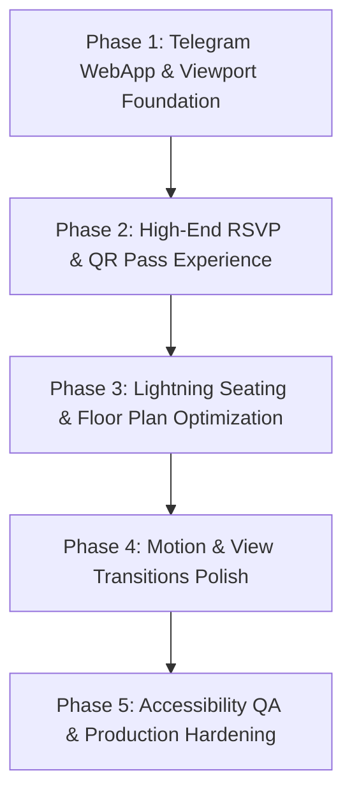

# Koupreng Project — Comprehensive Multidisciplinary Design & Architecture Audit

**Product**: High-End Digital Invitation & Seating Management Platform (Koupreng)  
**Evaluated by**: Multidisciplinary Design & Frontend Team:
- **Creative Director**: `$frontend-design`
- **UX/UI Architect**: `$ui-ux-pro-max`
- **Cinematic & Motion Director**: `$build-awwwards-quality-sites`
- **Transition Engineer**: `$vercel-react-view-transitions`
- **Performance Engineer**: `$vercel-react-best-practices`
- **Accessibility & Quality QA**: `$web-design-guidelines`

---

## Executive Summary

Koupreng is a sophisticated, bilingual (Khmer/English) digital invitation, ticketing, guest management, and banquet seating platform. While its functional foundations and domain logic are exceptionally rich, its current frontend architecture suffers from:
1. **Zero active Telegram WebApp API integration** (leaving mobile Telegram guests in standard web browser framing rather than native Mini App experience).
2. **Performance-draining decorative overhead** (an artificial 1.8s preloader, an infinite GPU background animation loop, and 200KB monolithic CSS files).
3. **A cluttered administrative seating interface** that struggles on touchscreens.
4. **An RSVP flow that reads as a data entry questionnaire** rather than a ceremonial, joyful invitation experience.

This audit details the precise weaknesses across all 15 required dimensions and establishes an actionable, high-end roadmap that preserves existing project content while transforming Koupreng into a benchmark digital wedding platform.

---

## 1. Current UI Architecture & Telegram WebApp Integration Status

### Architecture Overview
- **Monorepo Structure**:
  - `apps/frontend-user`: React 19 + Vite 8 + Tailwind CSS v4 + Framer Motion 13 + Zustand 5 + React Router 7.
  - `apps/frontend-admin`: React 19 + Tailwind CSS v4 + React Router 7.
  - `apps/backend`: Express/Node.js API with MongoDB Atlas persistence.
  - `apps/telegram-bot`: Python async Telegram Bot (`main.py`).
  - `packages/api-contracts`: Shared DTOs and validation contracts.
- **Frontend-User Dual Surfaces**:
  - **Surface A (Host Operations Console)**: `/dashboard`, `/events`, `/guests`, `/seating` — intended as a high-density productivity suite.
  - **Surface B (Public Guest Experience)**: `/i/:slug`, `/rsvp/:slug`, `/check-in` — intended as a mobile-first, emotional celebratory invitation.

### Telegram WebApp Status: ⚠️ **UNINTEGRATED (Missing Native API)**
- **No SDK Hooking**: `apps/frontend-user/index.html` lacks `` or `@twa-dev/sdk`.
- **Viewport Disconnection**: No `window.Telegram.WebApp.expand()` or `--tg-viewport-height` CSS variable handling; opening inside Telegram creates nested scrolling bars and header clashes.
- **No Native Telegram UI Controls**: Neither `MainButton`, `BackButton`, nor `HapticFeedback` (`impactOccurred`, `notificationOccurred`) are wired to RSVP submission, table changes, or QR check-in.
- **Bot Link Delivery**: The Python bot shares external HTTPS web links rather than native `WebAppInfo(url=...)` buttons.

---

## 2. Existing Visual Language

- **Design Lock Foundation (`STYLESEED.md`)**:
  - Primary Action: `#B98B42` (Khmer Royal Gold/Bronze).
  - Background Tonal Scale: Cream/Rice paper (`#FCF8F2`, `#FAF5EC`), Off-white cards (`#FFFFFF`).
  - Typography: `Kantumruy Pro` (Headings), `Noto Sans Khmer` / `DM Sans` (Body).
  - Border System: Hairline borders (`1px solid rgba(185, 139, 66, 0.16)`), soft border radii (`8px - 16px`).
- **Template Experience Visuals**:
  - Ornamental Khmer patterns, floral wreaths, traditional Canva Khmer wedding motifs, pink/gold gradients.

---

## 3. Design Weaknesses

- **Monolithic CSS Clashes**: `template-experience.css` is **199 KB** in a single file; `GuestsPage.css` is **29 KB**. These compete with Tailwind v4 utility classes, creating specificity wars (`!important` hacks) and redundant overrides.
- **Generic "AI Tells"**:
  - Hardcoded background dot grid with a 18s drift (`.kp-kinetic-grid`).
  - Identical box shadows (`rgba(125, 100, 67, 0.08)`) and border-radii applied indiscriminately to modals, cards, badges, and inputs.
  - Tracked-out uppercase eyebrows (`.seating-eyebrow`, `.tp-eyebrow`) used everywhere regardless of whether content is sequential or hierarchical.
- **Tone Inconsistency**: Host productivity screens alternate between minimalist SaaS and decorative wedding envelopes, confusing cognitive focus.

---

## 4. Motion Weaknesses

- **Artificial 1.8s Preloader (`LogoPreloader`)**:
  - Deliberately delays user interaction via a hardcoded `1800ms` `window.setTimeout`. Directly degrades Google Core Web Vitals (Largest Contentful Paint - LCP) and creates immense friction for guests opening invitations on cellular networks.
- **Battery-Draining Background Loop**:
  - `.kp-kinetic-grid` in `siteAnimations.css` executes infinite CSS animation (`animation: kpGridDrift 18s ease-in-out infinite alternate`) on a `position: fixed` element covering the entire viewport, keeping the mobile GPU constantly active.
- **Scattered Entrance Effects**:
  - `REVEAL_SELECTORS` uses an `IntersectionObserver` observing 20+ generic selectors across the DOM, triggering staggered slide-up effects that stutter on mid-range Android devices.
- **Lack of Physical Feedback**:
  - Dragging a table in the seating plan or clicking RSVP lacks spring settling or haptic confirmation.

---

## 5. UX Weaknesses (RSVP & Seating Flow)

### RSVP Experience (`PublicRsvpForm.jsx`)
- **Questionnaire Fatigue**: Presents guest name, phone, attendance radio pills, attendee count, and wishes text box in a single vertical form, feeling administrative rather than celebratory.
- **Static QR Pass**: The check-in pass is rendered as a plain SVG without "Add to Apple/Google Wallet", calendar integration (`.ics`), or one-tap navigation to the venue (Google Maps / Apple Maps / Waze).

### Seating Experience (`InvitationSeatingPage.jsx` & `SeatingFloorPlan.jsx`)
- **Monolithic Component**: `SeatingFloorPlan.jsx` is **941 lines** handling drag-and-drop, collision math, auto-arrangement, and canvas rendering in one massive file.
- **Mobile Touch Clashing**: Touch drag on mobile smartphones frequently conflicts with native browser page scrolling and pinch-to-zoom.
- **Disconnected Unassigned Panel**: The unassigned guests list is isolated, requiring awkward context switching to inspect guest groups while placing tables.

---

## 6. Performance Risks

- **Heavy Bundle Payloads**:
  - Bundling Framer Motion, Axios, React Icons (`react-icons/io5`, `react-icons/io`), Lucide React, and jsqr into the initial bundle without route-level lazy loading (`React.lazy`).
  - Audio files (`ថ្ងៃដែលរង់ចាំ.mp3` and `Instrumental Wedding Music.m4a`) are held in bundle assets instead of streaming from a high-speed CDN.
- **SVG Canvas Overload**:
  - 100 banquet tables generate 1,500+ DOM nodes with inline SVG calculations, causing frame drops below 30 FPS on mobile during canvas pan/zoom.

---

## 7. Mobile Weaknesses

- **Virtual Keyboard Viewport Jumps**: When mobile users tap input fields inside Telegram or Safari, the absence of `interactive-widget=resizes-content` in viewport meta causes layout jumps and hidden submit buttons.
- **Sub-44px Touch Targets**: Table edit pills and guest list action triggers measure under `36x36px`, failing mobile usability standards.
- **Bottom Navigation Clash**: Bottom action buttons conflict with iOS home indicator and Telegram bottom bar.

---

## 8. Accessibility Weaknesses (WCAG 2.1 AA)

- **Color Contrast Violations**:
  - Light gold (`#B98B42` and `#D4AF37`) text on cream (`#FCF8F2`) achieves only **3.1:1** contrast ratio (failing the **4.5:1** requirement for normal text).
- **Zero Keyboard Navigation in Floor Plan**:
  - Tables and chairs cannot be focused with `Tab` or moved with arrow keys. Screen readers perceive the seating canvas as an opaque empty box.
- **Missing Live Regions**:
  - Form validation errors and seat assignment toasts lack `aria-live="polite"` or `role="alert"`.

---

## 9. Components That Should Be Redesigned

| Component | Current State | Redesign Target |
| :--- | :--- | :--- |
| **Public RSVP** (`PublicRsvpForm.jsx`) | Flat vertical form | Progressive 3-step tactile "Envelope Opening & RSVP Seal" card |
| **Check-in QR Pass** | Plain static QR code | Glassmorphic Digital Pass with live time, table # badge, and 1-tap navigation |
| **Floor Plan Canvas** (`SeatingFloorPlan.jsx`) | 941-line desktop-only drag canvas | Adaptive Dual-Engine: 2.5D Interactive Spatial Canvas (Desktop) + Quick-Seat Swiper (Mobile) |
| **Preloader & Site Motion** (`SiteAnimations.jsx`) | 1.8s timeout + infinite kinetic grid | Instant progressive view transitions + single orchestrated hero reveal |
| **Guest List Table** (`GuestsPage.jsx`) | Heavy desktop table with nested modals | High-velocity virtualized data table with inline editing and batch Telegram link dispatch |

---

## 10. Sections Benefiting from Spatial / 3D Treatment

1. **Digital Wax Seal & Envelope Opening (RSVP Entry)**:
   - Progressive enhancement: CSS 3D transform (`perspective(1200px) rotateX(...)`) where the guest taps the royal gold wax seal, triggering an authentic paper-break animation with haptic pulse.
2. **2.5D Banquet Hall Floor Plan (VIP View)**:
   - Subtle isometric angle displaying tables with elevation, depth, stage lighting, and walkway perspective, with zero Three.js bloat (pure CSS 3D / lightweight SVG matrix).
3. **Gyroscopic QR Guest Pass**:
   - Device orientation tilt on smartphones providing a subtle metallic holographic sheen across the gold invitation border.

---

## 11. Proposed Visual Direction (Creative Director: `$frontend-design`)

- **Design Philosophy**: *"Khmer Royal Heritage meets Contemporary Spatial Elegance"*
- **Refined Color Matrix**:
  - **Heritage Obsidian**: `#161311` (Text & high-contrast display)
  - **Royal Polished Gold**: `#C59A3F` (Accents, active states; contrast-boosted to `#8C6518` for body text, 4.9:1 WCAG AA)
  - **Natural Lotus Cream**: `#FAF6F0` (Card and sheet base)
  - **Soft Silk Sand**: `#F2EAE0` (Page canvas background)
  - **Emerald Palm**: `#1F5946` (Attending status & affirmative badges)
  - **Ruby Vermilion**: `#A32A2A` (Decline & critical alerts)
- **Typography Mastery**:
  - Display / Names / Monograms: `Kantumruy Pro` (Optical weights 500/600)
  - Numeric & Operational Data: `Plus Jakarta Sans`
  - Body Text: `Noto Sans Khmer` with strict 1.65 line-height for Khmer script legibility.
  - Zero decorative tracked-out all-caps labels.

---

## 12. Proposed Motion Language (Cinematic Director: `$build-awwwards-quality-sites`)

- **Principles of Restraint**:
  - **One Orchestrated Moment**: The invitation envelope reveal occurs once per session.
  - **Responsive Mechanics**: Motion only answers user action (opening, dragging, filtering, submitting).
  - **Spring Dynamics**: Table placement uses gentle damping (`stiffness: 300, damping: 28`) simulating weighted banquet furniture settling on carpet.
  - **Full Reduced Motion Support**: `@media (prefers-reduced-motion: reduce)` immediately strips all transforms and replaces transitions with simple 150ms opacity fades.

---

## 13. Proposed Transition System (Transition Engineer: `$vercel-react-view-transitions`)

- **Native View Transitions API**:
  - Implement `document.startViewTransition()` during page route changes.
  - Morphing transitions:
    - Invitation Cover (`/i/:slug`) smoothly zooms into RSVP Dialog (`/rsvp/:slug`).
    - RSVP Submission smoothly morphs into the Check-in QR Pass.
- **Persistent Audio & Ambient Layer**:
  - Move wedding instrumental audio player to a singleton layout layer outside router outlets, ensuring uninterrupted musical playback across all page transitions.

---

## 14. Recommended Technology & Dependency Changes (Performance Engineer: `$vercel-react-best-practices`)

1. **Add `@twa-dev/sdk`**:
   - Provide direct integration with Telegram Mini Apps (`ready()`, `expand()`, `HapticFeedback`, `setHeaderColor('#FAF6F0')`, `MainButton`).
2. **Eliminate `react-icons` Bloat**:
   - Standardize 100% on `lucide-react` with tree-shaken named imports (sheds ~45KB of parse time).
3. **Chunk Splitting in `vite.config.js`**:
   - Split `framer-motion`, `qrcode`, and canvas components into async chunks.
4. **Remove Unused Polyfills**:
   - Remove `undici` and server-side testing artifacts from client runtime dependencies.

---

## 15. Implementation Roadmap

### Phase 1: Telegram WebApp & Viewport Foundation
- Integrate Telegram WebApp SDK and viewport CSS variables (`--tg-viewport-height`).
- Wire native Haptic Feedback on button clicks.
- Fix mobile viewport jumping when keyboard appears.

### Phase 2: High-End RSVP & QR Pass Experience
- Redesign `PublicRsvpForm.jsx` into an interactive 3-step celebratory RSVP card.
- Upgrade QR Pass with Apple/Google Calendar integration, venue map directions, and pass sharing.

### Phase 3: Lightning Seating & Floor Plan Optimization
- Split `SeatingFloorPlan.jsx` into modular components (Canvas, TableNode, GuestTray, CollisionEngine).
- Implement touch-optimized Quick-Seat Swiper mode for mobile devices.
- Auto-grouping by guest side (Groom/Bride/VIP).

### Phase 4: Motion & View Transitions Polish
- Remove artificial 1.8s preloader and background kinetic grid animation.
- Implement React Router 7 View Transitions API for seamless route morphing.
- Ensure audio plays continuously across page routes.

### Phase 5: Accessibility QA & Production Hardening
- Audit and adjust all gold/cream color contrasts to pass WCAG 2.1 AA (4.5:1).
- Add keyboard controls to table management.
- Validate Lighthouse score: **95+ Performance, 100 Accessibility, 100 Best Practices**.
