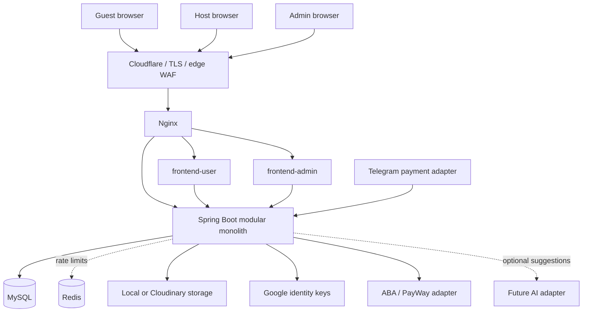
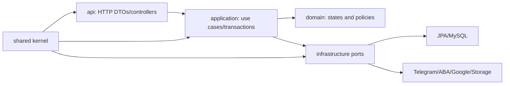
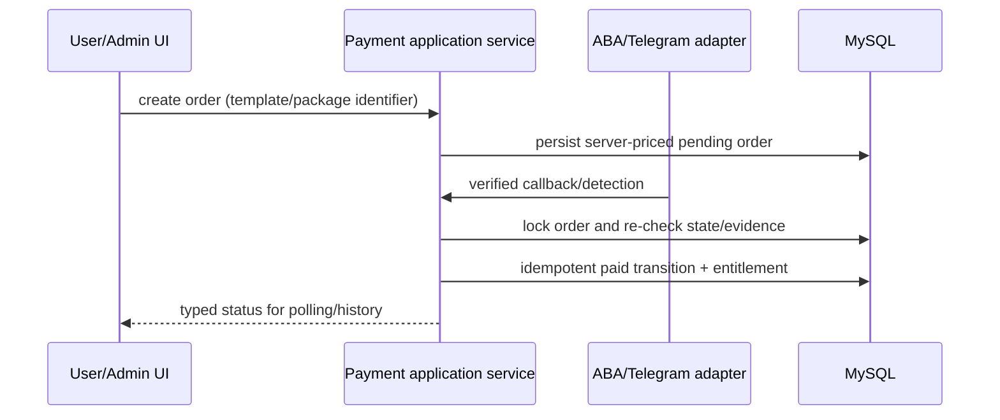

# Koupreng Architecture V2

Status: migration in progress
Last updated: 2026-09-15

## System context

Koupreng is a monorepo with one authoritative Spring Boot modular monolith, two independent React applications, and a Telegram integration adapter. MySQL is the source of durable business state. Redis is optional locally and is used in production only for cross-instance rate limiting. External providers never own Koupreng business rules.



## Application responsibilities

| Application | Owns | Must not own |
| --- | --- | --- |
| `apps/backend` | authentication, authorization, invariants, transactions, persistence, entitlements, provider orchestration | browser presentation or provider-specific UI |
| `apps/frontend-user` | marketing, host workflows, builder, public invitation presentation, client UX state | authorization, trusted payment confirmation, durable business state |
| `apps/frontend-admin` | independent operational UI and guarded routes | final admin authority; the backend always enforces it |
| `apps/telegram-bot` | Telegram update validation/parsing and backend adapter calls | payment state, entitlement, pricing, or order ownership |
| `packages/api-contracts` | checked-in reviewable API artifact | hand-maintained truth that can diverge from runtime OpenAPI |

## Backend target modules

```text
com.koupreng.backend
  shared/
    config/ exception/ i18n/ response/ security/ validation/ persistence/
  auth/
    api/ application/ domain/ infrastructure/
  user/
  organization/
  template/
  invitation/
  media/
  guest/
  rsvp/
  planning/       budget, gifts, seating, check-in, delivery
  payment/
  subscription/
  notification/
  admin/
  audit/
  integration/    provider adapters only; optional AI boundary
```

Simple modules may omit layers. Package depth is not a goal; explicit ownership is. A module's API package may call its application layer. Application code may use its domain and its own infrastructure interfaces. Cross-module work goes through an explicit application service or small published type, not another module's controller or repository.



### Dependency rules

1. Controllers never expose JPA entities.
2. Controllers do not call repositories.
3. Transaction boundaries represent business use cases.
4. A child resource lookup includes its owning aggregate identifier where applicable.
5. Provider SDKs and payloads stay in infrastructure adapters.
6. `shared` contains only cross-cutting code used by multiple modules; it is not a dumping ground.
7. New code is created in a domain module. Existing global packages are legacy migration sources.
8. A package move does not change the HTTP contract in the same step.

## API contract

The target canonical prefix is `/api/v1`. Existing `/api/auth`, `/api/users/me`, and `/api/admin` paths remain compatibility adapters until all consumers are migrated. Runtime springdoc output is the machine-readable source of truth. The checked-in `packages/api-contracts/openapi.yaml` is a review artifact and must eventually be generated/diffed in CI.

Success responses may retain the current `ApiResponse<T>` envelope. Error responses use:

```json
{
  "timestamp": "2026-09-15T01:00:00Z",
  "status": 400,
  "error": "Bad Request",
  "code": "REQUEST_INVALID",
  "message": "Request validation failed",
  "path": "/api/v1/invitations",
  "fieldErrors": {}
}
```

Clients branch on `status`, `code`, and typed response fields, never on translated messages. The legacy validation alias `fields` remains until consumers are verified not to use it.

## Authentication and authorization

The backend hashes passwords, validates signed JWT issuer/expiry, reloads active-user/token-version state, and maps roles to Spring authorities. Google and Telegram login accept provider proof that is verified server-side. Public routes are allowlisted; everything else requires authentication. Admin operations require backend `ROLE_ADMIN` regardless of frontend visibility.

Invitation children use ownership-aware lookups to prevent BOLA/IDOR. The organization module will publish an explicit action-to-role permission policy before organization members receive invitation permissions. Cookie authentication conditionally enables a cookie-backed CSRF token repository; it is not considered complete for production until token delivery, unsafe-method handling, hostile-origin behavior, and browser consumers are integration-tested.

## Invitation and public access boundary

`UserInvitation` is the host-owned aggregate. Sections, media, guests, RSVPs, delivery events, tables, assignments, check-ins, budget, and gifts are scoped to it. Public reads expose dedicated DTOs only after publication/privacy checks. Guest invitation tokens are opaque and must be scoped to the requested invitation. The backend owns RSVP deadlines, attendee limits, state transitions, and access-password validation.

## Payment architecture

The target payment flow separates request, provider verification, state transition, and fulfillment:



Telegram detection remains an adapter and defaults to pending review. A duplicate callback must return the existing result without granting a second entitlement. Template purchase and subscription purchase may share payment primitives but have separate fulfillment policies. Frontend success pages never mark an order paid.

## Persistence and migrations

MySQL is authoritative. Flyway migrations are append-only. Production never uses `create`, `create-drop`, or `update`. Every schema change includes a new migration, entity mapping update, clean-database test, upgrade-path review, and rollback/forward-fix note. Existing V1 and V3-V16 history is immutable; V2 remains intentionally absent.

## Frontend boundaries

Both React applications keep route composition in `app`, route-level composition in `pages`, business UI/data in `features`, and genuinely reusable code in `shared`. Raw Axios calls belong only in centralized clients or feature API modules. Business-specific UI is not moved to a shared package merely because it looks reusable.

The user and admin applications keep independent routing, authorization UX, build, and deployment. Existing visual identity, Khmer fonts, templates, and animations are compatibility requirements.

## Operations and observability

Nginx is the reverse proxy; Cloudflare owns edge TLS/WAF/DDoS concerns; Spring Security owns identity/authorization/validation and application abuse controls. Actuator provides health/info/Prometheus endpoints with restricted details. Logs use structured events and never include passwords, tokens, secrets, full provider credentials, or unnecessary personal data.

## Migration method

For each domain:

```text
inventory callers and tables
  -> add/move V2 module behind the existing contract
  -> run focused tests
  -> update runtime OpenAPI and contract artifact
  -> migrate user consumer
  -> migrate admin/bot consumer
  -> run full tests and smoke checks
  -> remove verified legacy code
```

The first Phase 2 slice establishes `shared.exception`, `shared.response`, and `shared.i18n`, migrates every backend caller away from the former `common` package, and restricts root `.env` loading to the dev profile. The authentication slice now owns its HTTP DTOs/controller, application services, identity adapters, password-reset persistence, token-state cache, cookie support, rate limiter, and JWT authentication converter under `auth/api`, `auth/application`, `auth/domain`, and `auth/infrastructure`. Existing routes and JSON remain unchanged. Users and the remaining domains follow in dependency order.

Current application services still inject some concrete auth infrastructure and the legacy user/audit services. Those seams are recorded migration debt, not a reason to introduce speculative interfaces during a behavior-preserving package move. Ports will be extracted when a second implementation or a testable provider boundary requires one.

## Known decisions deferred by evidence

- Do not merge `Event` and `UserInvitation` until product semantics and frontend consumers are reconciled.
- Do not merge the payment table families until data ownership and active routes are proven.
- Do not add an AI service until a real provider-backed capability is approved.
- Do not add Redis beyond the demonstrated distributed rate-limit need.
- Do not remove compatibility endpoints without caller search, telemetry where available, and contract tests.
