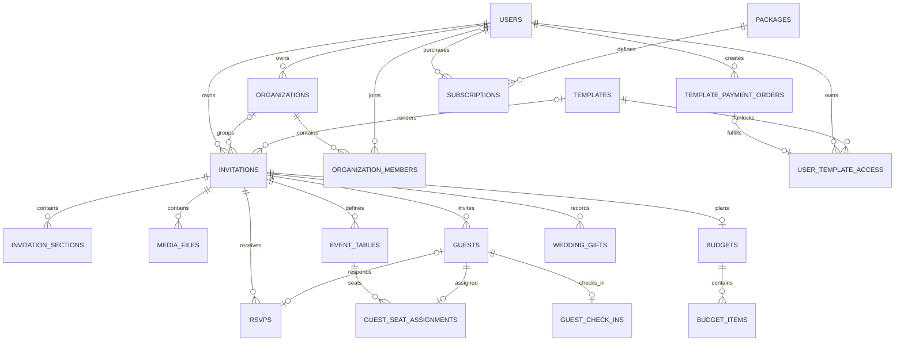

# Koupreng Database Architecture

Status: Architecture V2 baseline
Last reviewed: 2026-09-15

## Source of truth

The schema is owned by Flyway migrations in `apps/backend/src/main/resources/db/migration`. Entity annotations describe mappings but do not replace migrations. Existing versioned files are immutable. The current history is V1 and V3-V16; V2 is intentionally absent and must not be introduced retroactively.

Production must never use Hibernate `create`, `create-drop`, or `update`. V2 will move toward `validate` after clean-MySQL and current-schema validation prove exact mapping compatibility.

## Table ownership

| Module | Tables | Key ownership/relationship |
| --- | --- | --- |
| Auth/user | `users`, `password_reset_tokens` | reset token belongs to one user; email/phone are unique |
| Organization | `organizations`, `organization_members` | organization has one owner; membership is unique by organization/email |
| Template | `templates`, `user_template_access` | entitlement links user, template, and optional payment order |
| Invitation | `invitations`, `invitation_sections` | invitation belongs to a user and optionally template/organization; sections belong to invitation |
| Guest/RSVP | `guests`, `rsvps` | both belong to invitation; RSVP optionally belongs to a guest |
| Media/delivery | `media_files`, `invitation_delivery_events`, `notifications` | scoped to invitation and optional guest/user/payment references |
| Seating/check-in | `event_tables`, `guest_seat_assignments`, `guest_check_ins` | invitation-scoped; one assignment and one check-in per guest |
| Planning | `budgets`, `budget_items`, `wedding_gifts` | one budget per invitation; items belong to budget; gifts belong to invitation |
| Template payment | `template_orders`, `template_payment_orders` | server-created user/template orders; unique order/transaction identifiers |
| Guest gift payment | `payment_configs`, `payment_transactions`, `payment_webhook_logs`, `telegram_notifications`, `organizer_payout_accounts` | invitation payment configuration and provider evidence |
| Subscription | `packages`, `subscriptions` | subscription belongs to user/package; paid activation is incomplete |
| Audit | `audit_logs`, `system_audit_logs` | actor/target/event metadata; secrets are prohibited |
| Legacy event | `events` | separate generic event aggregate; relationship to invitations is unresolved |

## Core relationships

## Important constraints and indexes

- `invitations.slug`, invitation access token, guest invite token, template code, organization slug, reset-token hash, order codes, and provider transaction identifiers are unique.
- `budgets.invitation_id` enforces one budget per invitation.
- `guest_seat_assignments.guest_id` and `guest_check_ins.guest_id` enforce one active record per guest.
- organization membership is unique per organization/email.
- user-template access is constrained/indexed to prevent duplicate entitlement for the same ownership tuple.
- common invitation child queries are indexed by `invitation_id`; administrative/status queries have compound status/created indexes added by later migrations.
- foreign keys cascade for true aggregate children and use `SET NULL` where historical records must survive deletion.

Exact names and column evolution remain in the migration files; this document explains ownership rather than duplicating every DDL statement.

## Payment relationships and idempotency

Template purchases currently use `template_payment_orders` as the active rich order record and create `user_template_access` during trusted completion. `template_orders` is an earlier overlapping order model. Guest gift payments use `payment_transactions` and related provider-log tables. These models must not be merged until active consumers and stored data are proven.

Paid transitions require:

1. a server-generated unique order/reference;
2. server-owned amount and currency;
3. verified provider/internal evidence;
4. a locked re-read of the order;
5. an allowed state transition;
6. entitlement/fulfillment in the same short transaction;
7. a duplicate notification returning the existing outcome.

Raw callback and Telegram text is sensitive operational metadata. V2 must define minimization, redaction, access control, and retention before expanding its use.

## Guest and RSVP relationships

A guest belongs to exactly one invitation and may have one RSVP, one seat assignment, and one check-in. Every service/repository mutation must scope a child by both its child identifier/token and invitation identifier. Public guest tokens are opaque and do not substitute for an ownership check.

Guest email/phone duplicate checks currently exist in application code. They are not concurrency-safe at the database layer. A future additive migration must first define normalization and blank/null semantics, audit existing duplicates, backfill normalized values, add invitation-scoped uniqueness, and translate constraint conflicts to `GUEST_DUPLICATE`.

## Migration rules

1. Never edit an applied versioned migration.
2. Add the next version only after checking the highest repository and deployed version.
3. Make destructive changes in expand/migrate/contract stages.
4. Add constraints only after data profiling and repair.
5. Backfills must be deterministic, restartable where practical, and bounded for production data.
6. Test an empty MySQL schema and an upgrade from the current supported version.
7. Keep `ddl-auto` non-mutating in every non-test runtime.
8. Explicitly disable out-of-order execution in production.
9. Record rollback as restore/forward-fix steps; Flyway versioned migrations are not silently undone.
10. Preserve money as decimal and timestamps with documented timezone semantics.

## V2 database work queue

| Priority | Change | Gate |
| --- | --- | --- |
| HIGH | guest normalized contact uniqueness | duplicate-data audit and real-MySQL concurrency tests |
| HIGH | subscription order and idempotent activation relationship | approved business/payment contract |
| MEDIUM | provider verification attempt/retention model | payment transaction-boundary design |
| MEDIUM | pagination/index review | real query plans and stable API contract |
| LOW | legacy payment/event/audit consolidation | zero-caller proof, data migration, compatibility window |
