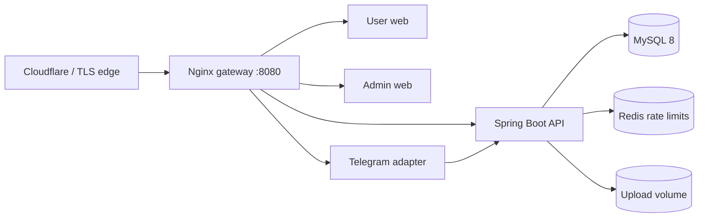

# Docker and reverse-proxy deployment

The tracked Compose topology is a production-like single-host deployment for Koupreng. It builds immutable application images, runs MySQL and Redis on an internal network, persists database/upload/cache data in named volumes, and exposes only the Nginx gateway.

## Topology



The default user host is `localhost`; the default administrator host is `admin.localhost`. Production should set `USER_SERVER_NAME`, `ADMIN_SERVER_NAME`, `PUBLIC_APP_URL`, and the backend CORS origins to the actual HTTPS hostnames. The two React applications intentionally remain separate host-based applications because their existing browser routes both start at `/`.

## Start

1. Copy `.env.example` to `.env`.
2. Replace every credential placeholder. Generate unrelated random values for the MySQL root password, application database password, JWT secret, internal payment secret, and Telegram webhook secret.
3. Set the public URLs, OAuth identifiers, Telegram allowlists, and ABA static link.
4. Build and start the stack:

```bash
docker compose config --quiet
docker compose build --pull
docker compose up -d
docker compose ps
```

Open `http://localhost:8080` for the user app and `http://admin.localhost:8080` for the admin app in the default local topology. The gateway's `/health` endpoint verifies the selected frontend. The backend readiness endpoint remains internal at `http://backend:8080/actuator/health/readiness`.

## TLS and trusted proxies

Terminate public TLS at Cloudflare or a host-level Nginx instance, then proxy to Compose port 8080 while preserving `Host`, `X-Forwarded-For`, and `X-Forwarded-Proto`. Set `HTTPS_REQUIRED=true` only after the proxy sends the correct external protocol. Restrict the host firewall so the Compose port is reachable only by the trusted edge/tunnel when deployed publicly.

The gateway routes `/api/` and `/uploads/` to Spring Boot, `/telegram/webhook` to the bot, and all other paths to the applicable React application. Telegram must register the same `TELEGRAM_WEBHOOK_SECRET` as its `secret_token`.

## Data and operations

- `mysql-data` is authoritative relational data; back it up with `infra/backup/mysql-backup.ps1` or an equivalent provider snapshot.
- `uploads` contains local media when `STORAGE_PROVIDER=local`; back it up or select Cloudinary before horizontally scaling.
- `redis-data` contains rate-limit state and is operational rather than authoritative business data.
- Flyway runs during backend startup. Never edit an applied migration; add a new migration and test both fresh and upgrade paths.

Before release, run the smoke checklist, test restore procedures, verify the real edge headers/CORS policy, and inspect logs without printing secret values.
